# 在 Unity 中加载场景

> 原文：<https://levelup.gitconnected.com/loading-scenes-in-unity-60efef317413>

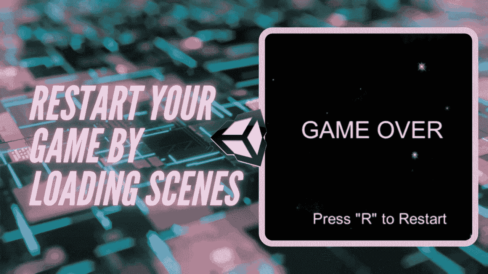

Unity 中的场景可以被认为是独特的层次，甚至是像主菜单一样的独立屏幕。在之前的[文章](https://medium.com/codex/creating-a-retro-game-over-behavior-f520e519b21e)中，我们通过简单地在现有的游戏场景上显示文本来创建一个屏幕游戏。然而，要从游戏结束状态重启游戏，使用 **Unity 的场景管理**是必要的。

在这篇文章中，你将学习如何从游戏结束状态重启游戏！

# 如何在 Unity 中加载场景

1.  确保你想要加载的场景被添加到你的**构建设置**中。否则，当您试图通过代码访问该场景时，它将无法被识别并导致错误。

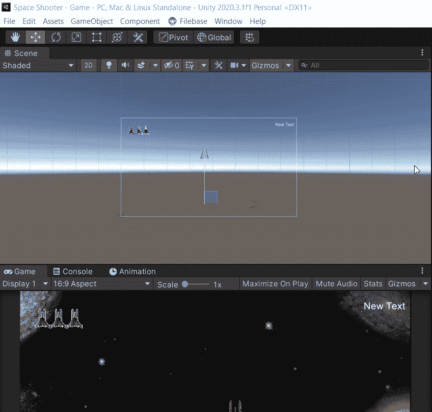

2.将 **Unity 场景管理库**添加到你的脚本中。你可以把它放在一个新创建的游戏管理器脚本中来帮助跟踪游戏的状态。

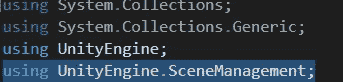

**以下步骤将在场景管理所在的相同脚本中进行**

3.创建一个 bool 变量来跟踪游戏状态。

> **注意**:如果您按照本指南学习如何加载场景，您的过程将在步骤 4 中**完成，而**这一步可以跳过**。您也不必将博弈结束条件添加到输入中。**

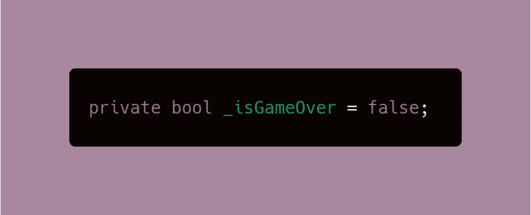

4.在 void 更新中，为重启游戏的键设置用户输入。它可以是任何键，在我的例子中，我用“R”代表*重启*。

因为您之前已经添加了场景管理库，所以您可以访问 SceneManager，它将加载您想要的场景。

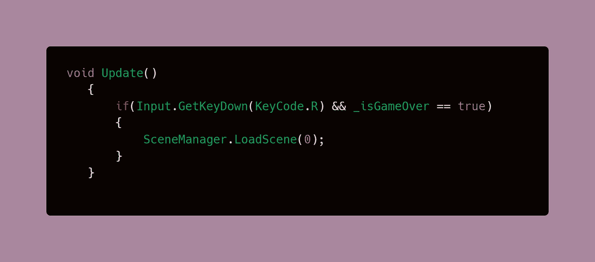

场景由其名称或其各自的场景编号来标识。在上面的例子中，场景是通过它的编号来识别的，这比使用字符串/场景名称要快。

您可以在构建设置中查看这两者。您也可以从项目文件夹中查看和更改场景名称

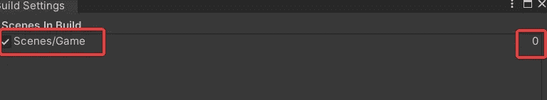

5.创建一个 void 方法来更改步骤 3 中的 bool 变量的值。

> **注意**:最好使用方法来改变 bool 变量，而不是直接改变。

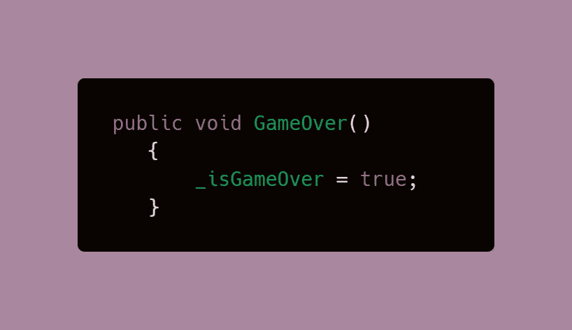

以下步骤将发生在 **UI 管理器脚本**中，该脚本是在 [**分数系统**](/ease-of-building-ui-elements-in-unity-4f501c7e7c5e) 文章中创建的，并进一步用于 [**生命计数器**](https://medium.com/codex/creating-a-lives-counter-ui-element-in-unity-9d48b485555e) 和 [**游戏结束屏幕**](https://medium.com/codex/creating-a-retro-game-over-behavior-f520e519b21e) 。

或者，您可以通过在脚本中最有意义的地方应用该逻辑来遵循您自己的代码。例如可以通过处理玩家的死亡或玩家当前的生活来触发游戏结束状态的脚本。

1.  使用[脚本通信](https://medium.com/codex/script-communication-in-unity-using-getcomponent-ca4444bfec6)，从 UI 管理器脚本或当前脚本访问游戏管理器脚本。

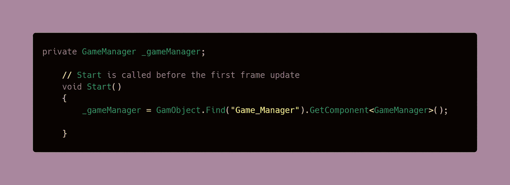

2.对 UI 管理器脚本或当前脚本调用 GameOver 方法。为了避免混乱，我创建了一个方法来包含游戏过程中在我的代码中发生的所有事情。

> **注意**:确保你试图调用的方法是公共的，否则你会得到一个保护级别错误。

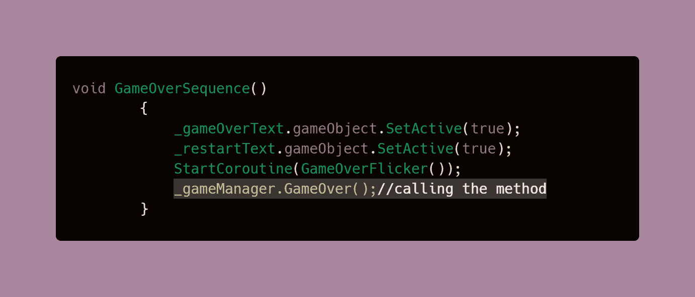

3.当玩家的生命值等于 0 时，调用 GameOver Sequence 方法，因为这是触发游戏结束状态的原因。

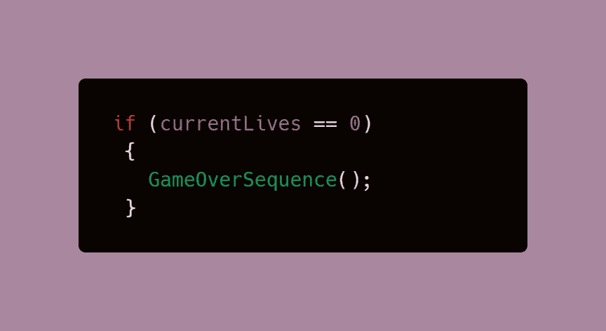

现在，你应该有一个全功能的**重启选项**！

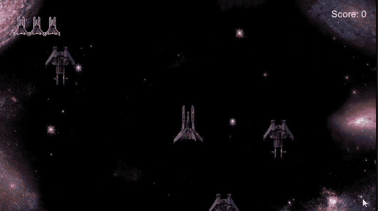

在下一篇文章中，我们将看看如何给一个被摧毁的游戏对象添加爆炸！