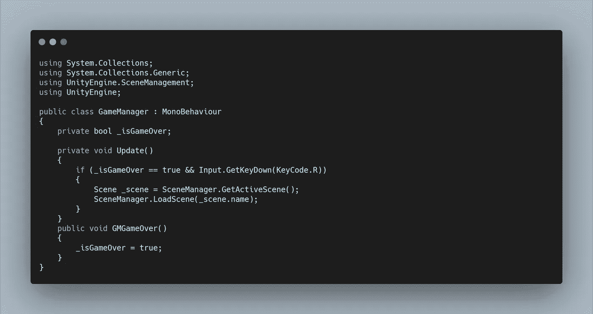

# 在 Unity 中加载场景

> 原文：<https://levelup.gitconnected.com/loading-scenes-in-unity-a5a76f9c8158>

我添加了另一个文本对象，它出现在 UI 管理器脚本的 GameOver 函数中。让我们创建一些功能来重置游戏。

首先，我们可以创建一个名为 GameManager 的空游戏对象，并让我们的 UI 管理器调用一个方法。

在我们的公共方法中，我们可以为 is Game Over 设置一个布尔值为真。

然后在我们的 Update 方法中，我们可以使用 if 语句来检查 bool 是否为 true，并使用(&&)来检查 R 键是否被按下。结合这两个条件，我们就可以让 R 键不重置游戏，除非游戏真的结束了。

要访问我们的场景管理，我们需要添加适当的名称空间 UnityEngine。SceneManagement，我们还需要将当前场景添加到构建中。文件>构建设置允许我们将打开的场景添加到构建中。

现在，在 if 语句中，我们可以创建一个场景变量来存储活动场景。从长远来看，获取活动场景而不仅仅是加载一个特定的场景可以更灵活地重置当前场景，而不必更改我们的代码。

从这里，我们可以简单地用存储的变量加载场景。名字功能。

让我们看看如何为主菜单创建一个不同的场景，并从那里将它加载到我们的游戏场景中。

为此，创建一个新场景，并相应地对其进行标记。我在 Filebase 资产中已经有了一个标题屏幕图像。所以我简单地添加了这个，添加了一个字幕的文本组件，并重用了背景覆盖。

要访问我们的游戏场景，让我们添加一个按钮。Unity 中的按钮 UI 组件包含一个文本组件，并允许我们调用 OnClick()函数。让我们为主菜单创建一个 UIManager，并为它分配一个新的主菜单脚本。

在这个脚本中，我们可以创建一个公共方法来加载我们的游戏。记住要添加 SceneManagement 名称空间，还要将我们的主菜单场景添加到构建设置中。在这样做的时候，重新排序是一个很好的做法，这样我们的主菜单是场景 0，我们的游戏是场景 1。

现在，在检查器的按钮组件中。我们需要调用这个方法。为此，我们需要添加一个新功能，分配 UI 管理器游戏对象。然后在下拉菜单中，我们可以在 MainMenu 下找到访问我们脚本的方法，然后 LoadGame()。

现在，当我们按下按钮，我们可以加载我们的游戏场景和发挥！

