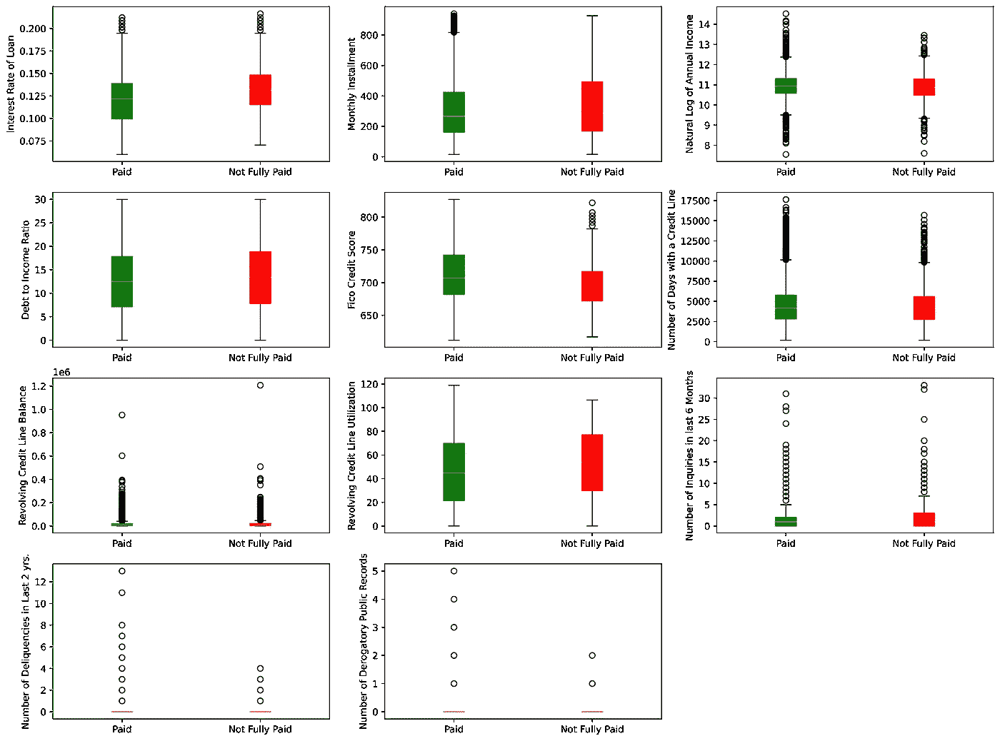

# 贷款数据分析和还款预测

> 原文：<https://levelup.gitconnected.com/loan-data-analysis-and-payoff-prediction-c77626697129>

# 介绍

谁没申请过贷款？我可以正确地假设，只有少数幸运儿从未申请过。对于我们其他人来说，有很多选择，从教育，债务合并，抵押贷款，个人，商业等。提供贷款服务的公司在批准贷款申请时承担了风险，因为获得贷款的个人/企业可能永远不会全额偿还贷款。为了最大限度地降低风险，公司根据申请人的信用记录、收入、信用利用等情况有选择地批准贷款。

# 项目概述

Lending Club 把需要钱的人(借款人)和有钱的人(投资人)联系起来。作为一名投资者，希望你能投资于那些表现出很有可能回报你的人。我在这个由两部分组成的项目中使用了来自 lendingclub.com 的公开数据

*   第一部分:使用探索性数据分析从贷款数据中获得洞察力，并建立一个机器学习模型来预测贷款是否会全额支付
*   第二部分:使用 Flask 构建 web 应用程序。你可以在一个表单中输入所有数据元素，应用程序将利用 ML 模型来预测贷款是否会全额支付

# 数据清理/预处理

数据集以 csv 文件的形式提供，有 14 列。

*   credit.policy:如果客户符合 LendingClub.com 的信用核保标准，则为 1，否则为 0
*   目的:贷款的目的(取值“信用卡”、“债务合并”、“教育”、“大宗采购”、“小企业”和“所有 _ 其他”)
*   int.rate:贷款的利率，以比例表示(11%的利率将存储为 0.11)。被 LendingClub.com 判断为风险更高的借款人会被分配更高的利率
*   分期付款:借款人所欠的每月分期付款，如果贷款是有资金的。
*   log.annual.inc:借款人自报年收入的自然日志
*   dti:借款人的债务收入比(债务额除以年收入)
*   fico:借款人的 FICO 信用评分
*   days.with.cr.line:借款人拥有信用额度的天数
*   revol.bal:借款人的循环余额(信用卡账单周期结束时未支付的金额)。
*   循环利用率:借款人的循环额度利用率(相对于可用信贷总额的已用信贷额度)
*   inq.last.6mths:过去 6 个月中债权人对借款人的查询次数
*   拖欠 2 年:在过去的 2 年中，借款人拖欠还款超过 30 天的次数
*   pub.rec:借款人的贬损公共记录数量(破产申请、税收留置权或判决)
*   未全额支付:如果未全额支付，则为 1，否则为 0

幸运的是，数据集非常干净，有 9，578 个观察值，没有缺失值。也许，数据集在公开之前就被清理了。

# 探索性数据分析

> **利用 lendingclub 平台进行不同的贷款用途:**

*   债务合并贷款在 lendingtree 批准的贷款中占最大份额(41%)
*   教育贷款在批准的贷款中所占份额最小(4%)

> **已还/未还贷款跨用途分布:**

*   小企业贷款的未完全偿还贷款比例最高，为 28%
*   主要购买的未完全支付贷款比例最低，为 11%

> **已还贷款和未还贷款的数字特征分布:**

*   我们看到全额贷款支付与轻微的

1.  较低的利率
2.  更高的 FICO 信用评分
3.  降低信用额度利用率
4.  较低的债务收入比

*   值得注意的是，对于未全额支付的贷款，上述特征的中间值没有太大的差异
*   我们看到相当多的异常值与大多数特性相关联。当我们在建模过程中规范化我们的训练数据时，我们会注意到它们
*   这些箱线图显示，已付贷款和未付贷款的特征中值非常接近。我还尝试了直方图，看看它们是否揭示了什么新的东西

*   支付和未支付贷款的特征分布非常相似。看看一个模型如何处理这个数据集会很有趣

> **未达到承销标准的贷款:**

我们有 1，868 笔贷款申请人不符合承销标准，但它们仍被批准。如果这些贷款中有很大一部分没有全额偿还，这将是一件有趣的事情。

信贷承销标准在这方面似乎没有太大的不同。88%的贷款在符合信贷标准时支付，83%的贷款在不符合标准时支付。仅仅 5%的差别。我们没有贷款金额，但我们有分期付款金额。当不符合信用标准时，我们可能需要检查已批准贷款的分期付款金额是否较低。

不符合信贷标准的申请人的分期付款中值比符合标准的申请人低约 14%。分期付款金额可能会更低或更高，这取决于贷款的长度和金额，但我们没有这方面的信息。

> 利率是否因贷款目的而异？

lendingtree 的利率似乎高于标准市场利率，并且不会因贷款目的而有太大变化。小企业贷款的利率最高，为 13.79%，主要购买贷款的利率最低，为 11.58%

> **特征之间有关联吗？**

利率和 fico 分数显示最高的相关性(-ve)为-0.71，这意味着 Fico 分数高的客户贷款利率较低。利率也与循环信贷额度利用率正相关。利用率高意味着利率高。其他一些特征也显示了一些相关性:

1.最近 6 个月内的查询与符合信贷核保标准的客户呈负相关(-0.54)，即查询次数越少，符合信贷标准的机会越高

2.循环利用率和 FICO 得分呈负相关(-0.54)，即低信用利用率导致较高的 FICO 得分

## EDA 摘要:

以下是来自贷款数据的一些见解

*   债务合并贷款在 lendingtree 批准的贷款中占最大份额(41%)
*   教育贷款在批准的贷款中所占份额最小(4%)
*   小企业贷款的未完全偿还贷款比例最高，为 28%
*   主要购买的未完全支付贷款比例最低，为 11%
*   与已支付贷款相比，未完全支付贷款的利率略高，FICO 评分较低，信贷额度利用率较高，债务收入比较高。然而，在有薪和无薪人群中，中间值相差不大。
*   9578 笔贷款中有 19.5% (1868 笔)是为不符合公司信贷承销标准的客户批准的。符合信贷承销标准的申请人获得批准的贷款中，88%已全部还清，而不符合信贷承销标准的申请人获得的贷款中，83%已全部还清。
*   不符合信用标准的客户的分期付款金额中位数比符合标准的客户低约 14%。分期付款金额可能会更低或更高，这取决于贷款的期限和金额，但我们没有这方面的信息
*   小企业贷款的利率中位数最高，为 0.1379
*   主要购买贷款的利率最低，为 0.1158

# 监督学习模型:

项目的这一部分涉及建立一个机器学习模型，使用早期用于探索性数据分析的相同数据集来预测贷款是否会全额支付。

我们的数据集包含 9，578 个观察值和 14 列。其中 13 列是特征，最后一列“未全额支付”是响应变量。

## 绩效指标选择:

我有一个不平衡的数据集。84%的贷款已全部偿还，16%的贷款未全部偿还。很容易建立一个模型，该模型总是预测贷款将被全额支付，并且它在 84%的时间内仍然是正确的，即 84%的准确性。准确性不是这里使用的正确指标，因为我希望能够正确预测贷款何时会全额支付，何时不会全额支付。我有几个选择

*   在分割训练和测试数据后，我可以对代表性不足的类别进行过采样，即在我们的案例中未完全支付的贷款，以获得平衡的数据集
*   另一种选择是使用 AUC(曲线下面积)作为模型性能的度量

我为我的模型选择 AUC，因为它使我们能够灵活地选择分类的概率阈值。以下是与 AUC 相关的一些定义

*   FP:假阳性->模型错误地预测申请人不会还清贷款
*   FN:假阴性->模型错误地预测申请人将还清贷款

如果您宁愿有假阳性或假阴性，则需要一些业务输入/知识来做出决定。两者都有经济后果:

*   假阳性，你会错过从这些贷款赚取的利息，如果你不批准，担心贷款不会还清
*   假阴性，你可能会失去贷款金额，因为申请人不会还清贷款

## 培训用数据

我将 80%的数据用于训练，其余的用于测试。测试数据应该放在一边，直到模型准备好进行测试。训练和测试数据之间的数据泄漏会导致测试分数被夸大。

因为我还打算创建一个 web 应用程序，所以创建一个管道来接收原始数据，进行所有必要的处理，并将最终预测作为输出给我，这一点对我来说很重要。

在 13 个特征中，只有一个(目的)是对象类型(字符串),其他的是数字。字符串不能在模型中使用，我需要使用 OneHotEncoder 或 Pandas 的 get_dummies 将它们转换为数字特征。我打算用 sklearn 做模型，所以我选择了 OneHotEncoder 而不是熊猫。为了在模型中给每个数字特征一个平等的机会，标准化数据是很重要的。

我通过扩展 sklearn 的 BaseEstimator 和 TransformerMixing 类创建了两个自定义类，以分离出数据集的数字和分类(字符串)特征。这允许我标准化数字特征，并在单独的并行管道中将分类特征转换成数字特征，然后使用 FeatureUnion 将它们组合起来。我向这个管道添加了另一个带有分类器的管道，以创建一个管道，我可以用它来训练我的模型并预测测试数据的结果。

我为我的模型考虑了以下内容:

*   随机森林分类器
*   KNeighborClassifier
*   SGD 分类器
*   GardientBoostingClassifier 分类器
*   物流回收
*   XGBClassifier

以下是使用 GridSearchCV 的测试分数(AUC ),带有三重交叉验证和每个分类器的一些超参数调整

*   所有模型的表现几乎一样
*   物流回归分类导致最高的 AUC 分数为 0.69
*   介于 0.6 和 0.7 之间的 AUC 分数通常被认为是一般分数，而高于 0.9 的 AUC 被认为是优秀
*   我们可以将 LogisticRegressionClassifier 保存为 pickled 文件，并在 web 应用程序中用于预测

要查看这个分析和模型构建的代码，请查看我的 GitHub 库[这里](https://github.com/sumitkumar-00/loan-payoff-predictor)

## 后续步骤:

在这个项目的第二部分，我将创建一个 web 应用程序，利用这个机器学习模型来预测贷款是否会全额支付。敬请期待！