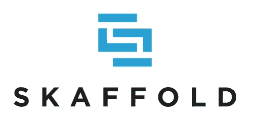
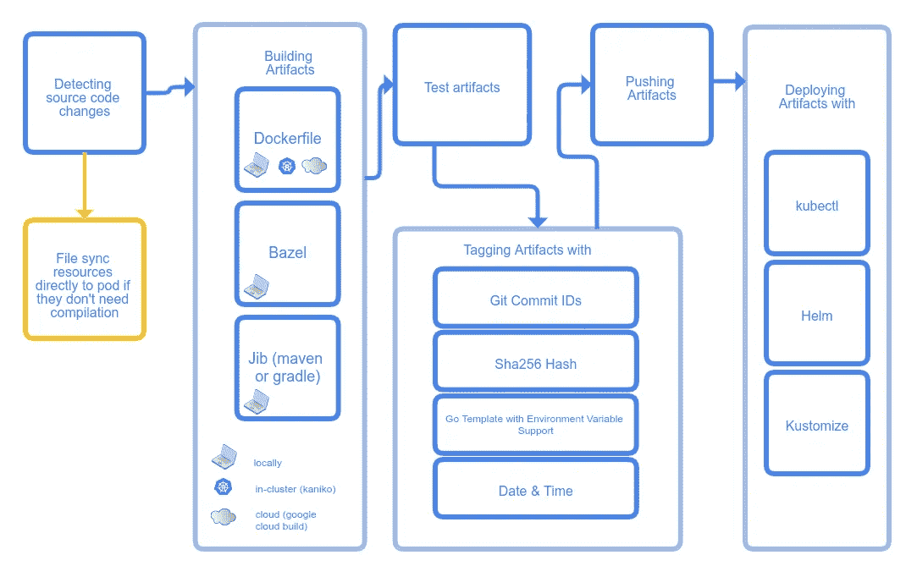
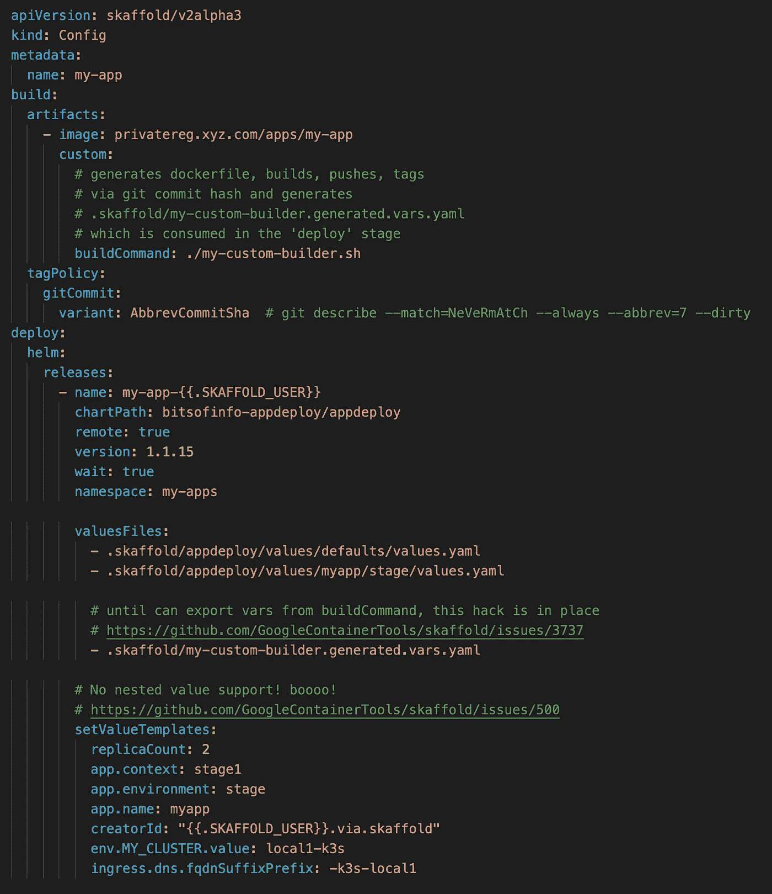

# Skaffold 的本地 CI/CD

> 原文：<https://levelup.gitconnected.com/local-ci-cd-with-skaffold-db1296eb3388>

多年来，软件开发领域以及应用程序在生产环境中的运行方式已经取得了长足的进步。从裸机物理服务器开始，我们发展到虚拟机，再到 LXC、Docker 守护进程，现在是通过 Kubernetes 等工具进行容器编排的当前状态。

在世界的另一边……定义软件开发人员如何在本地开发、测试、迭代、打包、构建和部署这些应用到他们的最终执行环境的标准也有很大的不同。这很大程度上是由于语言和框架的选择等显而易见的事情，但其中的另一个因素是应用程序将赖以生存的最终执行环境。随着目标运行时环境从裸机发展到容器，配置和“安装应用程序”的大部分复杂性现在已经被推到开发人员的盘子上，因为开发人员现在负责定义上下文，应用程序将通过该上下文使用容器映像来执行。

随之而来的是开发者的更多责任，不仅要定义和记录应用的依赖关系，而且现在还要通过 *Dockerfiles 实现所有这些；*将那些 *Dockerfiles* 构建成图像，然后将它们推送到工件仓库。过去几年的容器化标准无疑减轻了开发人员的负担，但这些额外的工作带来了一个巨大的好处:前所未有的是，开发人员现在可以在更加真实的执行环境中本地测试他们的应用程序，因为它们将在生产中运行(即本地 [Minkube](https://github.com/kubernetes/minikube) 、 [Docker](https://www.docker.com/get-started) 、 [k3s](https://github.com/rancher/k3s) 等)。

然而，为了能够在本地测试工件，它们仍然需要被构建并部署(本地或远程)到容器执行引擎。通常，这可以是一个集中式 CI/CD 服务，它处理所有这些额外的步骤，以响应开发人员只是推送提交；但是，如果开发人员希望以更加实时的方式完成所有这些工作，并避免在多次迭代中的每次变更时将工件推/部署到远程环境中，该怎么办呢？即仅局部迭代。

在过去的几年中，已经发展出了几种工具，它们将强大的 CI/CD 功能直接带到了开发人员的笔记本电脑上，使他们能够利用标准 CI/CD 工具来远程或本地地构建、打包、测试和部署*…甚至在本地文件被更改时实时进行。*

*让我们简单看一下这些工具中的一个，请记住，我在这里的报道主要基于我使用它的个人经验，这非常具体地针对某些用例。本文并不是对所有功能的详尽概述。*

**

*当我为本地自动化制作各种工具的原型时，我遇到了谷歌的项目 [Skaffold](https://skaffold.dev) 。Skaffold 是*“持续开发”*工具，开发人员可以在桌面上按需部署到本地或远程 k8s 集群，或者在*看到*文件在本地迭代更改时部署，而不需要将所有内容都推送到 Git origin。*

*Skaffold 完全在本地执行，没有服务器端组件。开发者在本地安装 ska fold，然后做一个*" ska fold init "*你的项目，然后手工制作一个*ska fold . YAML(是的！更多 YAML！).*这是一个迷你管道定义，可以通过“*ska fold run*”或 ska fold 守护进程(通过“skaffold dev”)按需执行，该守护进程可以监控项目内容，并在发生变化时自动重新处理您的*ska fold . YAML*。它甚至可以自动设置[端口转发](https://skaffold.dev/docs/pipeline-stages/port-forwarding/)到您的应用所配置的集群(本地或远程)，以及用于实际调试工具的[测试版功能(有限的语言支持)。](https://skaffold.dev/docs/workflows/debug/)*

*Skaffold 的核心是一个迷你 CI/CD 引擎，具有各种定义良好的阶段，每个阶段都支持许多插件，这些插件与常见的第三方工具一起工作，以实现实际的构建(Kaniko、Docker、Bazel、自定义脚本等)、测试、清单生成(Helm、Kustomize)、部署(vanilla kubectl、Helm)等。每个阶段会用到哪些“插件”，它们的配置选项都是通过 skaffold.yaml 中的 [YAML 配置的](https://skaffold.dev/docs/references/yaml/)*

**

**Skaffold 的高层架构，展示了 skaffold.yaml 中定义的本地执行的不同“阶段”以及实现它们的各种方式:*[*https://skaffold.dev/docs/design/*](https://skaffold.dev/docs/design/)*

*斯卡福德的 [YAML 模式](https://skaffold.dev/docs/references/yaml/)有一大堆选项，你[可以在这里阅读](https://skaffold.dev/docs/references/yaml/)。大多数值都被解释为静态定义的常量，除了少数非常有限的区域*，在这些区域中，您可以利用 Golang 模板语法来引用上下文或运行时环境变量。我在这方面最大的问题是变量在值中的使用缺乏一致性。为什么变量取值的原则不能在整个文档中保持一致，甚至不能声明新的不支持的变量？它也有各种各样的 bug，有点烦人。这在各种未决问题[这里](https://github.com/GoogleContainerTools/skaffold/issues/3702)和[这里](https://github.com/GoogleContainerTools/skaffold/issues/3343)中都有涉及。**

****

***这里有一个例子 skaffold.yaml，它只实现了构建和部署阶段。构建阶段调用自定义脚本。Skaffold 缺乏挂钩和一致的模板变量互操作可能会导致令人讨厌的变通办法。***

**对于我正在处理的用例，构建需要在构建之前生成一个惟一的 docker 文件。不幸的是，Skaffold 没有提供一个“预构建”钩子来生成文件，而是只提供了自定义的“构建”stage 命令；我随后重载了它来生成和构建我自己…而不是能够利用 Skaffold 的“docker”原生构建阶段功能。这很烦人。这工作得还不错 *…* 但是真的[需要改进对更多定制钩子](https://github.com/GoogleContainerTools/skaffold/issues/1441)的支持，这些钩子可以在所有阶段之前/之后调用定制命令，以及一个[契约来与这些钩子交换数据/变量](https://github.com/GoogleContainerTools/skaffold/issues/3737)。Skaffold 的[在*ska fold . YAML*中非常不一致的变量解析](https://github.com/GoogleContainerTools/skaffold/issues/3343)实现也是一个缺点。如果能够通过另一个脚本来定义自己的变量设置，那就太好了，相反，您可能只需要编写自己的 Skaffold 包装器脚本来按照您想要的方式设置您的 ENV 变量。**

**总的来说，斯卡福德很酷，但没有什么魔力。这是一个很好的自包含 CI/CD 自动化引擎，可以在任何地方运行，但更具体地说，是在您的本地桌面上运行。通过自动文件更改检测和自动重建映像，测试并部署到 k8s 集群，它非常强大。对于大多数用例，我认为它非常适合本地开发。你绝对应该给斯卡福德一个眼神。**

**一些问题，如果得到解决，将使斯卡福德更好！**

*   **[https://github . com/Google container tools/ska ffold/issues/1441](https://github.com/GoogleContainerTools/skaffold/issues/1441)**
*   **[https://github . com/Google container tools/ska ffold/issues/3737](https://github.com/GoogleContainerTools/skaffold/issues/3737)**
*   **[https://github . com/Google container tools/ska fold/issues/3702](https://github.com/GoogleContainerTools/skaffold/issues/3702)**
*   **[https://github . com/Google container tools/ska fold/issues/3690](https://github.com/GoogleContainerTools/skaffold/issues/3690)**
*   **[https://github.com/GoogleContainerTools/skaffold/issues/500](https://github.com/GoogleContainerTools/skaffold/issues/500)**
*   **[https://github . com/Google container tools/ska fold/issues/3343](https://github.com/GoogleContainerTools/skaffold/issues/3343)**

***原载于 2020 年 3 月 13 日 http://bitsofinfo.wordpress.com***。****