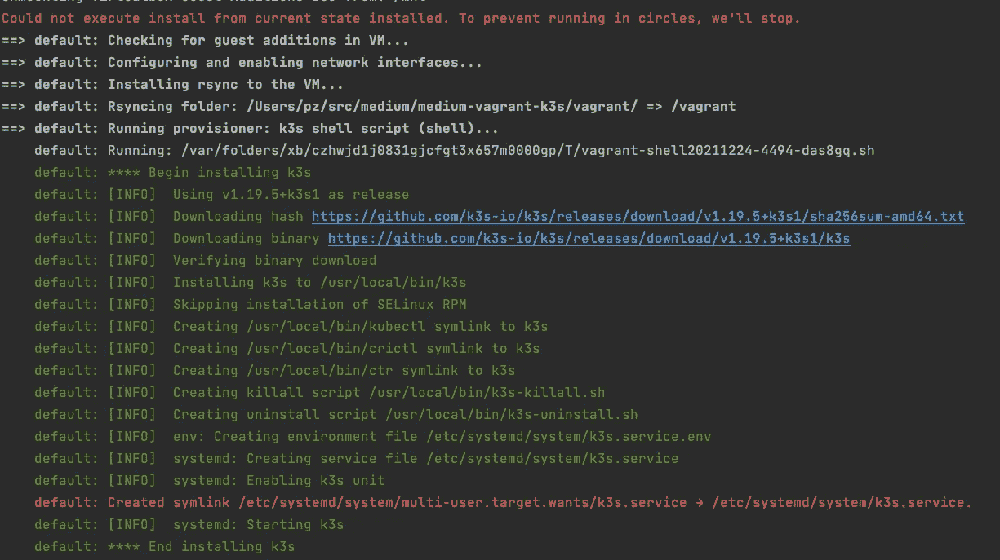
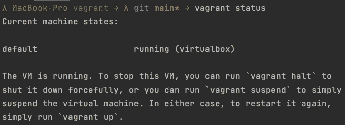
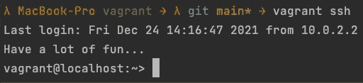
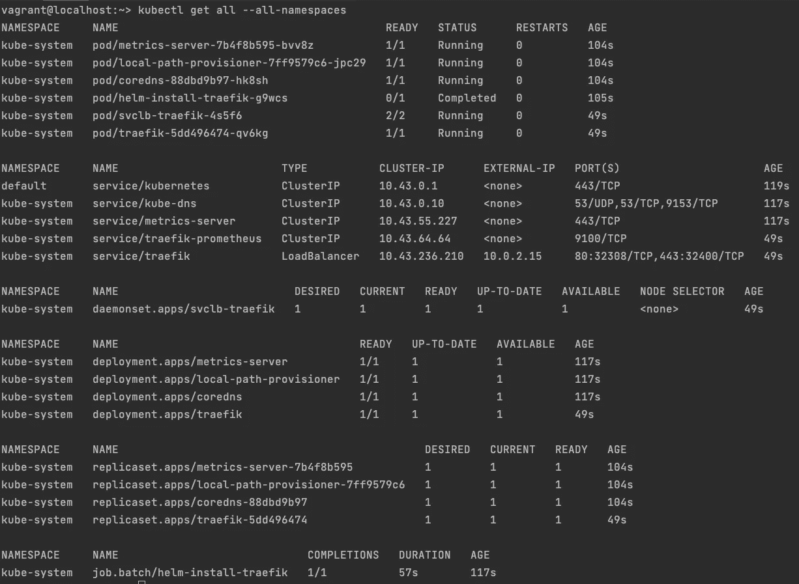
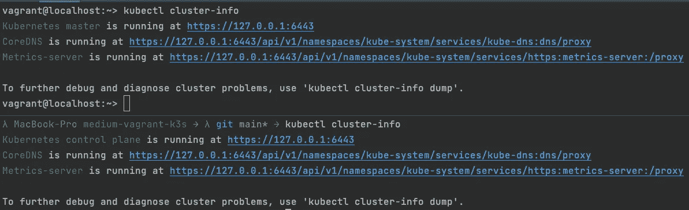
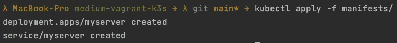
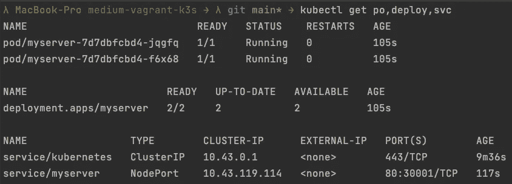
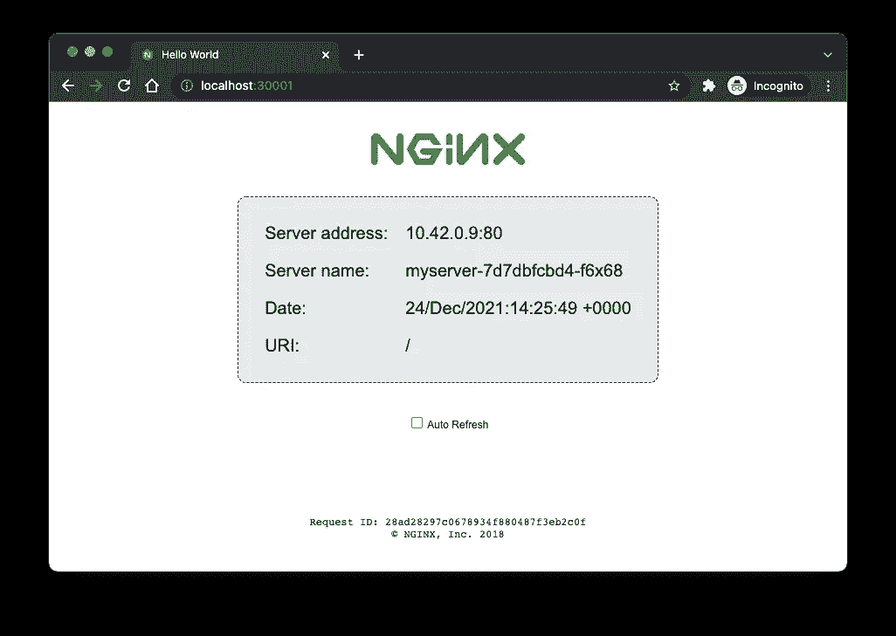

# 利用 vagger 和 K3s 开发本地 Kubernetes

> 原文：<https://levelup.gitconnected.com/local-kubernetes-development-using-vagrant-and-k3s-547bd5687a7f>

在您的本地漫游机器上设置 K3s，并从您的主机上将应用程序部署到集群的分步指南。


由[维塔米娜·波列兹诺娃](https://unsplash.com/@poleznova)在 [Unsplash](https://www.unsplash.com) 拍摄的照片

## 先决条件:

*   安装 [Virtualbox](https://www.virtualbox.org/wiki/Downloads)
*   安装[流浪汉](https://learn.hashicorp.com/tutorials/vagrant/getting-started-index?in=vagrant/getting-started)
*   安装 [Kubectl](https://kubernetes.io/de/docs/tasks/tools/install-kubectl/)

## 为什么用[流浪汉](https://learn.hashicorp.com/vagrant)和 [K3s](https://k3s.io/) 局部发展？

使用[流浪者](https://learn.hashicorp.com/vagrant)有助于防止污染你的主机。每个开发者都知道这种痛苦。你想尝试一些程序或技术。你必须安装它，添加一些依赖项，突然你的主机上充满了你永远不会再使用的程序、库和依赖项，你使用的磁盘空间堆积如山。一般来说，流浪者或虚拟机通过提供一个封装的空间来防止这种情况，当你完成时，你可以关闭并删除整个东西。另一个好处是，在其他开发人员机器上使用一个浮动文件可以很容易地复制整个设置，例如，在本教程中😉。

K3s 是一个非常轻量级的 Kubernetes 发行版，有助于减少资源的使用，由于有更多的可用资源，使得初始启动和整个开发过程更快。此外，安装就像运行一个 shell 命令一样简单。所以如果没有特别的需要去做一个完全成熟的发行版，我会一直推荐 K3s 进行本地开发。

## 学完本教程后，您将在本地机器上运行什么？

完成本教程后，您将获得以下结果:

*   一个带有 Kubernetes (K3s)集群的漫游虚拟机，您可以从您的主机访问该虚拟机。
*   从您的主机上运行`kubectl`命令来直接访问您的集群的可能性运行在 VM 上。
*   一个简单的 web 服务器将在您的 Kubernetes 集群上运行，您可以从您的主机上访问它，以验证一切都按预期运行。

# 我们开始吧

为了快速入门，我在 GitHub 上准备了一个资源库，您应该使用它来遵循本教程中描述的步骤，尽管在本文中我将重点介绍资源库的基本部分。

[](https://github.com/Abszissex/medium-vagrant-k3s) [## GitHub-abszisex/中型-流浪者-k3s

### 此时您不能执行该操作。您已使用另一个标签页或窗口登录。您已在另一个选项卡中注销，或者…

github.com](https://github.com/Abszissex/medium-vagrant-k3s) 

## 设置流浪机器

第一步是在我们的本地机器上设置浮动虚拟机。为此，我在链接的 GitHub 库中准备了一个`Vagrantfile`。可以在`vagrant/Vagrantfile`下访问。

**流浪档案**

这里有三个重要部分需要强调。

首先，我们向我们的主机公开我们的流浪虚拟机的几个端口。第一个端口是 Kubernetes API 服务器的端口`6443 and acts as`。您需要公开这个端口，让您的主机通过`kubectl`命令到达 Kubernetes API 服务器。

```
*# Kubernetes API Access* config.vm.network "forwarded_port", *guest: 6443*, *host: 6443*
```

如果您不在`Vagrantfile`中暴露这个端口，那么当您在您的主机上运行`kubectl`时，您将会得到以下错误:

```
The connection to the server 127.0.0.1:6443 was refused - did you specify the right host or port?
```

第二，我们公开端口范围 30000 到 30100。我们这样做是为了以后从我们的主机上通过其中一个端口访问我们的 web 服务器。理论上，在这里只公开一个端口就足够了，因为我们的集群上只运行一个服务。但是通常情况下，您会有几个服务正在运行并且可以到达，所以一个范围是一个很好的方式来轻松实现这一点。

```
*# Expose NodePort ports* for p in *30000*..*30100
*  config.vm.network "forwarded_port", *guest:* p, *host:* p, *protocol:* "tcp"
  end
```

第三，当我们配置一台新机器时，我们告诉 vagger 运行一个 shell 脚本。在我们的例子中，设置脚本名为`k3s.sh`，位于`Vagrantfile`的正下方。正如你所猜测的,`k3s.sh`脚本打算在配置后立即在我们的虚拟机上安装 K3s，所以你不必手动操作。

```
*# Run some setup script to install K3s on he VM* config.vm.provision "k3s shell script", *type:* "shell",
    *path:* "k3s.sh"
```

`k3s.sh`文件的内容:

**启动流浪虚拟机**

在我们验证了`Vagrantfile`的配置之后，我们就可以开始使用`vagrant up`创建 VM 了。为了让这个命令工作，我们必须和`Vagrantfile`在同一个文件夹中。

根据您的计算机功率和互联网连接速度，配置初始虚拟机可能需要几分钟时间。在您终端的控制台输出中，您还会注意到在配置结束时，vagger 将执行`k3s.sh`脚本并在 VM 上安装 K3s。



通过“向上漫游”来配置虚拟机

当 vanguard 完成配置后，您可以使用`vagrant status`来验证您的 VM 是否启动并运行。



通过“流浪状态”验证虚拟机状态

通过使用`vagrant ssh`,你可以直接 ssh 到你的虚拟机，一切就绪。



通过“自由 ssh”进入虚拟机

## 创建从您的主机到 Kubernetes 集群的连接

现在，我们已经在本地机器上配置了虚拟机，并验证了一切正常运行，是时候确认我们的设置脚本也正常工作了，Kubernetes 已安装在我们的虚拟机上，并允许我们的主机在虚拟机集群上运行`kubectl`命令。

首先，让我们检查一下`kubectl`是否工作，K3s 是否创建了`kube-system`名称空间中的所有资源。

为此，我们可以在虚拟机上运行以下命令来获取所有名称空间的所有资源。

```
kubectl get all --all-namespaces
```



“ku bectl get all-all-namespaces”的输出

如您所见，许多资源已经启动并运行，没有明显的错误。很好，那么让我们建立从主机到我们的 Kubernetes 集群的连接。

默认情况下，K3s 在位置`/etc/rancher/k3s/k3s.yaml.`创建一个 Kubernetes 配置资源。该配置包含连接信息，如用于创建与集群连接的服务器地址和证书。

在 VM 上使用`cat /etc/rancher/k3s/k3s.yaml`,我们可以将文件的内容打印到终端，复制它，并粘贴到我们主机上的`~/.kube/config`文件中。`~/.kube/config`处的配置文件被`kubectl`命令用来了解 Kubernetes API 服务器的地址以及如何连接到它。

编辑完配置后，我们可以通过运行任何`kubectl`命令来验证一切是否正常，并查看它是否正常工作。对于我的例子，我选择了`kubectl cluster-info`来确保命令指向正确的服务器，而不是我过去可能在某处配置的任何其他服务器。为了有 100%的把握，您还可以在您的浮动虚拟机上运行相同的命令，并比较输出。

下图显示了在我的浮动虚拟机和主机上运行`kubectl cluster-info`的输出。两者显示相同的结果。



在虚拟机和主机上运行“kubectl cluster-info”

## 在新集群上创建您的第一个应用程序

现在一切都按预期运行，我们可以从我们的主机访问我们的新集群，是时候在集群上创建并运行我们的第一个应用程序了。

我为这个演示准备了一个 Kubernetes 部署和一个 GitHub 存储库中的服务定义。您可以在存储库的`manifests`文件夹中找到这个例子的 YAML 定义。

该服务是 NodePort 类型的，公开了 30001 端口(还记得我们在`Vagrantfile`中公开了这个端口吗？😉)并指向我们部署的端口 80。另一方面，部署在端口 80 上运行带有两个副本的`nginxdemos/hello:0.2` Docker 映像，因此可以通过我们的服务进行访问。您可以在 [DockerHub](https://hub.docker.com/r/nginxdemos/hello) 上找到更多关于所用 Docker 图像的信息。

这个 Docker 图像的目的很简单，非常适合演示。根据官方文件:

> NGINX 服务器，提供一个简单的页面，包含主机名、IP 地址和端口，以及请求 URI 和 web 服务器的本地时间。

所以现在剩下的唯一事情就是通过`kubectl apply -f manifests/`应用我们的清单文件来启动我们的应用程序和服务。



通过` kubectl apply -f manifests/`应用我们的清单文件

由于它的体积很小，应用程序应该可以很快运行起来。通过`kubectl get po,deploy,svc`查询我们的 Kubernetes 集群，我们可以检查一切是否已经启动并运行。

正如您在下图中看到的，我们的两个 pod 处于`Running`状态，并且我们的部署告诉我们两个 pod 中的两个已经准备好并且可用。



` kubectl 获取采购订单，部署，服务'

最后但同样重要的是，让我们做最后的测试，检查我们是否可以访问在我们的 Kubernetes 集群上运行的 pod。

打开新的浏览器窗口并导航至 [http://localhost:30001](http://localhost:30001) :



# 摘要

如您所见，如果您知道如何做，在本地机器上构建一个新的 Kubernetes 集群并不困难。
希望我能为您提供一个快速的开始，为您的 Kubernetes 开发之旅正确地设置您的本地机器。

## 你想联系吗？

如果你想联系我，请在 LinkedIn 上联系我。

另外，请随意查看我的书籍推荐📚。

[](https://mr-pascal.medium.com/my-book-recommendations-4b9f73bf961b) [## 我的书籍推荐

### 在接下来的章节中，你可以找到我对所有日常生活话题的书籍推荐，它们对我帮助很大。

mr-pascal.medium.com](https://mr-pascal.medium.com/my-book-recommendations-4b9f73bf961b) [](https://mr-pascal.medium.com/membership) [## 通过我的推荐链接加入 Medium—Pascal Zwikirsch

### 作为一个媒体会员，你的会员费的一部分会给你阅读的作家，你可以完全接触到每一个故事…

mr-pascal.medium.com](https://mr-pascal.medium.com/membership)