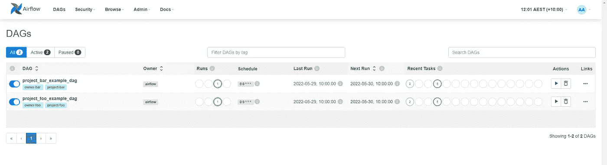
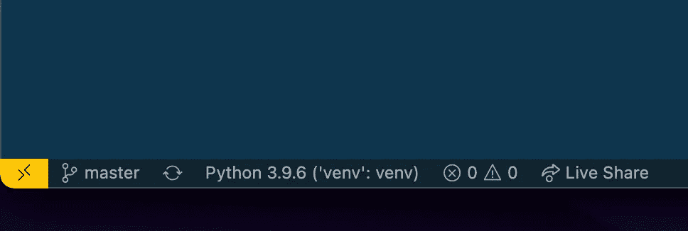
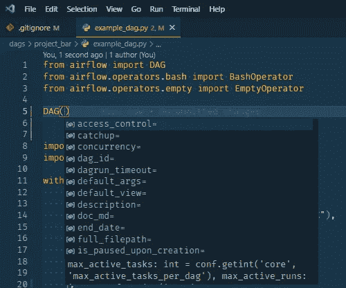

# 快速气流发展的本地设置

> 原文：<https://levelup.gitconnected.com/local-setup-for-fast-airflow-development-ca26c478f4b5>


我已经在 Airflow 平台上开发了一段时间，用它来调度和编排数据工程工作负载。对于这项工作，我投入了大量时间来确保它有一个优秀的开发人员工具链，允许工程师快速构建 Dag 和插件，并在将包部署到生产环境之前在本地测试工作。

在这篇文章中，我将讨论如何设置 Airflow repo，以允许您通过适当的 repo 结构更快地构建和测试 Dag 和操作符，并使用 Docker 更容易地定义和编排我们的 Airflow 运行时，以便您可以继续编写代码，而不是在本地 Airflow 堆栈上运行 ops 来测试您的更改。对于这个示例设置，[我已经在这里创建了一个 git repo，](https://github.com/Aaron-K-T-Berry/airflow-docker-boilerplate)因此，如果您想在它的基础上扩展您的 Airflow 项目，您可以派生或克隆它，并将其作为一个起点。

# 回购结构

对于回购结构，你需要平衡两个主要因素。将您的 Dag 拆分到每个项目并在 Dag 之间共享公共操作符的能力，无论它们是耦合到单个项目还是分离的公共设施。我发现基本的回购结构采取以下形式，以支持按项目分组，并鼓励代码共享。

```
├───config
|   |   airflow.cfg
├───dags
│   ├───project_1
│   │     example_dag.py
│   └───project_2
│         example_dag.py
├───plugins
│   ├───hooks
│   │      hello_hook.py
│   ├───sensors
│   │      hello_sensor.py
│   ├───operators
│   │      hello_operator.py
│   ├───scripts
│       ├───project_1
|       |      transform_cases.py
│       ├───common
|             helper.py
|             aws.py
| Dockerfile
| docker-compose.yml
| requirements.txt
```

有一点需要注意的是，任何 ***。py*** 文件在我们的 repo 中的 DAGs 文件夹下找到，当我们将它安装到 Docker 堆栈时，它会被气流拾取。这意味着您可以创建文件夹，并拥有任何您想要的结构来组织您的 DAG 代码，但是在编写时，Airflow UI 无法在 UI 中表示该文件夹结构。所有 DAG 都显示在一个表中，但是描述[DAG 之间所有权的有效方法是为每个 DAG](https://github.com/Aaron-K-T-Berry/airflow-docker-boilerplate/blob/master/dags/project_bar/example_dag.py#L16-L19) 配置所有者和标签。在 DAG docs 字符串中记录此信息也可能是有效的。[更多详情在下面的文章](/airflow-dag-and-task-markdown-docs-2c00c72152b4)。

对于插件文件夹，当它被装载到 Airflow 中时，它将被添加到 python sys 路径中，因此该文件夹中的任何内容都可以像常规 python 模块一样作为 DAG 代码的一部分导入。这样，你可以使用你的打包模式来划分你的 python 工具、操作符、钩子等等，无论你需要什么样的公共文件夹、项目文件夹或者客户文件夹。对于示例 repo，插件文件夹是按照 [Astronears 社区](https://www.astronomer.io/guides/)的建议设置的，为您可能想要定制或扩展的每个气流资源提供一个文件夹。

# Docker 撰写

为了更容易地在本地和生产中运行我们的气流堆栈，我倾向于在运行时使用 Docker 容器来运行气流，并使用 Docker Compose 来定义和编排堆栈。通过这种设置，我们可以清楚地区分 pip 和 apt 包等气流依赖项和 Dag 形式的气流应用程序代码、操作符和插件代码，它们都是用 python 编写的。

我们的 repo 现在将包含如何运行我们的 Airflow 堆栈的明确定义，以及在该堆栈上运行所需的内容，通过明确的职责分离和我们用来管理它们的工具，使一切都变得更加可移植和易于修改。通过这个 docker 文件，您还应该受益于在机器之间拥有一个可再现的环境，这为调试省去许多麻烦。

下面的 docker 文件显示了一个基本设置，它扩展了官方的 Airflow 映像，以安装我们的 DAG 代码所需的依赖项。您可以参考以下来自 Airflow 的文档，了解关于根据您的项目需求扩展基本 Airflow Docker 图像的[的一些细节。](https://airflow.apache.org/docs/docker-stack/build.html#extending-the-image)

```
# Extend over the airflow base image
FROM apache/airflow:2.3.1USER root# Install any root level apt packages
RUN apt-get update && \
  apt-get install -y --no-install-recommends build-essential# Run remaining commands as the airflow runtime user
USER airflow# Install airflow related files onto the host
COPY ./config/airflow.cfg /opt/airflow/airflow.cfg
COPY ./plugins /opt/airflow/plugins
COPY ./dags /data/airflow/dags# Install pip packages into the container that DAG code needs
COPY ./requirements.txt /tmp/requirements.txt
RUN pip install -r /tmp/requirements.txt
```

为了操作我们的栈，我们将使用 Docker Compose 来声明我们的气流栈的公共配置。我们基于 Airflow 提供的配置作为他们[推荐的配置](https://github.com/apache/airflow/blob/main/docs/apache-airflow/start/docker-compose.yaml)，并在示例报告中做了一些细微的修改。配置了这个 Dockerfile 和 docker-compose.yml 之后，我们可以使用下面的命令快速调出和删除 docker-compose 堆栈。

```
# Build the local extended Airflow container using the local Dockerfile
docker-compose build# Run all of the containers used in the stack
docker-compose up# Take down the airflow stack gracefully
docker-compose down
```

一旦您运行了您的应用程序，您就可以像往常一样访问位于 ***localhost:8080*** 的 UI，并开始操作和监控 Dag。



需要注意的一点是我们如何为本地 Dag 和 python 插件文件配置挂载。查看 Docker compose 配置中的卷块，我们已经将其配置为挂载本地 DAG 和插件目录。这允许我们在本地更新文件时，让所有的气流服务更新运行的 Dag，以加快我们的开发时间，因为我们可以很快看到我们的 Dag 或操作代码中是否有任何中断的逻辑，而无需同步我们的文件和更新每个代码都改变的整个气流堆栈。

```
---
version: '3'
x-airflow-common:
  &airflow-common
  build: .
 # .... other parts excluded in example 
  volumes:
  # Mount the local folders into the running Airflow containers
    - ./dags:/opt/airflow/dags
    - ./plugins:/opt/airflow/plugins
```

# 本地编辑器配置

当你开发 python 来描述你的 Airflow DAG 或插件时，你可能想在你的编辑器中得到一些代码完成的建议来更快地编写和理解你的代码。因为我们已经为 Dockerfile 和附带的 requirements.txt 文件定义了 python 运行时，所以我们可以使用它来创建我们的 python 虚拟环境，然后我们的编辑器可以引用它来访问我们安装的模块，例如代码完成。我们可以像 normal 一样创建和获取 python venv，并安装包含的 requiremnts.txt 文件，以使用我们的代码编辑器中可用的所有依赖项，就像 Airflow 在运行时在我们的本地堆栈中使用的容器中使用的一样。

```
# Create a venv
python -m venv venv# Add the venv to your path
source venv/bin/activate# Install all of the python modules that are used in the Docker container
pip install -r requirements.txt
```

对于我的代码编辑器，我使用 VS 代码，我可以为它设置 python 环境，以用于代码自动完成和建议的源模块。创建 venv 后，我将编辑器指向 repo 中的本地 venv。我们将获得基于我们创建的本地 venv 中安装的任何东西的自动完成，这使得在使用气流模块时发现您需要的所有参数变得容易得多。



如果您使用的是另一个代码编辑器，那么您需要配置它的 python 解释器，使其指向您创建的 repo 中的本地 venv，以便安装在那里的所有模块可供您的编辑器搜索。一些关于 [IntelliJ](https://www.jetbrains.com/help/idea/creating-virtual-environment.html) 和 [PyCharm](https://www.jetbrains.com/help/pycharm/creating-virtual-environment.html) 的文档可以在这里找到。

# 包扎

希望这篇文章能给你一些提示，告诉你如何在本地机器上更好地使用气流。我使用这个设置已经有一段时间了，它帮助我通过使用本地容器更快地开发操作符和 Dag，并且您可以在运行的气流环境中很快看到这些变化。这些容器还提供了一种非常简单的方法来更新 DAG 的运行时依赖项，例如 apt 或 pip 包。你也不能否认这样一个事实，你运行的 airflow 实例将总是使用你的文件的本地版本，因此你不应该试图更新当前的 airflow 文件时遇到这些奇怪的问题，并且它不会被组件拾取。

# 进一步连接

*   如果你正在考虑购买一份中等订阅，你可以通过我的推荐链接来帮我。
*   查看我在[媒体](https://medium.com/@aaron-kt-berry)上的其他文章，如果你想了解最新消息，请通过[电子邮件](https://aaron-kt-berry.medium.com/subscribe)订阅。
*   如果你想聊天，请在 Twitter 或 LinkedIn 上联系我，如果你想雇佣我，我在 Codementor 上。