# 免费本地测试 AWS 应用程序

> 原文：<https://levelup.gitconnected.com/local-testing-aws-applications-at-no-cost-c0bdd009d1d0>

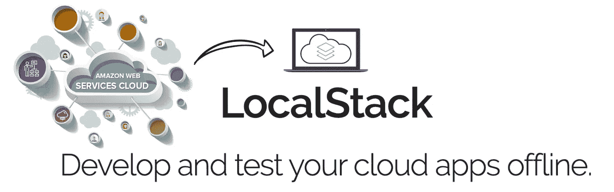

AWS 在所有云平台中一直如此受欢迎。正如所有平台的本质一样，在 AWS 上开发应用程序有许多挑战，比如部署、缺乏知识、调试，当然还有成本管理。为了减少和防止这些缺点，在部署到云之前，可以尝试一些有益的工具。LocalStack 和 AWS SAM 是在本地进行测试的优秀工具。

**LocalStack** 是一个开源框架，模仿了几个 AWS 云服务，并在本地提供了一个测试环境。更多细节可以看[网页](https://localstack.cloud/)和 [Github 回购](https://github.com/localstack/localstack)。

我设计了一个名为 *discount-spotter* 的全无服务器审计项目，它只需抓取一个 URL，如果价格低于阈值就发送通知。该项目基本上需要 AWS 服务，例如用于审计者的 [EventBridge](https://aws.amazon.com/eventbridge/) ，用于数据转换的 [Lambda](https://aws.amazon.com/lambda) ，用于消息队列的 [SQS](https://aws.amazon.com/sqs) ，以及用于通知的 [SNS](https://aws.amazon.com/sns) 。对于 URL 抓取步骤，我设置了 5000 的门槛，并在土耳其最大的电子商务公司 Trendyol 上选择了智能手机。

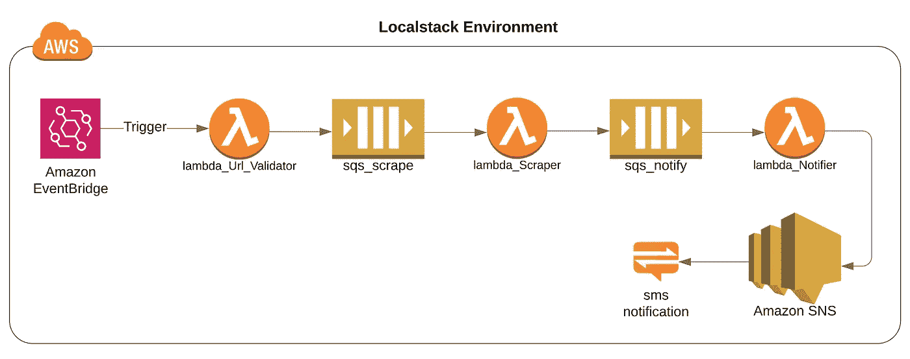

样本 AWS 项目的云基础设施

第一个λ`lambda_Url_Validator`是为了一般用途而添加的。它只从自己的环境变量中获取一个 URL。如果您有几个 URL 需要审计折扣，您可以使用 AWS 提供的许多数据库服务中的一个，如 [*DynamoDB*](https://aws.amazon.com/dynamodb/) 、 [*RDS*](https://aws.amazon.com/rds/) 和 [*Aurora*](https://aws.amazon.com/rds/aurora) (不在自由层)。然后，您可以从数据库中获取 URL，而不是从 lambda 环境变量中获取。

# 运行 LocalStack

可以使用 python 和 docker 安装 LocalStack。我更喜欢通过 docker 安装的方式。

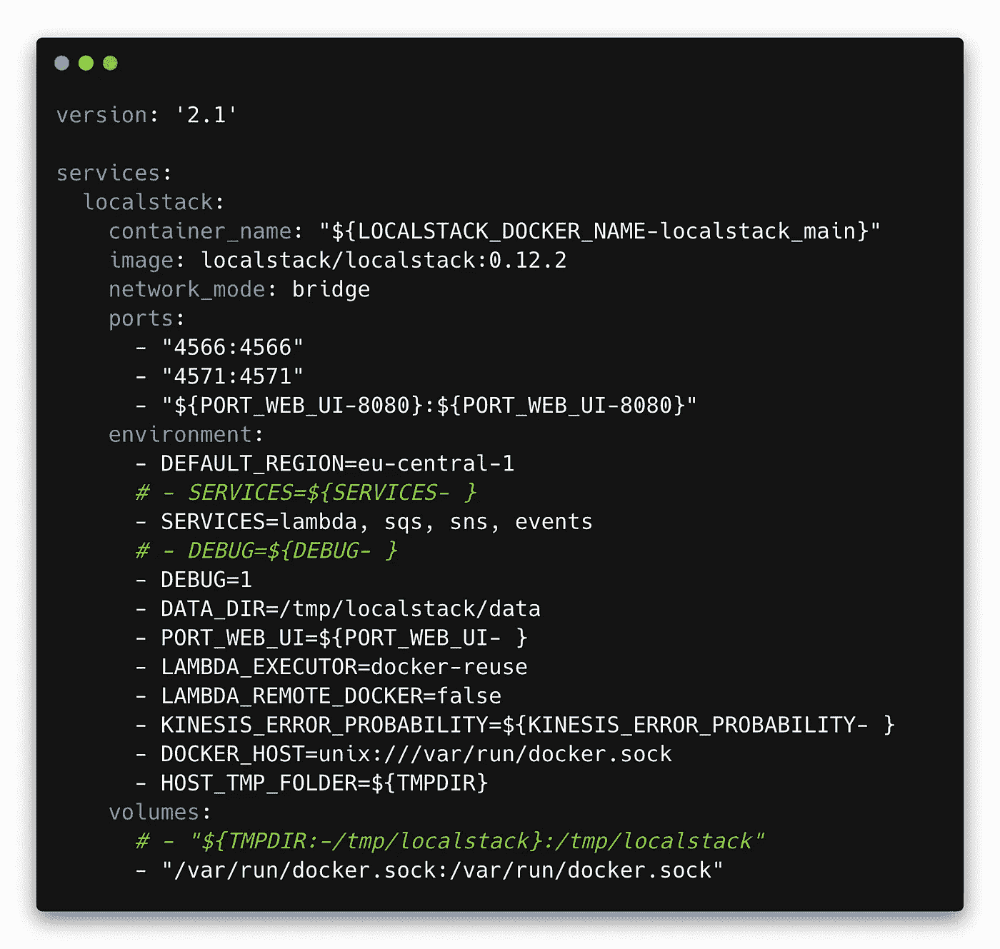

以前，LocalStack 为每个服务开放不同的端口，但现在它只在一个端口上运行， *4566* 。因此，您可能会在其他 docker-compose 文件中看到不同的端口分配。

我所做的更改如下:添加特定的 image 标签，更改环境变量 *DEFAULT_REGION* ， *SERVICES* ， *DEBUG* ， *LAMBDA_EXECUTER* ， *LAMBDA_REMOTE_DOCKER，禁用第一个 LocalStack 卷*。

*   ***image:local stack/local stack:0 . 12 . 2*>**local stack 仍在开发中，因此使用不带任何标记的会影响您的本地测试环境。所以你最好用一个图像标签来拥有一个更稳定的系统。
*   ***DEFAULT _ REGION = eu-central-1***>为了避免错误的 API 重定向，我添加了默认区域以防万一。
*   ***SERVICES=lambda，sqs，sns，events*** >保留这个变量不变，将导致所有的模拟服务都将由 LocalStack 启动。因此，最好指定需要哪些服务。
*   ***DEBUG=1*** >设置调试模式为 1 会让 LocalStack 详细写调试日志。
*   ***LAMBDA _ EXECUTOR = docker-reuse***>该设置使得 LocalStack 为每个函数创建单独的容器，并重用它们。
*   ***LAMBDA _ REMOTE _ DOCKER = false***>设置为 false，因为我们将使用本地代码进行 LAMBDA 调用。
*   ***$ { TMPDIR:-/tmp/local stack }:/tmp/local stack***>我把这个卷去掉了。LocalStack 存储每次执行出现的自己的数据。所以旧的数据可能会干扰当前的测试过程。

运行完`docker-compose up`命令后，我们应该等待 LocalStack 让所有服务准备好。一旦信号`Ready`发出，我们就可以开始部署了。

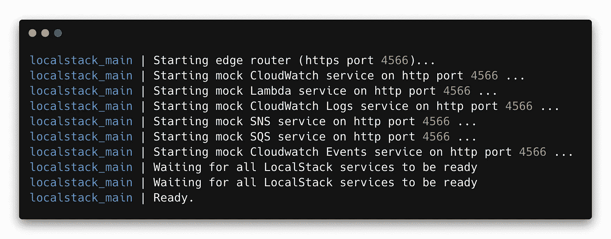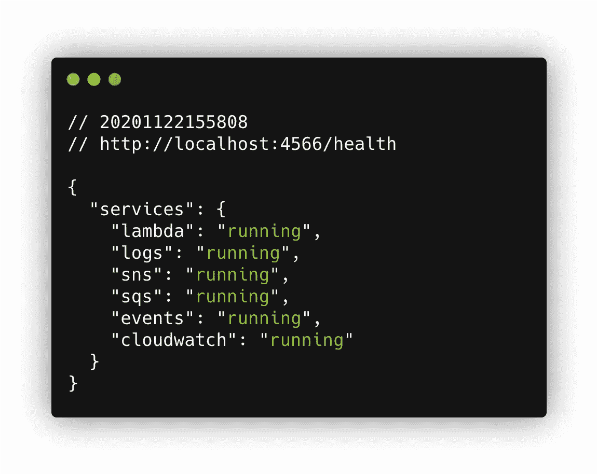

有时延迟可能会在初始化期间出现，因此我们应该手动检查我们启动的服务的状态。

LocalStack 有一个用于健康检查的端点。简单访问网址；

`[http://localhost:4566/health](http://localhost:4566/health)`

对于部署，还有其他一些工具，如`[AWS-CLI](https://aws.amazon.com/cli/)`、`[AWS_SAM](https://aws.amazon.com/serverless/sam/)`、`[Serverless Framework](https://www.serverless.com/)`。我现在用的是`AWS-CLI`。[在这里](https://docs.aws.amazon.com/cli/latest/index.html)你可以找到所有服务的所有 CLI 命令。在开始测试之前，必须首先应用 AWS-CLI 配置。只需运行`aws configure`命令并为凭证提供虚拟值。*区域*和*输出*值必须合理，分别像 *eu-central-1* 和 *json* 。

当我们继续进行本地部署时，我们应该将本地服务 URL 传递给每个 CLI 命令的参数`--endpoint`。这就是为什么 LocalStack 开发了一个名为`[awscli-local](https://github.com/localstack/awscli-local)`的 CLI 包装器，可以自动为所有服务设置端点 URL。

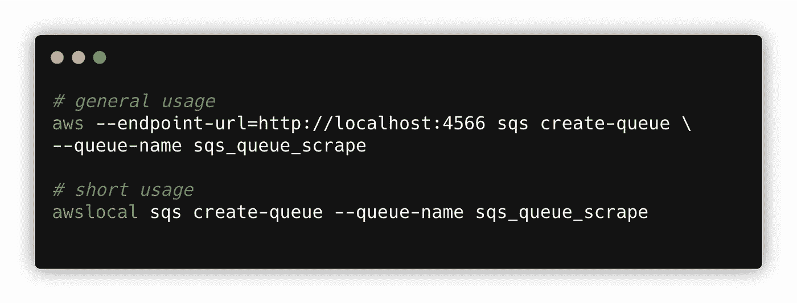

我们有两个用于部署的 shell 脚本；`1_Create_SQS_SNS.sh`和`2_Create_lambdas.sh`如果来自 bash 的终端不同，您可能需要给予 shell 脚本文件执行权限。`chmod +x ./*.sh`

1**_ Create _ SQS _ SNS . sh**>这个文件包含的 shell 脚本简单地创建了两个 SQS 队列， *sqs_queue_scrape* 、 *sqs_queue_notify* 和一个 SNS 主题 *sns_topic_price* 。SNS 中的电子邮件协议尚未开发，如这里的[所示](https://github.com/localstack/localstack/blob/2f1c5d71f539fddd1f6db1f6e133ea957a55d45b/localstack/services/sns/sns_listener.py#L272)。这就是为什么我会用一个虚拟手机订阅 SNS 主题，以短信的形式获得通知。Tough [AWS SES](https://aws.amazon.com/ses/) 是 LocalStack 中涉及的另一个选项。

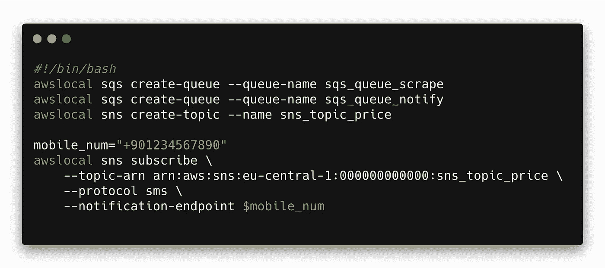

2**_ Create _ lambdas . sh**>这个文件包含了简单创建三个 lambda 函数的 shell 脚本， *lambdaUrlValidator* 、 *lambdaScraper、*和*lambdan notifier*。由于我们将变量 *LAMBDA_EXECUTOR* 设置为 *docker-reuse* ，LocalStack 将创建一个单独的容器。为了使 lambda 容器能够访问其他服务，它必须从其进程中获取主机 URL。这就是为什么我们不能简单地在 lambda 代码中使用 URL `localhost:4566`。必须按如下方式使用本地堆栈主机名:

```
http://${LOCALSTACK_HOSTNAME}:4566/queue/${process.env.queue_name}
```

我不想使用 *LOCALSTACK_HOSTNAME* 来避免 local 和 prod 代码之间特定于环境的变化。这就是为什么我必须解析命令输出来获取主机 URL，然后使用环境变量将它传递给 lambda 函数。功能`lambdaScraper`的样本创建和设置如下:

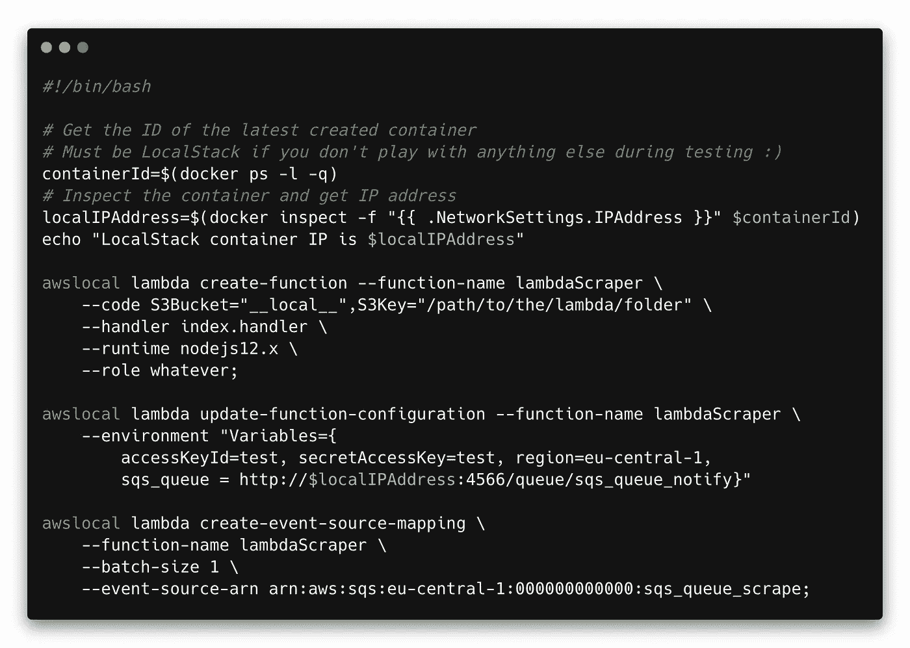

要测试和调用 lambda 函数，只需运行下面的命令。

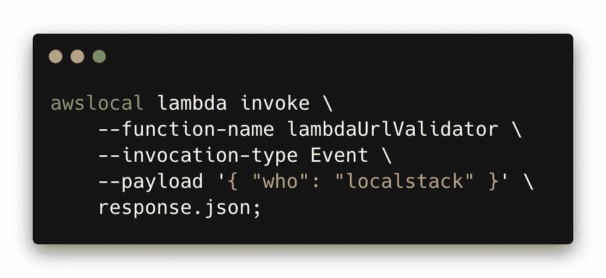

热交换可用于 lambda 执行，因为函数代码是从本地目录中取出的。因此您可以更改代码，而无需重启 LocalStack 容器或重新创建函数。

# 添加触发器

EventBridge 有类似于`rate`和`cron` job 的规则来触发端点。我更喜欢 cron 设置特定的通知时间，但是您可以根据自己的意愿使用 rate job。这个 cron 表示目标 lambda 函数将在每天的`8:00 AM`和`20:00 PM`被触发

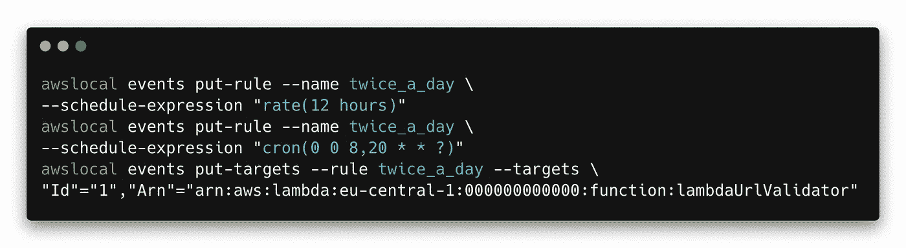

为了测试触发器，我最初将`rate`设置为`1 minutes`。因为 lambda 函数在另一个容器中运行，所以它们的日志比其他服务要晚一些。`invalid url`和`valid url`情况的日志如下:

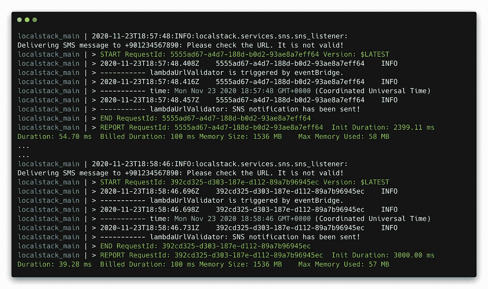

无效 URL 的 LocalStack 调试日志。

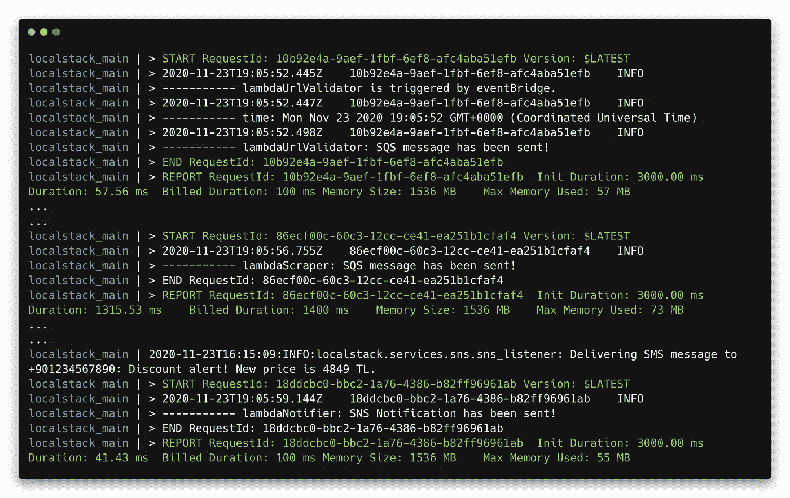

有效 URL 的 LocalStack 调试日志。

# 设计选择

我使用 SQS 来创建事件流，但在 AWS 云堆栈中还有其他选项，例如`[Step Functions](https://aws.amazon.com/step-functions)`如果您有特定于业务的逻辑，您可以组装 lambda 函数来创建应用程序流。使用阶跃函数可以节省您的 SQS 收费，并根据域降低成本。当然，这取决于项目领域。

显然，Lambda 函数使用五个并行的长轮询连接来监听 SQS，最大等待时间是 20 秒，如[开发者指南](https://docs.aws.amazon.com/AWSSimpleQueueService/latest/SQSDeveloperGuide/sqs-short-and-long-polling.html#sqs-long-polling)和[博客文章](https://aws.amazon.com/de/blogs/aws/aws-lambda-adds-amazon-simple-queue-service-to-supported-event-sources/)中所述。假设您在 AWS 免费层，您只能使用一个队列作为事件源映射，而不会被收费。免费层允许您每月免费发送 100 万个请求。因此，一个队列映射每月将产生大约 5 * 3 * 60 * 24 * 30 = 64 万个请求。添加第二个映射可能会开始收费。这就是为什么在部署到 prod 之前在本地测试应用程序有利于减少付费请求的数量。

整个项目可以在 [**Github repo**](https://github.com/ustundag/localstack-demo) 上找到一个简单的阶跃函数示例。如前所述，LocalStack 仍在开发中，因此您最好继续关注下一个特性，以免受到变化的影响。