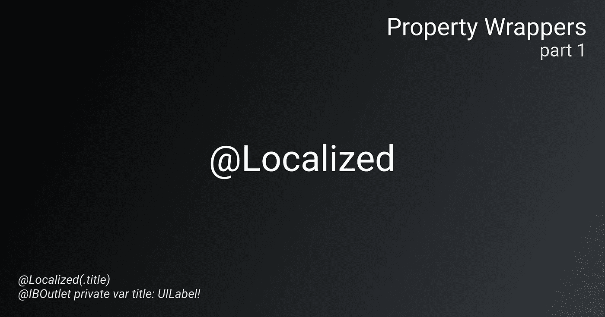

# 本地化 Swift 应用程序

> 原文：<https://levelup.gitconnected.com/localize-swift-application-f1fd0f4af800>

您好 Swift 开发者，我想与您分享我在应用程序中使用**属性包装器**的经验和知识，以及如何减少您的代码并使其更易于维护。我将在几个主题部分写这一点。

在 Swift 5.1 中，Apple 引入了**属性包装器**，这使得在您的属性和服务逻辑之间建立附加层成为可能。

这部分是关于如何使用**属性包装器**和`@IBOutlet`中的简单方法来本地化你的应用程序。

所以，代替**的基本**情况:

基本本地化

我们可以用**属性包装器** `@Localized`来改进代码，并且有:

属性包装本地化

它看起来很漂亮，不是吗？所以让我们创建`@Localized`属性包装器。
将关键字应用为枚举会很好，有:`@Localized(.natureTitle)`

本地化属性包装

并且可以申请任何符合`Localizable`协议的。为了实现我们的目标，我们还将延长`UILabel`和`UIButton`。

可本地化的协议和扩展

我们需要的最后一样东西是`LocalizationKey`:

本地化键

因为我们的枚举是原始可表示的，因为`String`符合协议，所以让`Localizable.strings`具有相同的键值就足够了。

所以最后我们的代码看起来像这样:

健壮的属性包装本地化

这部分就这些了！以下是一些`@Localized`可以包含的潜在想法:

*   将格式值与字符串一起应用于动态替换。
*   能够从特定的表和包中确定字符串。

*在官方文档中读到更多关于属性包装器的信息:*

 [## 属性-Swift 编程语言(Swift 5.2)

### 属性将值与特定的类、结构或枚举相关联。存储属性存储常数和…

docs.swift.org](https://docs.swift.org/swift-book/LanguageGuide/Properties.html)