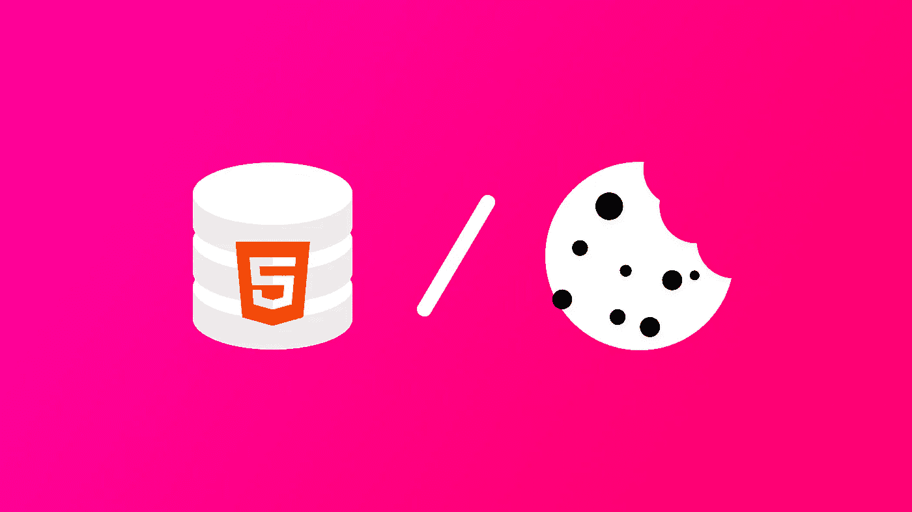

# LocalStorage 与 Cookies:关于在前端安全存储 JWT 令牌，您只需要知道

> 原文：<https://levelup.gitconnected.com/localstorage-vs-cookies-all-you-need-to-know-about-storing-jwt-tokens-securely-in-the-front-end-519f83c2b282>

*JWT 代币很棒，但你如何将它们安全地存储在你的前端呢？我们将讨论本地存储和 Cookies 的优缺点。*



[在我的上一篇文章](https://blog.cotter.app/what-on-earth-is-oauth-super-simple-intro-to-oauth-20-access-tokens-and-how-to-implement-it-in-your-site/)中，我们研究了 OAuth 2.0 是如何工作的，以及如何生成访问令牌和刷新令牌。现在，我们将深入探讨如何在您的前端存储令牌。

**访问令牌**通常是短暂的 JWT 令牌，由您的服务器签名，并包含在对您的服务器的每个 HTTP 请求中，以授权该请求。**刷新令牌**通常是存储在数据库中的长期不透明字符串，用于在到期时获取新的访问令牌。

# 我应该在前端的哪里存放我的代币？

有两种常见的方法来存储您的令牌。第一个在`localStorage`中，第二个在 cookies 中。关于哪一种更好有很多争论，大多数人倾向于 cookies，因为它们更安全。

让我们回顾一下`localStorage`和 cookies 的对比。本文主要是根据[这篇文章](https://dev.to/rdegges/please-stop-using-local-storage-1i04)和对这个帖子的评论。

## 局部存储器

**优点:方便。**

*   纯 JavaScript，很方便。如果你没有后端，并且依赖于第三方 API，你不能总是要求第三方 API 为你的站点设置一个特定的 cookie。
*   使用需要你把访问令牌放在头中的 API，比如:`Authorization Bearer ${access_token}`。

缺点:容易受到 XSS 的攻击。

当攻击者可以在您的网站上运行 JavaScript 时，就会发生 XSS 攻击。这意味着攻击者可以获取您存储在`localStorage`中的访问令牌。XSS 攻击可能来自您网站中包含的第三方 JavaScript 代码，如 React、Vue、jQuery、Google Analytics 等。在你的站点中不包含任何第三方库几乎是不可能的。

## 饼干

**优点:无法通过 JavaScript 访问 cookie 因此，它不像** `**localStorage**` **那样容易受到 XSS 的攻击。**

*   如果你正在使用`httpOnly`和`secure`cookie，这意味着你的 cookie 不能使用 JavaScript 访问，所以即使攻击者可以在你的网站上运行 JS，他们也不能从 cookie 中读取你的访问令牌。
*   它会在每个 HTTP 请求中自动发送到您的服务器。

**缺点:根据不同的用例，您可能无法将令牌存储在 cookies 中。**

*   Cookies 的大小限制为 4KB。因此，如果您使用大的 JWT 令牌，存储在 cookie 中不是一个选项。
*   有些情况下，您不能与 API 服务器共享 cookies，或者 API 要求您将访问令牌放在授权头中。在这种情况下，您将无法使用 cookies 来存储您的令牌。

# 关于 XSS 袭击事件

本地存储易受攻击，因为使用 JavaScript 很容易访问它，攻击者可以检索您的访问令牌并在以后使用它。然而，虽然使用 JavaScript 无法访问`httpOnly` cookies，但这并不意味着使用 cookies 就可以免受涉及访问令牌的 XSS 攻击。

如果一个攻击者可以在你的应用程序中运行 JavaScript，那么他们可以向你的服务器发送一个 HTTP 请求，这个请求会自动包含你的 cookies 这对攻击者来说不太方便，因为他们无法读取令牌的内容，尽管他们很少需要这样做。对于攻击者来说，使用受害者的浏览器进行攻击(只需发送 HTTP 请求)可能比使用攻击者的机器更有利。

# 饼干和 CSRF 攻击

CSRF 攻击是一种迫使用户执行非预期请求的攻击。例如，如果网站通过以下方式接受电子邮件更改请求:

```
POST /email/change HTTP/1.1 
Host: site.com 
Content-Type: application/x-www-form-urlencoded 
Content-Length: 50 Cookie: session=abcdefghijklmnopqrstu email=myemail.example.com
```

然后，攻击者可以很容易地在一个恶意网站中制作一个`form`，向`https://site.com/email/change`发送一个带有隐藏电子邮件字段的 POST 请求，然后`session` cookie 将自动包含在内。然而，这可以通过在你的 cookie 中使用`sameSite`标志并包含一个[反 CSRF 令牌](https://owasp.org/www-community/Anti_CRSF_Tokens_ASP-NET)来轻松缓解。

# 那么，我如何使用 cookies 来持久化我的 OAuth 2.0 令牌呢？

概括来说，以下是存储代币的不同方法:

*   **选项 1:** 将您的访问令牌存储在`localStorage`中:倾向于 XSS。
*   **选项 2:** 将您的访问令牌存储在`httpOnly` cookie 中:容易出现 CSRF，但可以减轻，在暴露于 XSS 方面稍好一些。
*   **选项 3:** 将您的刷新令牌存储在`httpOnly` cookie 中:安全来自 CSRF，在暴露于 XSS 方面稍好一些。

我们将讨论**选项 3** 的工作原理，因为它是 3 个选项中最好的。

## 选项 3:将访问令牌存储在内存中，将刷新令牌存储在 cookie 中

为什么这对 CSRF 来说是安全的？尽管提交给`/refresh_token`的表单可以工作，并且会返回一个新的访问令牌，但是如果攻击者使用 HTML 表单，他们无法读取响应。为了防止攻击者成功发出`fetch`或`AJAX`请求并读取响应，需要正确设置授权服务器的 CORS 策略，以防止来自未授权网站的请求。

## 那么这个设置是如何工作的呢？

**第一步:用户通过认证后，返回访问令牌和刷新令牌。**

用户通过认证后，授权服务器将返回一个`access_token`和一个`refresh_token`。`access_token`将包含在响应体中，而`refresh_token`将包含在 cookie 中。

刷新令牌 cookie 设置:

*   使用`httpOnly`标志来防止 JavaScript 读取它。
*   使用`secure=true`旗，这样它只能通过 HTTPS 发送。
*   尽可能使用`SameSite=strict`旗来防止 CSRF。这只能在授权服务器与您的前端具有相同站点的情况下使用。如果不是这种情况，那么您的授权服务器必须在后端设置 CORS 头或使用其他方法来确保刷新令牌请求只能由授权网站完成。

**步骤 2:将访问令牌存储在存储器中**

将令牌存储在内存中意味着将这个访问令牌放在前端站点的一个变量中。是的，这意味着如果用户切换到另一个选项卡或刷新站点，访问令牌将会消失。这就是为什么我们有刷新令牌。

**步骤 3:使用刷新令牌更新访问令牌**

当访问令牌消失或过期时，点击`/refresh_token`端点，步骤 1 中存储在 cookie 中的刷新令牌将包含在请求中。然后，您将获得一个新的访问令牌，可以用于您的 API 请求。这意味着您的 JWT 令牌可以大于 4KB，您也可以将它放在授权头中。

# 结论

尽管 cookies 仍然有一些漏洞，但这种方法比`localStorage`更可取。这是因为`localStorage`和 cookies 都容易受到 XSS 攻击，但是当你使用`httpOnly` cookies 时，攻击者就更难攻击了。此外，cookies 容易受到 CSRF 攻击，但这种威胁可以通过使用`sameSite`标志和[反 CSRF 令牌](https://owasp.org/www-community/Anti_CRSF_Tokens_ASP-NET)来缓解。最后，即使你需要使用`Authorization: Bearer`头或者你的 JWT 大于 4KB，你也可以让它工作。

这也符合 OWASP 社区的建议:

> *不要在本地存储中存储会话标识符，因为 JavaScript 始终可以访问这些数据。Cookies 可以使用* `*httpOnly*` *标志来减轻这种风险。*
> 
> [*- OWASP: HTML5 安全备忘单*](https://cheatsheetseries.owasp.org/cheatsheets/HTML5_Security_Cheat_Sheet.html)

# 就是这样！

这应该包括基本的，并帮助您保护您的网站。

# 资源

写这篇博客时，我们参考了几篇文章，尤其是这些文章:

*   [请停止使用本地存储](https://dev.to/rdegges/please-stop-using-local-storage-1i04)
*   [在前端客户端处理 jwt 的终极指南(GraphQL)](https://hasura.io/blog/best-practices-of-using-jwt-with-graphql/#jwt_persist)
*   [cookie 与会话的本地存储——你需要知道的一切](https://supertokens.io/blog/cookies-vs-localstorage-for-sessions-everything-you-need-to-know)

# 问题和反馈

如果您需要帮助或有任何反馈，请随时在这里发表评论！

这篇文章是由 [Cotter](http://cotter.app/) 的团队撰写的——你的网站或应用程序的无密码登录。