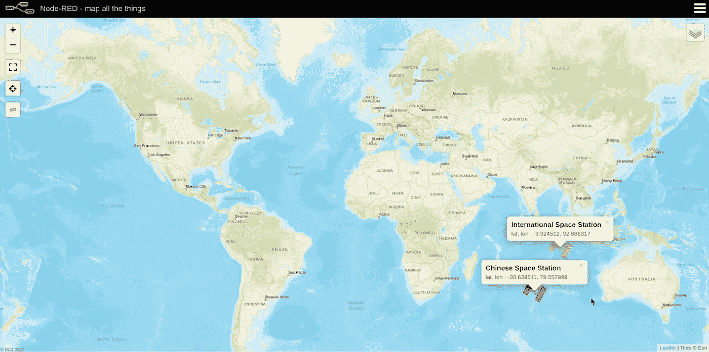

# 用红色节点定位国际空间站和中国空间站——天宫

> 原文：<https://levelup.gitconnected.com/locating-the-international-space-station-chinese-space-station-tiangong-with-node-red-46b017ff9c17>

在这个迷你项目中，我们将配置 Node-RED 来定位国际空间站&中国空间站(即天宫空间站)的相对位置。

为了开始这个迷你项目，我们将使用[N2YO.com](https://www.n2yo.com/login/)创建一个帐户来获取 URL 和 API 密钥。然后，我们将安装来自 Node-RED 的[世界地图节点，最后，我们将建立检测国际空间站(ISS) &天宫空间站(TSS)位置的流程。](https://flows.nodered.org/node/node-red-contrib-web-worldmap)

****在整个迷你项目*** *中，我为您提供了创建两个 API URL&显示空间站所需的所有代码。**

事不宜迟，我们开始吧！

**程序**:

从访问[N2YO.com](https://www.n2yo.com/login/)开始。

单击注册新帐户。

用你的用户名和密码创建一个账户。我们将在接下来的章节中用到它们。

完成后点击提交！

我们将被重定向到登录回 N2YO.com。输入您刚刚创建的用户名和密码！


现在我们已经登录到 N2YO.com，让我们检查我们的个人资料！

要查看我们的个人资料，请查看屏幕右下角的“您的当前位置”点击“更改您的位置”


在我们的个人资料屏幕上，找到我们的观察者坐标，它显示了我们的一般数据、我们的观察者坐标(即纬度和经度)和 API 键。

让我们检查一下我们观察者的坐标。我的坐标是:

```
**Latitude: 37.84°
Longitidue: -122.29°**
```

接下来，通过单击“**生成您的 API 许可证密钥**”按钮来生成我们的 API 密钥。


*Proof*我们的 API 许可证密钥出现了！

我的 API 许可证密钥是:

```
**W2P49E-CYAT4A-PL4YAB-4TSZ**
```

太好了！我们拥有编译 API 请求 URL 所需的所有信息。让我们用我们的可观测值为国际空间站&天宫空间站编译两个 API 请求 URL。

**首先**，你需要你的**纬度，经度**，还有来自 N2YO.com 的 **API 许可密钥**，如上图所示！

*   ***复制*********样本 URL*******&替换样本 URL 内的粗体变量*******your*******值*********

```
**SAMPLE URL**: [https://api.n2yo.com/rest/v1/satellite/positions/**NORAD**](https://api.n2yo.com/rest/v1/satellite/positions/NORAD) **ID/Lat**/**Lon**/0/2/&apiKey=**{your API key}*****My N2YO.com Information Below:*****NORAD ID for** **ISS**: 25544
**NORAD ID for CSS**: 48274
**Latitude**: 37.84
**Longitude**: -122.29
**API License Key:** W2P49E-CYAT4A-PL4YAB-4TSZ
```

将您的代码翻译成:

```
**International Space Station API URL:** [https://api.n2yo.com/rest/v1/satellite/positions/**25544**/**37.84**/**-122.29**/0/2/&apiKey=**W2P49E-CYAT4A-PL4YAB-4TSZ**](https://api.n2yo.com/rest/v1/satellite/positions/25544/37.84/-122.29/0/2/&apiKey=W2P49E-CYAT4A-PL4YAB-4TSZ)**Chinese Space Station—Tiangong API URL:** [https://api.n2yo.com/rest/v1/satellite/positions/**48274**/**37.84**/**-122.29**/0/2/&apiKey=**W2P49E-CYAT4A-PL4YAB-4TSZ**](https://api.n2yo.com/rest/v1/satellite/positions/48274/37.84/-122.29/0/2/&apiKey=W2P49E-CYAT4A-PL4YAB-4TSZ)
```

厉害！您现在应该有了两个唯一的 API URLs！先把这些 URL 放在一边，我们会在项目的后面再来讨论它们！

让我们继续下载&使用 Node-RED 中的[世界地图节点。](https://flows.nodered.org/node/node-red-contrib-web-worldmap)

在 Raspberry Pi 终端打开 Node-RED。

```
**node-red start**
```

通过服务器 URL 访问 Node-RED，并导航到用户设置中的安装选项板以安装 WorldMap 节点。

```
**Menu > Manage Palette > Install > Type in WorldMap**
```

如您所见，我的 WorldMap 节点已经安装好了。

**如果需要，单击安装并按照步骤完成安装过程。*

现在我们已经安装了 Worldmap 节点，我们可以开始构建流了！

**建立流程**

我们首先将画布从 Flow 1 重命名为 ISS & CSS Tracker。

接下来，将注入节点拖动到我们的画布中，并调整以下配置:

```
**Inject node > Properties > Select Inject Once after 0.1 seconds, then > Repeat Interval every 30 seconds > Done**
```

完美！还记得你为 ISS & CSS 定制的两个 URL 吗？是时候获取它们了，因为我们将在 HTTP 请求节点中使用它们！

要创建国际空间站 HTTP 请求节点，请将一个 HTTP 请求节点拖动到我们的画布中，并遵循配置步骤:

```
**http request node > Properties > URL:** [https://api.n2yo.com/rest/v1/satellite/positions/**25544**/**37.84**/**-122.29**/0/2/&apiKey=**W2P49E-CYAT4A-PL4YAB-4TSZ**](https://api.n2yo.com/rest/v1/satellite/positions/25544/37.84/-122.29/0/2/&apiKey=W2P49E-CYAT4A-PL4YAB-4TSZ) **> Return: a parsed JSON object > Name: N2YO Rest API (ISS) > Done**
```

6.我们将为中国空间站添加另一个 HTTP 请求节点，并遵循配置步骤:

```
**http request node > Properties > URL:** [https://api.n2yo.com/rest/v1/satellite/positions/**25544**/**37.84**/**-122.29**/0/2/&apiKey=**W2P49E-CYAT4A-PL4YAB-4TSZ**](https://api.n2yo.com/rest/v1/satellite/positions/25544/37.84/-122.29/0/2/&apiKey=W2P49E-CYAT4A-PL4YAB-4TSZ) **> Return: a parsed JSON object > Name: N2YO Rest API (ISS) > Done**
```

接下来，我们将功能节点拖动到国际空间站的路径上。

双击 Function 节点，输入下面的 JavaScript 代码，它将从 HTTP 请求节点提取 JSON 数据。

```
**CODE for ISS Position:** var iss = "International Space Station";
var lat = msg.payload.positions[0].satlatitude;
var lon = msg.payload.positions[0].satlongitude;
msg.payload = {
"name": iss,
"lat" : lat,
"lon": lon,
};
return msg;
```

我们将为 CSS 重复这一步。

```
**CODE for CSS Position:**var css = "Chinese Space Station";
var lat = msg.payload.positions[0].satlatitude;
var lon = msg.payload.positions[0].satlongitude;
msg.payload = {
"name": css,
"lat" : lat,
"lon": lon,
};
return msg;
```

太好了，我们快完成了！我们将用下面的代码创建在世界地图上显示 ISS 的属性:

```
**ISS Attributes:**
var icon = "iss";
msg.payload = {
"name": msg.payload.name,
"lat": msg.payload.lat,
"lon":  msg.payload.lon,
"icon": icon,
"iconColor":"#ebbe56",
};
return msg;
```

我们将用下面的代码重新创建 CSS 的属性:

```
**CSS Attributes:** var icon = "iss";
msg.payload = {
"name": msg.payload.name,
"lat": msg.payload.lat,
"lon":  msg.payload.lon,
"icon": icon,
"iconColor":"red",
};
return msg;
```

在每个流路径的末尾添加一个调试节点，并编辑配置:

```
**debug node > Properties > Output:complete msg object > Done**
```

拖动世界地图节点并将两个功能节点链接到它！

最后，单击 info 选项卡上的 WorldMap 节点，右键单击“here”在新选项卡上打开地图。


我们准备好摇滚了！🤘🏽

单击 Deploy our flow，然后单击 inject 节点，在 other 选项卡上查看 Worldmap 上的空间站！

🎉好样的。🎉我们使用 N2YO.com 的开源 API 创建了一个实时查看国际空间站和天宫空间站相对位置的流程！



访问我的 GitHub 页面复制[完整代码](https://github.com/TheDyslexicCoder/node-red-space-station-worldmap)并添加您的想法！✨