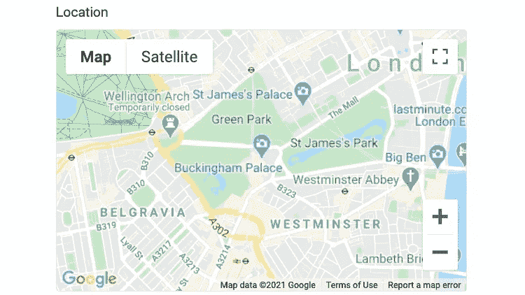
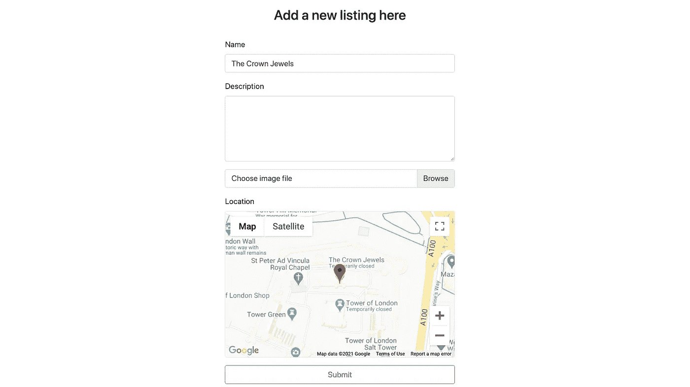

# 位置，位置，位置

> 原文：<https://levelup.gitconnected.com/location-location-location-bf4da727f9a5>

*将谷歌地图整合到带有地理定位功能的 React 表单中*


作为我上一篇关于实现[无限滚动](/just-keep-scrolling-scrolling-scrolling-47c3863fe653)的文章的后续，在这篇文章中，我将介绍如何将 Google Maps API 集成到 React 项目中，以及如何将它用作表单元素。

我在这个特性背后的动机是添加一个地图形式的响应位置字段，它将集中在用户的当前位置。

## 建立

首先，您需要在应用程序的根目录下运行以下命令来安装 Google Maps 节点:

```
npm i google-maps-react --s
```

安装好这个包之后，你需要访问[https://developers.google.com/maps/documentation/](https://developers.google.com/maps/documentation/)，注册并获得一个 API 令牌来使用。

Google 需要银行卡凭证来授予 API 令牌，但是在使用免费试用时不会产生任何费用。

## 成分

要设置第一个嵌入地图，必须从所选组件的包中导入地图组件。在我的情况下，这是上市形式。

```
import { Map, GoogleApiWrapper, Marker } from 'google-maps-react'
```

地图组件需要 google props，它由 GoogleApiWrapper 生成。此功能最好通过如下所示的导出语句来实现:

```
export default GoogleApiWrapper({ apiKey: process.env.REACT_APP_GOOGLE_MAP})(ListingForm)
```

这里的`process.env.REACT_APP_GOOGLE_MAP`代表 google 提供给我的 API 令牌。我已经利用 [dotenv](https://www.npmjs.com/package/dotenv) 节点来存储我的令牌，因为它是 ***不应该*** 推送到 GitHub 的东西。

`GoogleApiWrapper`现在已经提供了插入地图组件所需的道具。首先创建一个`div`元素来放置地图，并根据需要设置样式。

在其中放置地图组件，将属性`google`设置为包装器传递的`props.google`(在我的例子中，我使用了函数组件，但是使用类组件也可以获得相同的结果)。

```
<div className="map-container" >
    <Map
        google={props.google}
        zoom={14}
        initialCenter={{ lat: 51.501364, lng: -0.141890 }}
    ></Map>
</div>
```

有了如上配置的道具，你应该有一张以白金汉宫为中心的地图，如下所示:



## 用别针别住它

这看起来有点像平面——不太适合作为表单域。

要呈现一个将保留在地图中心的标记，该标记将代表要提交的位置，我们必须将以下内容添加到我们的地图组件中:

```
<div className="map-container" >
    <Map
        google={props.google}
        zoom={14}
        initialCenter={listing.latLng}
        ref={refMap}
        onBoundsChanged={
            useCallback(handleBoundsChanged,[handleBoundsChanged])
        }
    >
        <Marker
            position={listing.latLng}
        />
    </Map>
</div>
```

此处增加的内容有:

*   ref 用于表示地图，以便从中检索信息。
*   地图的中心现在由存储在 state 中的列表对象设置。

```
const [listing, setListing] = useState({
    latLng: { lat: 51.501364, lng: -0.141890 }
})
```

*   添加了一个`onBoundsChange`事件监听器，每当平移地图时都会调用该监听器。

`handleBoundsChanged`回调函数如下所示:

```
const handleBoundsChanged = () => {
    if (refMap.current) {
        const mapCenter = {
            lat: refMap.current.map.center.lat(),
            lng: refMap.current.map.center.lng()
        }
        setListing({...listing, latLng: mapCenter})
    }
};
```

现在，在渲染时，会有一个标记留在地图的中心。此外，在列表键下的状态中将存储坐标。这可以与任何其他属性相结合，这些属性可以是受控表单的一部分并提交到您的数据库。

## 地理定位

现在可能不是每个应用程序的用户都想从白金汉宫提交他们的列表。为了让他们找到自己的地址，他们将不得不缩小和平移，直到他们在地图上找到自己的位置。

这当然是除非他们启用共享位置。

如果他们这样做了，你将能够通过他们的地理位置获取他们的经度和纬度。

***NB*** *如果你正在使用谷歌 chrome 进行开发，并且你正在本地主机上访问你的网站，默认情况下，谷歌会将其视为不安全连接，并阻止发送你的地理位置信息。*

*要启用本地主机，您可以在地址栏中输入* `*chrome://flags/#allow-insecure-localhost*` *并启用不安全的本地主机。*

为了更好地利用地理定位，我建议将表单组件包装在一个父组件中，如果位置共享是活动的，父组件将负责将位置作为道具传递，如果不是活动的，则传递默认位置。

为此，您可以添加以下组件:

```
import { useEffect, useState } from "react"
import ListingForm from '../listings/ListingForm'const GeoLocator = props => { const [location, setLocation] = useState({ 
        lat: 51.501364, 
        lng: -0.141890 
    }) const success = position => {
        const coordinates = {
            lat: position.coords.latitude,
            lng: position.coords.longitude
        }
        setLocation(coordinates)
    } useEffect(()=>{
        if (navigator.geolocation) {
            navigator.permissions
            .query({ name: "geolocation" })
            .then(function (result) {
                if (result.state === "granted") {
                   navigator.geolocation.getCurrentPosition(success)
                }
            });
        }
    },[]) return (
        <div>
            <div className="container"  style={{maxWidth: "500px"}}>
                <ListingForm location={location} />
            </div>
        </div>
    )
}export default GeoLocator
```

然后在表单组件中，您可以定义`useState`来引用传递下来的属性。

为了避免当一个新位置作为道具被传递时的错误，我需要平移地图。我使用下面的函数来处理这个问题:

```
useEffect(()=>{ refMap.current.map.panTo(props.location)},[props.location])
```

再次利用地图的参考。



## 包裹

有了这些功能，您现在应该有一个以用户位置为中心的表单；中间有一个标记作为坐标的占位符，可以作为数据提交给表单。

现在要做的就是为你的后端编写必要的代码来处理坐标…

祝你在设置地图组件的过程中玩得开心，如果你在这个过程中遇到了任何巧妙的技巧，请与我分享。

这个项目的所有源代码都可以在这里[找到](https://github.com/Shilcof/osiris-frontend)如果你想克隆它并亲自看看应用程序的运行。