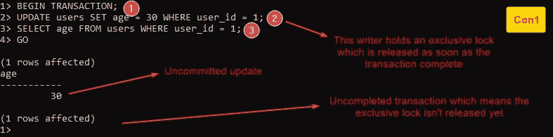

# SQL Server 上基于锁定的隔离

> 原文：<https://levelup.gitconnected.com/locking-based-isolation-at-sql-server-fdfafce9c8e8>


照片来自 [Freepik](https://www.freepik.com/free-vector/gradient-sql-illustration_22112357.htm)

# 介绍

在 SQL 世界中，事务是一个工作单元，它包括查询或修改数据库数据的单个或多个操作，将数据库从一种一致状态转换为另一种一致状态。

为了实现这种一致性并保证数据完整性，事务有四个属性，缩写为 **ACID** 。

# 酸性质一瞥

*   **原子性(A)** :要么事务中的所有操作都成功执行，要么都不执行。
*   **Consistency (C)** :事务通过控制隔离级别和遵守数据库中定义的完整性规则(如主键、外键和唯一约束)，将数据库从一种一致状态转换为另一种一致状态。
*   **隔离(I)** :并发事务只能访问一致的数据，换句话说，事务独立发生，没有干扰，这可以通过控制隔离级别来实现。
*   **持久性(D)** :一个成功的事务所做的修改必须存储在永久存储器上，这样即使系统发生故障，它们也能持久保存。

在本文中，我们将重点关注**隔离**属性，它是如何工作的，它的级别，以及每个级别的异常情况。

# 隔离模型(悲观与乐观并发控制)

正如我们提到的，数据库隔离使事务能够独立发生而不受干扰，所以这里的问题是，如何实现这一点？

SQL Server 有两种模型来实现事务之间的隔离:

*   **锁定(悲观)**:如果数据的当前状态不一致，读取器被阻塞(*必须等待*)，直到数据变得一致。
*   **行版本控制(乐观)**:如果数据的当前状态不一致，读取器会获得一致数据的旧版本，因此读取器不会被阻塞(*不能等待*)。

在本文中，我们将重点介绍基于锁定的*(悲观并发控制)*模型。

# 隔离锁定模式

要了解隔离机制在 SQL Server 中是如何工作的，您必须熟悉两种锁定模式:

*   **独占**:当一个事务修改*(更新、删除或插入)*数据时，它请求一个**独占锁**，如果被授予，这个锁将被持有直到事务完成(*整个事务*)。之所以称之为“排他锁”，是因为如果一个资源已经有了任何锁模式，就不能获得这个资源上的排他锁；如果一个资源已经有了独占模式，那么在这个资源上就不能获得其他的锁模式。
*   **共享**:当一个事务读取 *(select)* 数据时，请求一个**共享锁**，一旦 read 语句或整个事务完成*(基于隔离级别)*。之所以称之为“共享”是因为多个事务可以同时在一个资源上拥有共享锁。

为了更清楚起见，请看下表，假设两个事务在同一资源上请求不同的锁模式:


隔离锁定模式(作者提供照片)

# 隔离级别

隔离级别是并发事务处理同一资源时的数据一致性级别。隔离级别越高，锁越严格，等待时间越长，这意味着隔离级别越高，一致性越高，并发事务越少。

隔离级别的主要目标是控制以下影响:

*   读者是否请求锁，如果是，锁被持有多长时间。
*   如果一个事务修改了*(持有独占锁)*一个资源，另一个读取器想要读取同一个资源，这种情况下读取器的行为是什么:
    -读取未提交的数据。
    -读取最后提交的数据。
    -阻塞*(等待)*直到资源上的独占锁被释放。

事实上，每个数据库引擎都以不同的方式实现其隔离级别，但是 SQL Server 支持六个隔离级别，其中四个级别是基于锁定的*(未提交读、提交读、可重复读和可序列化)*，两个级别是基于行版本控制的*(快照和提交读快照)。*

> ***在潜入实际例子之前请记住这几点:***
> 
> -在较低隔离级别被阻止的任何异常不会在较高级别发生。
> -任何已经存在于较高层次的异常，肯定会存在于较低层次。
> -在所有隔离级别，任何写入者都必须请求一个独占锁来修改数据，一旦整个事务完成，该锁就会被释放。
> -对于单行，如果不显式启动事务，它会隐式启动并提交。
> -在较低隔离级别被阻止的任何异常不会在较高级别发生。

> ***要在您的 SQL Server 数据库上尝试这些示例，请遵循以下步骤:***
> 
> 1-创建自己的数据库(在我的例子中称为“isolation _ db”)
> 2-*创建“users”表并插入这个假行:*

> 3-打开到数据库 Con1 和 Con2 的两个连接。
> 4-遵循图片中显示的步骤。
> 5-完成以下任何示例后，提交任何正在运行的事务，然后运行以下语句进行清理:

事不宜迟，让我们从最低到最高进入基于锁定的隔离级别:

# 1-未提交的读取

## 它是如何工作的

这个级别是最低的隔离级别，在这个级别上，读取器不需要共享锁来读取数据。

## 它解决的异常

**-脏写**:如果一个事务更新了一个资源，而另一个事务在第一次完成之前更新了相同的资源，就会发生这种情况。

这个级别可以通过排他锁冲突来避免这种异常。换句话说，如果一个写线程持有一个独占锁，任何其他写线程都不能同时获得一个独占锁，必须等到另一个独占锁被释放。

让我们跳到一个实际的例子来阐明这个级别如何避免肮脏的书写:


连接 1(作者照片)


连线二(作者供图)

## 它的异常之处

**-脏读**:如果一个事务从另一个未提交的事务中读取更改，就会出现这种情况。

出现这种异常是因为这个级别不要求共享锁，所以与任何拥有独占锁的写入者没有冲突，这意味着读取者可以读取未提交的更改。

按照这个例子:



连接 1(作者照片)


连线二(作者供图)

# 2-已提交读取

## 它是如何工作的

在这一级别，读取者必须请求共享锁来读取数据，这意味着如果写入者持有独占锁，而读取者请求共享锁，则该请求将与独占锁冲突。一旦写入方提交事务，读取方就可以获得它的共享锁。此时，读者只读取已提交的更改。

您必须知道的另一个重要注意事项是，一旦读取器*(事务语句)*完成整个事务，共享锁就会被释放。

这个隔离级别是 SQL Server 的默认级别，您可以通过运行这个语句`DBCC useroptions;`来获得`isolation level`选项

## 它解决的异常

**-脏读**

按照这个例子:


连接 1(作者照片)


连线二(作者供图)

## 它的异常之处

**-不可重复读取:**当一个事务多次读取同一个资源，由于被另一个提交的事务改变而得到不同的结果时，就会出现这种情况。

因为此级别的共享锁在事务语句完成后立即被释放，而不是整个事务，所以如果我们有两个事务，第二个事务可以在同一资源的第一个事务的多个共享锁之间持有资源*(修改资源)*的独占锁。

让我们通过例子来澄清这种反常现象:


连接 1(作者照片)


连线二(作者供图)

**-更新丢失**:这种情况发生在两个事务读取一个值，将它们读取的内容存储在内存中，然后根据这个存储的值更新一个资源，这意味着第一个事务不知道第二个事务已经更改了资源值。

因为此级别的共享锁在事务语句完成后立即释放，而不是在整个事务中释放，所以读取器可以读取资源值，将其存储在内存中，另一个事务可以获得独占锁，并在第一个事务释放共享锁后立即更新资源。

如果这个解释不清楚，请按照这个例子:


连接 1(作者照片)


连线二(作者供图)

# 3-可重复读取

## 它是如何工作的

在这个级别，一个读取器必须请求一个共享锁来读取数据，并且这个读取器持有这个锁，直到整个事务结束*(不仅仅是像 read committed 这样的语句)*，这意味着如果一个读取器持有一个共享锁，则没有写入器可以获得一个独占锁来更新这个资源，直到通过完成事务来释放共享锁。

## 它解决的异常

**-不可重复读取**

按照这个例子:


连接 1(作者照片)


连线二(作者供图)

**-丢失更新**

按照这个例子:


连接 1(作者照片)


连线二(作者供图)

## 它的异常之处

**- Phantom Reads:** 一个事务只锁定它在特定过滤器下第一次查询时找到的行，而不锁定可能在这次查询后被另一个事务插入并满足该过滤器的行。换句话说，第一个事务中的第二个查询将返回新行，这些行称为虚行。

如果这个解释不够清楚，请参照这个例子:


连接 1(作者照片)


连线二(作者供图)

# 4-可序列化

## 它是如何工作的

在这个级别上，读取器必须请求一个共享锁来读取数据，并且这个读取器持有这个锁，直到整个事务结束，在此之上，读取器锁定符合查询的过滤器的任何行，这意味着读取器不仅锁定已经存在的行，而且锁定将来可能被另一个事务插入以满足查询的过滤器的任何行。

## 它解决的异常

**-幻象读取**

让我们通过示例了解该级别如何防止幻像行:


连接 1(作者照片)


连线二(作者供图)

查看此汇总表，了解隔离级别及其异常情况


隔离级别及其异常情况汇总(作者提供照片)

# 您应该使用哪种隔离级别？

不幸的是，没有放之四海而皆准的解决方案，正如我们所知，选择的隔离级别越高，性能越低，延迟越大，吞吐量越低。所以你不应该盲目地选择可串行化级别，因为完美通常是有代价的。

作为第一步，您应该知道您的应用的性质以及它将面临的异常情况，并据此决定选择哪种隔离级别。

# 结论

在本文中，我们了解了 SQL Server 如何控制事务之间的并发性，如何通过选择隔离级别来控制数据一致性级别，以及每个隔离级别的异常情况。

# 资源

*   T-SQL 基础知识第三版
*   [了解隔离级别](https://docs.microsoft.com/en-us/sql/connect/jdbc/understanding-isolation-levels)
*   [SQL 事务隔离实用指南](https://begriffs.com/posts/2017-08-01-practical-guide-sql-isolation.html)

```
*Originally published at* [*https://blog.mayallo.com*](https://blog.mayallo.com/locking-based-isolation-at-sql-server)*.*
```

感谢您成为我们社区的一员！在你离开之前:

*   👏为故事鼓掌，跟着作者走👉
*   📰查看更多内容请参见[升级编码刊物](https://levelup.gitconnected.com/?utm_source=pub&utm_medium=post)
*   🔔关注我们:[Twitter](https://twitter.com/gitconnected)|[LinkedIn](https://www.linkedin.com/company/gitconnected)|[时事通讯](https://newsletter.levelup.dev)

🚀👉 [**加入升级人才集体，找到一份神奇的工作**](https://jobs.levelup.dev/talent/welcome?referral=true)