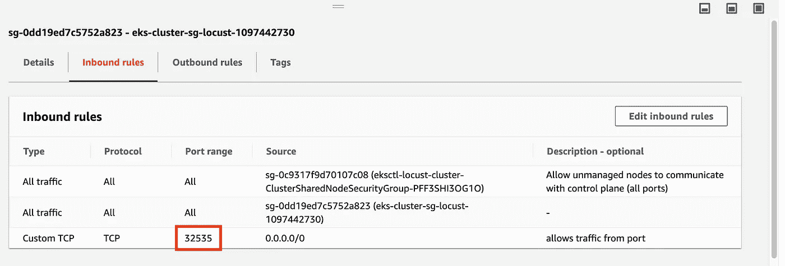

# Kubernetes 上的 Locust.io

> 原文：<https://levelup.gitconnected.com/locust-io-on-kubernetes-2ebf83fa9945>


詹姆斯·温斯科特在 [Unsplash](https://unsplash.com?utm_source=medium&utm_medium=referral) 上的照片

我曾经有一个包含 python 代码的存储库，这些代码基于 fabric 在 EC2 上运行 locust.io。它所做的是在 EC2 实例上安装 locust.io，然后将 locustfile.py 推送到该实例并运行它。问题是 EC2 可能很难使用，而且没有任何负载平衡和扩展。

因此，我四处看看，找到了一些 GitHub[库 T10，我可以在 Kubernetes 上使用 locust。问题是你必须使用他的图像，而且通常不是蝗虫的最新版本。因此，我决定推出我认为更加用户友好的 locust.io 版本，这是一个 Kubernetes 部署，它使用官方 docker 存储库中的最新图像，您可以在需要时轻松更改`locustfile.py`。](https://medium.com/locust-io-experiments/locust-io-experiments-running-in-kubernetes-95447571a550)

这是我创建的[存储库](https://github.com/mosesliao/kubernetes-locust),将用于部署目的。

# 集群部署

下面使用的所有源文件都存储在根目录中。让我们来设置集群。(我假设 kubernetes 已经启动并运行，并且`kubectl`能够连接到集群。)

```
$ git clone [git@github.com](mailto:git@github.com):mosesliao/kubernetes-locust.git
$ cd kubernetes-locust$ kubectl create -f nodeport.yaml -f scripts-cm.yaml -f master-deployment.yaml -f service.yaml -f slave-deployment.yaml
```

`kubectl`命令连接到我的 AWS EKS 集群并创建上面提到的组件。如果是第一次运行，可能需要一段时间才能完成(如果集群上没有 locust docker 映像，需要先下载)。

让我们仔细检查每一个组件

***nodeport . yml:***此文件创建服务，使外部端口连接到 EKS 集群

***scripts-cm . yml:***该文件创建了在 docker 实例上运行 locust.io 所需的`locustfile.py`。它将被装载为主节点和从节点的卷

***master-deployment . YAML:***该文件创建了 locust.io 的主节点

***slave-deployment . YAML:***该文件创建从节点并连接到主节点。不同的是`args`给出了。

***service . YAML:***该文件将所有节点捆绑在一起，确保它们通过正确的端口进行通信。

要了解 locust 节点是否正在运行，我们可以使用终端来检查 pod 是否已启动。

```
> kubectl get -w pods
NAME                             READY     STATUS    RESTARTS   AGE
locust-master-6dd5cc46d4-xrqt6   1/1     Running   0          26h
locust-worker-bc7464db8-bs857    1/1     Running   0          26h
locust-worker-bc7464db8-z84kp    1/1     Running   0          26h
```

从输出中我们可以获得主名称，也可以查看日志。`kubectl logs locust-master-6dd5cc46d4-xrqt6`应包括以下信息:

```
[2020-11-13 01:38:05,978] locust-master-6dd5cc46d4-xrqt6/INFO/locust.main: Starting web interface at http://:8089
[2020-11-13 01:38:05,989] locust-master-6dd5cc46d4-xrqt6/INFO/locust.main: Starting Locust 1.1
[2020-11-13 01:38:06,837] locust-master-6dd5cc46d4-xrqt6/INFO/locust.runners: Client 'locust-worker-bc7464db8-z84kp_324ebbc0df6f49c98c8198c8333195e1' reported as ready. Currently 1 clients ready to swarm.
[2020-11-13 01:38:07,220] locust-master-6dd5cc46d4-xrqt6/INFO/locust.runners: Client 'locust-worker-bc7464db8-bs857_03b4f012581b4af2be62cf9912f45538' reported as ready. Currently 2 clients ready to swarm.
```

我们可以看到主程序已经启动(第 1 行和第 2 行),工作程序“报告”准备好做一些工作。


# 从外部接近

如上所述，nodeport.yml 有助于创建外部 IP，因此您需要做的就是搜索 IP 和端口。

```
> kubectl get nodes -o wide |  awk {'print $1" " $2 " " $7'} | column -tNAME                                         STATUS  EXTERNAL-IP
ip-x-x-x-x.ap-southeast-1.compute.internal   Ready   x.x.x.x
ip-y-y-y-y.ap-southeast-1.compute.internal   Ready   y.y.y.y
```

您还需要知道节点端口服务运行在哪个端口上:

```
> kubectl get service/locust-serviceNAME             TYPE       CLUSTER-IP     EXTERNAL-IP   PORT(S)          AGE
locust-service   NodePort   10.100.3.131   <none>        8089:32535/TCP   26h
```

打开 AWS 控制台上的端口以允许外部访问



你应该可以通过`http://x.x.x.x:32535`或`[http://y.y.y.y:32535](http://y.y.y.y:32535)`访问 locust.io 网站

你可以使用我的库[https://github.com/mosesliao/kubernetes-locust](https://github.com/mosesliao/kubernetes-locust)来测试这个

*免责声明:我是在 AWS EKS 上做的。我不知道如果用在其他云 kubernetes 服务提供商是否会以同样的方式工作。如果可能的话请帮我测试一下*