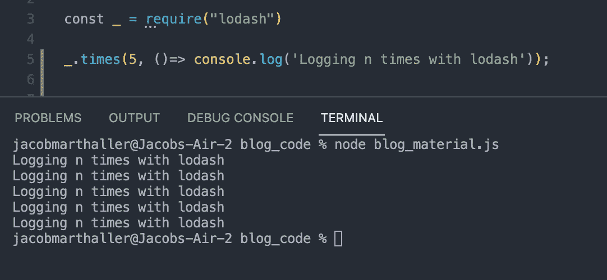
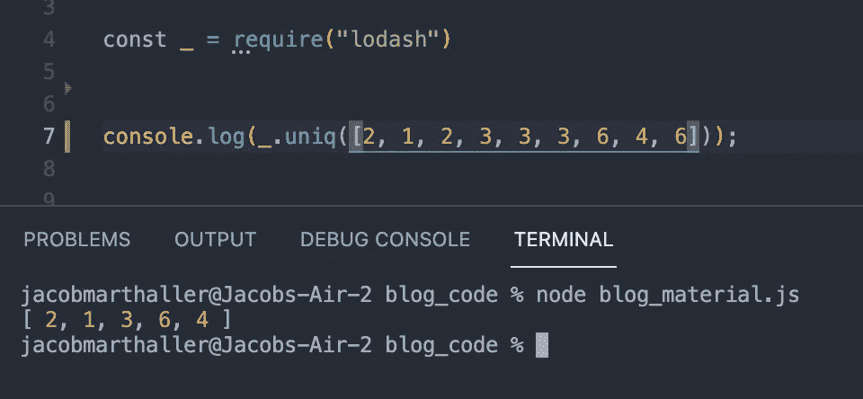

# Lodash:做 JavaScript 做不到的事情

> 原文：<https://levelup.gitconnected.com/lodash-do-what-javascript-cant-51ad6c859314>

几乎所有使用这种语言的人都知道，JavaScript 是一种非常强大的语言，被开发人员广泛使用。当它第一次出现在编程领域时，它改变了软件工程师的工作方式，并且是当今专业人士使用最广泛的语言。

JS 在专业开发人员中的排名

但是，尽管 JavaScript 功能强大(而且有趣)，但它只是一种语言，而且有一定的局限性。你不能指望它做所有的事情。来自其他语言的程序员可能会发现自己在想，“JavaScript 中没有`sleep()` 函数吗？我怎样才能让这个程序延迟一定的秒数？”

放松过度兴奋的开发者，我可以听到你尖叫“你可以使用`setTimeout()` 来实现一个 JS `sleep()`函数！！!"通过你的电脑。总而言之，JavaScript 的内置功能并没有涵盖程序员在过去几十年中提出的各种可能性。从许多方面来看，这是有道理的。你不会去餐馆指望你的服务员为你做饭，在晚上结束时洗碗，为明天的顾客点更多的食物。

幸运的是，JS 开发人员有了一个解决方案，可以链接那些不是现成的函数: [Lodash](https://lodash.com/) 。作为[下划线](http://underscorejs.org/)的超集，Lodash 是一个遵循[函数式编程范式](https://en.wikipedia.org/wiki/Functional_programming)的 JS 库，其中设计者强调函数是程序的基本构建块，而不是对象(感谢[这篇](https://www.reddit.com/r/compsci/comments/3mecup/eli5_what_is_functional_programming_and_how_is_it/) ELI5 Reddit 帖子提供了许多关于这个主题的精彩答案)。据该库的作者称，Lodash 通过消除处理数组、数字、对象和字符串的麻烦，使 JavaScript 变得更加简单

虽然 JS 是一种非常灵活的语言，允许您编写其他语言中可用的函数的复杂版本，但 Lodash 等库允许开发人员将几行代码封装成一行简单的代码，使您的语法更具可读性，因此也更容易理解。正如经典编程书籍 [*Clean Code*](https://www.amazon.com/Clean-Code-Handbook-Software-Craftsmanship/dp/0132350882) 告诉我们的那样，我们花在阅读代码和编写代码上的时间之比为 10:1(顺便说一句，如果你还没有阅读过 *Clean Code* ，你真的应该尽快开始。这让我成为了一名优秀得多的开发者。).因此，使我们的代码尽可能地可读是至关重要的，这正是 Lodash 真正派上用场的地方。Lodash 最初于 2012 年发布，一直在帮助 JavaScript 开发人员编写跨堆栈的更易维护的 JS。

Lodash 标志

正如大多数计算机编程的事情一样，例子有助于说明我在这里所说的内容。在这篇博客的剩余部分，我将向你展示我认为在你的程序中最有用的 Lodash 函数。要开始，运行`npm i lodash`并在程序中包含以下代码行:

你现在要和洛达什一起去比赛了！让我们看看一些最有用的功能是什么。

# _.倍

假设您想在控制台上记录一些东西`n`次。在 JavaScript 开发中，这是一个很常见的过程。开发人员这样做的一种常见方式是使用循环方法，如下所示:

虽然这很容易理解，但洛达什的`_.times`方法让这变得简单得多。例如:

用一行代码执行相同的操作！

正如你所看到的，我们已经大大简化了我们之前的代码，这在某些用例中可能对我们的团队更好。虽然在本博客的剩余部分，我将只给出一些其他 Lodash 函数的简要概述，但是互联网上的大量文档和代码示例应该会让您很好地了解如何实现大多数方法。

# _.头

假设你想从数组中取出第一项。这对于 Lodash 来说很简单:

# _.最后的

与`_.head`，`_.last`相反，它允许你从数组中取出最后一个元素:

# _.去抖

Js 开发人员通常希望延迟函数调用。幸运的是`_debounce`对此非常有用:

作为题外话，你可以在这里找到一篇讨论`_.debounce`和`_.throttle` [区别的有趣文章。](https://css-tricks.com/debouncing-throttling-explained-examples/)

# _.拉

虽然 JS 的内置`filter()`方法允许开发人员筛选数组中的值，但 Lodash 的`_.pull`更加灵活，允许您一次提取多个特定的值:

# _.变平

Ruby 程序员会很高兴在这里看到一个与`flatten`方法等价的 JS。Lodash 的`_.flatten`允许开发者展平一层深度的数组:

要递归展平数组，请尝试`_.flattenDeep`:

# _.省略

如果你想轻松过滤一个对象，`_.omit`方法感觉就像魔术一样:

# _.挑选

与`_.omit`相反，`_.pick`方法将“挑选”出键值对并返回对象。

# _.uniq

这是另一个来自 Ruby 的 JavaScript 开发新手的例子。像`uniq`方法一样，`_.uniq`将从数组中删除重复值:

# _.矮胖的人或物

对于将大型数组分割成更易于管理的部分非常有用。chunk 方法会将数组分割成指定数量的块:

如前所述，您可以使用现成的 JavaScript 编写许多 Lodash 函数。虽然任何称职的 JavaScript 开发人员都能够做到这一点，但是如果您试图从数组中取出一个随机元素，您是否愿意阅读以下内容:

还是这个？

虽然上面的方法非常简单，但是 JavaScript 编码人员知道嵌套回调和语言的其他日常功能会变得复杂，那么应该使用哪种代码呢？正如所有编程的事情一样，没有一个正确的答案。您编写的代码将适合当时的情况。应该注意的是，Lodash 是一个独立的库，你在程序中安装的库越多，你就越接近于把自己送进依赖地狱。此外，从长远来看，Lodash 函数的计算开销可能更大，因此记住简洁并不总是更好是很重要的。

然而，如果你像我一样，一旦你开始和 Lodash 一起工作，你会发现很难停下来。像`_.fill`、`_.isEqual`、`_.get`、`_.sortBy`、`_.union`、`_.random`、`_.remove`和`_.sample`等方法可以极大地简化你的代码，并且使用起来很有趣。它不仅能让你的代码更加整洁，还能帮助你的团队阅读你的代码，不管你是在操作数组、对象、字符串、数字还是其他任何数据类型。我鼓励您阅读 Lodash 的[文档](https://lodash.com/docs/4.17.15)，并立即开始使用它！

# 分级编码

感谢您成为我们社区的一员！[订阅我们的 YouTube 频道](https://www.youtube.com/channel/UC3v9kBR_ab4UHXXdknz8Fbg?sub_confirmation=1)或者加入 [**Skilled.dev 编码面试课程**](https://skilled.dev/) 。

 [## 编写面试问题+获得开发工作

### 掌握编码面试的过程

技术开发](https://skilled.dev)