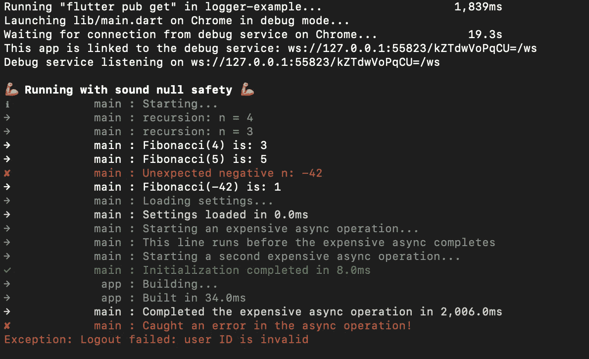

# 为您的 Flutter 应用程序提供高效的记录器

> 原文：<https://levelup.gitconnected.com/logger-706fb772cc47>



记录器输出示例。

在本文中，我将向您展示如何为您的 Flutter 应用程序设置一个简单而高效的记录器。

这里介绍的记录器具有以下特征:

*   根据您的需求和品味轻松定制；
*   可以选择同时登录到终端和开发工具，或者只登录到开发工具；
*   彩色终端输出；
*   记录器设置的最小代码；
*   大多数日志调用都在一行代码中；
*   充分利用代码自动完成功能，最大限度地减少所需的击键次数；
*   定时日志的集成选项；和
*   记录小部件构建的集成选项。

在接下来的部分中，我将展示一些如何使用记录器的例子。

# **模板工程**

为了运行本文中显示的示例，我使用 Flutter 的骨架模板创建了一个新项目。要实现它，您可以通过运行以下命令来创建一个新项目:

```
$ flutter create -t skeleton --project-name my_app_name app-name
```

> 其中,`my_app_name`是您的项目名称，而`app-name`是将在其中创建您的应用程序的文件夹的名称(如果不存在，将创建一个新文件夹)。

# 记录器设置

首先，如果你已经在使用 Dart 团队提供的[国际化(intl)](https://pub.dev/packages/intl) 包，就不需要导入任何第三方包。

如果您还没有使用 Dart 的 [intl](https://pub.dev/packages/intl) 包，您可以通过在项目目录中运行以下命令将它添加到您的项目中:

```
$ flutter pub add intl
```

这将自动把下面一行添加到您的项目的`pubspec.yaml`文件中，在 dependencies 部分下:

```
dependencies:
  (...)
  intl: ^0.17.0 # new line
```

# 新文件

在你的项目的`lib`目录下创建一个名为`logger.dart`的新文件，即`main.dart`文件所在的文件夹。

您可以直接从链接存储库中的[这个文件中复制文件内容，或者从本文的最后一节中复制。这个记录器被认为是容易理解的。](https://gitlab.com/rodweber/logger-example/-/blob/main/lib/logger.dart)

# 使用

要开始使用记录器，只需将这些行添加到您的`main.dart`文件中:

> 其中`my_app_name`是您的项目的名称，在模板项目部分中选择。

然后，仍然在您的`main.dart`文件中，您可以设置日志级别，如下所示:

日志记录选项如下，按重要性或严重性排序:

*   `logDebugFinest()`
*   `logDebugFiner()`
*   `logDebugFine()`
*   `logDebug()`
*   `logInfo()`
*   `logSuccess()`
*   `logWarning()`
*   `logError()`
*   `logFatal()`

此外，还有定时日志选项。这些将在下面显示。

对于任意代码块，您可以使用:

*   `logTimerStart()`
*   `logTimerStop()`

以应用程序初始化为例，您可以:

等待异步操作完成并记录花费时间的示例:

> `logTimerStop()`将花费的时间(以毫秒为单位)附加到日志消息的末尾。

一个调用昂贵的异步操作而不等待它完成的例子:

调用可能失败的昂贵异步操作的示例:

另一个定时日志选项是记录小部件的构建方法，方法是使用:

*   `logBuild()`

作为记录构建方法的一个例子，我们可以如下更新`lib/src/app.dart`文件:

你可以在[这个库](https://gitlab.com/rodweber/logger-example)中找到所有这些例子的实现。

包含所有示例的完整`main.dart`文件如下所示([也可以在这里看到](https://gitlab.com/rodweber/logger-example/-/blob/main/lib/main.dart)):

# 记录器

`lib/logger.dart`(此处[也可见](https://gitlab.com/rodweber/logger-example/-/blob/main/lib/logger.dart))的内容:

暂时就这样了。希望你能好好利用！