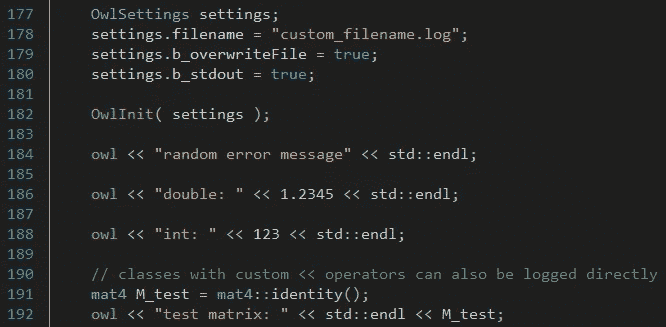
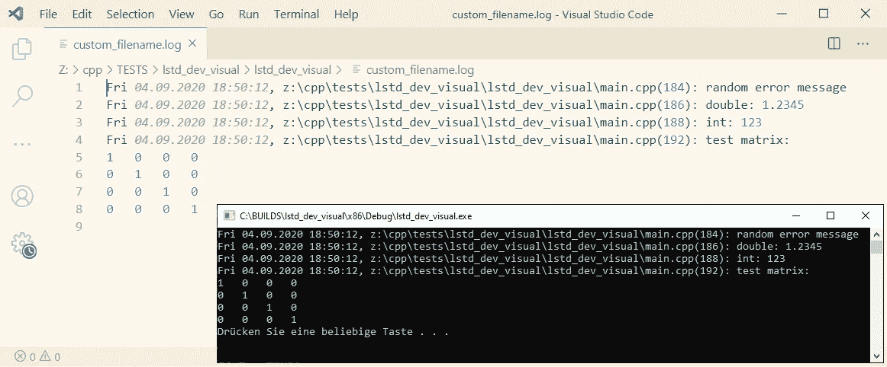

# 在 C++中登录

> 原文：<https://levelup.gitconnected.com/logging-in-c-60cd1571df15>

## 创建新的和改进的记录系统

任何程序最重要但经常被忽视的特性之一是日志记录。当程序在用户系统上运行并崩溃时，了解问题原因的唯一方法是通过日志文件。甚至在开发过程中，使用日志记录可以比使用调试器单步调试整个程序更快地发现一些问题。因此，您应该确保将良好的日志记录添加到您的应用程序中。

我最近为我的程序实现了一个新的日志系统。已经到了每个主要库都有自己的日志文件的地步，所以一个程序创建三个不同的日志文件并不罕见，这显然不是什么好事。我花了一些时间来设计新系统，使其尽可能易于使用，因此我更有可能在未来坚持使用它。

[法托斯 Bytyqi](https://unsplash.com/@fatosi?utm_source=medium&utm_medium=referral) 在 [Unsplash](https://unsplash.com?utm_source=medium&utm_medium=referral) 上的照片

# 目标

我的新日志系统有两个主要的设计目标。它必须易于使用，并且能够同时写入多个输出通道。易用性当然是最重要的方面。如果这个系统太复杂，我知道我以后不会用它了。我在`std::cout`之后模拟了新的日志记录系统，因为我真的很喜欢它的便利和用法，并且在开发期间，我总是打开一个控制台窗口来显示标准输出。不用查看日志文件，直接在标准输出中看到错误是很好的。

第二个设计目标是同时写入多个输出通道。在我的许多旧库中，每个错误检查都有两行，第一行是在控制台中显示错误，第二行是将错误写入日志文件。除了一些编译器定义之外，没有简单的方法来禁用任何一种输出方法，但是它们使用起来确实很麻烦，并且给代码增加了更多不必要的负担。因此，我希望新系统只需要一行代码，根据设置将错误写到正确的位置。

# 猫头鹰

最近，我养成了给项目取真名的习惯，而不仅仅是根据它们做了什么来命名。因此，我将我的新日志系统命名为 Owl，而不仅仅是日志记录器。它增加了一点额外的味道。猫头鹰被认为是非常明智、聪明和善于观察的鸟类，所以它是一个适合伐木系统的名字。

新日志系统的主要功能是重载的`<<`操作符。通过使用模板，所有标准数据类型和带有自定义`<<`操作符的所有类都可以被直接记录。这意味着 *Owl* 可以像`std::cout`一样使用，这使得它非常容易使用。与`std::cout`相似的另一个好处是，当我所要做的就是用`owl <<`替换`std::cout <<`时，很容易将旧的库和程序转换到新的系统。

Owl 日志系统可以完全像 std::cout，image by author 一样使用。

为了进一步方便使用，我为日志记录函数创建了一个自定义定义。使用日志记录系统所需要的是三个字母的编译器定义`owl`，而不是每次都使用日志记录类的实例并将前缀函数输入其中。C++编译器有两个非常有用的日志定义:`__FILE__`和`__LINE__`定义，它们包含文件名和它们所在的行，可以帮助您跟踪错误的位置。因为我使用了编译器 define，它们被自动插入到正确的位置。

当在程序开始时初始化日志系统时，init 函数采用一个设置结构。通过这些设置，Owl 的所有不同特性都可以打开和关闭。也许您不希望您的文件路径、文件名和代码行暴露在用户可以访问的日志文件中，或者您不需要程序的时间和日期。有一个地方可以控制这些选项，你不需要浏览整个程序，到处更改一堆代码，这使得它非常容易和方便使用。

我的新日志系统的输出在一个日志文件和标准输出中，图片由作者提供。

# 履行

这是我的新的 Owl 日志系统的完整实现。通过用模板重载`<<`操作符，所有的标准数据类型都可以被直接记录，这也适用于其他拥有重载`<<`操作符的类。结合`owl`编译器定义，这使得记录器非常容易和方便使用，这正是我想要的。

Owl 日志系统实现的头文件。

Owl 日志系统实现的源文件。

日志记录是每个应用程序的一个基本方面。虽然实现一个日志系统肯定不是最迷人的任务，但是从长远来看，花一些时间为它创建一个好的解决方案是有益的。我为我的 C++程序写了一个新的日志系统，我对结果非常满意。它和`std::cout`一样容易使用，但是仍然提供了很多灵活性和特性。您应该养成在代码中添加大量日志的习惯。这将有助于您将来在需要跟踪错误时节省大量时间。

# 资源

*   [Owl.hpp](https://gist.github.com/pingpoli/9caef815332f95e6f371ee67328a1faa)
*   [Owl.cpp](https://gist.github.com/pingpoli/27ccbfdb810bc94b20e78b1463379793)
*   [util.hpp](https://gist.github.com/pingpoli/160c57af2a64bdda047834ac6eddcfd6)
*   [timeutil.hpp](https://gist.github.com/pingpoli/6079472bd0105c39705ab49820a65ae1)