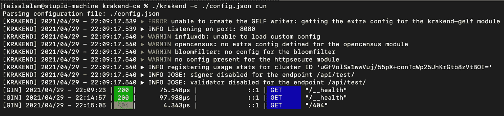
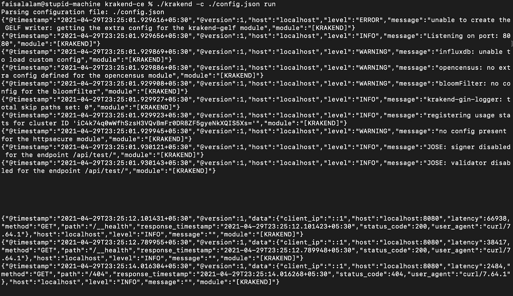

# 在 KrakenD API 网关中记录传入请求

> 原文：<https://levelup.gitconnected.com/logging-incoming-requests-in-krakend-api-gateway-341134b71e29>

许多日志文件的图像

如果你对探索克拉肯有兴趣，你可以在这里阅读[入门文档](https://www.krakend.io/docs/overview/introduction/)。您可能也有兴趣查看一下[基准测试结果](https://www.krakend.io/docs/benchmarks/api-gateway-benchmark/)，看看 KrakenD 与其他开源 API 网关如 [Kong](https://konghq.com/) 、 [Vulcand](https://vulcand.github.io/) 或 [Tyk](https://tyk.io/) 相比如何。本文是为那些已经在使用(以及那些计划或将要使用)KrakenD 作为其服务的 API 网关的读者准备的。本文不包括如何在生产中设置和使用 KrakenD。

## KrakenD 中的默认请求日志

默认情况下，KrakenD 中的请求日志中包含的信息在某些情况下可能不足以用于审计目的。如果您已经将 KrakenD 配置为使用 Logstash 格式来打印日志，那么请求日志仍然会使用默认格式，这需要开发人员仔细地为日志设置解析逻辑。KrakenD 依赖于 GIN 引擎中配置的默认日志记录器来打印请求日志，这也意味着如果您已经配置了 KrakenD Logger 来将日志写到 *Syslog* 中，那么请求日志就不会被发送到那里。

KrakenD 中的默认请求日志

## 为 GIN 设置自定义日志格式化程序

您可以很容易地修改 KrakenD-CE 代码，为 GIN 引擎添加一个定制的日志格式化程序中间件。我为 KrakenD 开发了一个模块，你可以很容易地在 KrakenD-CE 代码库中扩展它，在那里它初始化 GIN 引擎。你可以在我的 GitHub 账户找到模块[。](https://github.com/ifaisalalam/krakend-gin-logger)

你需要做的就是[克隆](https://github.com/git-guides/git-clone)KrakenD-CE[库并在`router_engine.go`文件中修改](https://github.com/devopsfaith/krakend-ce)[这个函数](https://github.com/devopsfaith/krakend-ce/blob/f77ed77b24c8dba6f45dfb8ff14fb21ee7348d9a/router_engine.go#L15)。这是您需要做的更改的快照。

您现在可以通过运行`make build`命令在您的机器上构建 KrakenD 二进制文件。这将在您的机器上克隆存储库的相同位置创建一个`krakend`二进制文件。

## **启用 GIN 日志格式化程序**

现在可以通过将以下内容添加到 KrakenD 的`configuration.json`文件中的服务`extra_config`来启用 GIN 日志格式化程序。

该模块使用与 KrakenD 内部使用的相同的[记录器模块来打印日志。因此，您为 logger 模块设置的配置选项也将应用于请求日志。](https://github.com/devopsfaith/krakend-gologging)

下面是一个使用 Logstash 和带有自定义选项的日志模块的示例`configuration.json`。

仅此而已！下面是上面的示例配置中日志的样子。

添加自定义日志格式化程序后的 KrakenD 请求日志

您还可以配置 GIN 日志格式化程序模块来忽略某些路径并且不记录它们。例如，您可能想要忽略`/__health`呼叫，并且不将它们包含在日志中。您可以通过在`skip_paths`选项中传递一个要忽略的路径列表来做到这一点。这里有一个如何实现这一点的示例配置。

在本例中，对路径`/__health`或`/api/ignore`的任何请求都不会被记录。

## GIN 日志格式化程序记录的字段

该模块记录传入请求的以下参数:

*   `method` : HTTP 请求方式
*   `host`
*   `path`
*   `status_code` : HTTP 响应状态码
*   `user_agent`:用户代理字符串
*   `client_ip`
*   `latency`
*   `response_timestamp`

如果您想在日志中添加更多的字段，可以随意地[派生](https://guides.github.com/activities/forking/)存储库，并在 KrakenD 中使用您自己版本的模块。这是 GitHub 项目的链接—[https://github.com/ifaisalalam/krakend-gin-logger](https://github.com/ifaisalalam/krakend-gin-logger)。

我希望这篇文章和这个项目对你有用。如果您有兴趣参与该项目，请随时打开[拉动式请求](https://docs.github.com/en/github/collaborating-with-issues-and-pull-requests/creating-a-pull-request)。

## 参照(References)

*   [https://github.com/ifaisalalam/krakend-gin-logger](https://github.com/ifaisalalam/krakend-gin-logger)
*   [https://github.com/devopsfaith/krakend-ce](https://github.com/devopsfaith/krakend-ce)