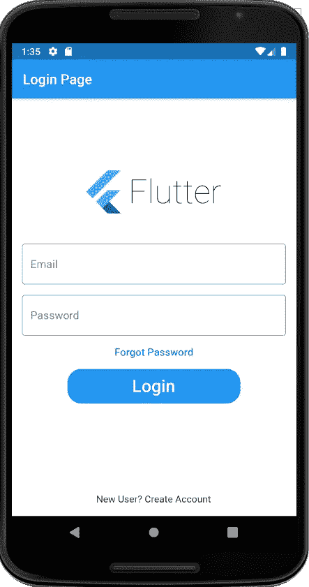

# Flutter 中的登录页面 UI

> 原文：<https://levelup.gitconnected.com/login-page-ui-in-flutter-65210e7a6c90>



登录页面

在允许用户访问网站、移动应用程序和计算机应用程序之前，对用户进行身份验证是一个很好的做法，以防止未经授权访问个人信息。

在这篇文章中，我将解释如何建立一个登录页面用户界面。我使用了 TextField 小部件，供用户输入用户名和密码。显示动作的 FlatButton 小部件。此外，我已经使用图像来设置登录页面的标志。

**第一步:main()函数**

```
import 'package:flutter/material.dart';void main() {
  runApp(MyApp());
}class MyApp extends StatelessWidget {
  @override
  Widget build(BuildContext context) {
    return MaterialApp(
      debugShowCheckedModeBanner: false,
      home: LoginDemo(),
    );
  }
}
```

这是 main()函数，我的程序执行的入口点，以及 MyApp 类，它将 LoginDemo 类的一个对象作为 home 属性的参数。

**第二步:类登录**

1.  如下设置 Scaffold 的 appBar 属性，为我们的应用程序创建标题。

```
appBar: AppBar(
  title: Text('Login Page'),
),
```

2.对于这个 UI，所有小部件都放在列小部件中，放在支架主体中。Column 的第一个孩子是容器小部件，它将 Image 小部件作为它的孩子

```
Container(
  height: 150.0,
  width: 190.0,
  padding: EdgeInsets.only(top: 40),
  decoration: BoxDecoration(
    borderRadius: BorderRadius.circular(200),
  ),
  child: Center(
    child: Image.asset('asset/images/flutter-logo.png'),
  ),
),
```

这里，flutter-logo.png 文件被复制到这个 flutter 应用程序的 asset/images 文件夹中，并写入 pubspec.yaml 文件，以便在我们的代码中得到它。

```
*# To add assets to your application, add an assets section, like this:* assets:
  - asset/images/
```

添加资产后运行包获取命令以获得结果

进程结束，退出代码为 0

3.然后，对于用户名和密码，使用 TextField 小部件。TextField 小部件是一个输入小部件，帮助您从用户那里获取输入。

```
Padding(
   padding: EdgeInsets.all(10),
   child: TextField(
       decoration: InputDecoration(
       border: OutlineInputBorder(),
       labelText: 'User Name',
       hintText: 'Enter valid mail id as abc@gmail.com'
     ),
   ),
 ),
 Padding(
   padding: EdgeInsets.all(10),
   child: TextField(
       obscureText: true,
       decoration: InputDecoration(
       border: OutlineInputBorder(),
       labelText: 'Password',
       hintText: 'Enter your secure password'
     ),
   ),
 ),
```

在这里，**填充**部件帮助你在你的文本域部件周围留出一些空间。

**obscureText** : *true* 属性帮助您在 textfield 中显示特殊字符，而不是实际的字母。

textfield 小部件具有**装饰**属性，该属性采用**输入装饰**小部件来设计 TextField。

**border** 属性指定 **OutlineInputBorder** 小部件为 textfield 提供轮廓。

属性有助于为 textfield 编写标签，以便用户能够理解他需要在那个特定的 textfield 中输入什么。

属性帮助编写关于用户输入的具体提示。

4.对于“忘记密码”,使用一个简单的平面按钮部件

```
FlatButton(
  onPressed: (){
    //*TODO FORGOT PASSWORD SCREEN GOES HERE* },
  child: Text(
    'Forgot Password',
    style: TextStyle(color: Colors.blue, fontSize: 15),
  ),
),
```

为此，使用 **Text** widget 作为“忘记密码”子控件，并使用此按钮的 **onPressed()** 我们可以编写代码来控制导航到另一个屏幕，并在那里编写代码来对忘记密码采取行动。

5.对于登录按钮，使用 FlatButton 小部件，但是如果它需要一些装饰，将 FlatButton 包裹在**容器**小部件中。

```
Container(
  height: 50,
  width: 250,
  decoration: BoxDecoration(
      color: Colors.*blue*, borderRadius: BorderRadius.circular(20)),
  child: FlatButton(
    onPressed: () {
      Navigator.*push*(
          context, MaterialPageRoute(builder: (_) => HomePage()));
    },
    child: Text(
      'Login',
      style: TextStyle(color: Colors.*white*, fontSize: 25),
    ),
  ),
),
```

为容器引用**高度**和**宽度**属性，使 flatbutton 获得与容器相同的高度和宽度。

容器的装饰属性允许设计按钮，在装饰中提及**颜色** ( *颜色.蓝色*)和**边框** ( *边框.圆形(20)* )属性。

将 **Text** widget 作为 FlatButton 的子控件设置为“登录”，并将此导航屏幕的 **onPressed()** 设置为我们应用程序的下一个主页。

6.最后，指定为新用户创建帐户的文本小部件。

在这里，我们可以通过 **GestureDetector** 小部件来包装文本小部件，这为我们提供了 **onTap()** 导航。或者创建与忘记密码按钮相同的按钮来获得 **onPressed()** 事件。

以下是可供参考的完整代码:

```
import 'package:flutter/material.dart';
import 'HomePage.dart';

void main() {
  runApp(MyApp());
}

class MyApp extends StatelessWidget {
  @override
  Widget build(BuildContext context) {
    return MaterialApp(
      debugShowCheckedModeBanner: false,
      home: LoginDemo(),
    );
  }
}

class LoginDemo extends StatefulWidget {
  @override
  _LoginDemoState createState() => _LoginDemoState();
}

class _LoginDemoState extends State<LoginDemo> {
  @override
  Widget build(BuildContext context) {
    return Scaffold(
      backgroundColor: Colors.*white*,
      appBar: AppBar(
        title: Text("Login Page"),
      ),
      body: SingleChildScrollView(
        child: Column(
          children: <Widget>[
            Padding(
              padding: const EdgeInsets.only(top: 60.0),
              child: Center(
                child: Container(
                    width: 200,
                    height: 150,
                    /*decoration: BoxDecoration(
                        color: Colors.red,
                        borderRadius: BorderRadius.circular(50.0)),*/
                    child: Image.asset('asset/images/flutter-logo.png')),
              ),
            ),
            Padding(
              //padding: const EdgeInsets.only(left:15.0,right: 15.0,top:0,bottom: 0),
              padding: EdgeInsets.symmetric(horizontal: 15),
              child: TextField(
                decoration: InputDecoration(
                    border: OutlineInputBorder(),
                    labelText: 'Email',
                    hintText: 'Enter valid email id as abc@gmail.com'),
              ),
            ),
            Padding(
              padding: const EdgeInsets.only(
                  left: 15.0, right: 15.0, top: 15, bottom: 0),
              //padding: EdgeInsets.symmetric(horizontal: 15),
              child: TextField(

                obscureText: true,
                decoration: InputDecoration(
                    border: OutlineInputBorder(),
                    labelText: 'Password',
                    hintText: 'Enter secure password'),
              ),
            ),
            FlatButton(
              onPressed: (){
                //*TODO FORGOT PASSWORD SCREEN GOES HERE* },
              child: Text(
                'Forgot Password',
                style: TextStyle(color: Colors.*blue*, fontSize: 15),
              ),
            ),
            Container(
              height: 50,
              width: 250,
              decoration: BoxDecoration(
                  color: Colors.*blue*, borderRadius: BorderRadius.circular(20)),
              child: FlatButton(
                onPressed: () {
                  Navigator.*push*(
                      context, MaterialPageRoute(builder: (_) => HomePage()));
                },
                child: Text(
                  'Login',
                  style: TextStyle(color: Colors.*white*, fontSize: 25),
                ),
              ),
            ),
            SizedBox(
              height: 130,
            ),
            Text('New User? Create Account')
          ],
        ),
      ),
    );
  }
}
```


登录页面

以下是 Github 链接供参考:

[https://github.com/yogitakumar/logindemo](https://github.com/yogitakumar/logindemo)

如何在平面按钮上导航，请参考:

[](https://medium.com/faun/flutter-navigation-using-push-pop-and-routes-d49988098efe) [## 颤振-使用 push()、pop()和 routes 导航

### 朋友你好，在开发任何移动应用的同时，导航是非常重要的。没有导航，你不能去…

medium.com](https://medium.com/faun/flutter-navigation-using-push-pop-and-routes-d49988098efe) 

谢谢大家！

# 分级编码

感谢您成为我们社区的一员！升级正在改变技术招聘。 [**在最好的公司找到你的完美工作**](https://jobs.levelup.dev/talent)**。**

**[](https://jobs.levelup.dev/talent) [## 提升——改变招聘流程

### 🔥让软件工程师找到他们热爱的完美角色🧠寻找人才是最痛苦的部分…

作业. levelup.dev](https://jobs.levelup.dev/talent)**