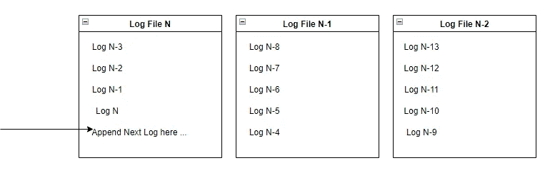
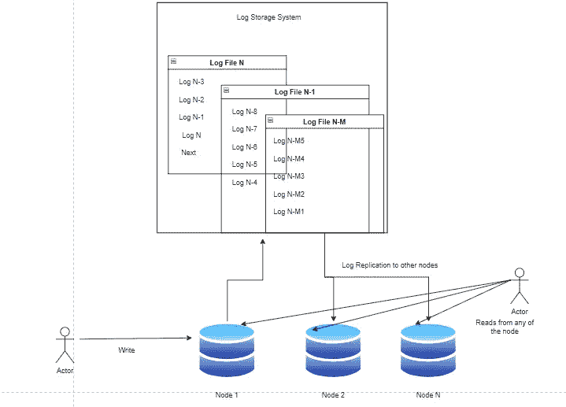

# 日志和分布式系统

> 原文：<https://levelup.gitconnected.com/logs-and-distributed-systems-ebd3902732bd>

## 为什么日志如此重要

日志对于软件工程界来说并不陌生。这可能是我们许多人最先听到和学到的事情之一。然而，这并不是日志的全部。它是一种有效的数据结构，能够在分布式系统中实现更快的数据写入和高效的复制。

让我们深入浅出地理解它。

# 什么是日志

将任何事件(或其元数据)按顺序写入简单存储称为日志记录。写入的每个条目都是日志。

这是最简单的存储形式，因为实现时不需要任何复杂的数据库检查和约束。几个亮点:

*   日志可以写在简单的普通文件中。
*   新信息将不断追加到文件的末尾。
*   日志只是附加的，并不意味着更新或删除。
*   任何更新或删除事件都将作为新条目记录在日志中。
*   日志总是按事件发生的时间排序。
*   如果文件太大，系统可以通过创建新文件来优化它。
*   前一个文件将按顺序存储，因此日志序列保持不变。

# 应用程序开发日志

在最简单的形式中，大多数开发人员首先了解到，日志在软件开发中大量用于记录系统信息，以用于调试和提供信息。

无论什么信息是重要的，它都是以仅附加的方式写入文件的。

这对于以后调试系统中的任何问题都有很大的帮助，也有助于通过分析记录的信息提取有用的系统信息。

***在这里阅读更多关于登录对软件开发的重要性***

*然而，在更多的地方，基于日志的存储扮演着非常重要的角色。让我们讨论一下这个问题。*

# *数据库系统中的日志*

*日志在许多数据库系统的实现中非常有用。*

*这些系统将变更指令存储在日志中，然后对核心数据结构进行变更。*

*原因是在日志中存储变更指令更简单、更快。它只需要按顺序在日志文件中添加指令。不需要其他处理、检查、约束等。*

*一旦变更指令被存储在日志中，数据库系统就将这些指令按顺序应用到实际的数据库存储数据结构中。该过程将处理所有酸等属性。*

*如果这些操作出现任何问题，数据库系统总是可以参考这些日志进行必要的更正。日志是代表“变更意图”的原始数据。*

*这些日志在数据库系统的多个节点之间的数据复制中扮演着重要的角色。*

*可以通过跨数据节点从一个表到另一个表复制数据来完成数据复制，这可能是一个繁重的过程，因为数据是以规范化的形式存在的，或者可能存储在多种结构、索引等等中。*

*另一个更简单的解决方案是复制事件日志(变更指令)。一旦日志在其他数据库节点上，就可以按顺序(重新)播放指令来创建系统的相同状态。*

> *它就像一个状态机，如果事件以相同的顺序触发，它将总是把系统带到相同的状态。*

*这比复制复杂得多的数据结构要简单和优化得多。*

*许多产品都基于这种方法来实现跨数据库节点的复制。“金门”就是一个例子。*

*引用数据库系统的这个用例，很明显日志是跨节点数据复制的重要工具。*

*让我们理解这在分布式系统中是如何有用的。*

# *分布式系统中的日志*

*从前面的用例来看，很明显日志在数据复制中扮演着重要的角色。因此，它通过支持多个节点更新数据，有助于确保更好的系统正常运行时间。*

*这是分布式系统的一个非常重要(关键)的方面。在分布式系统中，多个节点协同工作以提供服务，确保高可用性和高吞吐量，同时确保系统状态一致(即使最终一致)，并且数据不会长时间丢失或过时。*

*为了实现这一点，系统状态/数据必须跨节点高效复制。日志和日志复制有助于实现这一点。*

> *最基本的是在事件发生时记录主节点中的事件。*

*事件可以以任何格式记录，这可能特定于每个系统。*

*   *它可以是系统从客户端接收的简单指令。*
*   *它可以是由客户端调用的服务和操作名称。*
*   *一旦系统执行了变更请求，它可能是系统中的结果变更。*

*每个系统可以有不同的设计。但最终，事件将被记录。记录后，这些将被复制到其他节点，然后在其他节点上重放，以在系统中重新创建相同的状态。*

**

> *只要事件以相同的顺序进行，系统就会产生相同的状态。*

*这就是日志如何在支持分布式系统中发挥重要作用，并充当整个生态系统的基本构件。*

**这让我想起 Martin Fowler 在 LMAX 上的一篇很有意思的文章，是基于事件处理的。这里参考一下***。***

# **但是为什么是“日志”**

**理解的重要问题是，为什么我们应该使用日志来存储数据，而不是任何其他数据结构，如地图、树等？**

**原因是**

*   **仅附加日志是非常简单但功能强大的数据结构，用于在事件发生时捕获事件。**
*   **向这些数据结构写入比任何其他数据结构都要快得多。**
*   **这些日志是不可变的，即数据可以附加到日志中，但不能更改。**
*   **不变性和顺序写入使得日志非常快，而不需要在数据存储中找到正确的更改位置。**
*   **速度更快的另一个原因是，日志记录不需要应用各种检查和优化，而数据库系统通常需要在写入数据之前应用这些检查和优化，以确保 ACID(以及更多)类型的属性。**

**因此，日志写起来非常快。优化“写入”是数据密集型应用程序中最大的任务之一。**

**读取性能同样重要，但是，系统有更多的机会通过引入**

*   **多级缓存**
*   **布隆过滤器一种数据结构，用于检查数据出现在特定文件中的可能性**
*   **通过将文件与最新更新和压缩技术相结合来优化存储。**

**然而，写入总是一个瓶颈，因为它必须是实时的(接近实时的),同时确保数据的持久性。**

**简单有效的数据结构，比如普通的只附加日志，在这方面很有帮助。**

# **不写入磁盘仍然会使速度变慢**

**尽管基于日志的数据结构的简单性有助于更快的写入。然而，写入磁盘总是成本高昂，因此速度较慢。**

**正在通过使用缓存进行改进。一堆“写”语句可以先收集在缓存中，稍后再刷新到磁盘。但是，如果系统崩溃，它会带来丢失缓存中数据的风险。**

**然而，缓存存在于每一层。甚至操作系统和驱动程序也会在将写入内容刷新到磁盘之前对其进行缓存。因此，即使我们执行语句将数据写入持久存储，数据仍然可以在这些缓存之一中。**

**数据存储系统通常通过将操作系统(和驱动程序等)的刷新频率调整到最佳值来优化这一点。因此，为缓存刷新设置最佳频率是实现性能和耐用性平衡的解决方案之一。**

**硬件方面也有了更多的创新，使得书写速度更快。基于闪存的固态硬盘就是其中之一。它具有非常高的性能，即使系统停机也不会丢失数据。我希望还会有更多。**

**这就是为什么通过保持数据结构更简单，通过使用更好的缓存和硬件设计，写入变得越来越快。**

# **日志的更多好处**

*   **日志就像系统中发生的所有事情的原始数据。这些原始数据可用于重建任何时间点的任何状态。就像是重演了系统的整个生命事件。参考参考文献部分的 LMAX 架构，获得有趣的图解。**
*   **原始数据还可用于生成不同的报告，并支持整个分析生态系统。**

# **总结**

**日志是简单的，但是非常强大和有效的数据结构来写数据。由于其简单性和高效性，它成为分布式系统设计中支持数据复制的有效解决方案。**

**数据复制是分布式系统的核心需求。这里有一个高效的数据结构提高了整个生态系统的效率。**

**这就是日志在分布式系统设计中扮演重要角色的原因。**

**在未来的博客中，我们将讨论分布式系统如何高效地存储如此庞大的数据，以及良好的日志设计如何在其中发挥重要作用。我们将进行一次深潜。**

## **参考**

**[维基仅附加日志](https://en.wikipedia.org/wiki/Append-only)**

**[LSM 树](https://en.wikipedia.org/wiki/Log-structured_merge-tree)**

**[硬盘与固态硬盘](https://www.ibm.com/cloud/blog/hard-disk-drive-vs-solid-state-drive)**

**LMAX —基于事件驱动架构的交易平台**

**更多系统设计文章请参考[此处](https://medium.com/@matrixexplorer)**

**如果你喜欢读这篇文章，请分享，鼓掌，并关注更多的故事！**

***如有任何建议，欢迎通过****Linkedin****:*[*Mohit Gupta*](https://www.linkedin.com/in/mohitkgupta/)联系我**