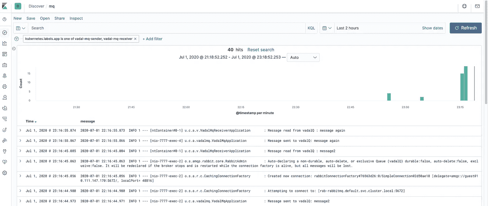

# 来自 K8s 的带有 Kibana、Elasticsearch 和 Fluentd 的日志

> 原文：<https://levelup.gitconnected.com/logs-from-k8s-with-kibana-elasticsearch-and-fluentd-337224e46397>


我们用 docker 在 K8s 集群外运行 Kibana 和 Elastisearch。我们安装 Fluentd 作为一个 deamonset 来捕获来自所有 pod 的日志，并将其推送到 Elasticsearch，Kibana 提供日志记录仪表板。

# Kibana 和弹性搜索

使用这个 docker-compose，yml 文件(摘自克里斯库尼的文章，见下文)。

```
version: '3'

services:
  elasticsearch:
    image: docker.elastic.co/elasticsearch/elasticsearch:7.6.2
    environment:
      - cluster.name=docker-cluster
      - discovery.type=single-node
      - bootstrap.memory_lock=true
      - "ES_JAVA_OPTS=-Xms512m -Xmx512m"
    ulimits:
      memlock:
        soft: -1
        hard: -1
    ports:
      - "9200:9200"
  kibana:
    image: docker.elastic.co/kibana/kibana:7.6.2
    ports:
      - "5601:5601"
```

> *docker-compose-f docker-compose . yml start*

Kibana 将在 [http://0:5601](http://0.0.0.0:5601/) 上启动并运行

若要稍后停止这些服务

> *docker-compose-f docker-compose . yml stop*

# 流体阻尼

创建 fluentd-values.yml

```
elasticsearch:
  hosts: ["192.168.0.129:9200"]
```

192.168.0.129 是我机器上运行 elasticsearch 的主机的 IP 地址。

添加流动性回购

> *掌舵回购添加 kiwi grid*[*https://kiwi grid . github . io*](https://kiwigrid.github.io)

安装它(helm v2.15.2):

> *helm install-name fluent d-logging kiwi grid/fluent d-elastic search-f fluent d-values . yml*

检查它是否启动了

> *ku bectl get pods | grep fluent
> fluentd-logging-fluentd-elastic search-wnm4q*

# 基巴纳原木

浏览到 [http://0:5601](http://0.0.0.0:5601/)

导航到管理(齿轮)-> Kibana ->索引模式->创建索引模式。对于索引模式，输入`logstash-*`，然后选择@timestamp 作为时间过滤器并创建索引。

然后点击 discover (compass)，我们将查看我们的 vadal-mq 服务的日志(参见 SpringBoot AMQP 博客)。搜索 kubernetes.labels.app，选择 vadal-mq-receiver。展开日志条目，在 JSON 选项卡上，选择消息(切换列)。如果选择变灰，请转到管理->索引模式，刷新索引并重试。



# 结论

我们增加了从 k8s 集群中收集日志的功能，这些日志由 fluentd 注入到 elasticsearch 中，并由 kibana 查看。围绕数据屏蔽、ML、指标和安全性，还有许多其他强大的功能可以通过这种设置实现。

# 进一步的细节

关于架构、实现选项和安全性的更多细节可以在克里斯·库尼的这篇文章中找到:

[https://coral ogix . com/log-analytics-blog/kubernetes-logging-with-elastic search-fluentd-and-ki Bana/](https://coralogix.com/log-analytics-blog/kubernetes-logging-with-elasticsearch-fluentd-and-kibana/)

*原载于 2020 年 7 月 1 日*[*https://blog . ram JEE . uk*](https://blog.ramjee.uk/logs-from-k8s-with-kibana-elastic-search-and-fluent/)*。*