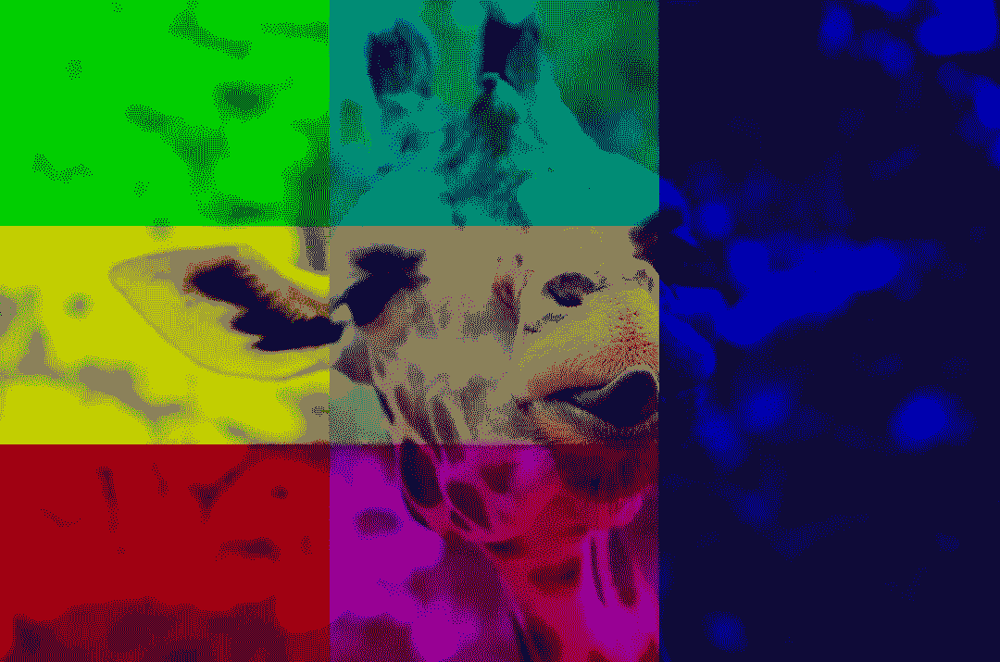

# 看这张照片

> 原文：<https://levelup.gitconnected.com/look-at-this-photograph-9713d43f79ac>

## Javascript 图像处理入门

在本教程中，我将介绍在浏览器中显示图像。很简单，只需使用一个图像标签。

``

教程结束…

但是等等。我们对这幅图像无能为力。我们不能应用自定义滤镜让 Instagram 嫉妒。我们也不能为了在照片上画假胡子而检测人脸。为了做到这些，我们需要访问组成图像的所有位和字节。我们将使用 HTML 画布和一个名为 GPU.js 的库在计算机的图形处理单元(通常称为 GPU)上运行我们的算法。

# 为什么选择 GPU？

图像是由像素组成的，而且通常是很多像素。许多图像处理算法将在每个像素上运行一些过程，以产生该像素的新值。我们当然可以一个接一个地在每个像素上运行这个过程，这对于小图像来说可以很好地工作，但是随着图像大小的增长，处理时间也会增长。如果我们需要实时处理，比如在视频流上，这可能会特别糟糕。

不是一次在一个像素上运行一个过程，而是在许多像素上同时运行该过程，也称为并行*。这就是构建 GPU 的目的。然而，Javascript 并不是这样设计的。它一次只能做一件事。需要用另一种语言 [GLSL](https://en.wikipedia.org/wiki/OpenGL_Shading_Language) 告诉 GPU 做什么。*

*这就是 GPU.js 的用武之地。它允许我们编写常规的(几乎)javascript 函数，并将它们编译成 GLSL，而不是学习另一种编程语言。让我们看一个简单的例子。*

*我们从导入和实例化 GPU.js 库开始。*

*`createKernel`方法采用一个将被编译以在 GPU 上运行的函数和一个选项对象。`output`选项决定了将运行多少个并行*线程*以及返回数组的大小。在这种情况下，我们有一个二维的 5x4 内核。`this.thread`属性用于确定函数在哪个线程上执行。我们稍后将使用它来访问图像的像素。这个内核的输出如下所示…*

```
*[[[0, 0], [0, 1], [0, 2], [0, 3], [0, 4]],
 [[1, 0], [1, 1], [1, 2], [1, 3], [1, 4]],
 [[2, 0], [2, 1], [2, 2], [2, 3], [2, 4]],
 [[3, 0], [3, 1], [3, 2], [3, 3], [3, 4]]]*
```

*注意:使用`function() {}`语法而不是箭头语法很重要，因为我们需要访问内核的`this`上下文。*

# *显示图像*

*现在，随着对如何在 GPU 上运行函数的理解，我们可以开始使用它来处理图像。GPU.js 让这变得简单。HTMLImageElement 的实例可以直接传递给内核，GPU.js 将知道如何处理它，将其转换为二维像素数组。一个像素包含四个*通道*数据——红色、绿色、蓝色和 alpha——每个通道用 0 到 1 之间的数字表示。值为 0 表示通道中没有任何颜色，值为 1 表示最大颜色量。alpha 通道表示像素的透明度。使用 x 和 y 坐标，我们可以访问图像的像素。让我们加载一个图像并进行测试。*

```
*const image = await loadImage('https://source.unsplash.com/random')*
```

*我们还想创建一个画布来显示图像。*

```
*const canvas = document.createElement('canvas')
canvas.width = image.width;
canvas.height = image.height;
canvas.style = 'max-width: 66vw; max-height: 66vh;'
document.body.appendChild(canvas)*
```

*现在创建一个新的 GPU 实例。我们将把刚刚创建的画布给它，这样它就知道在哪里渲染了。*

*GPU 需要知道它将绘制到画布上，而不仅仅是进行数值计算，所以我们将`graphical`选项设置为`true`。我们用内核的 x 和 y 坐标得到像素值。请注意，图像的第一个坐标是 y 轴，第二个是 x 轴。坐标`y=0, x=0`也在图像的左下方，而`y=height-1, x=width-1`在图像的右上方。根据您可能熟悉的其他绘图 API，这可能看起来有些倒退。内核的`color`方法获取 0 到 1 范围内的红色、绿色、蓝色和可选的 alpha 通道，并将该像素设置在`this.thread.x, this.thread.y`位置。在这个内核中没有对像素数据进行任何更改——它们只是从图像中取出并绘制到画布上。*

*现在运行内核，画布中应该有一个图像。*

```
*kernel(image)*
```

**

*照片由 [Aidas Ciziunas](https://unsplash.com/@cizikas?utm_source=medium&utm_medium=referral) 在 [Unsplash](https://unsplash.com?utm_source=medium&utm_medium=referral) 上拍摄*

*我们的 GPU 出了一只长颈鹿。*

## *一个更有趣的例子*

*当然，我们不会为了显示图像而在 GPU 上处理图像。这里是另一个例子，旨在显示通道如何组合产生原始颜色。下图有七个部分。左下角仅显示红色通道，左上角仅显示绿色通道，右栏仅显示蓝色通道。其他部分显示了相邻部分的重叠。举个例子，左中显示的是红色和绿色通道的组合。在中间，我们有所有三个通道，它们结合起来给我们图像的原始颜色。*

**

*这是生成上面图像的内核。*

*现在去实验一下，看看你能做出什么有趣的内核。*

## *更多关于 Javascript 中图像处理的文章*

*[臭名昭著的 RGB——Javascript 中的颜色模型](https://medium.com/@srmullen13/notorious-rgb-756f19f3e462)*