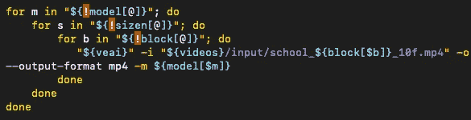

# 在 bash 中遍历数组，对每一部分都有完整的语法解释

> 原文：<https://levelup.gitconnected.com/looping-through-arrays-in-bash-with-a-thorough-syntax-explanation-of-each-part-374054501b67>



kewl colors 的一些彩虹狂欢

for 循环是一个相对简单的概念，但我想在这里分解语法，因为在幕后，bash 是非常重要的，我不能充分强调这一点，而不是 c。我确实试图了解幕后发生了什么，以便当我从 StackOverflow 复制 paste 时，它不起作用，我可以实际解决问题。

您可以像这样在 bash 中循环遍历数组

```
array=(thing1 thing2)for i in "${!array[@]}"; do
     echo ${array[$i]}done
```

如果您想遍历对，一个简单的方法是这样的:

```
xvalues=(x1, x2, x3)yvalues=(y1, y2, y3)for i in "${!xvalues[@]}"; do
     echo ${xvalues[$i]} ${yvalues[$i]}
done
```

基本上，您可以重用同一个索引来访问两个数组，

为了简单起见，让我们把第一个分解一下:

```
array=(thing1 thing2)
```

bash 中的括号通常表示所谓的“子外壳”。

引用“男人狂欢”页面上的话:

```
(list)    list  is  executed  in  a  subshell  environment (see COMMAND
          EXECUTION ENVIRONMENT below).  Variable assignments and builtin 
          commands that affect the shell's environment do not remain in 
          effect after the command completes.  The return status is the
          exit status of list.
```

这实际上是相当便携的，并不仅仅是针对`bash`的。 [POSIX Shell 命令语言规范](http://pubs.opengroup.org/onlinepubs/9699919799/utilities/V3_chap02.html#tag_18_09_04)对`(compound-list)`语法有如下描述:

> 在 subshell 环境中执行*复合列表*；见[外壳执行环境](http://pubs.opengroup.org/onlinepubs/9699919799/utilities/V3_chap02.html#tag_18_12)。影响环境的变量赋值和内置命令在列表结束后不再有效。

所以基本上，你在这里调用了一个小的 subshell，这有点像调用一个小的子程序或者类似的东西，从某种意义上说，它返回的东西就像一个子程序，

让我们来看看这个

> 分组命令
> 
> 命令分组的格式如下:
> 
> (*复合表*)在 subshell 环境中执行*复合表*；参见[外壳执行环境](https://pubs.opengroup.org/onlinepubs/9699919799/utilities/V3_chap02.html#tag_18_12)。影响环境的变量赋值和内置命令在列表结束后不再有效。
> 
> 如果以“((”开头的字符序列如果前面带有“$”将被 shell 解析为算术扩展，则实现扩展的 shell 会将“((*表达式*))”作为算术表达式进行计算，并会将“((”作为算术计算而不是分组命令引入。符合要求的应用程序应确保用空格分隔两个前导'('字符，以防止 shell 执行算术计算。
> 
> { *复合列表*；}在当前流程环境中执行*复合列表*。这里显示的分号是一个控制操作符的例子，用于分隔 **}** 保留字。其他分隔符也是可能的，如[外壳语法](https://pubs.opengroup.org/onlinepubs/9699919799/utilities/V3_chap02.html#tag_18_10)所示；换行符>经常被使用。

所以基本上有两种类型的复合列表，一种在 subshell 环境中执行，另一种在当前流程环境中执行。

所以，

*   $()是命令替换，
*   ${}是我们获取变量的值的方式
*   ()是一个子 shell，它执行并返回值。

子 shell 中的变量在子 shell 中的代码块之外是不可见的。它们不能被父进程访问，也不能被启动子 shell 的 shell 访问。实际上，这些都是局部变量。

这意味着，如果你愿意，你可以声明局部变量并在那个子 shell 中进行局部计算来计算你的链表

*   { ;}是针对当前 shell 环境中的复合列表的，我还不确定这将用于什么，也许我可以在另一篇文章中介绍它。

好的，脚本的下一行:

```
for i in "${!array[@]}"; do
```

所以我们在这里声明 for 循环，非常好，

*   ！如果用于“间接引用”。(不像它通常用作取反布尔型的求反运算符)。

文档[此处](https://tldp.org/LDP/abs/html/ivr.html#IVRREF)表示:

> Bash 中的间接引用是一个多步骤的过程。首先，取一个变量的名字:varname。然后，引用一下:$varname。然后，引用引用:$$varname。然后，*转义*第一个$: \$$varname。最后，强制对表达式重新求值并赋值: **eval newvar=\$$varname** 。
> 
> 变量的间接引用有什么实际用途？它赋予 Bash 一些[指针](https://tldp.org/LDP/abs/html/varsubn.html#POINTERREF)在 *C* 中的功能，例如在[表查找](https://tldp.org/LDP/abs/html/bashver2.html#RESISTOR)中。此外，它还有一些其他非常有趣的应用。。。。t

现在我们有了它，我们引用一个引用，然后重新计算它，得到一个数组中指针的行为。

*   @代表[遍历位置参数](https://tldp.org/LDP/abs/html/internalvariables.html#APPREF)。你可以把它想象成一个迭代器，它只是把传递给它的列表弹回。它将传递给它的参数视为单独的单词。
*   ；是命令分隔符
*   do 关键字用于循环遍历位置参数(在本例中是我们传入的数组的内容), do 在 while 和 until 循环中也是必需的

好吧，让我们到下一行

```
echo ${array[$i]}
```

*   ${}用于获取变量的值
*   []-单括号表示数组索引
*   echo 用于输出到命令行

好了，让我们进入下一行:

```
done
```

*   done 关键字只是结束 for 循环

好了，我们现在应该对 bash 实际上在做什么有了更好的理解，太棒了！