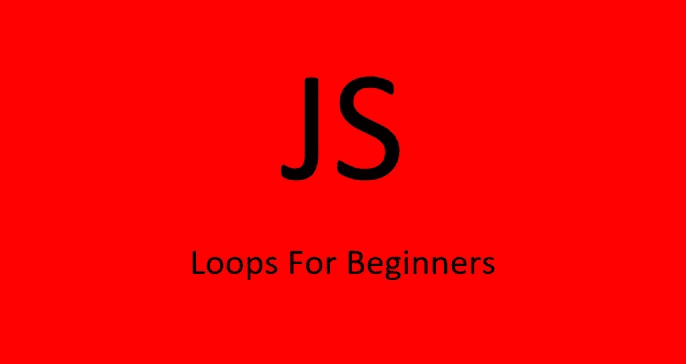

# 对 Javascript 初学者来说非常简单的循环

> 原文：<https://levelup.gitconnected.com/loops-made-super-simple-for-javascript-beginners-8b176a60b8b3>

## 不要被循环弄糊涂了，只要遵循这个简单的食谱



作者照片

在 Javascript 中，有很多方法可以遍历数组、对象和字符串！初学者如何决定使用哪个循环是正确的？

读完这篇 3 分钟的文章后，你将能够不用绞尽脑汁地遍历数组、对象和字符串。我将用这个简单的方法让循环任何东西变得超级简单。

# 瑞士军刀 `Loop`

无论是遍历对象、数组还是字符串，最容易使用的循环是`for…of`循环。你可以让这个循环为所有三种类型工作，这样做，你不需要决定使用哪个循环，因为你知道`for…of`为所有三种类型都做了工作。

**用**和`**for…of**`循环遍历一个数组

用`for…of`遍历数组非常简单。`for…of`就是为此而建。

语法如下所示:

```
const myArray = [3, 4, 19, 25];**for** (const value **of** myArray) {
  console.log(value); // Output 3, 4, 19, 25
}// use let, not const, if reassigning the value of the current loop value
**for** (let value **of** myArray) {
  value += 20;
  console.log(value); // Output 23, 24, 39, 45
}
```

就这样，非常简单。如果想在找到某个值的时候跳出循环，可以使用`break`关键字。您可以在下面看到，循环在到达 19 时被终止，因为循环使用了`break`作为该值。

```
const myArray = [3, 4, 19, 25];**for** (const value **of** myArray) {
  if (value === 19) {
    break;
  }
  console.log(value); // Output 3, 4
}
```

如果你想在循环中跳过你正在做的某个值，你可以使用`continue`关键字。您可以在下面看到，19 的日志记录被跳过，因为循环对该值使用了`continue`。

```
const myArray = [3, 4, 19, 25];**for** (const value **of** myArray) {
  if (value === 19) {
    continue;
  }
  console.log(value); // Output 3, 4, 25
}
```

**用**循环遍历一个对象`**for…of**`

使用`for…of`你也可以遍历一个对象。虽然`for…of`是为数组构建的，但是有一个简单的方法可以用来首先将对象转换成数组。进行这种转换的方法是使用`Object.keys()`、`Object.values()`或`Object.entries()`方法。

如下图所示，使用`Object.keys(myObject);`将`myObject`对象转换为`myObjectKeys`

```
const myObject = {
    keyOne: 5,
    keyTwo: "valueTwo",
    differentkey: "value3"
};const myObjectKeys = Object.keys(myObject);
console.log(myObjectKeys);
// Output ["keyOne", "keyTwo", "differentkey"]
```

现在您可以在`for…of`循环中使用`myObjectKeys`。然而，到数组的转换通常是在使用
`(const key of Object.keys(myObject)`的`for…of`循环中完成的，如下所示。

```
const myObject = {
    keyOne: 5,
    keyTwo: "valueTwo",
    differentkey: "value3"
};// convert keys to array an loop through them
for (const key of Object.keys(myObject)) {
  console.log(key); // Output "keyOne", "keyTwo", "differentkey"
}
```

同样的过程也适用于对象的值。使用
`(const value of Object.values(myObject)`将值转换为`for…of`循环内的数组，如下所示。

```
const myObject = {
    keyOne: 5,
    keyTwo: "valueTwo",
    differentkey: "value3"
};// convert keys to array an loop through them
for (const value of Object.values(myObject)) {
  console.log(key); // Output 5, "valueTwo", "value3"
}
```

如果您想在循环中同时使用键和值，同样的模式也适用，只是这次您使用
`(const [key, value] of Object.entries(myObject));`将键-值对转换为一个数组

```
const myObject = {
    keyOne: 5,
    keyTwo: "valueTwo",
    differentkey: "value3"
};for (const [key, value] of Object.entries(myObject)) {
  console.log(key, value);
  // Output "keyOne", 5, "keyTwo", "valueTwo", "differentkey", "value3"
}
```

就是这样，你可以遍历任何对象的键和值！

**用**和`**for…of**`循环一个字符串

你已经知道如何用`for…of`遍历数组和对象，现在使用`for…of`遍历一个字符串。这非常简单。如下所示循环遍历字符串。

```
const myString = "Hello";for (let letter of myString) {
  console.log(letter); // "H", "e", "l", "l", "o"
}
```

# 最后的想法

如你所见，使用`for…of` 你可以毫无问题地遍历数组、对象和字符串。

不用再考虑使用什么循环，`for…of`完成了所有的工作！

感谢阅读。如果你喜欢这篇文章，可以考虑在这里[订阅](https://craftedwebpages.medium.com/membership)中级会员，以获得数以千计的其他文章。

如果你想更深入地了解循环，那么请看这篇文章:

[](https://js.plainenglish.io/javascript-loops-a-comprehensive-guide-eb7f98b7c455) [## JavaScript 循环:综合指南

### 对象、数组和字符串— for、forEach、for…of、for…in、includes、while、do…while、every、some

js .平原英语. io](https://js.plainenglish.io/javascript-loops-a-comprehensive-guide-eb7f98b7c455)