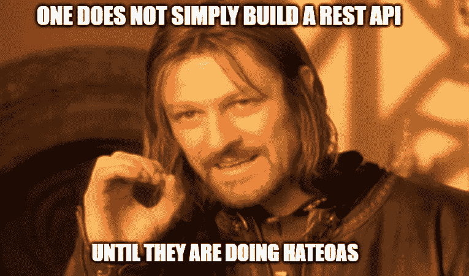

# 爱它或恨它

> 原文：<https://levelup.gitconnected.com/love-it-or-hateos-it-3f8d5844e736>

上周，我们就 HATEOAS 对于我们基于 REST 的微服务应用套件的功效进行了一次相当长时间的讨论。长话短说，团队在我们是否应该基于 REST 的“统一接口”特性构建我们的 API 响应模型上存在意见分歧。

**什么是 HATEOAS？** 在我们到达那里之前，我想请你挑战一下自己，给休息下一个正确的定义。我们的 API 团队中都有一个人会(至少一次)评论说，我们的 API 不是真正 RESTful 的。不管怎样，他们可能是绝对正确的。他们的想法很可能基于罗伊·菲尔丁的论文。坚持认为我们可能理解什么是 HTTP 动词[，但它们不是超文本驱动的](https://roy.gbiv.com/untangled/2008/rest-apis-must-be-hypertext-driven)。否则，您的 REST API 只是一个 RPC 驱动的基于 HTTP 的接口。

简单地说，Hypertext**A**S**T**he**E**ngine**O**f**A**application**S**state，或 *HATEOAS* 意味着我们在响应中嵌入了足够的信息，以便客户端可以智能地选择下一步要做的事情。每种媒体类型都定义了默认的处理模型，例如 HTML 定义了超文本的呈现过程和每个元素周围的浏览器行为。它与动词 GET/PUT/POST/DELETE 没有直接的依赖关系。该接口告诉客户端使用什么方法，例如获取用户的数据，这反过来又转换为 GET 调用。

客户端下一步应该做什么转化为资源发现，如果定义正确，资源发现就在响应超媒体中。这将允许客户端计算出哪些资源是可用的，哪些是可以操作的。

假设您的 API 被最终用户和管理员通过相同的接口使用。普通用户将能够获得`/users/{​userId}​`。超级用户可以上传并修补`/users/{​userId}​`，管理员拥有删除权限。如果我们停留在 Richardson 成熟度模型的第 2 级，我们就会有一个能够理解特权类型并基于此进行渲染的客户端。

**听起来很花哨，我该实现吗？** 大多数团队不理解的一点是，HATEOAS 不是设计原则，而是架构约束的一部分。构建一个完全解耦、独立可扩展的系统是每个工程师的目标。但我的抱怨是，仅仅因为你在周末读到了一些东西就去实现它，这永远不是正确的方法。

让我们看看 HATEOAS，如果实现正确，它将不再需要显式文档，因为它是*自文档化的。*但实际上，我们大多数人不会花时间构建足够智能的客户端来读取`*rel = what-this-endpoint-does*`并判断它是否应该为特定用例使用 PUT 方法或 POST 方法。我当然希望它这样做，从而允许对我的应用程序进行渐进的非侵入性增强。但我们在这一点上相差甚远。

此外，大多数 API 的实现依赖于通过像 [Apigee](https://cloud.google.com/apigee) 或服务网格这样的网关提供对它的访问，这使得基于 HATEOAS 的链接几乎不起作用。

此外，为了让您的 REST API 真正为可演进性做好准备，它可能需要[版本化，对吗](https://medium.com/swlh/api-versioning-7f6f713c6b14)。但是对于真正的仇恨来说，这变得有点违反直觉了。

REST 仍然是构建 API 的一种非常好的方式，但是我不会试图为一个虚构的客户端实现它，这个客户端会以某种方式理解我的超媒体格式的语义。每个微服务套件都是不同的，不存在通用的 API。尝试构建最终的响应发现引擎是一个很好的最终目标。但是对于任何工程团队来说，僵化的思维模式最终会降低应用程序的可发展性，这不是一个好的方向。

参考资料:

*   [http://Roy . gbiv . com/untangled/2008/rest-APIs-must-be-hypertext-driven](http://roy.gbiv.com/untangled/2008/rest-apis-must-be-hypertext-driven)
*   [https://www . ics . UCI . edu/~ fielding/pubs/dissertation/rest _ arch _ style . htm](https://www.ics.uci.edu/~fielding/pubs/dissertation/rest_arch_style.htm)
*   [http://Martin fowler . com/articles/richardsonmaturitymodel . html](http://martinfowler.com/articles/richardsonMaturityModel.html)
*   [https://en.wikipedia.org/wiki/No_Silver_Bullet](https://en.wikipedia.org/wiki/No_Silver_Bullet)