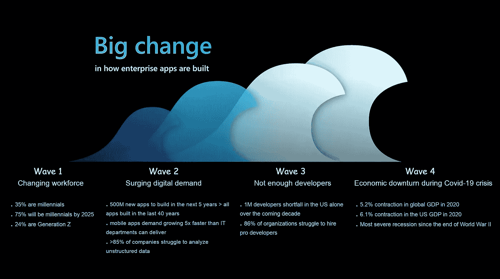

# 低代码:炒作和怀疑论观点背后的挖掘

> 原文：<https://levelup.gitconnected.com/low-code-deep-look-b5be4b410a29>

## [软件工程](https://rakiabensassi.medium.com/list/software-engineering-7a179a23ebfd)

## ●用数字编码



企业应用构建方式的巨大变化([原图](https://www.youtube.com/watch?v=JwM9NrePPMc)

Appian 首席执行官马特·卡尔金斯(Matt Calkins)表示，与传统模式相比，低代码使应用程序开发速度*提高了 10 倍*，成本*降低了 50%*。

对于组织来说，这似乎是令人鼓舞的消息，但是对于像我这样的程序员来说，这听起来就不一样了。

低代码真的会让影子 IT 走出阴影吗？它会解决未实现的业务目标并成功解决传统软件开发中的痛点吗？我必须找新工作的时候到了吗？

为了获得更深入的观点和仔细的考虑，在今天的文章中，我将超越围绕[低代码](https://betterprogramming.pub/low-code-history-b756c095494f)的叙述的两极分化，分享一些有见地的数字。

```
**Table of Contents**[**4 Waves Driving the Low-Code Revolution**](#11a6) ∘ [Changing workforce](#d129)
 ∘ [Surging digital demand](#1fd2)
 ∘ [Not enough developers](#ccaa)
 ∘ [Economic recession during the Covid-19 crisis](#2ac7)[**5 Keys to Selecting the Right Platform**](#3618)∘ [Goals](#e33e)
 ∘ [Ownership cost](#815d)
 ∘ [Support](#22a2)
 ∘ [Collaboration](#fa26)
 ∘ [Flexibility](#28a3)
[**3 Keys to Get High Return Of Investment**](#9729)[**5 Cases to Set Off Alarm Bells**](http://f041)∘ [Complexity](#4fbc)
 ∘ [Integration](#b95e)
 ∘ [Security and testing](#3764)
 ∘ [Lock-in](#1b30)
 ∘ [Scaling](#96ab)
[**Final Thought**](#c618)
```

# 4 波驱动低代码革命

微软公司副总裁查尔斯·拉曼纳提出了四个浪潮，概述了严重的问题，并说明了商业和 IT 应该如何考虑低代码平台。

## 1.不断变化的劳动力

数字原生劳动力——35%的千禧一代和 24%的 Z 世代——需要移动优先和人工智能优先的应用。

100 次点击和 100 个屏幕的商业应用程序不会满足他们。

## 2.激增的数字需求

*   未来 5 年需要开发 5 亿个新应用，这比过去 40 年开发的所有应用都多。
*   对移动体验的需求增长速度比 IT 部门能够提供的速度快 5 倍。
*   超过 85%的公司都在努力分析[非结构化数据](https://entrepreneurshandbook.co/how-a-19-year-old-boy-built-a-billion-business-1d3022faa2a6)。这是一个我们可以通过自动化解决的挑战。

## 3.没有足够的开发者

市场上没有足够熟练的开发人员。仅在美国，未来十年就有 100 万开发人员缺口。

组织希望获得更多他们已经拥有的资源，并培养公民开发者来解决他们的数字需求。

## 4.新冠肺炎危机期间的经济衰退

为了应对像新冠肺炎这样的爆炸，我们必须超级灵活。需要数年才能完成的大企业项目无助于加快发展和克服这样的危机。

> “大规模的数字化转型必须是小规模、小规模的渐进过程，能够带来高回报、高效益。”—查尔斯·拉曼纳

# 选择**正确平台的 5 个键**

当研究合适的低代码环境时，您不应该错过检查客户对它的满意度。

为了了解它的优点和缺点，您必须考虑多个用例以及您的持续需求。以下是帮助你做出选择的五个关键:

## 1.目标

一些平台授权公民开发者构建应用程序。其他人支持业务分析师和主题专家，或者为每个角色提供不同的工具。

您选择的平台应该有助于您实现特定的业务和技术目标。

## 2.所有权成本

市场上有不同的定价模型，但是您也需要考虑拥有成本，以便做出准确的估计。

平台的易用性如何？[你的](/learning-velocity-and-coding-standards-10952f6c9640)[团队](https://medium.com/swlh/characteristics-of-successful-team-60272e59a2c6)需要多少时间和精力进行培训？支持需要额外费用吗？

当该平台不再满足您的需求时，将您的[软件](https://betterprogramming.pub/frontend-architecture-376e6323ef9b)从该平台转移出去会花费您多少钱？

## 3.支持

您的应用程序和平台本身都容易出现错误。拥有方便的工具来有效地找到并修复它们是很重要的。

## 4.合作

如果不同的人需要同时更改项目，而他们没有鼓励协作的基础设施，那么您的项目可能会陷入停顿。

支持[版本控制](/git-workflow-devops-69e5a9071be1)至关重要，但是你可能还需要 ***模块化*** 来将你的软件分成不同团队成员可以开发的[组件](https://betterprogramming.pub/angular-custom-autocomplete-7ffb479477e7)。

## 5.灵活性

低代码平台支持*预制块*，并允许添加*自定义代码*。以下是你在做决定前需要考虑的问题:

*   平台提供哪些预制块？它们符合您的技术要求吗？
*   添加定制代码有什么方法和接口，需要什么编程语言和技术能力？
*   *数据模型*有多灵活？你能轻易改变它们而不重新开始吗？

# 获得高投资回报的 3 个关键

根据 ThoughtWorks 的说法，在找到满足您业务需求的低代码平台后，有三个关键要素可以将其集成到公司的流程中，并获得高投资回报(ROI):

1.  企业需要对平台有现实的期望，以及对部门间政治的有力管理。
2.  它应该拥有所有权，并成为平台的推动者。
3.  业务和 IT 必须协同工作，利用彼此的专业知识。

> “传统的软件开发几乎完全是 IT 部门的工作。低代码平台声称，通过允许创建影子 IT 部门，可以通过他们的平台绕过这一点。这在多大程度上是真实的是有争议的。无论如何，我们相信当使用低代码平台时，它仍然必须发挥作用。
> 
> 期望财务部门的某个人拥有让他们的部门应用程序符合内部安全标准或隐私政策的知识和技能是不合理的。”— [如何低码成功](https://www.thoughtworks.com/insights/articles/low-code-success)

# 敲响警钟的 5 个案例

当我们考虑[企业应用](https://betterprogramming.pub/frontend-architecture-376e6323ef9b)的现实和它们应该解决的复杂[问题](https://betterprogramming.pub/problem-solving-techniques-b1ed8b4c729f)时，我们可能会跑到适合低代码平台的甜蜜地带之外。

## **1。复杂性**

当我们想到低级代码时，我们会想到用一种可视化的方法来描述逻辑程序流。但是当代表代码的*图*变得太大的时候，就变得很难理解了。

许多低代码环境对这个问题的解决方案是，如果事情变得太复杂，就使用定制代码。

但是，如果你开始修改你的低代码应用程序背后的代码，你能确定你会继续升级吗？如果没有，你会后悔没有让你的软件专家提前交付定制的解决方案吗？

> "关键任务应用程序需要专业软件开发人员提供的专业知识深度."—思想工作

## 2.综合

当您必须集成其他系统并与它们交换数据时，您不应该低估管理 API 的复杂性。

从长远来看，低代码平台能让你满足这个需求吗？

## **3。安全和测试**

一般来说，如果你写的代码更少，就像你写低级代码一样，出错的可能性就更小。但是谨慎的做法是检查测试低代码应用程序的工具是否没有达到您的预期。

## **4。锁定**

为了避免灾难恢复格言，供应商锁定应该是您关注的问题之一。

有必要检查一下从您的低代码平台生成的代码是否可供人类使用。你能改变它吗？

## **5。缩放**

你选择的平台不应该阻碍你的整体业务增长。您可能会有更多的项目或员工需要访问该平台，您的软件的用户数量可能会增加。

您需要计划当您的应用程序变得至关重要时会发生什么。您将如何处理偏离原始用例并增加复杂性的特性请求？

# 最终想法

低代码平台有望更快更便宜地生产软件。但是这需要现实的期望、业务和 IT 之间的相互理解和合作，以确保一帆风顺。

🧠💡我为一群聪明、好奇的人写关于工程、技术和领导力的文章。 [**加入我的免费电子邮件简讯，独家获取**](https://rakiabensassi.substack.com/) 或在此注册 Medium。

*你可以在 Udemy 上查看我的* ***视频课程****:*[*如何识别、诊断、修复 Web Apps 中的内存泄漏*](https://www.udemy.com/course/identify-and-fix-javascript-memory-leaks/) *。*

## 参考

[1] [低代码革命——查尔斯·拉曼纳](https://www.youtube.com/watch?v=JwM9NrePPMc)

[2] [低码鉴赏力](https://www.thoughtworks.com/insights/articles/choosing-low-code-platform)

[3] [为低代码平台提供案例](https://www.thoughtworks.com/insights/articles/making_case_low-code_platforms)

[【4】如何低码成功](https://www.thoughtworks.com/insights/articles/low-code-success)

[](https://betterprogramming.pub/low-code-history-b756c095494f) [## 低代码开发简史

### 回到可视化编程的根源

better 编程. pub](https://betterprogramming.pub/low-code-history-b756c095494f) [](https://betterprogramming.pub/serverless-bcc0d2b65b41) [## 关于无服务器，维基百科不能告诉你什么

### 后虚拟机和后容器范式的非常规指南

better 编程. pub](https://betterprogramming.pub/serverless-bcc0d2b65b41) [](https://betterprogramming.pub/data-scraping-tools-7cb76eeab89e) [## 2021 年你应该知道的 7 大数据搜集工具

### 如何保持领先地位，并从网络上的公共数据中获得竞争优势

better 编程. pub](https://betterprogramming.pub/data-scraping-tools-7cb76eeab89e)