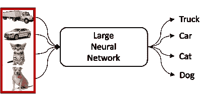

# 基于分层神经网络的低功耗多摄像机目标再识别

> 原文：<https://levelup.gitconnected.com/low-power-multi-camera-object-re-identification-using-hierarchical-neural-networks-275663db83d6>

这是在 2021 年 IEEE/ACM 低功耗电子和设计国际研讨会(ISLPED 21)上发表的研究论文“*使用分级神经网络的低功耗多摄像机物体再识别*”的摘要。

这篇简报由论文的主要作者[阿比纳夫·戈埃尔](https://www.linkedin.com/in/abhinavgoel95/)撰写。

本文的目标是开发一种精确的物体重新识别算法，该算法使用相对较少的能量，适用于低功耗设备，如手机或相机。

# **背景**

摄像机广泛部署在许多嵌入式系统中，通常称为*视频物联网* [0】。计算机视觉技术可以使用这些摄像头收集的数据来执行分析、跟踪和监视等任务。卷积神经网络(CNN)的最新进展已经导致许多计算机视觉任务的重大突破。CNN 的最新精度主要归功于它们训练数十亿参数以拟合复杂函数的能力。然而，精度的提高伴随着高能量成本和计算资源需求。

大多数嵌入式系统没有运行 CNN 所需的计算资源，因此处理通常被卸载到云中。基于云的解决方案是“尽力而为”的技术。它们不提供任何延迟保证，因为它们依赖于网络带宽的可用性。隐私问题也限制了大多数应用程序将相机数据发送到云端。对于实时处理和响应，CNN 需要变得更高效，并直接部署在嵌入式系统上。

流行的 dnn，如 VGG [1]和 ResNet [2]，具有单片架构，如下图所示。当执行像图像分类这样的任务时，这种架构包含单个 CNN，该 CNN 负责识别与每个可能的对象类别相关联的所有特征以做出决策。这种 CNN 执行许多不同的任务，需要大量的神经元和层。然而，当处理单个图像时，这些神经元中只有一小部分具有非零激活。在这些细胞神经网络中，不管激活值如何，所有的算术运算和存储器访问仍然在每个神经元上执行。这些冗余大大增加了 CNN 的能耗。

为了实现计算机视觉任务的高精度，许多 dnn 依赖于单片结构。输入通过一个单一的大型神经网络，“神奇的事情发生了”，它产生物体识别。

我们之前的工作开发了一种新的 CNN 架构，称为基于树的单向神经网络(TRUNK)，可以提高计算机视觉的效率[3]。不是单个深 CNN，而是树形式的多个浅 CNN。参见下图中的示例。

我们基于树的单向神经网络(TRUNK) [2]，用于提高计算机视觉任务的效率。TRUNK 以树的形式连接多个浅层神经网络。

这些网络协同工作来执行计算机视觉任务。主干架构首先找到不同对象类别之间的*相似度*。相似的物体类别被分组为*簇*。然后，相似的集群被分组到一个层次结构中，创建一个树。主干每个节点上的浅层细胞神经网络在不同的簇之间进行分类。在推断过程中，对于输入图像，一旦 CNN 选择了一个聚类，另一个 CNN 进一步在该聚类的子聚类(子聚类)中进行分类。在推断该图像的过程中，不使用与其他聚类相关联的 CNN。通过这样做，在推断过程中只使用了 CNN 的一小部分，从而避免了冗余操作(理解为:使用更少的能量)。

当在 TRUNK 中形成聚类时，现有方法使用两种主要类型的相似性度量:(a) *语义*:使用概念和词汇关系将对象彼此链接，例如作为交通工具的汽车和自行车，以及(b) *视觉*:基于它们的外观对对象进行分类，例如，因为它们是圆形的，所以是比萨饼和盘子。我们之前的主干层次(用于图像分类[3]和对象计数[4])是使用视觉相似性构建的。

# 工作总结

本文将 TRUNK 体系结构应用于目标再识别(reID)问题。主要创新在于(a)相似性度量和(b)定义层次结构的方法。

# 物体再识别问题

在 object reID 任务中，给定一个对象的图像，目标是返回一组包含被查询对象的图像。参见下图中的示例。采用 object reID 的系统可用于增强公共安全、管理人群和跨多个摄像机检测事件。现有技术执行许多冗余操作，因为查询图像不需要与每个图库图像进行比较。

该图描述了现有对象 reID 技术的典型工作方式。大 DNN 从查询图像中提取特征向量。然后，使用诸如欧几里德距离的距离度量，将该特征向量与每个图库图像，即图像(a)-(d)的特征向量进行比较。然后基于图库图像与查询图像的距离对图库图像进行排序。

# 对对象 reID 使用主干

## 概念

大型 DNN 的存在导致典型对象 reID 实现消耗大量能量。如果我们提出的主干架构可以适应这个问题，那么它可以使用更少的能量来回答对象 reID 查询。为此，我们实例化了主干架构，使得层次结构的每个节点都包含一个小的 CNN，该 CNN 从查询中提取特征向量，并在其后续分支之间路由查询。下图说明了我们的方法。

主干架构，适应对象 reID 问题。查询图像由第一小 CNN 处理，以(1)确定车辆是否具有天窗，以及(2)产生用于后续分析的相关特征向量。遵循决策树来有效地产生用于计算最相似图库图像的特征向量。

在查询图像被第一 CNN 分类为具有天窗的车辆之后，图库减少到图像(b)、(c)和(d)。下一个 CNN 继续处理特征向量，识别车辆的*颜色*。这种分类将图库缩减为图像(b)和(c)。来自叶 CNN 的特征向量用于执行与剩余图库图像的比较，以重新识别对象。剩余的图库图像包含具有在查询中识别的属性的对象。因为每个小 CNN 只专门处理对象的一个子集(具有特定属性)，所以它们获得了高精度。

虽然主干架构在概念上对这个问题很有吸引力，但它在细节上对我们没有帮助。我们需要构建一个网络层次结构，为此我们需要一些相似性度量。*然而，现有的视觉或语义相似性并不适用*。每当遇到以前看不见的对象时，基于视觉相似性的层次需要被重新训练。同时，当用于计算机视觉时，基于语义相似性的层次具有显著的准确性损失。我们用视觉和语义相似性的新颖组合来解决这些缺点。

## 构建层次结构

如前所述，层次结构的每个节点标识图像中的一个属性。我们的技术确定(1)识别属性的*顺序*，以及(2)识别哪些属性的*。总结一下典型的度量标准:选择*顺序*使用视觉相似度(基于分类难度)，而选择*哪些属性*使用语义相似度(基于数据集中属性的相关性)。以这种方式结合这两种度量是新颖的，并且看起来工作得很好。*

为了说明我们的主干层次结构构建方法，我们使用来自 Market-1501 数据集的示例。这是 person-reID 的一个流行数据集。

使用主干层次结构时，没有必要识别图像中的所有属性。例如，如果大多数背着*背包*的人没有同时背着*双肩包*，那么如果识别出了*背包*，那么识别一个人是否背着*双肩包*就是多余的。我们的技术使用属性相关性来确定应该识别哪些属性。相关性是在同一对象上找到两个属性的可能性；高度相关的属性不需要在相同的路径中标识，因为预期的图库大小减少很小。

下图显示了对 Market-1501 数据集中的图像使用预训练 DNN 获得的特征向量。等高线被添加到聚类中，以突出属性识别的不同难度。具有可辨别聚类的属性(例如*性别*)比其他属性(例如*提着包*)更容易识别。在 Market-1501 数据集中，男性和女性在视觉上是不相似的，但带包和不带包的人很难区分。因此，*性别*分类应该在接近层级的根的位置执行，一个小的 DNN 可以准确地执行这项任务。此外，后续分类变得更容易，因为它们是在图库的子集上执行的。当在图库的较小子集上执行时，困难的*箱包*分类变得越来越容易。

在来自 Market-1501 的图像上使用预训练的最先进的 DNN 获得的特征向量。左边的图像显示了具有可识别聚类的属性，而右边的图像则没有。这种差异表明，这个 DNN 会发现男性或女性的问题比袋或不袋的问题更容易。

*选择顺序:* 确定在根识别哪个属性，以及后续属性分类器在层次结构中的顺序，我们量化属性识别的难度。我们在接近层次的根的地方执行更容易的属性识别。这种排序是有利的，因为分层 dnn 将输出特征向量从父节点传播到子节点。等级 DNN 的每个分支代表一个更深的 DNN(即更多层)。靠近叶的小 DNNs 比靠近根的 DNNs 具有更强的区分能力。我们的具体方法是使用预训练的 DNN，并测试目标数据集的每个属性，如上图所示。我们计算每个属性的难度，然后将较容易的属性放在靠近主干根的位置。

*选择哪些属性:* 在量化属性识别的难度后，确定层次结构的第一个属性分类(即排名最高的属性)。然后，对于树的每个分支，我们需要确定要分类的属性。这是通过递归地获得不同属性之间的相关性来实现的；高度(正或负)相关的属性不在同一分支中识别。

该方法通过仅识别与先前识别的属性弱相关的属性，提高了常见情况下的效率。考虑一个例子:在 1501 市场，大多数男性不携带*手袋。*用于重新识别所有男性(有无*手包*)、其他属性(如*年龄*、*包包*等。)被首先识别以减小图库大小。对于普通情况，即没有*手提包*的男性，执行较少的冗余操作。

## 构建树的每个顶点

一旦定义了层次结构，就为每个节点构建 dnn。每个 DNN 执行两个任务:(1)提取特征向量，和(2)识别属性。层次结构的每个节点都包含一个小 DNN，专门处理和重新识别图库的子集。

需要选择 DNN 架构，以便每个 DNN 都能准确高效地执行任务。较大的 dnn 更精确，但是使用更多的资源。为了在准确性和效率之间获得可接受的折衷，我们应用了我们先前工作中使用的架构搜索技术[4]。每个小 DNN 由几个层叠的卷积层组成，通过自动搜索几个配置来找到一个好的配置。

# **实验结果**

我们的方法始终优于现有的技术，同时实现竞争的准确性。

我们从模型大小(以 MB 为单位的内存需求)、FLOPs(以百万为单位的算术运算次数)、准确性(秩-1 和平均精度)、查询时间(秒)和能耗(焦耳/图像)等方面对我们的技术进行了比较。接下来的两个表格显示了结果。

模型大小(MB)、#operations (FLOPs)、rank-1 和 mAP 的比较。蓝色字体表示最佳结果。

两个嵌入式设备上的查询时间(sec/img)和能耗(J/img)对比:Raspberry Pi 3 和 NVIDIA Jetson Nano。蓝色字体表示最佳结果。

# **结论**

我们的方法采用干线架构，其中每个 CNN 处理输入并识别属性。现有的主干层次结构是使用视觉或语义相似性构建的。通过这项工作，我们展示了一种创新的方法，这种方法考虑到了视觉和语义的相似性来构建高效对象 reID 的层次结构。这是通过量化属性识别的难度并找出属性之间的相关性来确定识别哪些属性以及识别它们的顺序来实现的。每次识别出一个属性，我们就缩小搜索空间(图库大小)。我们将层次结构中的小 dnn 专门化为仅处理和重新识别对象的小子集，以低资源需求实现高准确度。

# 更多信息

1.  研究论文可在[这里](https://arxiv.org/pdf/2106.10588.pdf)获得。
2.  研究样机可在[这里](https://github.com/abhinavgoel95/Object-ReID-Hierarchical-Neural-Networks)获得。

# 参考

[0] A. Mohan，K. Gauen，Y. Lu，W. W. Li 和 X. Chen，“2030 年的视频物联网:一个拥有许多摄像头的世界”，2017 年 IEEE 国际电路与系统研讨会(ISCAS)，2017。

[1] K. Simonyan 和 A. Zisserman。2014.用于大规模图像识别的非常深的卷积网络。ArXiv:1409.1556 [cs]。

[2]何国光、张晓东、任少宁和孙军。(2016).用于图像识别的深度残差学习。IEEE 计算机视觉和模式识别会议论文集(第 770-778 页)。

[3] A. Goel、S. Aghajanzadeh、C. Tung、S. Chen、G. K. Thiruvathukal 和 Y. Lu。2020.用于嵌入式设备上低功耗图像分类的模块化神经网络。ACM Trans 德斯。Autom。电子。系统。26、1、第一条(2021 年 1 月)。

[4] A. Goel、C. Tung、S. Aghajanzadeh、I. Ghodgaonkar、S. Ghosh、G. K. Thiruvathukal 和 Y. Lu。2020.基于分层神经网络的低功耗目标计数。《ACM/IEEE 低功耗电子与设计国际研讨会论文集》(ISLPED'20)。