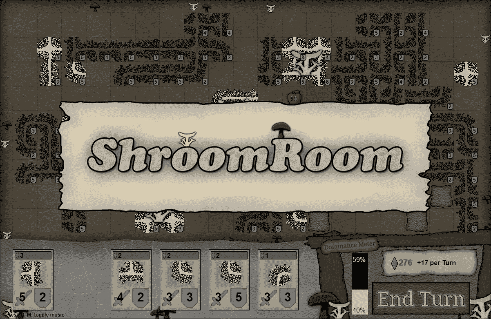
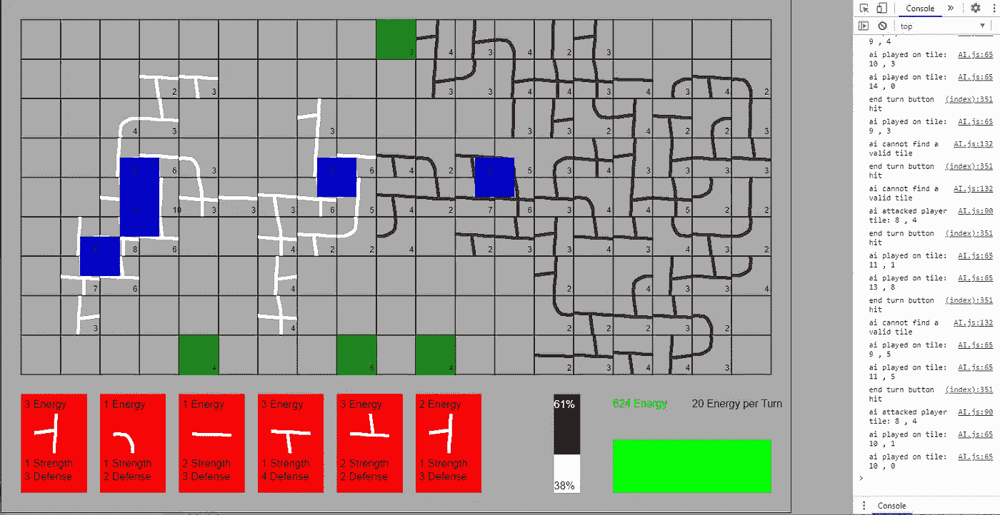
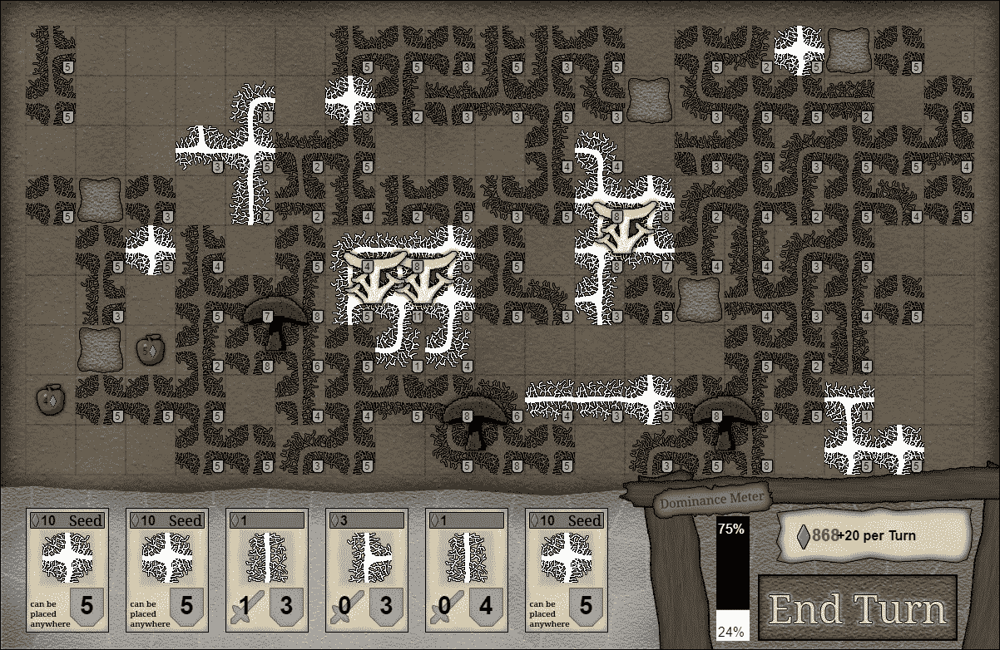

# Ludum Dare 47 事后分析——在 48 小时内创建一个游戏

> 原文：<https://levelup.gitconnected.com/ludum-dare-47-post-mortem-creating-a-game-in-48-hours-f36f7c0cb889>

## 回顾我的 Ludum Dare 游戏的开发过程

Ludum Dare 是一年两次的游戏大赛，你有 48 个小时的时间完全从头开始创作游戏。一开始会宣布一个主题，但大多数主题允许广泛的游戏类型。在 Ludum Dare 中有两个规则集:Compo 和 Jam。Compo 是硬核版本，你有 48 小时来创建游戏，所有的东西都必须在这段时间内完成，包括所有的资源、声音、音乐等等。Jam 规则更宽松:小组可以参与，他们有 72 小时的时间，可以使用一些预先存在的资产。这是我第 8 次参加，我在 Compo 类别工作。

[蘑菇房](https://pingpoli.de/ld47/)，我的[参赛作品](https://ldjam.com/events/ludum-dare/47/shroomroom)为 Ludum Dare 47，图片作者。

# **主题**

在活动开始前的一周，我已经想好了我想做什么类型的游戏。通常，我很早就想出一个流派，然后根据主题进行改编。我脑海中浮现的主要想法是制作某种纸牌游戏，这是我想尝试一段时间的一种类型。最近，我开始种植自己的蘑菇，所以我想做一些与蘑菇相关的东西。

当主题“陷入循环”被宣布时，我一开始并没有超级兴奋，因为这似乎不符合我的任何想法。但经过一番头脑风暴，我想出了一个令我满意的计划:与一个 AI 对手进行回合制游戏。玩家每回合随机抽取一张牌。每张卡片代表一个菌丝块，这些菌丝块可以放在地图上匹配的边上。当 2x2 图案中的 4 张牌形成一个环时，蘑菇将发芽，提供额外的能量，因此在未来的回合中可以玩更多的牌。要赢得游戏，玩家必须成为优势蘑菇物种，并击败*黑霉*(对手)。

# **编程语言**

为了这次 Ludum Dare，我再次使用了 JavaScript 和 HTML5。与我选择的 C++和 OpenGL 相比，它有几个优点。首先，它是基于网络的，人们更喜欢玩和评判网页游戏。对于现代浏览器来说，JavaScript 和 HTML5 的性能对于大多数游戏来说已经足够好了。共享小型网页游戏的源代码也容易得多，这是 Compo 规则集中的一项要求。如果我用 C++，我将需要共享我所有的内部库，它们真的很乱，根本不在可发布状态，或者参与 Jam，我不像 Compo 那样喜欢 Jam。

# **实施**

一旦我有了一个坚实的计划，我就开始实施过程。我对大部分的技术很有信心，但是有一些事情可能会消耗很多时间。

我工作的第一个机械师是卡拖放。起初，只是跟随鼠标，后来捕捉到有效的瓷砖。然后是放置规则，实现起来有点繁琐，因为有 11 个不同的瓷砖，每个瓷砖有 4 个边，我必须考虑所有可能的组合。之后，我还添加了不同放置规则的种子牌并攻击对手，这给牌的放置增加了更多的条件。可能有一种更好的方法来实现放置规则，这种方法需要更少的手工操作，但是我没能及时想出一个。第二个繁琐的机制是循环检测，因为每个图块有 4 个不同的可能循环。

随着主要布局机制的完成，是时候研究人工智能对手了。这是我第一次在 Ludum Dare 游戏中尝试这样的东西，所以我不确定在有限的时间里我能创造出多好的 AI 对手。当我实现布局规则时，我并不总是考虑到人工智能，所以我必须做一些修改来使它为人工智能工作。但总的来说，我设法在合理的时间内创造了一个像样的对手。这绝不是完美的，它确实作弊，但它足够可信的几个回合。

实现的其余部分相当简单，主要是图形、声音和 UI 元素的小代码部分。我在测试时发现了一些较小的错误，但它们都很容易修复。

主要的机制已经实现，但游戏仍然以程序员艺术和作者图像为特色。

# **图形**

如上所述，我最近开始种植蘑菇，当菌丝穿过地面时，它会形成一个密集的网格，覆盖几乎所有的东西。我想在游戏中实现类似的外观。一开始我只有主股，但是看起来不怎么样。瓷砖之间仍然有太多的空隙。所以我在大股的边缘添加了更细的股，它立刻看起来好多了。

对于背景，我在 Photoshop 中用几个内置滤镜做了一个污垢纹理。展示卡片的底部应该是一面鹅卵石墙，但是我对底部的背景不太满意。卡片本身看起来相当不错，它们看起来足够好，最重要的是清楚地传达了信息。

所有其他图标都是像素艺术风格，但它们显示在每个游戏像素的一个图像像素上，所以不是很明显。比起用更软的笔刷画画，我对创作像素艺术更有信心，所以我选择了像素艺术。

总的来说，我对游戏的最终效果很满意。它不会赢得任何图形价格，但它符合游戏的风格，不会对游戏性产生负面影响(我希望)。

主游戏画面与适当的艺术，由作者的形象。

# **音乐**

甚至 compo 规则也允许程序生成器创建音乐(或其他资产)，这对我很好，因为我不知道如何作曲(尽管我希望有一天能学习)。有一些音乐发生器，但我一直使用的是 [Wolfram Tones](https://tones.wolfram.com/) 。它有各种不同的音乐风格，非常容易使用。有些构图听起来有点怪异，但几分钟后，你一般可以找到一个符合游戏的。

# **音效**

我试着用一个[发生器](https://jfxr.frozenfractal.com/)来创造音效，但是我对结果不满意。相反，我在我的麦克风前把随机的东西撞在一起，并用我的嘴发出奇怪的声音。对 Audacity 做了一些小的修改，结果要好得多。

我还录下了自己说的一些短语，在 Audacity 中经过一些后期处理后，结果比我预期的要好，所以我可能会在未来更多地使用这些短语。顺便提一下:我的麦克风没有流行过滤器，但我的桌子上有一个口罩，戴口罩和流行过滤器的效果一样。

# **抛光**

在游戏卡顿中，游戏的润色经常被忽视。尽管 game jam 游戏本质上很小也很简单，但完善控制是非常重要的，包括错误检查、修复 bug，并提供如何玩的说明。人们倾向于利用每一分钟在他们的游戏中加入更多的内容，但大多数时候，内容和机制稍微少一点更好，而是一个更精致的游戏。

当人们评判游戏时，他们只在每场游戏上花几分钟，而花大部分时间试图弄清楚该做什么是非常令人沮丧的。因此，我一直专注于在游戏中直接提供更好的指导。我在游戏开始时放了两个教程屏幕，用一点文字、图像和箭头解释了主要的机制。

# **平衡**

平衡是游戏中最困难的方面之一(一般来说也是游戏开发中最困难的方面)。理想情况下，你希望难度恰到好处，所以这个游戏很有挑战性，但不要太难，所以似乎不可能被打败。我相信人们会更喜欢这个游戏，如果他们能打败它，让我们称之为成就感偏差，所以我倾向于更容易的一面。当你花了 20 个小时在一款游戏上，所以你确切地知道该做什么和如何打败它时，平衡它也是极其困难的。你必须记住，一个新玩家没有这方面的知识。我相信我的游戏又变得更容易了，应该在一个合理的判断时间框架内被大多数玩家打败。

总的来说，我对我的 Ludum Dare 开发过程非常满意。当我第一次提出这个想法时，我认为这个范围对于一个游戏堵塞来说可能有点太大了，因为我不知道我能在多大程度上实现所有的放置规则和条件以及 AI 对手。但事实证明这是完美的范围。我在两天游戏堵塞中的主要目标是在第一天结束时有一个可玩的游戏，我设法做到了。傍晚的时候，我已经完成了所有的核心工作，并且在晚上，我能够创作出大部分的图形。这就把第二天留给了音乐、音效、UI 元素、平衡和所有其他需要完成的小事情，以创建一个体面的游戏。时间会告诉我们游戏是如何被接受的，但至少我对结果和开发过程感到高兴。

如果你想尝试这个游戏，你可以在这里这样做:[https://pingpoli.de/ld47/](https://pingpoli.de/ld47/)

完整开发过程的延时，作者视频。

*最初发布于*[*https://ping poli . de*](https://pingpoli.de/?s=blogpost&bpid=60)*。*