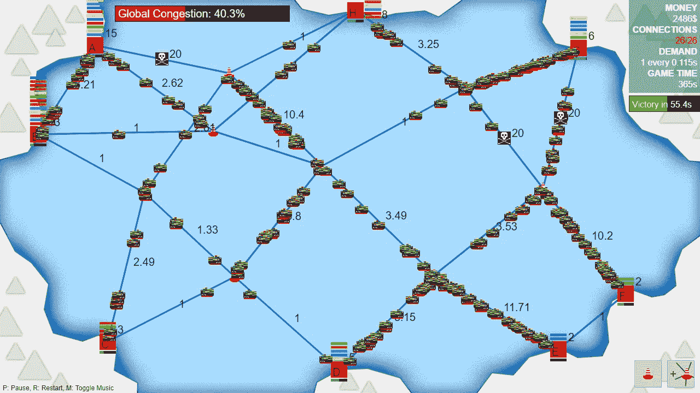
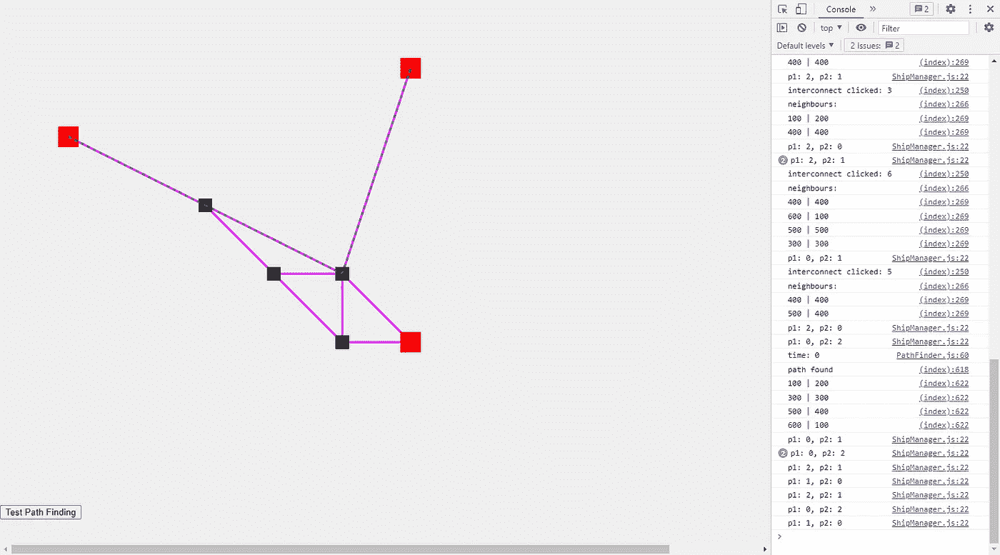
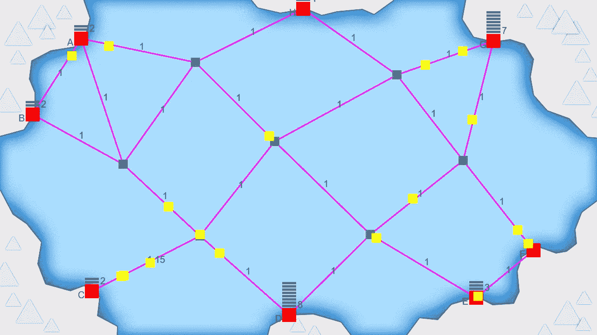

# 勒杜姆·达雷死后 50 年

> 原文：<https://levelup.gitconnected.com/ludum-dare-50-post-mortem-932f8cfe5504>

## 在 48 小时内从零开始创造一个游戏

国际航运模拟器-我的 Ludum Dare 50 提交。图片作者。

上周末标志着非常受欢迎的 [Ludum Dare](https://ldjam.com/) 游戏 jam 的 20 周年纪念日和第 50 期，在这里你必须在 48 小时内为一个给定的主题完全从零开始创建一个游戏。这包括所有的编程，图形，用户界面，音效，音乐，以及构成游戏的一切。以下是一篇略长的博文，讲述了我在活动中的想法和经历:

# **主题和创意**

这次活动的主题是*推迟不可避免的事情*，我不太喜欢这个。[我上一个 Ludum Dare 游戏](https://pingpoli.de/ludum-dare-49-post-mortem)有一个重大缺陷:玩游戏感觉很压抑，太难赢了。问题是不断的失败不是一个好的玩家体验，因此它没有得到好的评价。

主题*推迟不可避免的事情*听起来像是另一个主题，从技术上讲，你永远不可能赢，只能尽可能长时间地推迟失败，这是我从上次事件中吸取教训后想要避免的事情。

我在周末之前的一个想法是创建某种物流/交通管理游戏，灵感来自于[迷你地铁](https://store.steampowered.com/app/287980/Mini_Metro/)，这是一个基于几年前 Ludum Dare 提交的游戏。当主题宣布时，我写下了一堆想法，并迅速将其缩小到一个航运模拟游戏，玩家需要在全球供应链不可避免地崩溃之前尽可能长时间地创建和维护它们。

最后，我想对 Ludum Dare 采取稍微放松一点的方法，因为我在过去几周一直很忙，这意味着比平常更限制范围。然而，只持续了大约一个小时左右，我才意识到我的想法仍然相当复杂，需要大量的工作。

# **编程**

我再次使用了普通的 JavaScript 和 HTML canvas，因为基于网络的游戏更便于人们判断，而且在很大程度上，这是一个低麻烦的开发环境。

我从实现端口和互连之间的线路连接开始，这并不太难。但是，仅仅开发了一个小时，我的更放松的 Ludum Dare 计划就已经停止了。不管是什么原因，当我想到它的时候，我没有想到我的游戏想法需要寻路。幸运的是，我在 C++中有一个 [A*](https://en.wikipedia.org/wiki/A*_search_algorithm) 的工作实现，所以我只需要将它转换成 JavaScript，并完全改变几分钟前我实现节点和连接的方式。但是因为我只是转换了它，并没有把它所有的错综复杂都记在心里，所以我错过了一个小细节，这意味着它找到的路径并不总是最短的可能路径。我花了一段时间才发现这个问题，事实证明在 A*中使用一个精确的值作为启发式算法并不是一个好主意。在把它改成[曼哈顿近似](https://en.wikipedia.org/wiki/Taxicab_geometry)之后，它终于开始工作了，并且总能找到最短的路径。A*的优势之一是，除了几何距离之外，您还可以包括连接的其他成本。过了一会儿，我实施了路线拥堵，并在拥堵路段降低了行驶速度。当一艘新船诞生并计算它的路线时，它会考虑拥挤情况，并找到到达目标的最快路径，这可能不总是最短的。

寻路。图片作者。

在有很多单位的游戏中，寻路是计算量最大的任务之一，我希望我的游戏能同时有相当数量的船只，让它看起来很忙。因此我不确定一台普通的计算机是否能处理所有的寻路任务，所以我选择只在一艘船出生时计算一次它的路径，而不是每隔几秒钟重新计算一次。重新计算路径会更好，这样船只就可以考虑动态变化的交通状况，但我不认为这对游戏有任何影响。这也意味着船只有时可以沿着新删除的连接行驶，如果它仍然是旧路径的一部分，但我不认为这是一个大问题。

除了寻路之外，游戏的编程没有什么特别有趣的地方。港口保持着一个进港船只的队列，并且每隔一段时间只能处理一艘船只，这可以通过雇佣港口工人来降低，我在某种程度上实现了海盗，以便他们将一条路线的拥挤度设置为很高的数字，而不是完全阻塞它。阻止它将需要重新计算所有的路径，以防止船只沿着海盗封锁的路线行驶。虽然事后看来，这将使海盗更有趣，因为他们现在，他们不是一个大问题，你可以在玩游戏时忽略他们。

最后，我改变了当一艘船在一个港口被处理时你得到的金钱奖励，使之依赖于船的平均速度，以使慢速航线更具惩罚性，但我不认为我使它具有足够的惩罚性，因为你可以忽略它，仍然赢得游戏。

大多数机制都已实现。图片作者。

# **图形**

当我为 Ludum Dare 创作游戏时，我通常会选择像素艺术。然而，这一次我想要一个更加风格化和简约的外观。在这次活动之前，我有一个粗略的想法，就是只用基本的几何形状来创建一个游戏，也就是说，只用 HTML canvas 本身支持的形状。有一段时间，我考虑用彩色的正方形和圆形来代表港口、互连和船只，但最终我为它们创建了一些简单的图形。然而，最终的游戏有一个相当简约的风格，我认为它适合这个游戏。

# **音效和音乐**

我总是在游戏卡壳时纠结音效和音乐，但这次更糟糕。部分原因是因为许多声音非常随意。没有一个真实世界的声音来连接一个港口和一个航路点，所以我想不出任何伟大的东西。在过去的活动中，我尝试了游戏中的语音通知，我喜欢这个想法，但不是我的配音技巧。相反，这次我尝试了一些新的东西:我使用了一个[文本到语音的浏览器插件](https://chrome.google.com/webstore/detail/read-aloud-a-text-to-spee/hdhinadidafjejdhmfkjgnolgimiaplp?hl=en)并记录了结果。它适用于一些短语，如“海盗正在封锁你的一条路线”或胜利和失败的消息，但出于某种原因，它很难在“全球疫情需求增加”中发音疫情这个词，我不得不自己录制这个词。所以我最终得到了一个奇怪的声音风格和任意音效的混合。我不认为他们主动伤害游戏，但他们也不伟大。

对于音乐，在上次尝试使用在线音序器制作音乐失败后，我回到了 [Wolfram Tones 程序音乐生成器](https://tones.wolfram.com/)。你通常可以在几分钟的实验后获得一段不错的音乐，尽管它的最大长度为 30 秒，但对于一个简短的 Ludum Dare 游戏来说，它已经足够好了。然而，我仍然梦想着能够在某个时候自己为一个游戏即兴创作一小段音乐，或者至少创建自己的音乐生成器，所以我从来没有真正喜欢过只使用现有的解决方案。

# **平衡**

我没有从去年的 Ludum Dare 中吸取任何教训，当时我做了一个很难平衡的游戏，因为我的游戏又一次无法平衡。即使我在第二天有足够的时间来平衡，我不认为我能找到一个好的解决方案。平衡的最大问题是，你可以忽略大多数海盗，你不需要建立任何额外的路点或增加更多的连接。如果你专注于雇佣港口工人，就很容易获胜。这款游戏有太多复杂且相互关联的系统，在游戏拥堵的几个小时内无法平衡。

# **抛光**

在某些方面，我的不过分计划奏效了，因为我的时间管理得相当好。游戏在周六结束时基本上可以玩了，这意味着我能够比平时更多地完善它的一些方面。一个非常有效的特性是弹出文本，它要么确认一个操作，要么显示一个错误。这给了玩家很多反馈，避免了混乱。它还被恰当地封装在一个类中，所以我可以很容易地将它复制粘贴到下一个事件中，并再次使用它。然而，最初的游戏教程并不怎么好。到最后我已经筋疲力尽了，所以我只做了最少的工作，并在游戏开始前添加了一些基本的文字说明。

# **显影延时**

我又一次记录了我完整的开发过程，并把它变成了延时拍摄:

完全发育延时。作者视频。

总的来说，比赛结果还不错。我对游戏性和视觉风格很满意。把港口连接起来，看着船只在它们之间穿梭，有点像观察一群蚂蚁，这很有趣。另一方面，声音效果并不是很好，平衡也很糟糕，因为它让一些游戏机制变得过时了。至少它很容易赢得游戏，而且与我上一个几乎总是输的 Ludum Dare 游戏相比，它提供了一个更轻松的体验。

在这里玩游戏:【https://pingpoli.de/ld50/】T4Ludum Dare 页面:[https://ldjam . com/events/Ludum-Dare/50/international-shipping-simulator](https://ldjam.com/events/ludum-dare/50/international-shipping-simulator)

*原发布于*[*https://ping poli . de*](https://pingpoli.de/ludum-dare-50-post-mortem)*。*