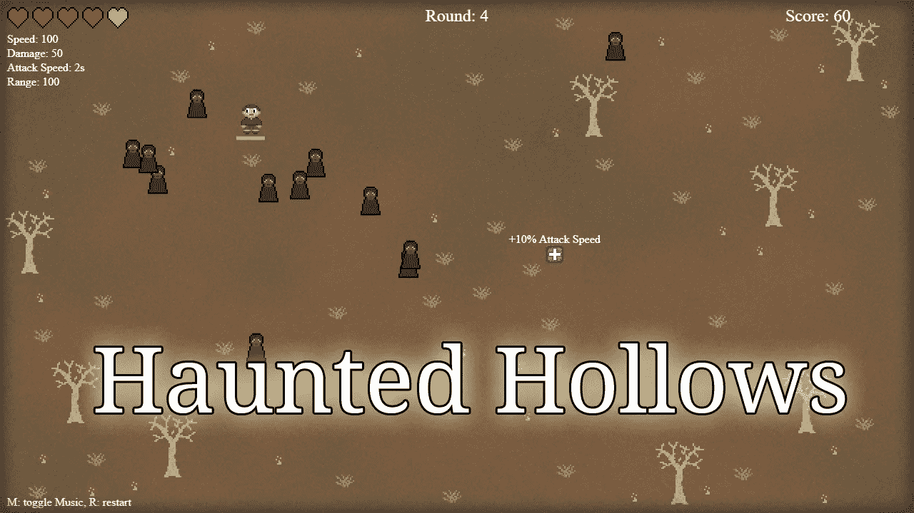
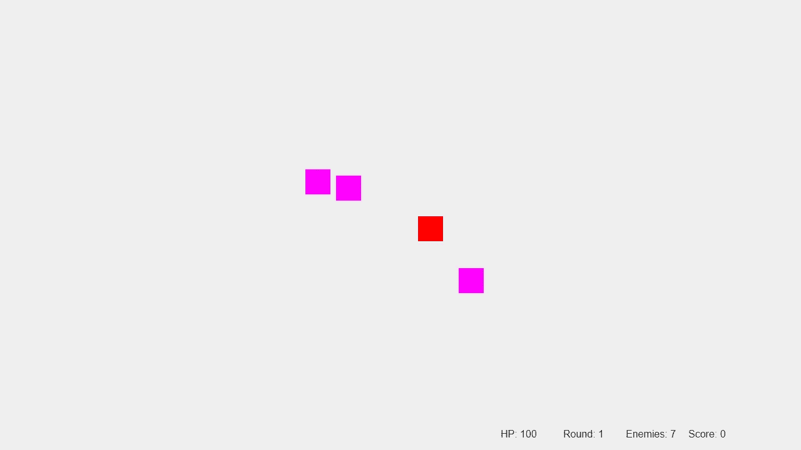
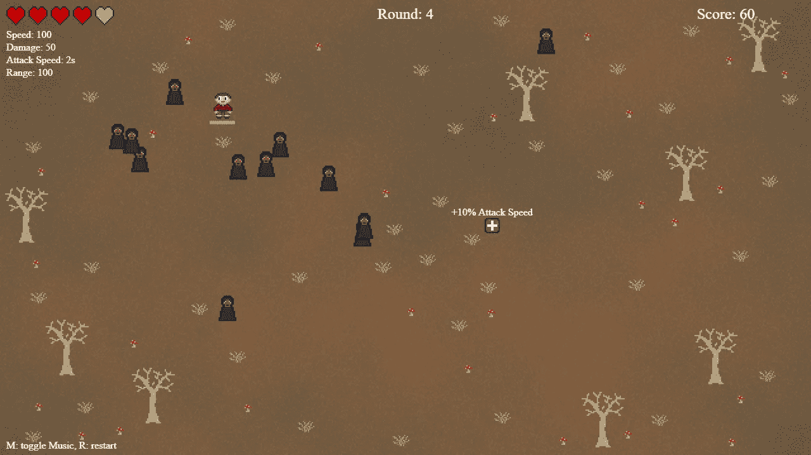
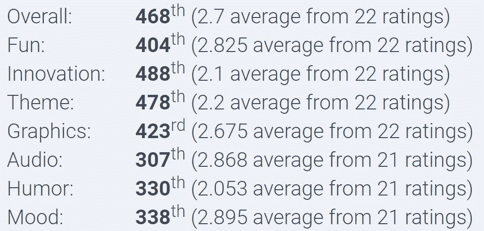

# Ludum Dare 51 验尸-每 10 秒一次

> 原文：<https://levelup.gitconnected.com/ludum-dare-51-post-mortem-every-10-seconds-e74ab99937a4>

## 在不到 48 小时内创建一个完整的游戏

闹鬼的山谷，我的游戏提交给 Ludum Dare 51。图片作者。

几周前，我参加了第 51 届 [Ludum Dare](https://ldjam.com/) 活动。Ludum Dare 是最受欢迎的游戏，你有 48 个小时的时间完全从零开始开发游戏。在活动之前，我感觉不太好，我在考虑是否要参加。我知道我将无法处理我通常的 Ludum Dare 小时，我不知道我是否能够用更少的时间创建一个可玩的游戏。我决定至少试一试，看看我能走多远。我也没有给自己设定任何期望，没有完成比赛是一个可以接受的结果。幸运的是，我确实设法创造了一个像样的游戏。以下是对其发展过程的简短回顾。

# **主题**

这次 Ludum Dare 的主题是每 10 秒钟一次*。不像以前的一些活动，我在主题上很纠结，这次我有很多想法。我决定创造一个*吸血鬼幸存者*启发的基于波浪的生存游戏，随机升级。这样一个游戏的基本玩法模式很容易创建，我有信心我能做到这一点。根据我的感觉和我还剩多少时间，以后添加更多的功能会很容易。*

# **编程**

像最近的大多数 Ludum Dares 一样，我选择了 JavaScript 而不是 C++，因为网页游戏对其他人来说玩和评判要方便得多。事实上，这是第一次我自己只玩网页游戏并为其评分的活动，因为我不想为任何下载而烦恼。

我坚持我的游戏想法的原因之一是游戏不需要任何复杂的机制。玩家和敌人的控制和移动很容易实现，可能最困难的事情是让三角函数正确地进行对角线移动。

对于攻击动画，我采取了一点捷径。我制作了一个动画，其中剑绕着玩家旋转，但是我不想在旋转的剑和敌人之间计算生命值。相反，我只是对范围内的所有敌人立即施加剑伤害。这意味着一些敌人在剑明显到达他们之前几毫秒受到伤害，但在我看来这并不太令人分心——尽管一些玩家注意到了这一点。

*只有彩色方块的早期开发进度。图片作者。*

# **图形**

game jam 游戏中最常见的艺术风格之一是像素艺术。这主要是因为它可以比更高分辨率的资源更快地创建。我的游戏也使用了像素艺术。尽管我花了比平时更少的时间在艺术上，但我认为它结果很好，看起来足够好。然而，玩家角色没有任何动画。我不擅长或者至少在制作 2D 雪碧动画方面不太快，所以我没有在活动期间制作，但这将是一个很大的视觉改进。

*游戏的最终外观。图片作者。*

# **音乐和音效**

背景音乐和音效没做什么特别的。像上次一样，我使用了 [Chrome 音乐实验室的歌曲制作工具](https://musiclab.chromeexperiments.com/Song-Maker/)来创作音乐。我仍然想在某个时候学习如何创作好的音乐，但现在，一首非常简单的短歌就够了。

我通过对着麦克风发出奇怪的呻吟和嗖嗖声来制作大部分音效，还有一些是用 jfxr 制作的。

# **平衡**

与我最近玩的大多数 Ludum Dare 游戏不同，这款游戏并不是一个巨大的平衡噩梦。这并不是说游戏是平衡的，远非如此，但是游戏类型的随机性给数字带来了更大的差异。敌人在随机的地点繁殖，升级和他们的类型也是随机的。这意味着你可以很幸运地在早期获得好的升级，这使得游戏变得容易很多。另一方面，你也可能运气不好，没有在早期获得任何升级，这意味着你将会挣扎，甚至可能很快失败。当有人评判游戏并因为糟糕的 RNG 而失败时，这并不好，但随机化是流氓式游戏的核心机制，所以我不认为我能对此做些什么。

# **改进**

鉴于我花在这个游戏上的时间有限，有很多地方可以改进。很多人评论说，没有明确的反馈敌人是否被击中。当敌人被击中时，游戏有声音效果，但与音乐相比，声音不够大。一个更好的解决方案是健康条或者一个短的红色闪烁动画。我甚至想过在活动期间增加健康栏，但决定反对，因为我想保持简约的风格，吸血鬼幸存者也没有健康栏。在阅读了反馈之后，我创建了一个有健康条的游戏后期版本，我不得不承认有健康条的游戏要好得多。

另一个我在后期版本中解决的问题是一些热门话题。敌人的身高超过了宽度。然而，当我为他们添加艺术时，我保留了彩色正方形的尺寸，并在两边留下了一些透明像素。但是我从来没有把 hitboxes 调整到一个更矩形的形状，这意味着你可能会被击中，即使在视觉上看起来你没有被击中，这显然不是一个很好的体验。

除了这两个问题之外，我还想增加一些改进，比如不同的敌人类型、老板和更多的物品种类。如果我有正常的时间参加 Ludum Dare 活动，我可以做得更多，但另一方面，如果你提交了一个游戏，但你没有更多的功能想添加，你可能做错了什么。一款游戏永远不会真正结束，总会有可以改进的地方，尤其是对于一款在 48 小时内完成的游戏来说。

# **评级**

不幸的是，我的游戏是我评价最差的游戏之一。我想我是可以被期待的，因为我只花了正常时间的一半。缺少健康条是最大的问题，我相信我的游戏的后堵塞版本会放置得更好。

我的游戏的最终收视率。图片作者。

总的来说，我很高兴我参加了这次活动。即使我感觉不太好，我也知道我不能创造出一个令人惊奇的游戏，但是创造一些东西总是值得的。

# **玩**

卡壳版:【https://pingpoli.de/ld51/
卡壳后版:[https://pingpoli.de/ld51_2/](https://pingpoli.de/ld51_2/)

卢杜姆斗胆游戏页面:[https://ldjam.com/events/ludum-dare/51/haunted-hollows](https://ldjam.com/events/ludum-dare/51/haunted-hollows)

*原发布于*[*https://ping poli . de*](https://pingpoli.de/ld-51-post-mortem)*。*