# 使用 Hadoop 的 LVM

> 原文：<https://levelup.gitconnected.com/lvm-with-hadoop-63111412fda2>

我们将了解如何在 Hadoop 集群中使用 LVM(逻辑卷管理)的概念，为 datanode 共享的存储提供灵活性。

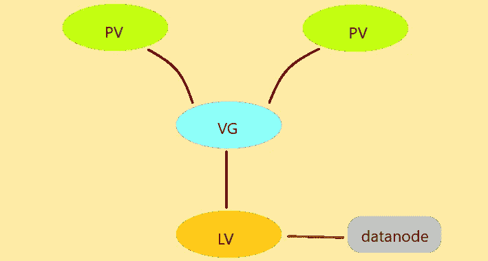

> 需要创建基本 Hadoop 集群的知识。

我们想要达到的目标，

◾将 LVM 与 Hadoop 相集成，并为 DataNode 存储提供弹性。

我们在 RHEL8 操作系统的虚拟机上执行此任务。

我附加了一个大小为 8 GiB 的磁盘(这里是/dev/sdb)

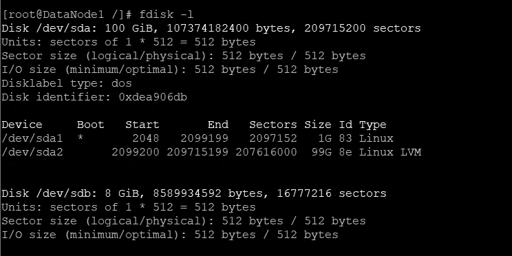

我们在连接的磁盘中创建两个主分区，每个大小为 3 GiB，使用 fdisk 命令进入磁盘

```
fdisk /dev/sdb
```

当创建新分区时，它默认选择主类型，并在最后一个扇区中键入+3G 以创建 3 GiB 的分区，

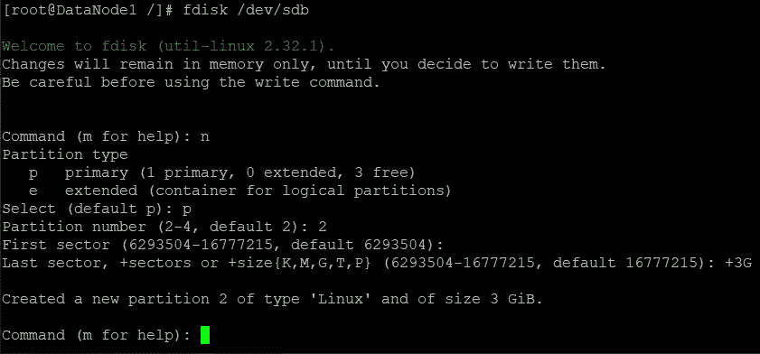

因此，我们现在有两个存储设备 sdb1 和 sdb2。

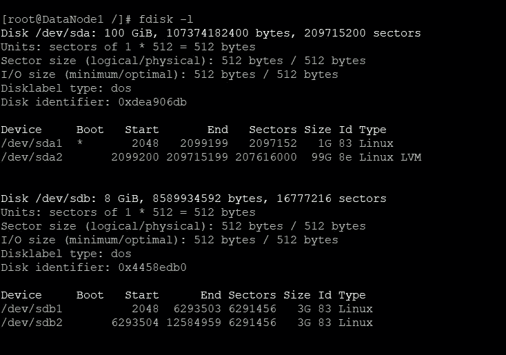

现在，使用两个设备创建物理卷(pv)。(我们也可以使用完整的/dev/sdb 设备并添加更多存储设备来创建物理卷)

```
pvcreate /dev/sdb1
pvcreate /dev/sdb2
```

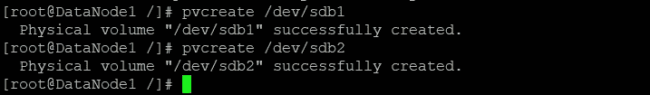

pvdisplay 命令用于查看可用的物理卷，

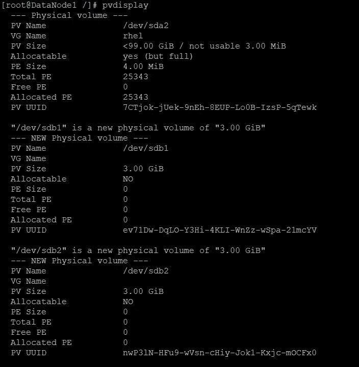

卷组是使用可用的物理卷创建的，因此我们使用前面创建的两个分区创建一个卷组(名为“mygroup”)。由于每个 pv 的大小为 3GiB，卷组的总大小变为 6 GiB。

```
vgcreate mygroup /dev/sdb1 /dev/sdb2
```

使用 vgdisplay 命令查看卷组。

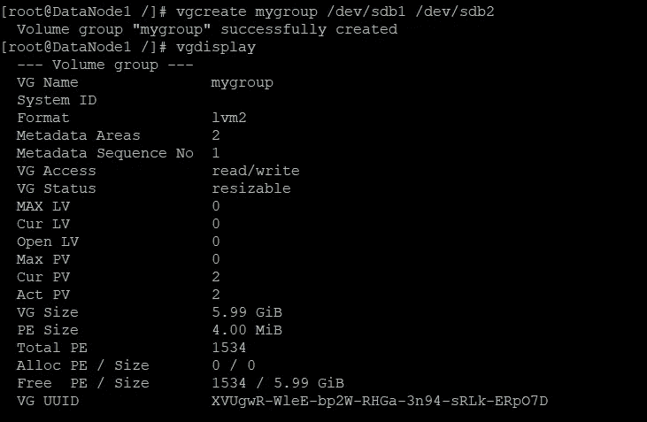

现在，我们已经创建了一个卷组，因此我们可以创建一个逻辑卷(就像一个分区)。在这里，我创建了一个大小为 2 GiB 的逻辑卷(来自“my group”VG，其中有 6 GiB 可用，因此在此之后还有 4 GiB ),并将这个 lv 命名为“mylv”。

```
lvcreate --size 2G --name mylv mygroup
```

使用 lvdisplay 命令查看所有逻辑卷，

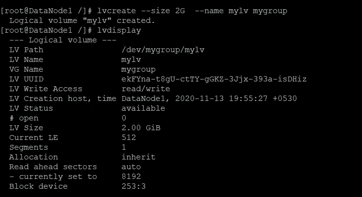

现在，当我们创建了一个逻辑卷之后，我们必须在挂载之前对其进行格式化，

```
mkfs.ext4 /dev/mygroup/mylv
```

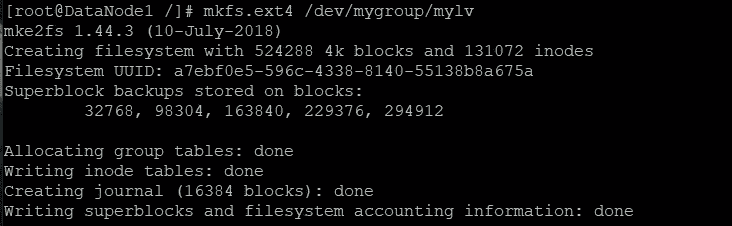

让我们将这个逻辑卷挂载到 hadoop 集群中 datanode 的共享目录(这里是/dn)，这样这个目录的大小就变成了逻辑卷的大小。

```
mount /dev/mygroup/mylv  /dn
```

之后启动 datanode 服务，

```
hadoop-daemon.sh start datanode
```

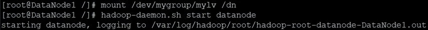

因此，如果我们检查 datanode 贡献的存储，它将大约为 2gb。

```
hadoop dfsadmin -report
```

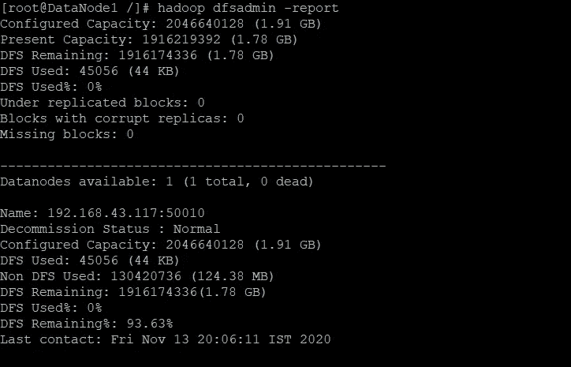

现在，我们的 datanode 正在运行，同时共享 2gb 的存储。我们将动态地将该存储增加到 4gb。意味着我们将从 vg 向这个 lv 添加更多的 2gb(显然 vg 应该有那么多空间，而 lv 只能从一个 vg 中占用空间)，

使用 lvextend 命令，

```
lvextend --size +2G /dev/mygroup/mylv
```

增加大小后，我们必须在不丢失之前的数据的情况下格式化增加的存储部分，为此使用 resize2fs 命令。

```
resize2fs /dev/mygroup/mylv
```

当我们再次检查 datanode 的存储贡献时，它现在将变为 4 GiB

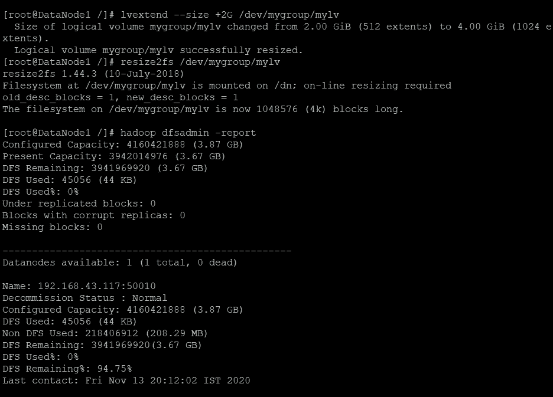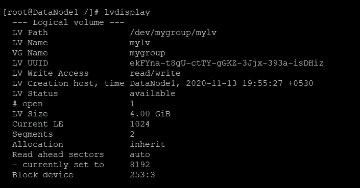

最后，我们通过将 datanode 与 LVM 的概念相集成，改变了它对 hadoop 集群的存储贡献。

## 谢谢大家！😀