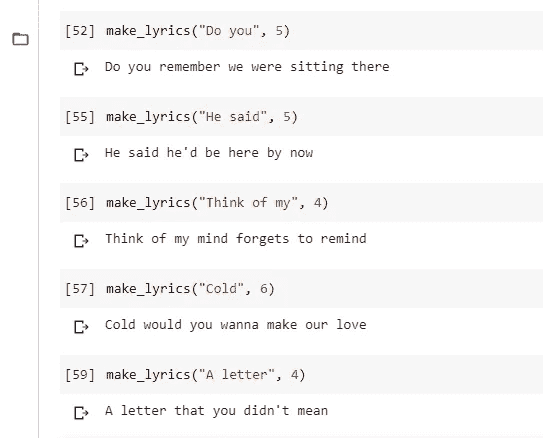
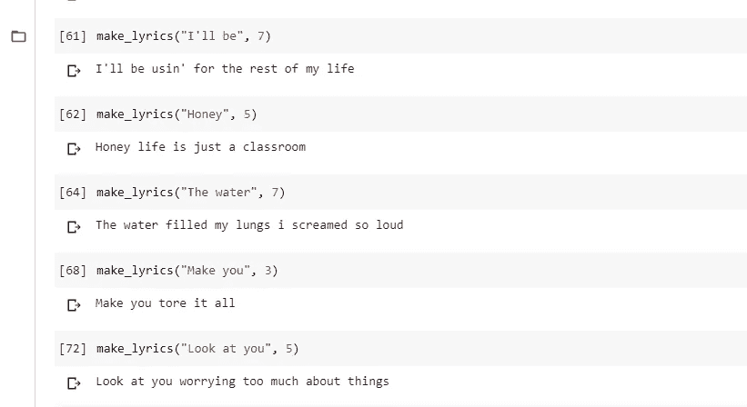
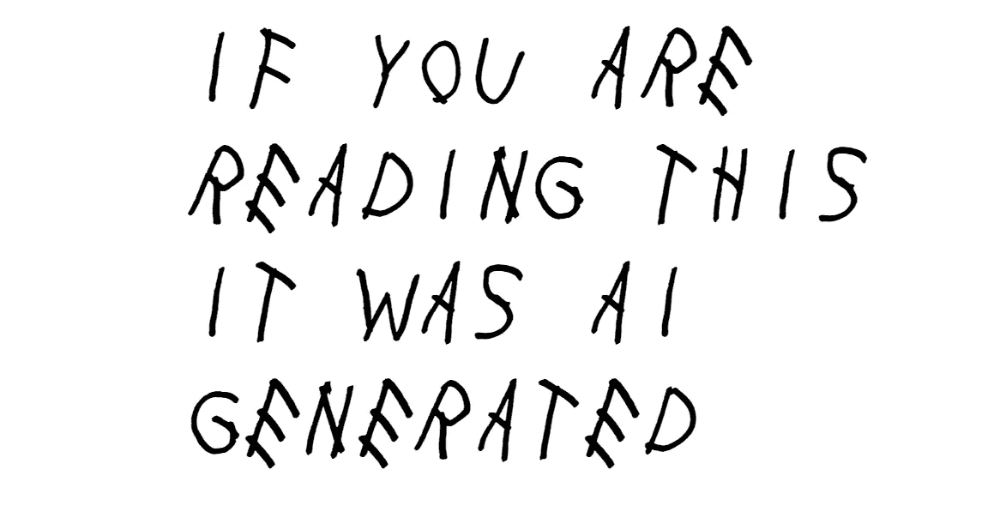

# 使用 LSTM 的歌词生成器:NLP 项目

> 原文：<https://levelup.gitconnected.com/lyrics-generation-using-lstm-5a5a0bcac4fa>

最近，我建立了一个单词预测模型，并使用该模型来生成歌词。我用来训练模型的数据包含了泰勒·斯威夫特歌曲中的歌词。我的人工智能看起来很沮丧，或者也许它只是一个心碎。结果是这样的:



这是我的模型预测的一个例子，当我给它提供一些词根的时候。

现在，我们来谈谈我是如何做到的——方法和工具。我们开始吧！



## 读取数据

我们将从一个简单的问题开始。如何读取数据？这很简单

```
data = open('../filename.txt').read()
```

您的数据可能如下所示

```
'He said the way my blue eyes shined**\r\n**Put those Georgia.......'
```

请注意“\r\n”？这些代表下一行或句子的结尾。有时，根据数据和读取数据的方式，它可能只是' \r '或' \n '。我们必须摆脱他们。

```
# Splitting the string into sentences, while converting whole data into lowercase.corpus = data.lower().split("\r\n")# To make sure no sentence appears twice in our corpus, we use set. Otherwise, it will make the model biased.corpus = list(set(corpus))
```

现在，语料库是一个包含你的数据的每个句子作为其元素的列表。因为我们使用 set，所以它没有任何重复的值。

## 组织数据

因为我们的模型只接受数字作为输入，所以我们需要将单词转换成数字。

**Tokens:** 为此，我们将使用 Tokenizer，这是 Keras 附带的一个非常有用的工具。

```
tokenizer = Tokenizer()tokenizer.fit_on_texts(corpus)total_words = len(tokenizer.word_index) + 1
```

当我们适合语料库的标记器时，我们将与语料库相关的数据存储在标记器本身中。

如果你运行 *tokenizer.word_index* ，它会返回如下结果:

```
{'you': 1,  'i': 2,  'and': 3,  'the': 4,  'to': 5,  'me': 6,  'a': 7,  'it': 8,  'in': 9,  'my': 10,  'your': 11,.......}
```

它是一个字典，其中关键字代表语料库中的所有单词，每个关键字的值是其索引。

总字数取为*len(tokenizer . word _ index)+1*。

“+1”用于为不属于我们语料库的未知单词做标记。

**输入序列:**输入序列是单词排列方式的数字表示。继续读下去就知道是什么意思了。

```
# create input sequences using list of tokensinput_sequences = []for line in corpus:
    token_list = tokenizer.texts_to_sequences([line])[0]

    for i in range(1, len(token_list)):
        n_gram_sequence = token_list[:i+1]

    input_sequences.append(n_gram_sequence)
```

我们将对此进行逆向工程，看看这是如何工作的。

当你打印 *input_sequences，*我们会得到这样的东西:

```
[[125, 45],  
 [125, 45, 901],
 [125, 45, 901, 9],  
 [125, 45, 901, 9, 10],  
 [125, 45, 901, 9, 10, 36],  
 [125, 45, 901, 9, 10, 36, 96],  
 [125, 45, 901, 9, 10, 36, 96, 11],  
 [125, 45, 901, 9, 10, 36, 96, 11, 902],
 .....
 ......]
```

这是语料库中第一句话的再现，即
*‘我背上仍有你的刀伤’。*

现在您可以检查一下，在 tokenizer.word_index 中，still 的索引是 125。所有的字都是如此。

```
>>> tokenizer.word_index["still"]
Out: 125
```

同一个句子有不同长度的输入序列。它们只是代表了模型如何学习。首先，我们输入两个单词，并教它预测第三个单词。然后，我们输入 3 个单词，并期望它预测第 4 个单词。每个句子也是如此。我们的模型就是这样运作的。

**填充序列:**在我们的语料库中，每个句子都有不同的长度。因此输入序列也将具有不同的长度。这样的输入不能输入到模型中，因为它是不平衡的。因此，我们执行填充。

```
# pad sequencesmax_sequence_len = max([len(x) for x in input_sequences])input_sequences = np.array(pad_sequences(input_sequences,
                       maxlen = max_sequence_len, padding='pre'))
```

首先我们定义，序列的最大长度是多少。然后，我们填充输入序列的每一行，使每一行中的元素数量相等。但是填充是如何工作的呢？

假设序列的最大长度是 10。但是你的序列长度只有 4。例:[125，45，901，9]。

填充后，这个序列将变成:[0，0，0，0，0，0，125，45，901，9]。

输入序列现在看起来像这样:

```
[[  0,   0,   0, ...,   0, 125,  45],        
 [  0,   0,   0, ..., 125,  45, 901],        
 [  0,   0,   0, ...,  45, 901,   9],
 ..........
 ...........
```

**预测器和标签:**我们这里解决的问题是一个有监督的学习问题。因此，我们必须为模型提供一些标签，以便它可以概括用于预测的单词和预测的单词之间的关系。

因此，我们将使用我们的输入序列，并使用所有序列的最后一个单词作为所有前面单词的标签。

> 用简单的语言来说，在句子*‘我背上还有刀疤’:* **还有**会被用来预测**有了**
> **还有**会被用来预测**有刀疤**
> **还有**会被用来预测**有**等等。

```
predictors, label = input_sequences[:,:-1],input_sequences[:,-1]
```

## 构建模型

老实说，复杂的部分做完了。现在我们只需要用 LSTM 建立一个 RNN 模型。点击这里阅读更多关于 LSTM 的信息。

```
model = Sequential()model.add(Embedding(total_words, 50, input_length=max_sequence_len-1))# Add an LSTM Layer
model.add(Bidirectional(LSTM(150, return_sequences=True))) # A dropout layer for regularisation
model.add(Dropout(0.2))# Add another LSTM Layer
model.add(LSTM(100)) model.add(Dense(total_words/2, activation='relu')) # In the last layer, the shape should be equal to the total number of words present in our corpusmodel.add(Dense(total_words, activation='softmax'))model.compile(loss='categorical_crossentropy', optimizer='adam', metrics='accuracy')  #(# Pick a loss function and an optimizer)print(model.summary())
```

现在，我们将根据预测值和标签来拟合模型。您可以改变时期，以查看准确性的变化以及模型在何处过度拟合数据。

```
history = model.fit(predictors, label, epochs= 100, verbose=1)
```

## 生成歌词

我们现在将使用我们构建的模型生成歌词。

```
def make_lyrics(seed_text, next_words):
    for _ in range(next_words):
        token_list = tokenizer.texts_to_sequences([seed_text])[0]
        token_list = pad_sequences([token_list],
                     maxlen=max_sequence_len-1,padding='pre') predicted = model.predict_classes(token_list, verbose=0) output_word = "" for word, index in tokenizer.word_index.items():
            if index == predicted:
                output_word = word
                break
        seed_text += " " + output_word
    print(seed_text)
```

上面的函数挺好理解的。
输入是“seed_text ”,然后对其进行标记和填充，使其等于序列的最大长度。然后，模型使用该种子文本来预测一个数字。该数字表示预测单词的索引。

因此，我们遍历 word_index 字典中的所有条目，找到预测的单词，并将其添加到种子单词中，以完成句子。但是这个方法预测的只有一个词。因此，我们将所有这些放入一个 for 循环中，并多次运行。你需要做的迭代次数等于你要预测的字数。

感谢阅读。我希望你喜欢我的文章，并发现它是有帮助的。如果你有任何问题或建议，请随时写在评论区。你也可以在 LinekdIn 这里跟我连线: [Ishant Juyal](https://www.linkedin.com/in/juyalishant/) 。

## 参考资料:

1.  数据集:[Kaggle.com/Taylor 雨燕歌词](https://www.kaggle.com/PromptCloudHQ/taylor-swift-song-lyrics-from-all-the-albums)
2.  视频教程:[https://youtu.be/Pe56OZ4aPds](https://youtu.be/Pe56OZ4aPds)

[](https://skilled.dev) [## 编写面试问题

### 一个完整的平台，在这里我会教你找到下一份工作所需的一切，以及…

技术开发](https://skilled.dev)