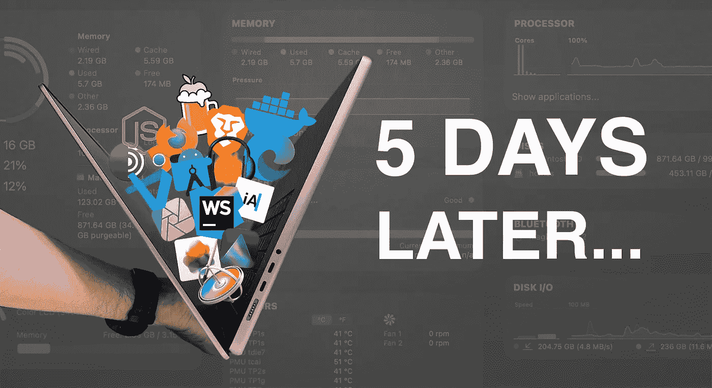
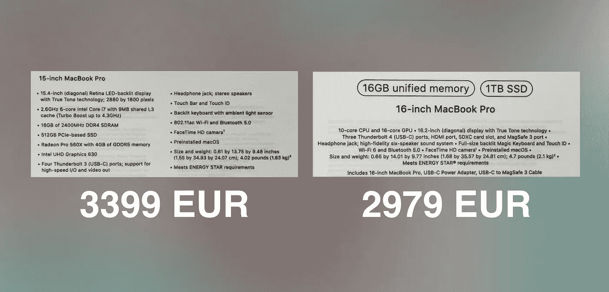
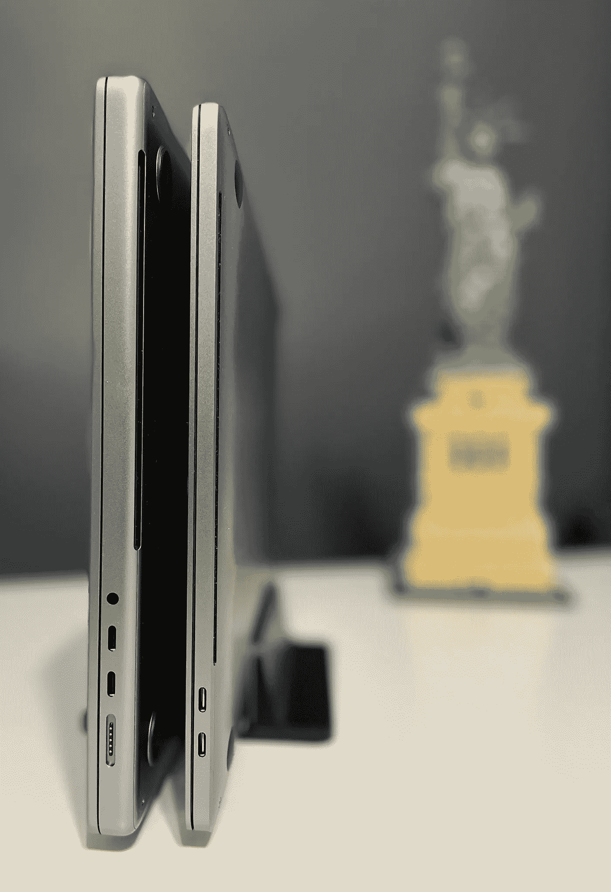
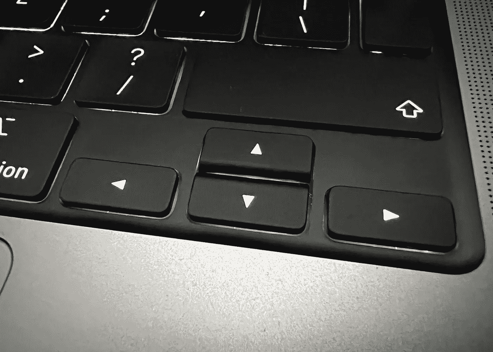
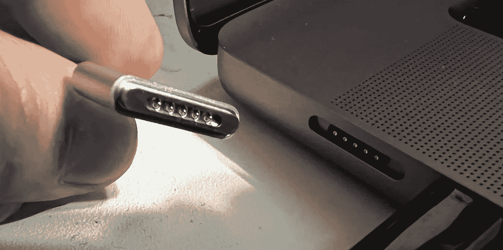
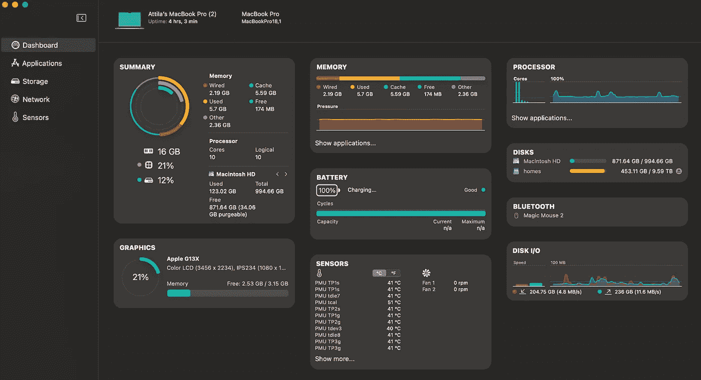
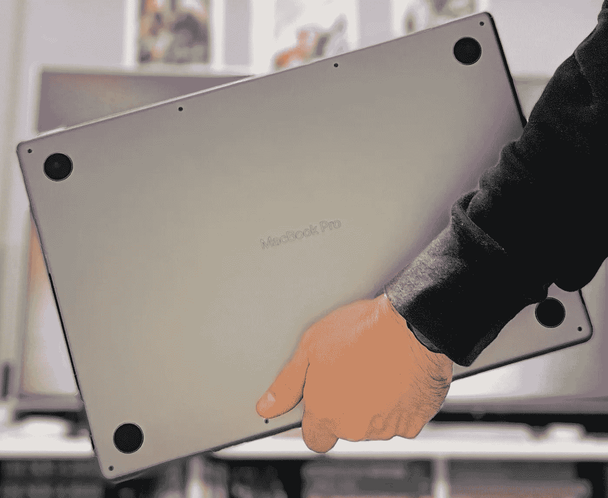

# MacBook Pro 2021 早期实践印象、开发和内容创建工作流程设置日记

> 原文：<https://levelup.gitconnected.com/macbook-pro-2021-early-hands-on-impressions-development-and-content-creation-workflow-setup-4fc8e92f3ee2>



那句话怎么说来着？*“好奇心杀死了我的钱包……”*，或者等等，是猫吗？好吧，无论如何，钱包还是猫，与我的直觉相反，作为一名软件工程师升级到新的 MacBook Pros 对大多数开发人员来说很可能是不必要的——你真的包括在内——我做了一个冲动的决定。在发布会后的第二天，我走进了离我最近的值得信赖的苹果高级经销商商店，给自己买了一台——信不信由你——实际上并不是我有史以来最贵的 MacBook Pro，在拥有 2012 年和 2018 年 Pro retinas 之后。

我完全打算在单独的文章中详细介绍我拥有的各种工作流的每一个细节，哪些工作完美无缺，哪些没有，[所以免费订阅，在它们上线的那一刻就可以在你的收件箱](https://attilavago.medium.com/subscribe)中获得它们。现在，让我们从*【痛苦】*部分开始，为这台机器付出自己辛苦赚来的钱。

# 我们有了一个良好的开端…

这已经是一个很好的继续，重温我以前对新 MacBook Pro 价格的说法。就 spec*而言，就 spec 而言(就目前而言)，虽然大多数第一印象和反应文章以及早期评论都认为价格很高，但我不敢苟同。我选择了 16 英寸、10 核、16GB 内存、1TB 固态硬盘的型号。

** 16GB 内存的英特尔与 16GB 内存的 M1 Pro 如何较量，仍有待观察。*

我很想选择 14 英寸的版本，但是——我稍后会更深入地讨论——当谈到我的一般设置时，更大的屏幕往往会赢得争论，这主要是静态的；本质上充当台式机的笔记本电脑，移动性是很少使用但偶尔需要的功能。

保留了旧的 15 英寸型号的收据和背面贴纸上有确切配置的两个盒子，很容易看到您可能会获得更多优惠。当然，每个国家的价格都不一样，但我认为大多数地方的价格差异是相似的。



左:英特尔 i7 2.6 GHz，6 核，16GB 内存，镭龙 Pro 560X，512GB 固态硬盘，2018 年 15 英寸 MacBook Pro @ 3399 欧元。右图:M1 Pro，10 核 CPU，16 核 GPU，16GB RAM，1TB SSD @ 2979 EUR。

> 从表面上看，甚至不考虑通货膨胀和芯片短缺导致的价格上涨，M1 Pro 比它的英特尔前辈更便宜。

这是很重要的一点，对于大多数人来说，包括我自己，得到一台这样的机器，是一项多年的投资。我必须承认，虽然花在电脑上的钱不是一个微不足道的数字，但 2021 年比 2018 年支付的钱少，确实让我在回家的路上有了一点活力，不管机器的重量如何。

# 矮胖，有好处…？

虽然多吃 300 克听起来不多，但这可能吗？或许没有一小桶粉色喜马拉雅盐那么重，但确实感觉比在新款 MacBook Pro 上听起来要重。当我把东西带回家的时候，我已经注意到多出来的重量。现在，公平地说，其中一些来自充电砖，它比 15 英寸 Pro 的充电器更大更重。然后是盒子，它出奇的坚固——即使对苹果来说也是如此。这款笔记本电脑并不是一款超极本。句号。



见见“劳雷尔&哈代”。左:哈迪(16 寸 MacBook Pro 2021)，右:劳雷尔(15 寸 MacBook Pro 2018)。

虽然内部规格无疑在多个方面都是超级的，但 14 英寸和 16 英寸的尺寸都不会给你一种超级书的印象。如果你的开发，或任何其他类型的工作流程需要一个苗条，娇小，零号，走秀性感的机器，这绝不是。然而，如果你喜欢前视网膜，2012 年 MacBook Pros，甚至 PowerBook G4 和 Titanium，你可能也会喜欢这一款。

我认为，对于相当一部分人来说，这一点非常重要，足以让他们最终选择最初的 13 英寸 M1，无论是 Air 还是 Pro。这不是一台我会随身携带太多的机器，在模拟器上展示一个功能时用一只手保持平衡，或者与朋友或同事一起随意浏览代码片段。就便携性而言，14 英寸和 16 英寸的 pro 都是明显的退步。当从顶部打开时，它可能看起来和以前的设计一模一样，但不要让它欺骗你，以为你会用这个在办公室里跑很多。最肯定不是 16 英寸版本。我现在真的很好奇，公司会对新机器做出什么反应。IT 部门肯定会有一些思考要做。

> 有人称之为复古时尚，我称之为矮胖。不，这不是肥胖羞辱。它是一台更厚更重的机器。结束！

## 可靠的键盘

但我只说出(主观上)坏的一面是不公平的，因为有好的一面，而且有很多好的一面。虽然表面上是冲动购买，但为新机器支付现金的一个稍微理性一点的原因是键盘。2018 年的 15 英寸 Pro 拥有臭名昭著的蝴蝶开关键盘。就我而言，在它的三年生命中，我从未遇到过任何问题，但我也不想走到我遇到的那一步。

> 我写了很多东西，也写了很多代码，所以坚固的键盘对我的日常驾驶来说是必不可少的。新的 MacBook Pro 有一个经过验证的记录。

虽然没有 touch-bar，这让我很恼火，但与许多人不同，我发现它很有用。然而，我承认，在头两天，我已经能够回到一个没有触摸条的世界。



是只有我，还是左/右箭头键上方的空白没有意义？

最后一点要注意的是键盘上的方向键。我知道上/下键是半键，但为什么苹果公司决定保留左/右键作为半键，而明明有全键的空间，我不明白。我发现我的手指想要按下空白的地方，当你输入很多的时候，这不是很好。

## 有史以来最好的保险箱？

起初我以为是我在胡思乱想，但斯内兹实验室也证实了这一点。2021 款 MacBook Pro 上的新 MagSafe 强到疯狂。试图以水平运动的方式拔出电缆将需要很大的努力，事实上，我不鼓励这样做，因为重复这样做可能最终会撕裂电源线。现在，你可能会认为这否定了返回 MagSafe 的意义，但你会很高兴地听到，电缆的真正意外去耦(例如电线跳闸)仍然很容易，因为这是在成角度的运动中发生的，我也建议有意移除。我大胆猜测，这是有史以来最强大和最安全的 MagSafe，同时保留了纤薄的设计。



一个漂亮，纤薄，但功能强大的新 MagSafe 连接器。

# 软件开发设置

我很想买 14 英寸的。与普遍的看法相反，大小并不总是重要的，然而在这种情况下，我不得不务实，因为它很重要。web 和 Flutter 开发都需要屏幕空间，我知道我自己，我总是为只有一个屏幕而挣扎，所以当我减少到只有一个屏幕时，它可能是尽可能大的——所以是 16 英寸。

来自 13 英寸 M1，我不希望在设置我的机器进行软件开发时出现任何大的问题，但很好地确认了大多数应用程序原生支持 M1 和 M1 Pro/Max ARM 架构，有些至少添加了 Rosetta2 支持。

## 本机和 web

Xcode 当然没有问题，而且在 M1 Pro 上下载和安装速度惊人——大约 40 分钟。在我以前所有的机器上，这需要一个多小时。虽然我还没有做太多的原生苹果开发，但它是对 Flutter 的依赖。在 13 英寸的 M1 上，我默认使用 VS 代码来构建 Flutter 应用程序，而在这里，[我下载并安装了据称是 M1 特有版本的 Android Studio](https://developer.android.com/studio/#downloads) 。还有待观察它有多快，但在设置过程中没有大的问题。

我安装了 VS 代码的苹果芯片版[,正如人们所料，它会立即打开。说到 M1 本地应用，当然](https://code.visualstudio.com/docs/?dv=darwinarm64) [WebStorm](https://www.jetbrains.com/webstorm/download/download-thanks.html?platform=macM1) 是另一个我非常喜欢的应用，实际上是我主要的 web 开发 IDE。这以前也从来不是问题，但是很高兴看到[节点](https://nodejs.org/en/download/)仍然可以毫不费力地安装，并且原生支持苹果芯片，现在[自制软件](https://brew.sh)也可以了！当然，我喜欢我的终端有一些风格，所以补充说[哦，我的 Zsh！](https://ohmyz.sh/#install)为好。最后，为了配合 web 开发，我添加了 [Yarn](https://yarnpkg.com/getting-started/install) ，同样没有任何问题；因为没有大量的浏览器，人们无法可靠地测试网络应用和网站，所以我把它们都放在那里只是为了更好地衡量。


所有的浏览器！从左到右:Safari，Chrome，Edge，Brave，Firefox 开发者版，Tor 浏览器，Firefox。

这里需要注意的是，唯一不支持 M1 处理器的浏览器是 Tor 浏览器。

## 颤动和飞镖

虽然设置起来或多或少很容易，但它还不支持苹果基于 ARM 的架构，所以 Rosetta2 是必须的。使用以下命令启动安装程序:

```
sudo softwareupdate --install-rosetta --agree-to-license
```

除此之外，和通常的添加扑扑到路径瞎忙活，这是由于卡特琳娜岛的变化，我认为，一切都感觉一帆风顺。

对于 Flutter 和 web 开发，我稍后将带着更深入的文章回来，因为我运行并测试了我现有的两个项目，一个 Next.js web 应用程序，以及一个为 iOS 和 Android 构建的 Flutter 应用程序，这两个应用程序都计划在 1 月初上线，所以[如果你有兴趣在你的下一台 M1 机器上运行类似的项目](https://attilavago.medium.com/subscribe)，让我们保持联系。

# 设置内容创建

在整个开发的设置过程中，我感觉我在用一台非常时髦的机器工作，所以当我在做的时候，我想我也可以为内容创建设置好一切，也就是写作和视频动画。有趣的事实是，我在苹果音乐上听格伦·汉塞德的“狂野不羁”时，正在写这篇关于新 M1 Pro 的文章。

[](https://music.apple.com/ie/album/this-wild-willing/1485074325) [## 格伦·汉塞德的《野性的意志》

### 在 Apple Music 上听听格伦·汉塞德的这首 Wild Willing。流歌曲包括“我会是你，是我”，“不要定居”…

music.apple.com](https://music.apple.com/ie/album/this-wild-willing/1485074325) 

我也有黑胶唱片，但我需要一个借口来测试苹果似乎引以为豪的*“六扬声器音响系统”*。音乐在很多方面激励着我，所以每当声音被作为卖点时，我都有兴趣去尝试一下。不是作为一个音响发烧友。哦不！对我来说，更多的是我能感受到多少音乐。我不得不承认，在 15 英寸和新的 16 英寸 MacBook Pro 上听[傻瓜游戏](https://music.apple.com/ie/album/fools-game/1485074325?i=1485074329)，差异是显而易见的。更深的低音，更丰富的声音，和更多的声场。如果音乐对你的发展或内容创作工作流是必要的，你会发现这些很有吸引力。它们真的像苹果营销的那样虚无缥缈吗？号码

> 两个或六个扬声器，它们不会取代你现有的音响系统。但他们听起来不错，我会给他们。

不过，我确实觉得我的 Bose SoundTouch 10 会被打开得更少，所以我可能会在日常工作流程中少用一个电子设备来拯救地球。随着能源价格的上涨，我甚至可以省下一两分钱。

在内容创作方面，我不是 SnazzyLabs、iJustine 或 MKBHD，但从 2019 年开始，我确实开始更多地关注我的写作，并在 2021 年开始关注视频内容创作，形式是关于无障碍的 2D 动画短视频。我不需要很多工具，但我需要的工具，我需要工作得很好。事实证明我很幸运。

对于动画， **Apple Motion 5** 是我的首选应用。现在，这一直受到苹果 ARM 架构的良好支持，但在 13 英寸 M1 上，我的一个项目设法让它嘎然而止。在拿到 M1 Pro 的一个小时内，我下载了 Motion 5 并打开了同一个项目。令我欣慰的是，在 M1 Pro 上，它运行得非常流畅。我很确定这不是 CPU 的问题，而是内存的问题，比如 13 英寸的[“我只有 8GB，这有很大的不同](/twelve-months-into-using-apples-m1-chip-and-my-opinions-have-changed-1831e77d657e)。iStatistica Pro 也证明了我的猜测，尽管更多的测试和真实生活场景肯定会提供更多无可辩驳的证据。



iStatistica 的统计数据很有趣，当你启动更多 GPU 密集型应用程序如 Motion 5 时，RAM 容量会重新安排，并优先考虑这些应用程序，而不是其他应用程序，这些应用程序可能会进入交换空间。

除了 Motion 5，我还做了一些照片编辑，为此我使用了 **Affinity Photo** 、 **Pixelmator Pro** 和 **Luminar AI** 。零问题，完全支持 M1 M1 Pro/Max 架构。后两者的安装速度非常快——我说的是仅仅几秒钟——而 Affinity Photo，不管出于什么原因，总是花时间安装。


从左至右:Apple Motion 5、Pixelmator Pro、Luminar AI、Affinity Photo

作为撰写这篇评论的一部分，我还使用了 **Pixelmator** ，表现非常出色，对 CPU 温度几乎没有影响。在这一点上，是的，我还没有听到球迷加油。公平地说，我在 13 英寸的 M1 上已经习惯了，但是，看到一个更强大的版本，冰冷如冰，死寂无声，仍然让我感到惊讶。

对于写作，我真的只使用两个应用程序:iA Writer 和标记为 2 的应用程序，我想我是相当保守的。就像照片编辑应用程序一样，安装或运行它们没有问题。全方位的流畅体验。


从左至右:iA 书写者和标记 2

我的视频脚本实际上是用苹果笔记写的，嗯，作为一个原生的苹果应用程序，它完美地工作并不奇怪。

# 我很乐观…

虽然还没有被说服。最终，虽然在我的上一篇文章中，我成功说服自己不要升级到新型号，但除了我贪得无厌的好奇心之外，还有一些原因让我不管不顾地尝试一下。其中之一就是淘汰一台带有蝶形开关键盘的机器。此外，不知道 M1 Pro 上的 16GB 是否真的相当于英特尔 CPU 的 16GB，这让我很困扰，我觉得正确理解这些机器性能的唯一方法是实际使用它们一段时间。最后是设计。不是因为它很棒——因为我真的不认为它很棒——而是因为它不会在明年或后年改变。

> 如果我们想要额外的端口，明显更好的对比度屏幕，惊人的电池寿命和额外的马力，我们现在就只能使用这些又胖又重的机器。

在这种情况下，今年或明年得到它对我来说真的没有任何区别。如果没有其他好处的话，在接下来的 12 个月里，我可以和那些需要一个公正观点的人分享我的经验和发现。我是否还会保留我的 15 英寸智能手机，还没有定论。我的一半想为后代保留它，如果没有别的原因，也许在 30 年后以某个疯狂的价格拍卖掉。我也可以现在卖掉它，得到大约 700 欧元。时间会告诉我该走哪条路。

> 现在，我要说的是:这是一台笨重的机器，但除此之外，到目前为止，一切顺利。希望这是唯一的交换。

当我把我的项目移到它上面时，让我们看看这个故事将会怎样。我会保持乐观吗？留下来寻找答案。



阿提拉·瓦戈——*高级软件工程师打造令人惊叹的 ed-tech 软件。永远的酷呆子，代码和博客的作者。网络无障碍倡导者，乐高迷，黑胶唱片收藏家。喜欢精酿啤酒！*