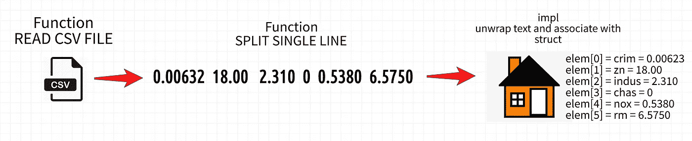

# 机器学习与 Rust(第二部分):线性回归

> 原文：<https://levelup.gitconnected.com/machine-learning-and-rust-part-2-linear-regression-d3b820ed28f9>

在本教程中:如何在 Rust 中读取 csv 文件？如何实现线性回归？让我们亲自动手，了解更多关于`rusty_machine`的知识。


图片来自 [Unsplash](https://unsplash.com/photos/uGGy672VX1E) 作者 [Clark Van Der Beken](https://unsplash.com/@snapsbyclark)

[](https://medium.com/@stefanobosisio1/membership) [## 通过我的推荐链接加入 Medium-Stefano Bosisio

### 作为一个媒体会员，你的会员费的一部分会给你阅读的作家，你可以完全接触到每一个故事…

medium.com](https://medium.com/@stefanobosisio1/membership) 

欢迎来到第一个学习 Rust 并将这种奇妙的编程语言应用于机器学习的教程。

*   在这里你可以找到关于 Rus 的简介
*   参考 Github repo for today 教程在这里:h[ttps://Github . com/ste boss/ML _ and _ Rust/tree/master/tutorial _ 1](https://github.com/Steboss/ML_and_Rust/tree/master/tutorial_1)
*   今天我们将处理[线性回归](https://en.wikipedia.org/wiki/Linear_regression)和著名的[波士顿住房数据集](https://www.cs.toronto.edu/~delve/data/boston/bostonDetail.html)。
*   为了测试 Rust online 的功能，我可以向你推荐这个神奇的应用程序[https://play.rust-lang.org](https://play.rust-lang.org)。

本教程结束时，您将学到什么？

*   如何在 Rust 中使用自定义函数读取 csv 文件
*   如何编写一个 Rust 代码来处理数据，定义训练和测试分割以及创建向量和矩阵
*   熟悉我们的第一个 ML Rust 包:`rusty_machine`

请继续关注下一次冒险，我们将使用`smartcore`扩展本教程——另一个强大的 ML Rust 包

## 线性回归:是什么？

从流行病学到金融和天文学，线性回归是一种广泛使用的模型。线性回归理论指的是广义线性模型族(GLM)。如果你想深入了解下面的数学知识，就看看这个关于 GLM 的介绍吧。GLM 的主要目的是拟合输入数据点，这些数据点遵循准正态分布并呈现方差恒常性。给定这些假设，我们可以创建一个模型，通过最大化对数似然来预测给定一些初始条件下的新数据点。这就把我们带到了线性回归模型，它用线性拟合正负系统误差来拟合给定的分布。

## CSV 阅读器:学习如何在 Rust 中处理 CSV 文件

现在我们知道了模型，我们可以开始看看如何处理输入数据:[https://github . com/ste boss/ml _ and _ rust/tree/master/regression/datasets](https://github.com/Steboss/ML_and_Rust/tree/master/tutorial_1/regression/datasets)

和往常一样，首先要做的是用`cargo`创建一个新的包:

```
cargo new read_csv
```

在`src`文件夹中，我们可以将`main.rs`重命名为`reader.rs`，这样我们*将使用这个包作为回归代码*的外部库。为了创建这个库，我们将创建主要的 Rust 代码来解析和读取 csv 文件，然后，我们将设置`Cargo.toml`文件。

要将 csv 文件解析成 Rust，我们可以遵循图 1



图 1:用 Rust 解析输入 csv 文件的步骤。首先创建一个函数来读取 csv 文件，然后将每一行拆分成元素，最后创建一个结构的实现来将每个元素与特定的结构组件相关联。

我们要写的第一个函数是`read_housing_csv`，在这里输入 csv 将被读取。此函数的声明定义了函数的名称、文件的路径类型和返回类型:

所以函数是可见的，`pub`是函数`fn`，输入是来自导入`use std::path::Path;`的路径`impl AsRef<Path>`，返回一个矢量`HousingDataset`。此函数的核心在第 95–98 行之间，我们将在此处理所有文件行并将其映射出来:

每一行都由函数`read_single_line`处理，该函数创建一个类型为`HousingDataset`的新向量。`HousingDataset`类型的实现完成了解析输入文件值的粗略工作。首先，我们将定义一个函数来展开每一行(30–34):

*这是一个很好的例子来理解如何在 Rust 中换行并使用命令* `map`。基本上，我们取字符串的输入向量`v`，用`iter()`遍历每个元素，然后定义一个`map`。`map`将由`|`分隔的变量作为输入，该变量对给定向量的每个元素执行操作，在本例中`parse().unwrap().`如果您熟悉 Python，这就像`lambda(x: do something)`最后，必须收集所有结果，所以我们添加了`.collect()`——就像在 PySpark 中一样。

一旦这些元素被解析，我们就可以将每个 vector 元素与结构`pub struct HousingDataset`(第 8 行)关联起来。正如[第 52–74 行](/machine-learning-and-rust-part-1-getting-started-745885771bc2#L52)允许理解如何创建一个简单向量以及如何在 Rust 中处理简单函数。

现在让我们建立`Cargo.toml`文件。*在这个文件中，我们必须定义所有的依赖关系和代码功能*。在这种情况下，我添加了依赖关系`serde`和`serde_derive`，以允许代码的序列化——我们会回来讨论这一点，但你可能已经注意到在`reader.rs`代码中有类似于`[derive(Debug)].`的东西。最后，我们将使用`read_csv`作为主线性回归函数的外部库。因此，我们必须将`[lib]`关键字添加到`toml`文件中:

这里我们定义了这个库的名字，它将在后面被用来调用函数，以及代码的路径。这意味着在我们的主代码中，我们将把这个函数作为`read_csv::read_housing_csv`导入，其中`read_csv`是库名，`read_housing_csv`是读取`csv`文件的主函数。

## rusty_machine 线性回归

和以前一样，首先我们可以创建一个新的`cargo`包:

```
cargo new rust-regression
```

这里我们将使用`rusty_machine`实现线性回归。虽然名字听起来不怎么样，`rusty_machine`是 Rust 的 ML 包，已经实现了很多算法，随时可以使用。既然我们要使用外部库，那么第一个问题就是:我们在 Rust 中从哪里检索外部库？以及我们如何安装它们？

任何在 Rust 的库都被称为*板条箱。在这里，你可以找到一个特定包装所需的所有板条箱。例如，我们可以搜索`rusty-machine`:*


图 2: crates.io 允许我们查找特定包装所需的所有板条箱。在本例中，我们要寻找生锈的机器

点击`rusty-machine`,您将被提示进入一个页面，其中包含关于该软件包的所有详细信息，以及“安装”程序:


图 3:对于每个板条箱，只需复制 Cargo.toml 文件中的安装说明

正如你所看到的，要安装这个包，你只需要把`rusty-machine = "0.5.4"`复制到你的 Cargo.toml！瞧

此外，在 Cargo.toml 中，我们可以将依赖项添加到已创建的`read_csv`库中。这非常简单，正如您在我们最终的 Cargo.toml 文件中看到的，我们只需要使用一个相对文件路径:

现在让我们实现线性回归。在`src`目录下创建一个名为`linear_regression.rs`的新文件。首先，我们需要导入所有相关的`rusty_machine`函数，以及我们的`read_csv`库:

如你所见，与 Python 不同，`rusty_machine`需要特定的类型来定义一个`Matrix`和一个`Vector`。此外，在`rusty_machine`中，当我们导入`rusty_machine::learning__lin_reg::LinRegressor` [时，我们将导入一个线性回归结构](https://docs.rs/rusty-machine/0.3.2/i686-pc-windows-gnu/rusty_machine/learning/lin_reg/struct.LinRegressor.html)，它的唯一方法是`train_with_optimization`。为了拥有线性回归的全部功能，我们需要导入相应的特征— [你还记得特征吗？你能看出它们现在有多重要吗？](/machine-learning-and-rust-part-1-getting-started-745885771bc2) —这将使我们使用`train`和`predict`功能。为此，我们需要导入:`use rusty_machine::learning::SupModel;` [，它实现了模型`struct`的特征](https://docs.rs/rusty-machine/0.2.0/rusty_machine/learning/trait.SupModel.html)。最后，值得一提的是`rusty_machine`几乎没有已经编码好的度量，因此我们正在计算与`neg_mean_squared_error`的线性回归拟合度(此处的[用于参考](https://athemathmo.github.io/rusty-machine/doc/rusty_machine/analysis/score/fn.neg_mean_squared_error.html))。

第二步是实现预处理部分。我们将在接下来的教程中讨论预处理技术，现在让我们熟悉如何读取输入文件并在训练集和测试集中拆分数据:

我们需要记住几个要点:

*   正如您所看到的，输入数据向量具有属性`split_at`,这对于拆分数组非常方便
*   从输入数据向量，我们通过平面映射出训练变量和映射出目标变量来创建向量`x_train, y_train, x_test, y_test`
*   `rusty_machine`想要自己的数据类型，因此我们需要将`x_train, y_train, x_test, y_test`转换成`rusty_machine::Matrix`和`rusty_machine::Vector`。这有时可能会很乏味

最后，让我们实现模型，进行预测并检索`mse`指标:

*注意这里的所有权概念，我们通过引用传递我们的输入变量*。然后，如上所述，我们必须将我们的预测和`y_test`向量转换成矩阵格式，以供`neg_mean_squared_error`读取这是`rusty_machine`想要的，例如，这是与 Python 的显著区别。

将一切变为现实的最后一步是为我们的代码创建主`main.rs`。由于这个任务相对容易，我们只需要导入线性回归模块并运行它。就像这样简单:

由于`main.rs`和`linear_regression.rs`位于同一个文件夹中，我们可以用`mod`将代码作为一个模块导入

## 准备，稳定，开始:运行您的第一个 ML RUST 代码！

现在我们已经为运行代码做好了一切准备。首先进入你的`rust-regression`文件夹，输入`cargo run`。这将运行`cargo`，读取 Cargo.toml 并安装依赖项和编译我们的代码。如果一切顺利，您应该会看到一个`Cargo.lock`文件，它用 Java 记住了我的一个`pom.xml`文件和所有已安装的依赖项，以及没有编译代码的`target`文件夹。此外,`cargo run`将运行我们的`main.rs`,您将看到类似如下的最终输出结果:


如果你足够高兴，你可以用`cargo build`构建整个包，它将对我们的代码运行进一步的优化，瞧！

你的第一个 ML Rust 代码完成了:)🎊🎊🎊

暂时就这些吧！看起来不是很多，但是你学会 Rust，申请 ML，已经是很了不起的进步了！

请随时给我发电子邮件询问问题或评论，地址:stefanobosisio1@gmail.com

或者，你可以在 Instagram 上联系我:[https://www.instagram.com/a_pic_of_science/](https://www.instagram.com/a_pic_of_science/)