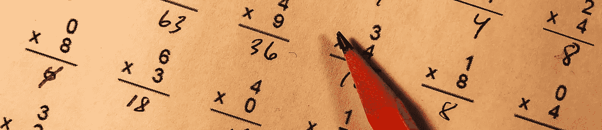
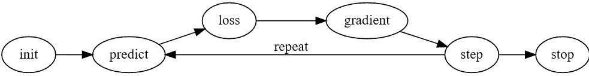
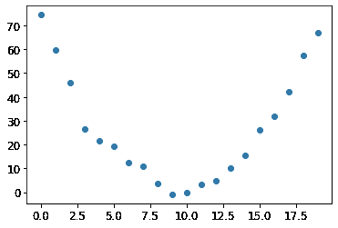
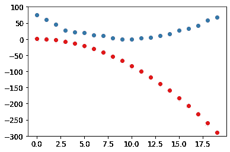
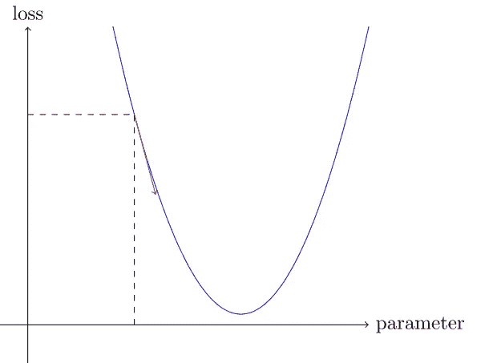
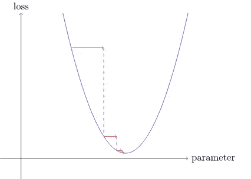

# 用高中数学解释机器学习

> 原文：<https://levelup.gitconnected.com/machine-learning-explained-with-high-school-math-254f4f0dce02>



克里斯·利维拉尼在 [Unsplash](https://unsplash.com/collections/10610004/simple-math?utm_source=unsplash&utm_medium=referral&utm_content=creditCopyText) 上的照片

## 对于这篇文章，你需要知道什么

1.  高中数学
2.  Python 知识
3.  均方误差
4.  PyTorch(实际上不多，将在本文中解释代码)
5.  二次函数的行为(即 x 的系数如何影响函数的凹度)

## 这篇文章是给你的吗？

本文是“落后一步”系列的第二篇。如果你对机器学习有最低限度的先验知识，阅读[的第一篇文章](https://medium.com/mlearning-ai/gradient-descent-4fda4e3fbdc0)将有助于理解这一点。在这篇文章中，我将讨论机器如何使用高中数学进行学习。如果你对机器学习背后的场景感兴趣，那么这篇文章可能适合你。先前训练 ML 模型的经验将对理解这篇文章有很大帮助，即使你只是阅读了别人的代码并毫无头绪地运行它。

## 为什么学习 ML 令人生畏，为什么不应该如此

机器学习领域无疑是有趣的；然而，ML 中花哨词汇的数量令人望而生畏。事实上，许多行话实际上只是高中数学隐藏在花哨的词汇后面。

当我刚开始学习 ML 时，这对我来说是个问题。术语包装的简单概念通常会让我陷入困境，因为我仍然需要搜索并试图理解它们。在我以前学习 ML 的几种方式中，目前为止最有效的是 FAST AI 的在线课程。它使用自上而下的方法，但在这样做的时候，他们不会用花哨的词语来吓唬你，因为他们会抽象地告诉你这些结果，而你不必担心落后于课程。

## 本文的内容

在本文中，我们将看到机器如何学习像循环这样简单的概念。

## **启动前的提示**

如果你跟着做，你的学习体验会更好。这里是下面提到的代码的 [colab 笔记本](https://colab.research.google.com/drive/1fr-hhP2tFpn6ENBBqk8AafyNgBsB86Ub?usp=sharing)。

https://colab . research . Google . com/drive/1fr-HHP 2 tfpn 6 enbbqk 8 aafyngbsb 86 ub？usp =共享

**注意**:运行笔记本的第一个电池需要一段时间。输入为您生成的授权码，将其安装到您的驱动器上。

# 我们开始吧

> 假设我们安排一些自动方法来测试任何当前权重分配在实际性能方面的有效性，并提供一种机制来改变权重分配以最大化性能。我们不需要研究这样一个过程的细节，就可以看出它是完全自动化的，并且看出这样编程的机器会从它的经验中“学习”。
> 
> 亚瑟·塞缪尔

上面亚瑟·塞缪尔的引用告诉了我们机器学习的本质。我们今天的目标是理解上面的这句话。



截图来自[https://course.fast.ai/videos/?lesson=4](https://course.fast.ai/videos/?lesson=4)

该图像是报价的图形表示。

**问题**:我们想要找到一个函数，它会给出我们在某个时间点上过山车的速度。

**给定:**我们得到了一个骑手用速度计捕捉到的数据。



图片来自:[https://course.fast.ai/videos/?lesson=3](https://course.fast.ai/videos/?lesson=3)

上面是时间与速度的图表，代表了骑手在他的骑行中的几个点上获得的数据。

**样本解读:**2.6 秒时，过山车以每秒 25 米的速度行驶。

看着它，我们可以推断出它可以用一个二次函数来建模。也就是说，我们想要创建一个与上面的函数非常相似的二次函数。(创建二次函数并不意味着我们画出它，而是获得它的实际数值)

## **python 中的二次函数**

首先我们想用 python 做一个二次函数。这是回忆高中课程的好时机，尤其是函数。我们知道，一个二次函数看起来是这样构造的: *f(x) = ax + bx + c.* 对比一下下面的 python 函数。

> def f(t，params):
> a，b，c = params
> 返回 a*(t**2) + (b*t) + c

也许你已经开始看到他们之间的相似之处。是的，它们本质上是一样的。唯一的区别是 x 被 t 代替了，这并不重要，因为它们只是变量。我们在这里使用 *t* 是因为使用 *t* 来表示时间更符合逻辑。

## 知道我们有多正确或多错误

> 定义均方误差(预测值、目标值):
> 
> return((预测-目标)**2)。平均值()。sqrt()

为了确定我们离正确答案有多近，我们将使用**均方误差(MSE)** 。上面的函数将接收上面的二次函数的输出，并将其与骑车人从速度计获得的实际值进行比较。

# 亚瑟·塞缪尔描述的第一步:初始化

> params = torch.randn(3)。requires_grad_()

为了更容易理解上面的代码是如何工作的，我将对它进行分解。

**torch.randn(3)** —返回 3 个随机数，将成为我们的 a，b，c ( **供参考** : *f(x) = ax + bx + c)*

**requires_grad()** —将允许 PyTorch(我们正在使用的库)计算梯度(稍后您会明白为什么)

好吧，太好了！我们现在完成了第一步。我们现在有一个随机二次函数。这可能不太符合给定的数据，但至少我们已经有所进展。

# **第二步:预测**

> preds = f(时间，参数)

*时间*这里是一串数字。

在二次函数中拟合*时间*的值， *f()的输出就是预测。*

**注意** : *preds* 这里是秩 1 张量(一维数组)，里面有几个值。

至此，您可能开始意识到预测模型与函数非常相似。嗯，实际上它只是一个函数。你给它一个 x 值，在这种情况下是时间，然后它会给你相应的 x 的 y 值。从这个意义上说，建模只是找到正确的参数，使这个函数能够有一个正确的 y 值/预测。

下图显示了我们的功能(红点)的**结果与**实际结果**(蓝点)的对比**

**注**:由于功能是随机启动的，可能会有一些差异。



图片来自:[https://course.fast.ai/videos/?lesson=3](https://course.fast.ai/videos/?lesson=3)

# **第三步:计算损失**

是的，我们知道我们的预测是错误的，但我们知道它们有多错吗？这是我们之前定义的均方误差。

> 定义均方误差(预测值、目标值):
> 
> return((预测-目标)**2)。平均值()。sqrt()

称之为

> 损失= mse(预测值，速度)

我们的目标是尽量减少损失。随着我们的函数开始更加符合数据，它们之间的差异也将开始减少，因此随着我们变得更加精确，损耗也将开始减少。

# **第四步:计算梯度**

又来了一个高中数学概念。梯度对你来说可能有点抽象，因为你可能只记得:

*f(x) = x*

*f'(x) = 2x*

换句话说，梯度就是一个函数的斜率(上升超过下降)。在线性函数中，你可以很容易地得到它，因为斜率总是恒定的，但是在二次函数中，斜率经常是变化的。这就是我们在 x 的导数/梯度中有变量的原因，随着 x 值的变化，斜率也随之变化。

也就是说，下一步是计算参数的梯度。

> loss.backward()
> 
> 帕拉姆斯·格拉德

参数的梯度是令人困惑的。简单来说，上面这段代码会告诉你参数的变化如何影响损耗的变化。



截图来自:[https://course.fast.ai/videos/?lesson=3](https://course.fast.ai/videos/?lesson=3)

有了这个，我们现在知道我们可以从哪个方向改变参数(x 轴)以减少损耗(y 轴)

**注:**上图和红点蓝点的不一样。这个代表我们的损失和参数之间的关系，而上面的一个给出了实际数据点和预测数据点之间的比较。

# **第五步:改变权重**

看看这一节的标题，你可能会开始奇怪为什么“重量”这个词会突然出现。这是告诉你权重是模型的参数的好时机。这些是您放入模型参数中的值。

例如:

*f(x) = ax + bx + c*

*这里 a* 、 *b* 、 *c* 是模型的参数。

*f(x) = 2x + 3x + 4*

2、3 和 4 是模型的权重。

希望澄清权重和参数。

**下面是更新权重的代码:**

> lr = 1e-5
> 
> 参数数据-= lr *参数数据
> 
> params.grad =无

让我们一个一个来看。

> **lr = 1e-5**

lr 指的是模型的学习率，在这种情况下，学习率从 1 提高到-5。从我们之前计算的梯度，我们知道哪个方向，方向有多陡。



截图来自:[https://course.fast.ai/videos/?lesson=3](https://course.fast.ai/videos/?lesson=3)

学习率越大，我们在 x 轴上的步长就越大，这将使它学习得更快，但它也可能具有相反的效果，因为它将采取太大的步长，这将使它错过具有最小损失值的点。另一方面，小的学习率将使其更准确，因为它将采取更多的步骤，这意味着它错过最小损失值的机会更小；然而，这将需要较长的时间来执行。

在了解了整个过程之后，你可以尝试不同的学习速率，但是现在我们只使用 1 提高到-5。

> **参数数据-= lr *参数分类数据**

有了学习率和梯度，我们就可以开始改变参数值，以更接近我们的目标，即具有更低的损失值。为了在调整参数时不影响我们的渐变，我们添加了 *.data.* ，因为我们之前声明了。*要求 _grad()* ]我们希望 PyTorch 记住对参数所做的操作，以了解梯度，调整这些参数也将包括在操作记录中。我们不想这样，因为我们唯一需要梯度的时候是在预测阶段。

> **params.grad = None**

这一步只是删除梯度，为下一个预测中的下一个梯度留出空间。

# **让我们回到步骤 2:预测和步骤 3:计算损失**

现在我们已经改变了模型的权重，我们可以检查损失是否降低了。

再次运行步骤 2 和 3 中的代码:

**预测**

> preds = f(时间，参数)

**查找损失**

> 损失= mse(预测值，速度)
> 
> 失败

我的损失从 143.6154 降到了 143.3416

**让我们编译它们，这样我们可以使用 for 循环多次运行它们**

> 定义学习():
> 
> preds = f(时间，参数)
> 
> 损失= mse(预测值，速度)
> 
> loss.backward()
> 
> 参数数据-= lr *参数数据
> 
> params.grad =无
> 
> print("loss: " + loss[0])

**在 for 循环中运行它**

> 对于范围(10)内的 I:
> 
> 学习()

**下面是我输的结果:**

```
tensor(142.2465, grad_fn=<SqrtBackward>)
tensor(141.9728, grad_fn=<SqrtBackward>)
tensor(141.6992, grad_fn=<SqrtBackward>)
tensor(141.4256, grad_fn=<SqrtBackward>)
tensor(141.1520, grad_fn=<SqrtBackward>)
tensor(140.8785, grad_fn=<SqrtBackward>)
tensor(140.6050, grad_fn=<SqrtBackward>)
tensor(140.3315, grad_fn=<SqrtBackward>)
tensor(140.0581, grad_fn=<SqrtBackward>)
tensor(139.7847, grad_fn=<SqrtBackward>)
```

# 第七步:停止

**经过近千个循环:**

```
tensor(25.1210, grad_fn=<SqrtBackward>)
```

在大约一千次循环后，我的损失值大约是 25。它只是在这个值上维持了一段时间，所以我决定停下来。

# **结论**

恭喜你创造了一个机器学习模型！感谢您阅读完本文。