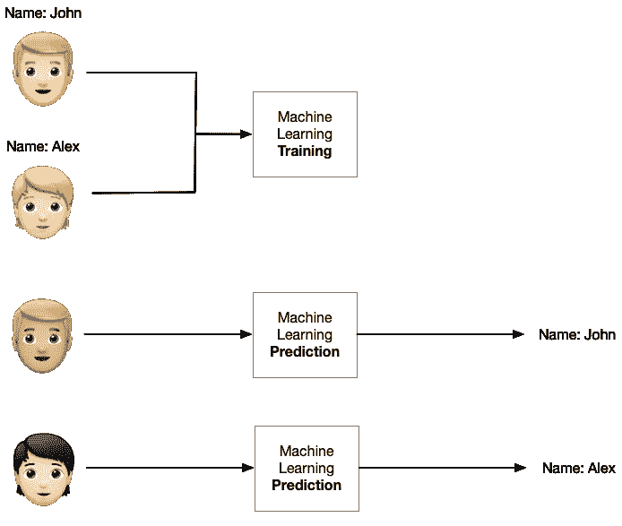
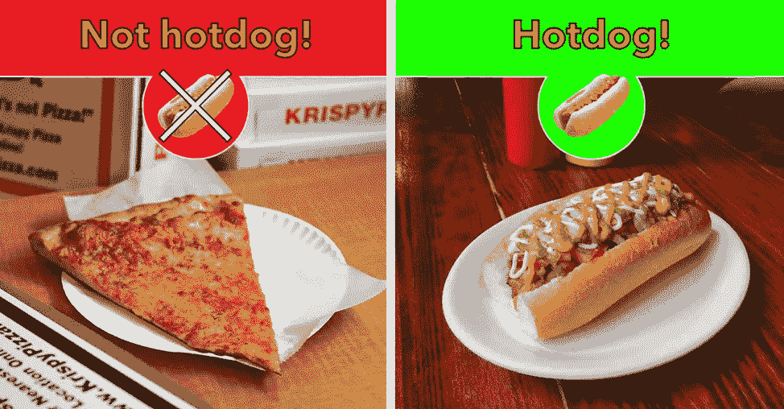
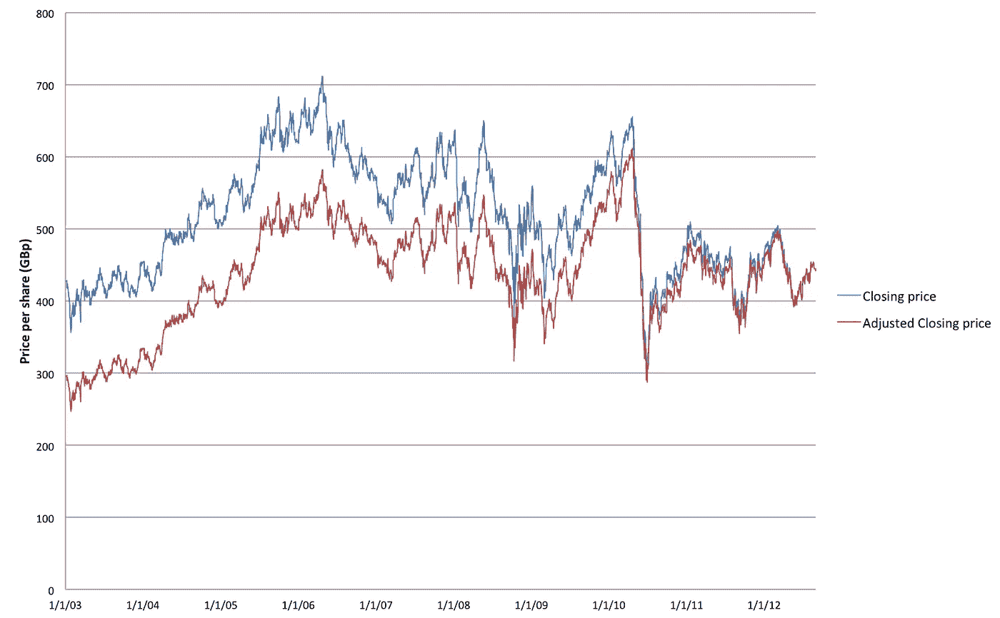
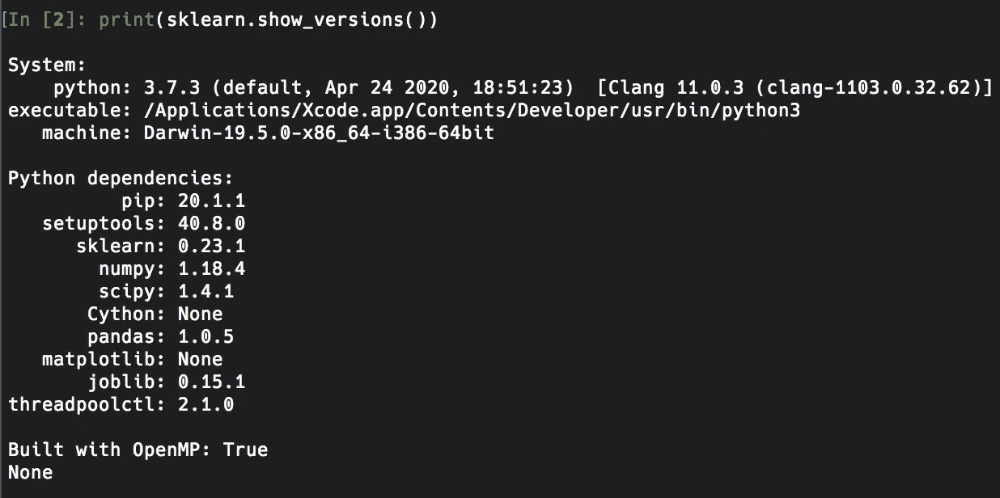
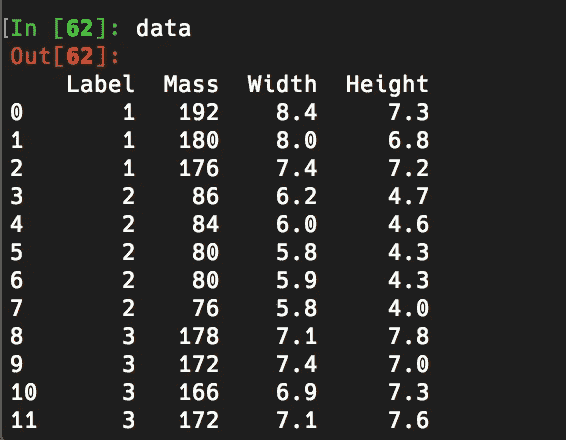
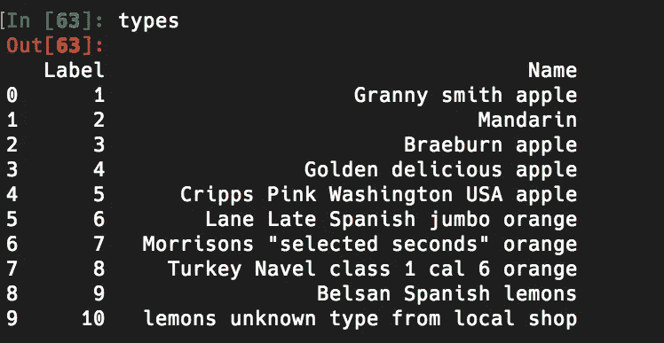
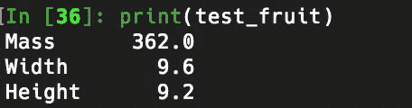
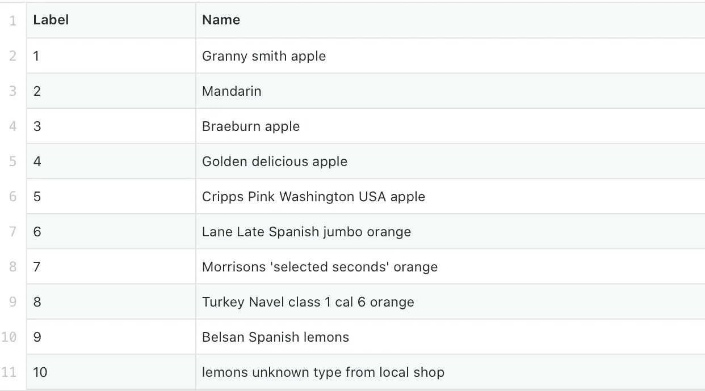
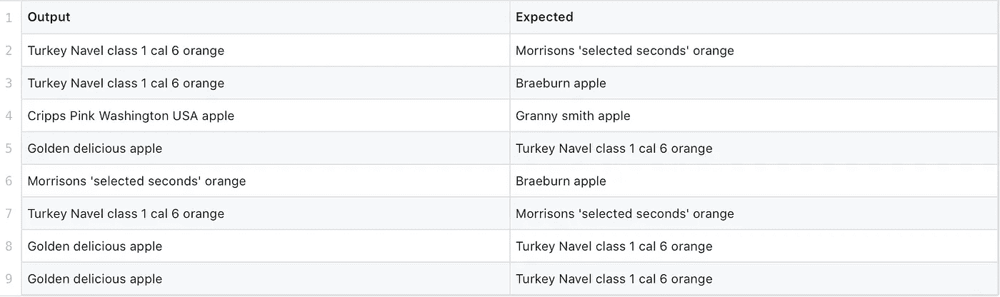

# 程序员的机器学习

> 原文：<https://levelup.gitconnected.com/machine-learning-for-programmers-f719b3a93c2c>

对绝对初学者的机器学习的温和介绍


在这篇文章中，我将概述什么是机器学习，为什么你可能会使用它，以及如何将它融入到项目中。

我假设你对机器学习一无所知。所以，如果你对这个话题很好奇，但不知道从哪里开始，你就来对地方了。

如果你已经知道什么是机器学习，只是想知道如何使用它，请随意跳到“入门”部分。

## 什么是机器学习？

机器学习是人工智能的一个子类，它使计算机能够解决通常对人类来说很容易，但对机器来说很难的问题。例如:

*   识别图片中的对象
*   对声音进行分类，包括语音识别
*   生成“原创”艺术品和图像

作为程序员，思考 ML 的一个好方法是:

> *一种计算方法，使程序能够根据给定的输入生成可预测的输出，而无需使用逻辑规则*

这意味着，你*用例子训练*一个机器学习系统，而不是编写代码来决定你的软件的行为。“以身作则”的过程就是*学习*的比喻来源。

因此，在一个识别照片中的人的应用程序中，你不会预先编程你希望它识别的每个人的特征。相反，机器学习算法将*根据人类标记的输入数据学习*不同人的面部表情。



用标记的例子训练导致对未标记的例子的预测。

# 分类



照片:SeeFood 技术公司。

识别照片中的人脸是一种叫做[分类](https://en.wikipedia.org/wiki/Statistical_classification)的机器学习的例子。分类在我们想要将事物分成*类别*的项目中很有用。例子包括:

*   检测图像中的对象
*   光学字符识别
*   声音识别
*   情感检测
*   过滤垃圾邮件

分类器是最常见的机器学习形式之一，也是最容易使用的。在这篇文章的后面，我将向你展示如何构建一个简单的分类器。

# 回归



股票市场图由 [Arturo](https://commons.wikimedia.org/w/index.php?title=User:Arturo_at_BP&action=edit&redlink=1)

机器学习的另一个应用是基于已知的先前值来预测值。这就是所谓的回归。

例如，根据卧室的数量、大小和位置来预测房价。另一个例子是根据以前的股票数据预测未来的股票价格。

像分类一样，我们需要大量高质量的训练数据(比如以前的房价)来训练我们的系统。

# 无监督学习

对于分类器或回归系统，我们需要一组标记为的*训练数据，例如一个标记为“垃圾邮件”或“非垃圾邮件”的电子邮件文件夹，以便创建我们的系统。*

然而，有时我们需要系统在没有首先被训练的情况下发现数据中的模式。这被称为*无监督学习*。

无监督学习最常见的应用之一是在[推荐](https://en.wikipedia.org/wiki/Recommender_system)中。亚马逊、Spotify、苹果和脸书使用推荐系统每秒向数百万用户推荐产品、服务或音乐。

# 深度学习


通过[m heiler](https://commons.wikimedia.org/wiki/User:MTheiler)进行多目标检测

深度学习是机器学习的一项最新进展，它能够解决比上述“基本”分类和回归更复杂或更具挑战性的问题。

深度学习的一个典型应用是检测图像中的多个对象。深度学习也可以用来*生成*新数据。例如，深度学习可以学习艺术家的“风格”，并将其应用于一张照片或另一幅画。这里，梵高的绘画风格被应用到斯坦福大学校园的图像中。


艾·范·高夫的斯坦福校园

深度学习的其他应用包括:

*   从录音中去除噪音
*   基于示例生成音乐和语音
*   识别手写
*   玩游戏，如国际象棋和空间入侵者

深度学习正在以非常快的速度前进，受到谷歌和脸书等公司的大力推动。为了探索这一前沿，有必要看一看 Deepmind 项目最近的工作。

# 机器学习入门

现在我们已经概述了机器学习的主要类型，我将讨论如何开始编写自己的机器学习代码。

## 学点 Python！

绝大多数的机器学习工作都是用 Python 完成的。即使一个项目最终被部署在另一种语言中，Python 也是大多数原型制作发生的地方。机器学习本质上是实验性的，用 Python 进行实验比用编译语言容易得多。

简而言之，如果你想玩 ML 技术，你需要学习一些 Python！如果你是 Python 新手，我强烈推荐[这本指南](https://python-3-patterns-idioms-test.readthedocs.io/en/latest/PythonForProgrammers.html)。

我还推荐使用 [ipython](https://ipython.org) ，它将用于本教程的剩余部分。

## sci kit-了解 Hello World

[scikit-learn](https://scikit-learn.org/stable/) 是最流行的机器学习框架之一。它提供分类、回归和无监督学习的功能。scikit-learn 是研究机器学习的一个很好的起点，因为它在设计上非常简单，同时包含了您开始学习所需的一切。

我们现在将使用 scikit-learn 构建一个简单的“Hello World”分类器。安装简单，这里描述[和](https://scikit-learn.org/stable/install.html)。但是，如果您已经有了 python 设置，它主要归结为:

```
$ pip install -U scikit-learn
```

我们还将安装 [pandas](https://pandas.pydata.org) ，这是一个加载和操作数据的标准工具。我们将需要这个来加载我们的 CSV 文件。

```
$ pip install -U pandas
```

现在，为了确认所有安装都正确，启动一个 python 会话并键入:

```
import sklearn
print(sklearn.show_versions())
```

它应该显示如下内容:



sci kit-了解 Hello World

假设成功了，我们现在准备构建我们的分类器！🎉

# 一种简单的水果分类器

首先，我们要编写一个机器学习程序来对不同类型的水果进行分类。

我们将根据以下信息进行此操作:

*   每种水果的质量，单位为克
*   以厘米为单位的宽度和高度

## 加载数据

这包含在文件`fruit_data.csv`和`fruit_types.csv`中，你可以在这里找到[。在机器学习中，这些信息被称为*数据集*。](https://gist.github.com/jamiebullock/9864441e751ce2d5b04e8e5fed5b8737)

您应该将这些文件下载到 python 脚本可以访问的方便位置。要导入这些文件，请在 python 解释器中输入以下内容:

```
import pandas as pddata = pd.read_csv('fruit_data.csv')
types = pd.read_csv('fruit_types.csv', index_col=0)
```

为了确认这已经成功，在你的终端中输入`data`，你应该会看到一个类似这样的表格:



熊猫数据表

由于大多数机器学习算法不直接处理字符串，我们使用数字标签作为标识符。这些可以使用 fruit_types.csv 中的信息映射到文本字符串…



水果种类表

所以，在我们的`data`表中`1`是老奶奶，`2`是官话等等。

接下来，我们将把我们的`data`表分成两个独立的对象:

1.  标签列表，每行一个
2.  仅包含每行的质量、宽度和高度的特征“子表”

这是通过以下方式实现的:

```
y = data['Label']
X = data[['Mass', 'Width', 'Height']]
```

## 缩放数据

一旦数据被加载到内存中，对其进行缩放或“正常化”是一个很好的做法。这样做是为了消除不同比例的数据对结果的影响。例如，在我们的数据集中，`Mass`与`Width`和`Height`的比例不同。在归一化之后，数据将具有一致的属性，例如被缩放到范围 0..1.

为此，我们使用 scikit-learn `StandardScaler`:

```
from sklearn.preprocessing import MinMaxScaler
scaler = MinMaxScaler()X_train = scaler.fit_transform(X_train)
X_test = scaler.transform(X_test)
```

有各种形式的缩放，但实际上对于我们的数据集和算法，是否使用缩放并没有什么区别。

## 分割数据集

最后，我们将把数据集分成两个子集。一个训练集，用来*训练*我们的系统，一个测试集用来测试它。

```
from sklearn.model_selection import train_test_split
X_train, X_test, y_train, y_test = train_test_split(X, y, random_state=0)
```

这是机器学习的标准步骤。如果我们用我们训练系统所用的相同数据来测试我们的系统，这不是一个现实的评估，而且看起来会比用真实世界的数据更准确。

(注意，通常在分割数据集之前，通常包括数据缩放或“归一化”步骤，但为了简单起见，此处省略了。然而，它将包含在[完整代码列表](https://gist.github.com/jamiebullock/7f90de0eded28f599994bf6f08e387d1)中

## 训练我们的分类器

现在我们有了正确格式的数据，我们可以实际训练我们的分类器了。要做到这一点，需要两件事:

1.  一个机器学习*算法。*这是一套预定义的规则或流程，决定了系统的工作方式
2.  一个机器学习*模型*。这是系统*经过训练后的状态*

对于这个例子，我们将使用*k*-最近邻或 k-NN 算法。这是一个非常简单且广泛使用的分类算法。在 scikit-learn 中，我们可以这样使用它:

```
from sklearn.neighbors import KNeighborsClassifier
knn = KNeighborsClassifier()
knn.fit(X_train, y_train)
```

这里的`knn.fit()`是用来*训练*我们的系统的方法，使用 X 作为训练数据，y 作为目标标签。使用术语“拟合”是因为我们将(否则未初始化的)模型的参数拟合到我们的特定训练数据。“装配”类似于“训练”。

## 测试分类器

我们现在可以用`knn.predict()`测试我们的分类器。此方法将基于未标记的输入返回预测输出。

让我们从测试数据集的第 0 行获取数据。

```
test_fruit = X_test.iloc[0]
print(test_fruit)
```

这应该会显示:



测试水果数据

现在让我们看看我们的分类器是否能告诉它是什么…

```
knn.predict([test_fruit])
```

这应该会返回`array([6])`。这告诉我们对应于测试数据中第 0 行的输出标签是`6`。如果我们在`types`表中查找这个标签，我们会看到它对应于`Lane Late Spanish jumbo orange`。

这是正确的吗？让我们看看我们的测试标签列表…

```
y_test.iloc[0]
```

这应该归`6`。如果是这样…我们的分类器已经工作了！

但是，如果我们尝试测试数据集中的不同行呢？让我们尝试第`3`行，并将预测的输出标签与标签列表中的第 3 个元素进行比较:

```
knn.predict([X_test.iloc[3]])[0] == y_test.values[3]
```

这将返回`False`，表明分类器的预测*不正确*。事实上，scikit-learn 提供了一种简便的方法来测试我们的分类器的整体准确性:

```
knn.score(X_test, y_test) * 100
```

这告诉我们其标签被分类器成功预测的测试例子的百分比。在我们的例子中是 47%。这比随机选择标签要好得多，我们预计随机选择标签的成功率为 10%左右，但尽管如此，这并没有那么好。

## 了解结果

如果我们查看我们的输入数据集，我们可以看到标签包含许多“品种”的水果:



水果数据类型

如果我们将其与我们的分类器预测标签错误的情况进行比较，我们会发现，在 8 个案例中有 3 个案例中，水果的总体*类别*是正确的，即使特定的*品种*不是。



输出标签与预期

如果我们更改输入数据，使用水果类别(橘子、苹果、柠檬、柑橘)而不是水果种类，那么我们的成功率会增加到 66%，这还算不错。

## 摘要

我们已经构建了一个基本的分类器，并演示了机器学习的 4 个标准步骤:

*   **加载**数据
*   **将数据缩放到可用范围内**
*   **将**数据划分为*训练*和*测试*集合
*   **培训**(或“试衣”)我们的模特
*   **通过比较预测输出和已知数据标签来测试**(或“验证”)训练好的模型

我们示例的完整代码清单可以在[这里](https://gist.github.com/jamiebullock/7f90de0eded28f599994bf6f08e387d1)找到。

作为下一步，我建议对代码和数据进行试验。例如，尝试使用不同的分类器:

```
from sklearn.svm import SVC
classifier = SVC()
classifier.fit(...) 
```

或者

```
from sklearn.tree import DecisionTreeClassifier
classifier = DecisionTreeClassifier()
```

或者尝试用 scikit-learn 中内置的众多数据集之一[构建一个分类器。](https://scikit-learn.org/stable/modules/classes.html#module-sklearn.datasets)

# 后续步骤

scikit-learn 是机器学习的一个很好的起点，是传统分类、回归和无监督学习问题的一个很好的行业级解决方案。

然而，对于更复杂的问题，深度学习将是更好的工具。

为此，我建议看看 Tensorflow 或者(我个人的偏好)PyTorch。

此外，由于 CPU 和 GPU 需求的增加，大量的深度学习计算是在基于云的环境中在线完成的。我强烈推荐尝试一下[的 Google Colab](https://colab.research.google.com) 作为起点。

在未来的帖子中，我将在 Google Colab 中用 PyTorch 重新创建我们的水果分类器示例，使用水果图像*而不是质量、长度、宽度数据集。*

我希望这是有用的。有任何问题，欢迎在评论中提问。