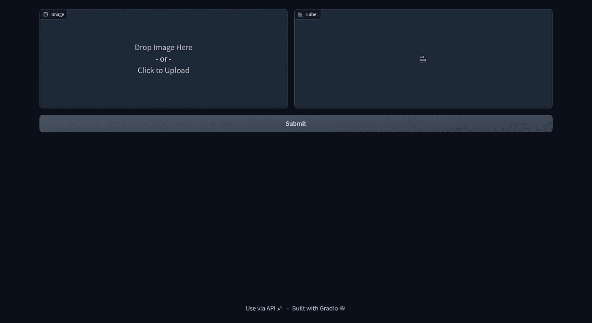
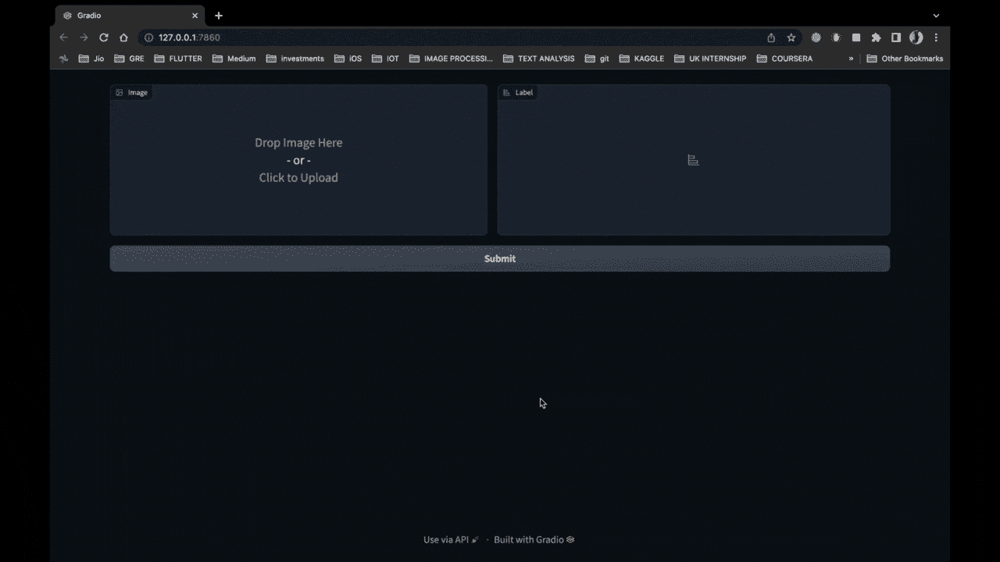

# 生产中的机器学习

> 原文：<https://levelup.gitconnected.com/machine-learning-in-production-a036567e9c86>


来源:Freepik.com

我看到大多数 ML 从业者可以建立机器学习模型，但当涉及到模型的部署或用 ML 模型建立真实世界的应用程序时，他们不知道如何去做。他们展示他们在 jupyter 或 colab 笔记本上写的代码。

我听到的一个常见抱怨是，在生产中部署 ML 模型是一个复杂的过程，这确实是事实。研究表明，几乎 90%的 ML 模型从一开始就没有投入生产。

这就像你造了一辆车，停在车库里，却从未使用过。

构建机器学习应用程序的目标是解决一个问题，而 ML 模型只有在生产中被积极使用时才能做到这一点。ML 模型部署和 ML 模型开发一样重要。部署机器学习模型的过程称为 MLOps。

在本文中，我们将构建一个将图像作为输入的 web 应用程序，ML 模型将输出预测。

在我开始之前，我想让你知道，这是我上一篇文章的延续， [***《利用张量流和迁移学习进行脑瘤分类》。***](/brain-tumor-classification-using-tensorflow-and-transfer-learning-b4b7ab5fd7cf)

在我之前的[文章](/brain-tumor-classification-using-tensorflow-and-transfer-learning-b4b7ab5fd7cf)中，我谈到了使用迁移学习制作分类模型，并保存 Tensorflow 模型以备将来使用。在这篇文章中，我将介绍

*   如何加载已保存的 ML 模型
*   如何构建 web 应用程序

我们学习了如何保存模型，但是现在，我们如何加载模型以便在生产中使用它呢？

# 加载 ML 模型

```
import gradio as gr
import tensorflow as tf
import cv2
import numpy as np

# Loading the Machine Learning model
model = tf.keras.models.load_model("models/modelv1.h5")
```

为了加载机器学习模型，我们可以利用 Tensorflow 库提供的名为 *load_model* 的函数。在上面的代码中，我们导入了必要的库，并通过给出模型的路径简单地加载了模型。

我还导入了名为 Gradio 的库。Gradio 将帮助我们建立一个网络界面，这样任何人都可以在任何地方使用它！

让我们首先构建用户界面。

```
# Building the Interface
with gr.Blocks() as demo:

    # Image inputs and outputs widget
    with gr.Row():
        image = gr.inputs.Image(shape=(224, 224))
        label = gr.outputs.Label(num_top_classes=4)

    # Submit button for classiying the image
    with gr.Row():
        submit_btn = gr.Button(value="Submit")
        submit_btn.click(classify_image, inputs=[image], outputs=[
                         label], show_progress=True)
```

假设我们正在设计的 web 应用程序由行和列组成，我们在一行中需要两个容器，一个用于图像输入，另一个用于输出。在第二行中，我们需要一个标签为 submit 的按钮，这样用户就可以按下这个按钮，我们的模型就可以做出预测。

上面的代码创建了两个不同的行。在一行中，我们创建了一个输入容器(gr.inputs.Image ),它接收形状为 244x244 的图像。你不必担心将你的图像调整到 244x244 大小，代码已经为我们做好了一切。在同一行中，我们还有另一个容器(gr.inputs.Label)标签。此标签将帮助我们显示预测，即无肿瘤、神经胶质瘤肿瘤、脑膜瘤肿瘤和垂体瘤。

在第二行中，我们用值**“提交”创建按钮(gr.Button)。**请注意，该按钮是刚刚创建的，还不能点击。我们必须让它可以点击。Gradio 帮助我们通过 Gradio 的 button 类提供的 *click()* 方法轻松创建一个可点击的按钮。

*click()* 方法接受不同的参数，第一个参数接受一个函数作为输入，另外两个参数接受输入和输出。在我们的例子中，输入是我们的图像，而输出必须显示在标签上，所以，我们将标签提供给输出参数。

界面将看起来像这样👇👇👇



作者图片

上面的代码会给出错误**“classify _ image is not defined”**。让我们通过创建*classifier _ image*函数来消除这个错误。

```
def classify_image(input_image):
    opencvImage = cv2.cvtColor(np.array(input_image), cv2.COLOR_RGB2BGR)
    img = cv2.resize(opencvImage, (150, 150))
    img = img.reshape(1, 150, 150, 3)
    p = model.predict(img)
    p = np.argmax(p, axis=1)[0]

    if p == 0:
        p = 'Glioma Tumor'
    elif p == 1:
        p = "No Tumor"
    elif p == 2:
        p = 'Meningioma Tumor'
    else:
        p = 'Pituitary Tumor'
    if p != 1:
        print(f'The Model predicts that it is a {p}')

    return p
```

classify_image 函数将图像作为参数。我们使用 OpenCV 的 cvtColor 方法将该图像从 RGB 转换到 BGR。然后，我们将图像大小调整为 150x150。为什么？因为在我们构建分类器模型时，我们提供了大小为 150x150 的图像。每当我们构建任何 ML 模型时，我们必须确保创建 ML 模型时的输入大小和在生产中使用模型时的输入大小必须相同。

在对图像进行必要的转换和调整大小之后，我们实际上是将这个图像传递给 predict 方法。这是我们的模型做出实际预测的地方。

这里，我们必须再次使用 *argmax* 函数，因为预测数组中的每一行都包含相应标签的四个值。每行中的**最大值**描述了 4 种可能结果中的预测输出。

因此，使用 *argmax* ，我们将能够找出与预测结果相关的指数。基于我们的分类模型做出的预测，我们为一个变量(p)分配不同的值。例如，如果我们的模型预测 0，那么图像是神经胶质瘤肿瘤，如果它预测 1，那么图像是没有肿瘤的，等等。我们返回这个变量(p ),这样我们就可以向 Gradio 标签显示 p 的值。如果我们不返回任何东西，那么我们的模型会很好地工作，但是它不会向用户显示输出。

在这一点上，我们几乎完成了，但当你运行程序时，它不会显示任何东西，它不会显示任何错误或任何东西，为什么？因为我们还没有创建程序的入口点。

让我们创建程序的入口点，这是主函数。

```
# Main Function
if __name__ == "__main__":
    demo.launch()
```

上面的代码创建了 main 函数，在 main 函数中，我们调用了 demo.launch()，它依次在我们的本地主机上启动网站。

要访问我们的 web 应用程序，请在浏览器上输入 [http://127.0.0.1:7860/](http://127.0.0.1:7860/) 这将启动我们刚刚制作的网站。注意:如果您想与任何其他用户共享此网站，您必须将 share=True 添加到启动函数:demo.launch(share=True)

唷！😮‍💨

很多工作不是吗？这样，我们就完成了 web 应用程序的创建。你可以把这个代码部署到 Heroku，amazon 等任何一个服务器上。

# 输出



作者 GIF

注意:MLOps 是一个完全不同的东西，它包含了很多东西，比如定义管道，定义 ML 架构等等。它涉及数据科学家、数据工程师和 ML 工程师。

先看这篇文章的部分“用张量流和迁移学习进行脑瘤分类”。GitHub 上提供了第 1 部分和第 2 部分的代码。如果您有任何疑问、建议、问题或任何事情，可以随时在 [**LinkedIn**](https://www.linkedin.com/in/thejitenpatel/) **，**[**Twitter**](https://twitter.com/thejitenpatel)**，**和**[**insta gram**](https://www.instagram.com/thejitenpatel/)**上联系我。****

**一个很小的请求，如果你有任何建议或任何事情，请填写下表，这将有助于我写你希望我写的技术和主题。谢谢:)**

****快乐编码😉****

**[https://forms.gle/1zB9GiKAdejyNbkh6](https://forms.gle/1zB9GiKAdejyNbkh6)**

**[](/brain-tumor-classification-using-tensorflow-and-transfer-learning-b4b7ab5fd7cf) [## 基于张量流和迁移学习的脑肿瘤分类

### 我使用机器学习技术对四种不同类型的脑瘤进行分类；没有肿瘤，胶质瘤肿瘤，脑膜瘤…

levelup.gitconnected.com](/brain-tumor-classification-using-tensorflow-and-transfer-learning-b4b7ab5fd7cf) [](https://github.com/thejitenpatel/brainTumorDetection) [## GitHub-jaten Patel/脑瘤检测

### 此时您不能执行该操作。您已使用另一个标签页或窗口登录。您已在另一个选项卡中注销，或者…

github.com](https://github.com/thejitenpatel/brainTumorDetection) [](https://thejitenpatel.medium.com/) [## Jiten Patel -培养基

### 阅读吉滕·帕特尔在媒介上的作品。机器学习工程。|扑开发者|写手。每天，吉滕·帕特尔和…

thejitenpatel.medium.com](https://thejitenpatel.medium.com/) 

# 分级编码

感谢您成为我们社区的一员！在你离开之前:

*   👏为故事鼓掌，跟着作者走👉
*   📰查看[升级编码出版物](https://levelup.gitconnected.com/?utm_source=pub&utm_medium=post)中的更多内容
*   🔔关注我们:[Twitter](https://twitter.com/gitconnected)|[LinkedIn](https://www.linkedin.com/company/gitconnected)|[时事通讯](https://newsletter.levelup.dev)

🚀👉 [**加入升级达人集体，找到一份惊艳的工作**](https://jobs.levelup.dev/talent/welcome?referral=true)**