# 机器学习——带代码遍历的最近邻算法

> 原文：<https://levelup.gitconnected.com/machine-learning-nearest-neighbours-algorithm-with-code-walkthrough-d7fc05cdd698>

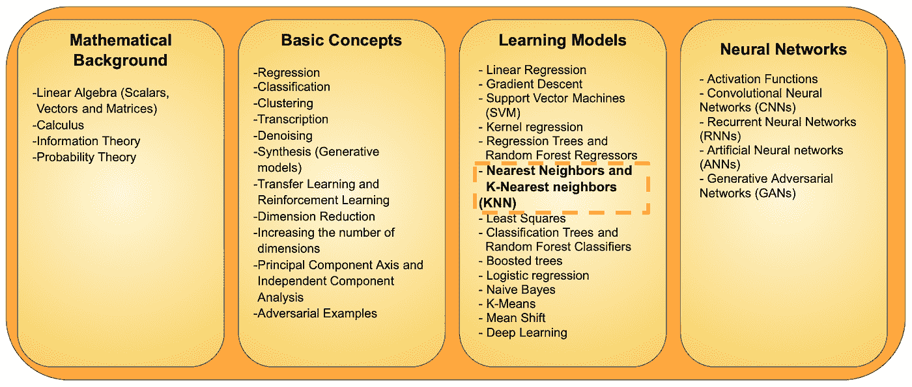

机器学习中的一些关键概念

“最近邻”算法是数学上最容易理解的机器学习算法之一。尽管它很简单，但算法相当精确，基于它的模型通常会产生最佳结果。

通过使用该算法来执行数据分类，可以更好地理解该算法。在给定我们需要确定预测标签(类别)的数据点的情况下，使用这种基本的机器学习算法，我们将找到与所讨论的数据点最接近的数据点，并假设我们的数据点的标签与其最接近的数据点的标签相匹配。

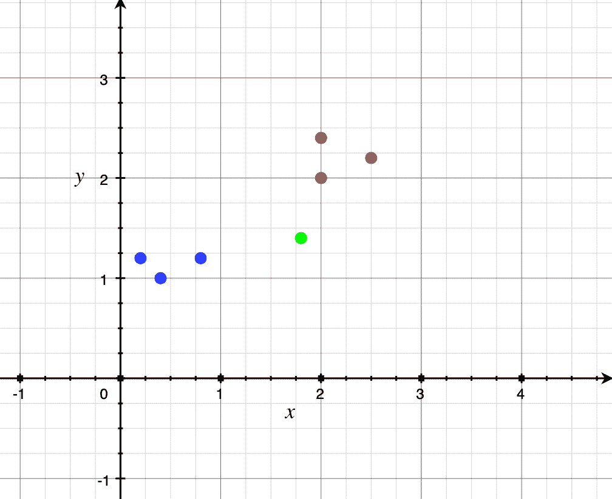

考虑旁边图表中的例子。我们得到一组红色或蓝色的点。这些都是根据一些参数绘制在图上的。现在，我们得到一个新点(用绿色标出)，并被要求预测它应该是红色还是蓝色。在最近邻(NN)算法中，我们首先基于我们用于绘制早期点的相同参数在图上绘制绿点，然后我们搜索与所讨论的点最近的点。在这种情况下，坐标为(2，2)的红点最接近绿点。因为最近的点是红色的，我们预测这个新点也将是红色的。

在这样一个简单的图表上，距离公式可以用来计算距离，以找到最近的点，即“最近的邻居”。

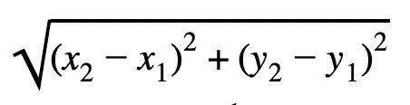

距离公式的数学表示(二维)

当我们实际编码时，我们使用 numpy.linalg.norm()函数(在 Python 中)来计算数据点之间的距离，它使用欧几里得距离，这是任意两点之间“直线距离”的度量。在这种情况下，测量任何数据点和我们图上的问题点之间的垂直距离。

理解了最近邻算法之后，现在让我们检查它在数据分类中的应用

# **伪代码:**

对于测试数据中的每个点:

第一步:*计算所有其他点的距离。*

第二步:*找到距离最小的数据点*

第三步:*找到这个最近点的正确标签，用相同的标签*对有问题的点进行分类。

# **代码**

出于本教程的目的，我选择使用 MNIST 数据集来执行图像分类:一组手写数字的图像。

为了构建这个分类模型，我们必须做的第一件事是导入必要的库，即:

1.  *numpy* :处理向量、数组和矩阵
2.  *matplotlib.pyplot* :绘制图形，查看图像等。
3.  keras 库包含许多数据集，我们将从这个库中导入 MNIST 数据集，用作我们的训练数据。

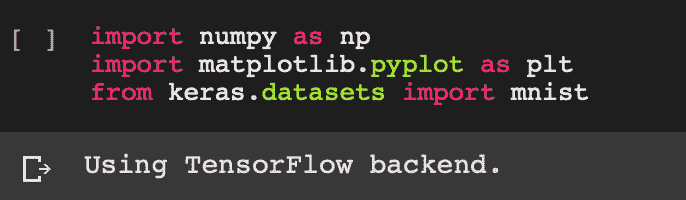

现在，我们必须从互联网上下载 MNIST 数据集。这个数据集已经被分成两部分——60，000 个训练图像和另外 10，000 个测试图像。我们现在必须存储训练和测试图像以及它们各自的标签。

我们使用以下四个 numpy 数组来存储数据:

1.  *x_train* :存储训练图像
2.  *y_train* :存储训练图像的标签
3.  *x_test* :存储测试图像
4.  *y_test* :存储测试数据的正确标签

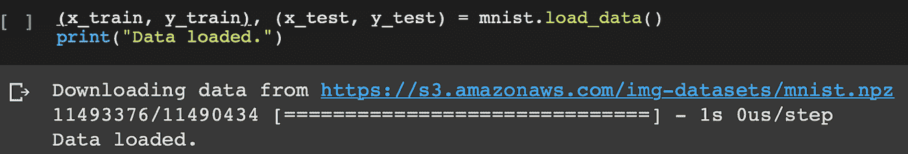

这些图像目前是 rgb 格式，但是对于识别所画的数字来说，数字的颜色并不重要。因此，为了使计算更容易，我们将把图像中当前处于 0 到 255 [0，255]范围内的颜色转换为 0 到 1 [0，1]范围内的颜色。这是通过将像素值除以 255 来实现的。

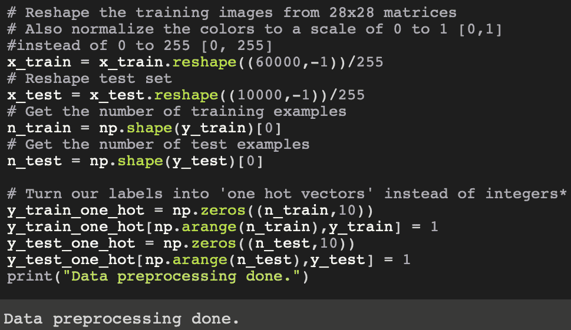

在上面的代码中可以看到的另一个步骤是将 out 标签从整数格式转换成一种称为“ **one-hot vectors** ”的格式。当我们的标签是 0 和 1 的二进制形式时，计算速度会更快，而不是像 0，1，2，…，8，9 这样的整数标签。因此，我们创建了一个零向量，它在正确标签的索引处有一个“一”(1)。例如，如果我们有三个类(0、1 和 2)，我们想把“1”变成一个热向量，我们会有[0，1，0]。如果我们想把“0”变成一个热向量，我们会有[1，0，0]。如果我们有 10 个标签为 0–9 的类(MNIST 数据集就是这种情况)，并且我们想将“9”转换为一个热向量，我们将得到[0，0，0，0，0，0，0，0，1]。

接下来我们要做的是定义一个函数，它将向我们显示一个图像及其相应的标签。这对于实际的机器学习算法来说并不重要，但它将帮助我们可视化我们的图像。

我们定义了一个名为“ *imshow* ”的函数。该功能的目的是接收图像，然后:

1.  *可视化图像*:这将通过使用 matplotlib 库创建一个图来完成
2.  *重塑我们的矢量*回到 28x28 图像的形式:在我们的数据集中，所有的图像都已经是 28x28 像素的格式，但是我们已经重塑了它们，以便应用颜色转换。因此，我们必须将它们改回 28x28 的格式。在其他数据集中，由于所有影像的尺寸可能不同，因此最好将所有影像的尺寸调整为一致的尺寸，以确保影像尺寸的差异不会以任何方式影响分类。

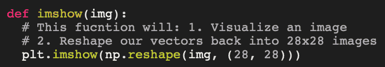

接下来，我们将编写几行代码，从我们的训练集中为一幅图像选择一个随机索引，并将对它使用我们的" *imshow"* 函数，以查看我们的显示函数是否工作正常。然后，我们将打印出正确的标签，这样我们就知道图像中画的是哪个数字。

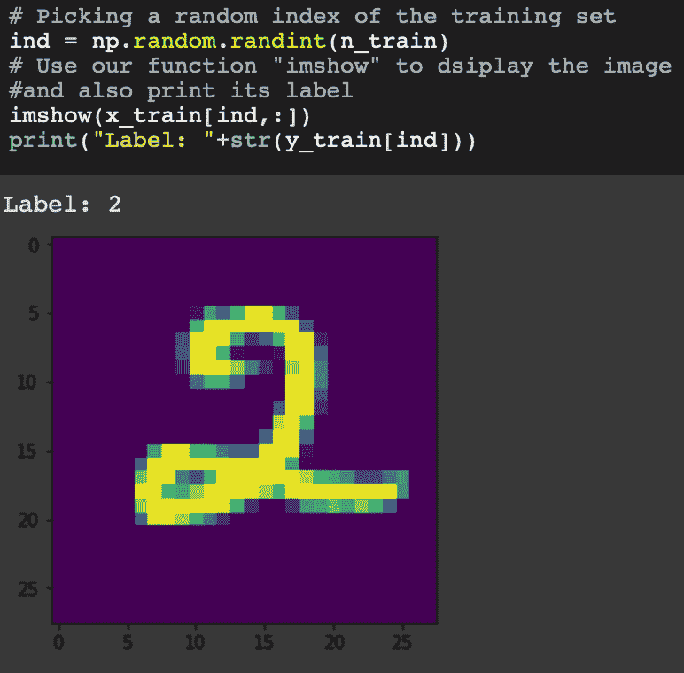

现在，我们将定义一个函数"*getnearestneighborhood*"来返回训练集中最近点的索引以及 testInstance 与该点之间的距离。

该函数的参数是:

1.  *trainingSet:* 这是一个 n x d (n 乘 d)的数组，其中 n 是图像的数量，d = 784 (28x28=784)。
2.  *测试实例*:这是我们的一张图片(以 784 维向量的形式)

为了使我们的功能能够使用上述参数执行上述任务，我们必须遵循以下步骤:

1.  *形成我们的图像和每个其他训练图像之间的距离的数组:*我们将使用预定义的函数‘linalg . norm’来计算这个距离。当我们调用' linalg.norm '函数时，我们将指定 axis = 1。这是为了让函数分别考虑我们的每个图像
2.  *找到离我们最近的点的索引:*函数‘arg min’将用于返回“距离”中最小值的索引。
3.  *获取离我们最近的点与我们的点之间的距离以及这个最近点的索引*。这很容易，因为所有的距离都存储在“距离”中，我们将最近点的索引存储在变量“nn_index”中。

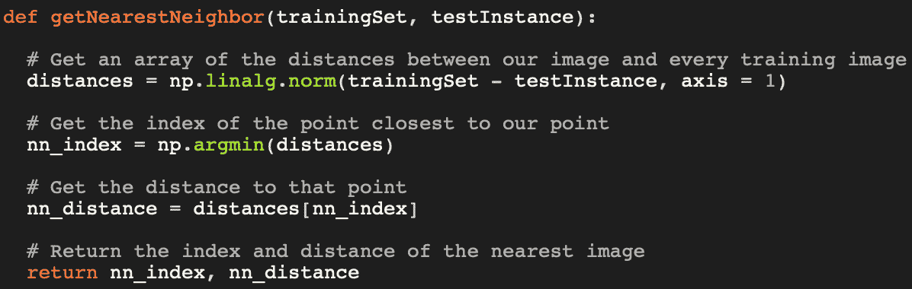

最近邻方法是最简单的机器学习模型之一，因此需要非常少量的代码。我们现在要做的就是决定用于训练和测试我们的模型的图像数量，从而评估它的准确性。

1.  *num_train* :存储我们在训练模型时想要使用的图像数量(在我们的训练数据集中)
2.  *num_test* :存储我们想要测试我们的模型的图像的数量(在我们的测试数据集中)(我们想要测试我们的模型的多少图像来检查它的准确性)

我还编写了一些代码来计算模型的准确性。该代码片段中的主要变量是:

1.  *correct_count* :当我们预测测试数据集中图像的标签时，这个变量存储了正确预测的数量。
2.  *ind* :用于从我们的测试数据集中挑选一个随机图像，然后可视化它。我们还将可视化我们的模型识别为该图像的“最近邻居”的图像。

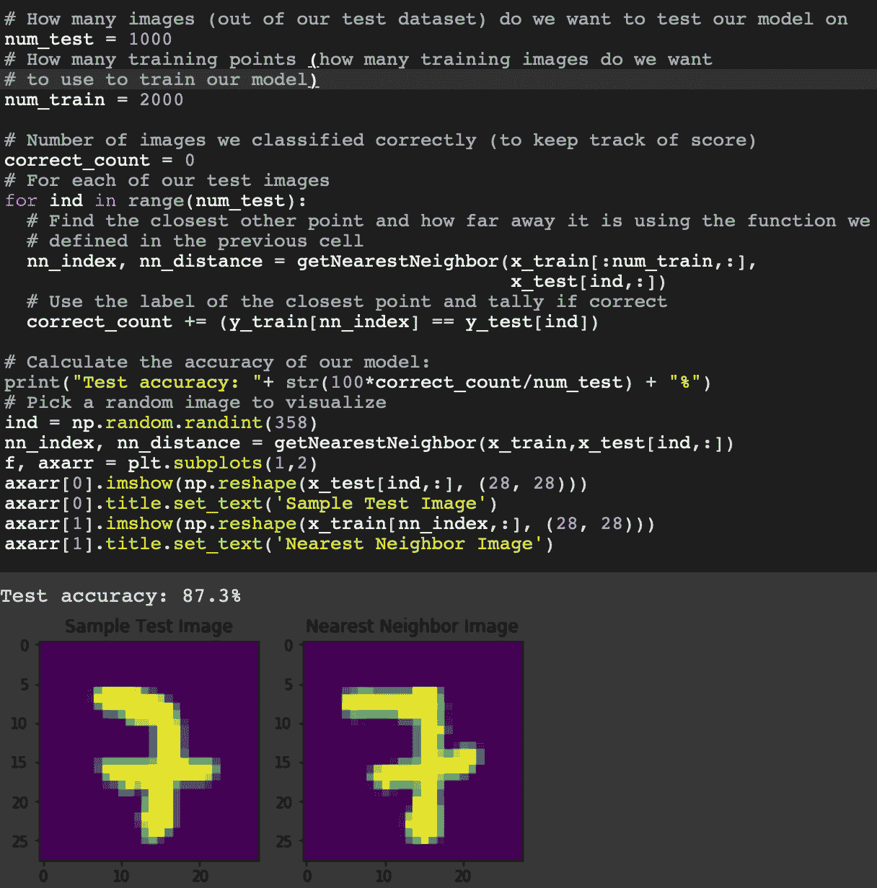

因此，尽管事实上“最近邻”是一个如此简单和基本的机器学习算法，但当用于分类手写数字时，它具有合理的准确度。同样值得注意的是，在给定的超参数设置下，精确度达到了 87.3%。您可以随时查看我的 Colab 文档(本文末尾的链接),使用这些代码调整这些值并进一步提高精确度(在这种情况下，仅有的超参数是测试数据和训练数据中的图像数量，因此可以进行的更改非常有限，但在更高级的算法中，有更多突出的超参数是算法本身的直接部分， 而在这些情况下，寻找超参数值的最优集合，虽然繁琐耗时，但对模型的精度和整体性能有很大的影响)。

# **KNN (K 个最近邻居)**

k-最近邻，通常称为 KNN，是最近邻算法的一种变体，在大多数情况下有助于提高准确性。它基于与“最近的邻居”相同的原理，除了它寻找 K 个最近的邻居，而不仅仅是最近的点(它寻找最近的 K 个点，而不仅仅是最近的点)。因此，由于减少了数据中异常值和不确定边界的影响，准确性得到了提高。

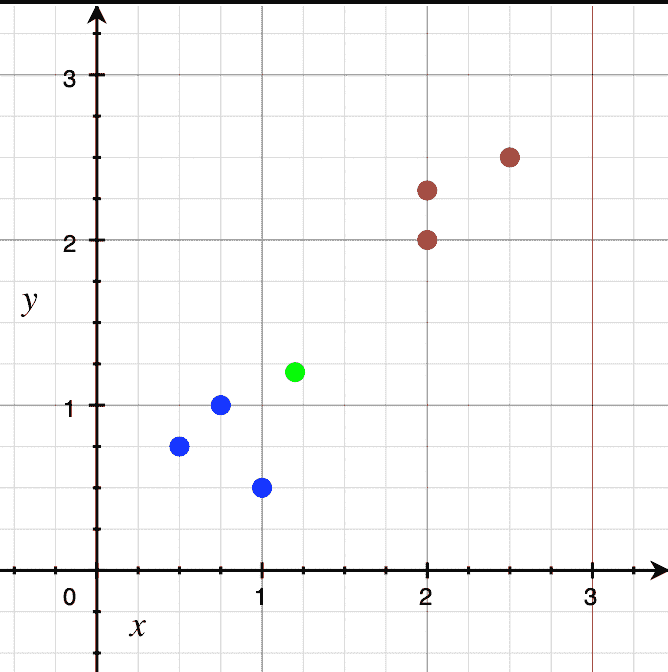

在上图中，假设蓝色和红色点在训练数据中，现在，我们必须将绿色点分类为红色或蓝色。如果我们使用 K-最近邻的概念，K=2，那么离绿色最近的两个点都是蓝色的，这表明我们的预测应该是这个新点是蓝色的。

还可能存在这样的情况，其中两个最接近的点是这样的，一个是红色的，一个是蓝色的。在这种情况下，我喜欢做的是寻找下一个最接近的点作为“决胜局”。如果下一个最接近的点是红色的，那么我们将绿点归类为红色，如果下一个最接近的点是蓝色的，那么我们将绿点归类为蓝色。下图展示了一个相同的示例:

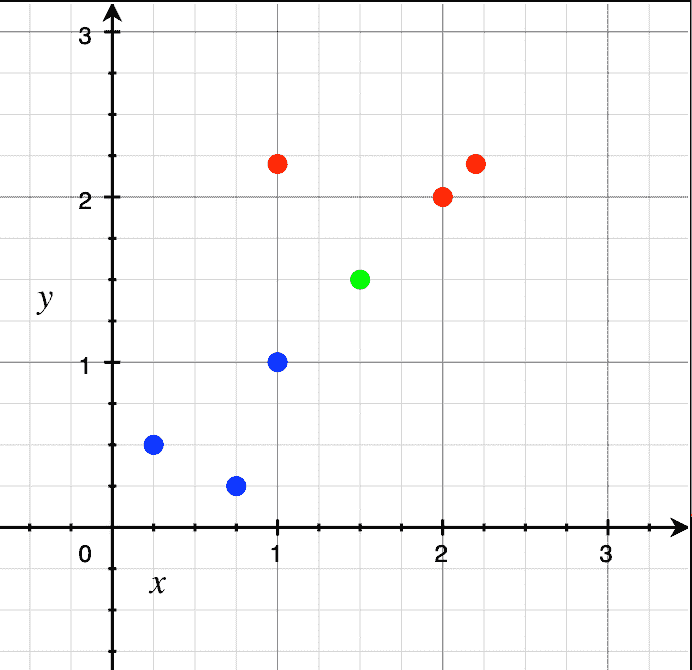

这里，最接近的两个点是(2，2)处的红点和(1，1)处的蓝点。由于这是一个相等的数字，我们取下一个最接近的点，也就是(2.2，2.2)处的红点。因此，我们将这个绿点归类为红色。

为了避免这种“平局决胜问题”,我通常喜欢为 K 保留一个奇数值。在这种情况下(K 有一个奇数值),我们就按照它进行预测。

KNN 算法的代码与我之前解释的最近邻的代码非常相似，因此尝试修改该代码以使其适用于“K 个最近点”将是一个很好的练习。

要查看最近邻居模型的可执行教程，您可以在其中与代码进行交互并修改代码，请查看我网站上的 colab 笔记本:

 [## Karan Kashyap 的最近邻居教程:谷歌合作实验室

### 这是一个 Colab 笔记本，上面有我在上面的文章中解释过的所有代码。您可以到笔记本上编辑代码，以便更好地理解它是如何工作的。可以尝试的几件事是:1)更改超参数的值以提高模型精度，2)编辑代码以将其从神经网络模型转换为 KNN 模型。

colab.research.google.com](https://colab.research.google.com/drive/1Z-ae-manV0-c0uai_SBmgURfYALof4lB) 

你也可以在这里查看我的其他文章:

 [## 机器学习-决策树和随机森林分类器

### 分类是识别物体、动物等属于哪个组的能力。可能属于给定的一些…

medium.com](https://medium.com/analytics-vidhya/machine-learning-decision-trees-and-random-forest-classifiers-81422887a544)  [## 机器学习:Google Colab——为什么、何时以及如何使用它

### 机器学习(ML)是计算机科学领域的最新趋势，任何对数据有兴趣的人…

medium.com](https://medium.com/@karankashyap_7430/machine-learning-google-colab-why-when-and-how-to-use-it-9624e34abd6d)  [## 21 世纪的编程:应该学习哪些语言？

### 深入了解初学者如何根据自己的兴趣和爱好选择学习哪种编程语言

medium.com](https://medium.com/@karankashyap_7430/programming-in-the-21st-century-which-languages-should-you-learn-d4055e5871f4)  [## 使用随机数计算圆周率的值:蒙特卡罗模拟

### 深入了解如何使用随机数相当准确地计算像“圆周率”这样具体的数字…

medium.com](https://medium.com/@karankashyap_7430/calculating-the-value-of-pi-using-random-numbers-a-monte-carlo-simulation-d4b80dc12bdf)