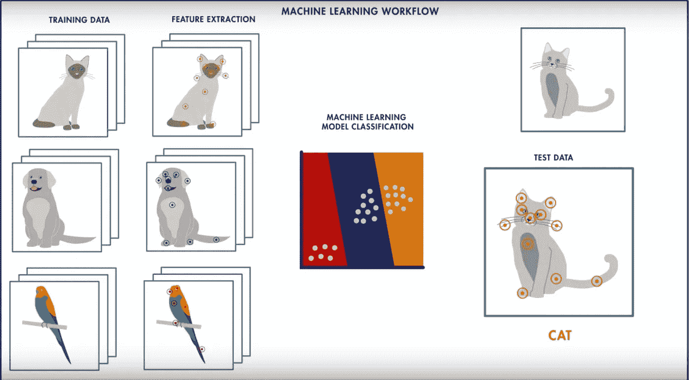
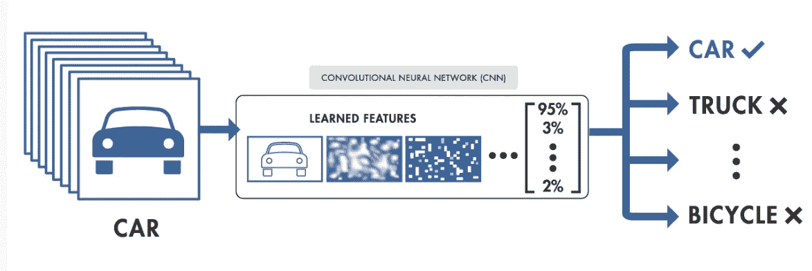
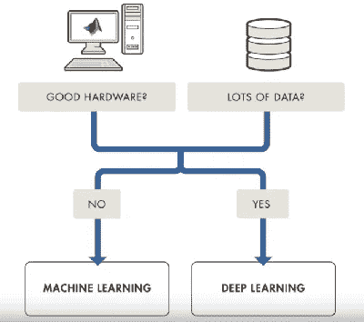
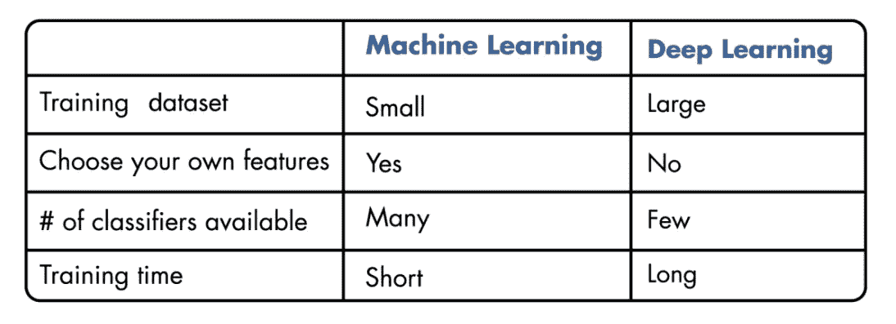

# 机器学习 vs 深度学习

> 原文：<https://levelup.gitconnected.com/machine-learning-vs-deep-learning-9879f32e84eb>

## 理解人工智能的这两大类领域之间的区别

安迪·凯利在 [Unsplash](https://unsplash.com?utm_source=medium&utm_medium=referral) 上的照片

# 介绍

深度学习和机器学习都提供了训练模型和分类数据的方法。这篇文章比较了两者，并提供了一种方法来帮助你决定使用哪一个。

让我们从讨论猫和狗的经典例子开始。

安杰尔·卢西亚诺在 [Unsplash](https://unsplash.com?utm_source=medium&utm_medium=referral) 拍摄的照片

在上图中，你看到一只狗还是一只猫？你怎么能回答这个问题？

随着时间的推移，你可能已经见过很多猫和狗，所以你已经学会了如何识别它们。这就是我们试图让计算机做的事情。从实例中学习并识别实例。

还要记住，有时甚至人类也可能识别错误。因此，我们可能认为计算机会犯类似的错误。

# 机器学习

为了让计算机使用标准的**机器学习**方法进行分类，我们将手动选择图像的相关特征，如边缘或拐角，以便训练机器学习模型。然后，在对新对象进行分析和分类时，该模型会引用这些特征。

物体识别的例子

这是物体识别的一个例子。然而，这种技术也可以用于场景识别和对象检测。

在解决机器学习问题时，你遵循一个特定的工作流程。你从一幅图像开始，然后从中提取相关特征。然后，您创建一个描述或预测对象的模型。

# 深度学习

另一方面，有了**深度学习**，你就跳过了从图像中提取特征的手动步骤。相反，你直接将图像输入深度学习算法，然后该算法预测物体。

所以深度学习是机器学习的一个亚型。它直接处理图像，通常更复杂。

在这篇文章的其余部分，当我提到机器学习时，我指的是不在深度学习类别中的任何东西。

# 用哪个？

在机器学习和深度学习之间做选择的时候，你要问问自己有没有**高性能 GPU** 和**大量数据**。

如果你没有这些东西，你会更幸运地使用**机器学习**而不是深度学习。这是因为深度学习一般更复杂。所以你至少需要几千张图片来获得可靠的结果。

你还需要一个高性能的图形处理器，这样模型就可以花更少的时间来分析这些图像。如果您选择机器学习，您可以选择在许多不同的分类器中训练您的模型。您还可能知道提取哪些特征会产生最佳结果。

另外，有了机器学习，你可以灵活地选择方法的组合。使用不同的分类器和特征来查看哪种排列最适合您的数据。

你可以使用 **MATLAB** 快速尝试这些组合。还要记住，如果你想做碱基检测之类的事情，你可以使用现成的 MATLAB 例子。

正如我之前提到的，机器学习比深度学习需要更少的数据。你也可以更快地找到训练有素的模特。

然而，深度学习最近变得非常受欢迎，因为它高度准确。您不必了解哪些特征是对象的最佳表示。这些都是给你学的。

然而，在深度学习模型中，你需要大量的数据，这意味着模型可能需要很长时间来训练。你也要对许多参数负责。因为模型是一个黑盒，如果有些东西不能正常工作，可能很难调试。

# 摘要

机器学习和深度学习之间的选择取决于你的数据和你试图解决的问题。MATLAB 可以帮助你单独或结合使用这两种技术。