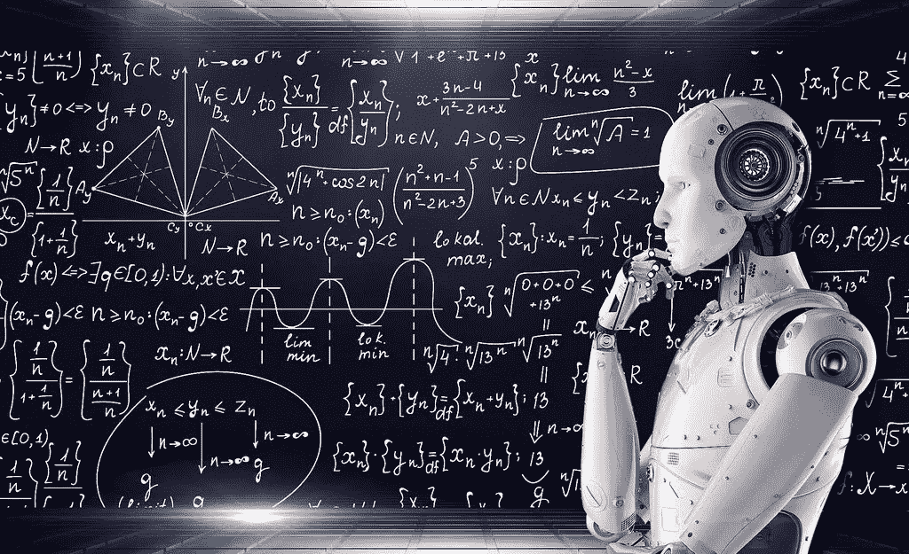

# 数据预处理—使用 Python 进行机器学习

> 原文：<https://levelup.gitconnected.com/machine-learning-with-python-d99f13a9e395>



【https://www.flickr.com/photos/mikemacmarketing/30212411048 

最近几个月，我一直在从事 *R* 和 *Python* 的机器学习工作，也选修了几门课程。我注意到我所有的程序都有一个共同点，那就是对数据进行预处理，以便应用机器学习模型。大多数情况下，数据预处理过程分为以下步骤:

*   导入数据集
*   完成缺失的数据
*   编码分类数据
*   分割数据集
*   特征缩放

## 导入数据集

有几种方法可以导入*数据集*。最简单的方法是从一个`.csv`文件导入*数据集*。为此，您必须执行以下操作:

首先，您必须导入必要的库来处理数据:

```
import numpy as np
import matplotlib.pyplot as plt
import pandas as pd
```

一旦你建立了工作目录，你必须导入`dataset` *:*

```
dataset = pd.read_csv('Data.csv')
```

```
The command pd.read_csv('filename') receives different optional parameters, you will have to use some of them depending on how your dataset is arranged on the *.csv* file. You can set the sep parameter to indicate the separator on your file. For instance:dataset = pd.read_csv('Data.csv', sep = ';')
# sep = ';' indicates that the separator between each data is ;
```

一旦我们加载了数据集，我们需要通过以下操作将自变量从因变量中分离出来:

```
X = dataset.iloc[:, :-1].values # We take all the feature columns (we exclude the last one)
Y = dataset.iloc[:, 3].values # We take the dependent variables
```

## 完成缺失的数据

填写缺失数据是可选的。如果你的*数据集*是完整的，你显然不需要做这部分。但是有时您会发现*数据集*缺少一些单元格，在这种情况下，您可以做两件事:

*   删除一整行(不推荐，您可能会删除关键信息)。
*   用该列含义来完成所缺的信息。

拿下面这个不完整的*数据集*，

如您所见，有一些缺失的单元格，一个在**年龄**列，另一个在**收入**列。为了用每列的**平均值**填充这些缺失的单元格，您必须遵循以下步骤:

1.  从`scikitlearn`进口`Imputer`。这将有助于我们填补缺失的数据。

```
from sklearn.preprocessing import Imputer 
```

2.我们需要实例化导入类的一个对象。

```
# NaN = not a number
# The default strategy is mean, so you can ommit it
imputer = Imputer(missing_values = 'NaN', strategy = "mean", axis = 0)imputer = imputer.fit(X[: , 0:2])
X[:, 0:2] = imputer.transform(X[:, 0:2])
```

我们已经检查了每一列上是否有空单元格。如果有，那么空单元格将被替换为列的平均值。

输出如下所示，

既然数据已经完成，我们可以进入下一步。

## 编码分类数据

这一步也是可选的。根据您的*数据集*，您可能从一开始就有一个已经编码了分类数据的*数据集*。那样的话，你就不需要这么做了。

在我们的例子中，我们有**毕业生**列，这个列有两个可能的值，或者是**是**或者是**否**。为了能够处理这些数据，我们必须对其进行编码，这意味着将标签改为数字。在 *Python* 中做到这一点非常简单，你只需要做以下事情:

```
from sklearn.preprocessing import LabelEncoder
label_encoder_y = LabelEncoder()
Y = label_encoder_Y.fit_transform(Y)
```

输出如下所示:

## 分割数据集

这一部分是强制性的，也是使用机器学习模型时最重要的部分之一。

分割*数据集*意味着你要将整个数据集分成两部分，即*训练集*和*测试集*。当你想训练一个模型去解决或者预测一个特定的事情，你首先要训练你的模型，然后测试这个模型是否在做一个正确的预测。

通常比例为 80% *训练集*和 20% *测试集*，但可能会因您的型号而异。我们将按照这个比例分割数据集。

您首先必须安装以下库:

```
from sklearn.cross_validation import train_test_split
```

下一步是将*数据集*分成测试和训练集。为此，请键入以下内容:

```
X_train, X_test, Y_train, Y_test = train_test_split(X, Y, test_size = 0.2)
```

既然数据已经分割，我们可以继续进行最后一步。

## 特征缩放

这最后一步也不总是必要的。在数据集中，有一些值不在同一个范围内，例如，年龄和收入具有非常不同的范围。

大多数机器学习模型使用两点之间的[欧几里德距离](https://hlab.stanford.edu/brian/euclidean_distance_in.html)工作，但是由于尺度不同，两点之间的距离可能是巨大的，这可能会给你的模型带来问题。

有些模型已经处理了这一点，因此您不必自己动手，但其他一些模型要求您先对要素进行缩放。为了扩展我们的数据，我们必须运行以下代码:

```
from sklearn.preprocessing import StandardScaler
scale_X = StandardScaler()
X_train = scale_X.fit_transform(X_train)
X_test = scale_X.transform(X_test)
```

编码的分类数据呢？我们也需要扩展它吗？

有人说对分类数据进行缩放是有用的，有人说没有必要。我实验过的是，没那么重要，看你自己。

## 结论

在多次完成所有这些数据预处理步骤之后，您会注意到，如果您的数据从一开始就准备充分，那么其中的一些步骤可以省略。

为什么所有这些步骤都很重要？机器学习最关键的部分之一是拥有一个准备充分且值得信赖的*数据集。以正确的方式准备你的信息是拥有一个好的机器学习模型的又一步。*