# macOS 性能比较:颤振台式机与电子

> 原文：<https://levelup.gitconnected.com/macos-performance-comparison-flutter-desktop-vs-electron-6eb3c9c950de>

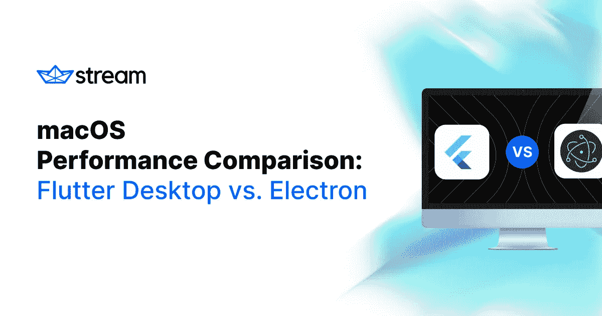

本文涵盖以下内容:

*   驱动颤振和电子的基本发动机和技术。
*   重要的性能考虑因素以及它们与 Flutter Desktop 和 electronic 的关系。
*   真实性能指标演示示例在 **macOS** 上的桌面和电子应用。

在继续阅读之前，请记住，本文并不打算推荐一种解决方案。现代电脑和设备上的资源足够多，你很难找出制作精良的 Flutter 桌面应用程序与制作精良的电子应用程序之间的区别。

性能只是一个指标。当决定使用哪个解决方案时，您的团队的开发人员生产力、经验和知识也是要考虑的重要因素。

D**is claimer***:本文作者是一名在*[*getstream . io*](https://getstream.io/)*的颤振开发者。JavaScript 工程师审查了这篇文章以保证质量。虽然我们尽了最大努力在这两种技术之间进行公正和公平的比较，但可能会出现无意的错误或不正确的测量。*

用于这些测试的所有代码都在本文中有链接；随时发现错误或不一致之处，帮助提高结果的质量。

# 电子与颤振桌面的现状

## 电子

Electron 经受住了时间的考验，证明了自己是将 web 应用程序带到桌面的好解决方案。事实上，我最喜欢(也是最常用)的一些桌面应用程序都运行在 Electron 上，比如 Visual Studio Code、Figma 和 Slack。其他受欢迎的应用程序包括 Discord、Skype 和 Tusk。

> 微软正在将团队从 Electron 转移到 Edge WebView。

这些都是大公司，大应用。大量的资源和工程力量被投入到改进电子、节点、V8 引擎、JavaScript、HTML 和整个网络上。看看微软在优化 VSCode 方面所做的工作，让它感觉像一个原生应用。

但是对于每一个好的电子应用程序，都有一个坏的存在(没有名字掉落👀).电子应用程序以其大的可执行文件大小、大量的内存/资源使用以及在某些情况下长的启动时间和 jank 问题而闻名。

## 摆动

Flutter 有一个雄心勃勃的目标，从一个单一的代码库瞄准各种设备。Flutter 已经证明了自己是移动(Android 和 iOS)开发的一个很好的解决方案，自 v1 发布以来，它的性能一直在稳步提高。这些年来出现了一些性能问题，但是大多数问题已经得到解决。

[飘起的桌面](https://flutter.dev/desktop)，不过，在写作的时候还在测试版。没有任何知名的应用程序是用 Flutter Desktop 开发的，我们可以对其进行实验并直接与 electronic 进行比较。时间会告诉我们这个解决方案在生产场景中有多好，但是从我个人的经验来看，最初的性能结果似乎很有希望。理论上，在移动设备上运行良好的 Flutter 应用程序在桌面上应该运行得一样好，如果不是更好的话。

# 关于 JavaScript V8 引擎和 Dart Native 的简短说明

让我们讨论一下驱动电子和颤振的语言和技术。

## JavaScript V8 引擎

Electron 将 Chromium 的渲染库与 Node.js 结合在一起，两者共享同一个 JavaScript 引擎 V8。直接引用 [V8 文件](https://v8.dev/docs):

> V8 是 Google 开源的高性能 JavaScript 和 WebAssembly 引擎，用 C++编写。它被用于 Chrome 和 Node.js 等等。
> 
> V8 编译并执行 JavaScript 源代码，处理对象的内存分配，并对不再需要的对象进行垃圾收集。V8 的停止世界，分代，准确的垃圾收集器是 V8 的性能的关键之一。

V8 引擎在不断改进，虽然 JavaScript 通常被认为是一种解释语言，但现代 JavaScript 引擎不再只是解释 JavaScript，而是编译它。V8 内部用**即时编译** (JIT)编译 JavaScript，加速执行。

还可以使用[本机模块](https://www.electronjs.org/docs/tutorial/using-native-node-modules)与本机代码接口(参见[本文](https://pspdfkit.com/blog/2018/running-native-code-in-electron-and-the-case-for-webassembly/)中的示例)。

## Dart 本地

根据 [Dart 本地文档](https://dart.dev/overview#native-platform):

> 在开发过程中，快速的开发周期对迭代至关重要。Dart VM 提供了一个实时编译器(JIT ),它具有增量重新编译(支持热重载)、实时度量收集(支持 [DevTools](https://dart.dev/tools/dart-devtools) )和丰富的调试支持。
> 
> 当应用程序准备好部署到生产时，无论您是发布到应用程序商店还是部署到生产后端，Dart AOT 编译器都可以提前编译到原生 ARM 或 x64 机器代码。您的 AOT 编译的应用程序启动一致，启动时间短。
> 
> AOT 编译的代码运行在一个高效的 Dart 运行时内，该运行时强制执行声音 Dart 类型系统，并使用快速对象分配和一个[分代垃圾收集器](https://medium.com/flutter-io/flutter-dont-fear-the-garbage-collector-d69b3ff1ca30)来管理内存。

关键的一点是，Dart 可以以热重载的形式为您提供快速的开发人员体验，并在您创建发布版本时为目标体系结构提供小型编译应用程序的好处。

以下是其他一些值得注意的 Dart 功能和更新:

*   Dart 最近增加了对声音空安全的支持，这使得 Dart AOT 编译器能够产生更快的机器代码(查看 [Dart 和声音类型的性能优势](https://medium.com/dartlang/dart-and-the-performance-benefits-of-sound-types-6ceedd5b6cdc)以了解更多信息)。
*   Dart 的**外部函数接口** (FFI)允许您使用现有的 C 库以获得更好的可移植性，并可以选择使用高度优化的 C 代码来执行性能关键的任务。阅读 [Dart 2.13](https://medium.com/dartlang/announcing-dart-2-13-c6d547b57067) 了解更多关于 Dart FFI 的信息。

Dart 正在孤立地成长为一门伟大的语言，但它的流行绝对可以归功于 Flutter 的崛起。Google 和 Flutter 团队维护 Dart，这意味着该团队可以优化框架(Flutter)和语言(Dart)，以帮助改善开发人员的体验。

# 性能考虑因素

以下各节比较了颤振和电子的性能考虑。这些方面可能会影响最终应用程序的性能，或者您的开发人员经验以及避免潜在性能问题所需的工作量。

[Flutter](https://flutter.dev/docs/perf) 和[electronic docs](https://www.electronjs.org/docs/tutorial/performance)都涵盖了每个平台的性能，您应该查看它们以获取最新信息。

## 应用程序大小、依赖关系和模块

要考虑的一个重要因素是编译后的应用程序的可执行大小。在这里，颤振是明显的赢家。Flutter 编译成机器码，这意味着 Dart 可以很聪明地决定在最终版本中包含什么，去掉什么。参见此[与 Dart AOT 建造尺寸相关的已关闭 pr](https://github.com/dart-lang/sdk/issues?page=2&q=label%3Avm-aot-code-size+is%3Aclosed)列表。这是一个持续改进和衡量的领域。

另一方面，电子应用程序运行在铬上。基本上，每个电子应用程序都捆绑了自己的浏览器。这就是使电子成为可能的魔力，也是为什么你得到一个大约 150mb(或更多)的可执行文件，只需简单的“你好，世界！”app。类似的颤振应用大约为 30mb。(稍后，在我们的性能指标中，我们将看一些真实的数字来评估包的大小。)

忽略电子应用的庞大规模，还有其他重要因素需要考虑:

*   对于 Electron，你需要更加注意你包含了什么模块，因为未使用的代码仍然会被包含在你的最终包中(参见[不小心包含了模块](https://www.electronjs.org/docs/tutorial/performance#1-carelessly-including-modules))。
*   在 electronic 中加载模块是一项非常昂贵的操作。作为开发人员，您需要注意将大模块的加载推迟到需要的时候(参见标题为[过早加载和运行代码](https://www.electronjs.org/docs/tutorial/performance#2-loading-and-running-code-too-soon)的部分)。
*   最后，建议您[将应用程序的所有代码](https://www.electronjs.org/docs/tutorial/performance#7-bundle-your-code)捆绑到一个包中，因为运行`require`是一项昂贵的操作(有各种 JavaScript 捆绑器可以帮助您完成这项工作，比如 Webpack、Parcel 和 rollup.js 等等)。

如果你是一个铁杆 JavaScript 开发人员，你可能会翻着白眼说，“简单”，但是这些小麻烦越积越多。尤其是如果你是一个新的开发者。

另一方面，Dart 在剥离不需要的代码和依赖性方面做得很好。如果您开始一个新的 Flutter 项目，那么在 macOS(以及所有其他平台)上运行的构建设置将已经设置好并在等待。

Flutter 需要的配置少得多，当您在目标平台上构建应用程序时，您将立即受益于 Dart 提供的所有 AOT 编译优势。

## 隔离、Web Workers 和进程

Flutter 和 Electron 应用程序都可以从主/UI 线程中卸载昂贵的工作，当您想要执行可能会阻塞 UI 的操作时，这是必要的:

*   在 Dart 中，每个线程都在自己的[隔离区](https://api.flutter.dev/flutter/dart-isolate/Isolate-class.html)中，有自己的内存，不同隔离区之间唯一可以通信的方式是通过端口传递值。
*   在 electronic 中，您可以使用[工作线程](https://nodejs.org/api/worker_threads.html)，它支持使用线程来并行执行 JavaScript。

> 有关这些进程的更多信息，请参见 Electron 的[阻塞主进程](https://www.electronjs.org/docs/tutorial/performance#3-blocking-the-main-process)和 Flutter 的[隔离和事件循环](https://medium.com/dartlang/dart-asynchronous-programming-isolates-and-event-loops-bffc3e296a6a)。

虽然这两个框架都可以以非阻塞的方式执行昂贵的工作，但重要的是要注意，Electron 在默认情况下会加速几个额外的进程，因为它运行的是 Chromium。

请看这张来自 **macOS 活动监视器**的截图:

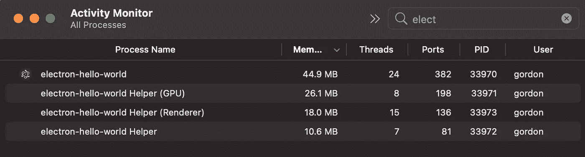

*活动监视器展示了 macOS 上的电子“Hello，World”应用程序。*

您会注意到三个额外的助手进程(助手、GPU、渲染器)，每个都占用一些内存和处理能力:

*   主进程创建并管理 [BrowserWindow](https://github.com/electron/electron/blob/main/docs/api/browser-window.md) 实例和各种应用程序事件。
*   渲染过程运行你的应用程序的用户界面(一个网页)，它是 [webContents](https://github.com/electron/electron/blob/main/docs/api/web-contents.md) 的一个实例。

> 查看 Cameron Notes 的优秀文章，[深入探究 Electron 的 main 和 renderer 进程](https://cameronnokes.com/blog/deep-dive-into-electron's-main-and-renderer-processes/)。如果你想了解更多信息，这是一个很好的起点。

另一方面，Flutter 只运行一个进程，您可以选择产生额外的隔离来卸载主线程的工作。

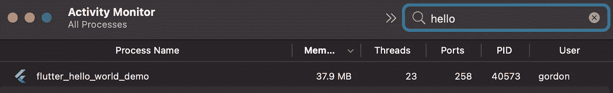

*活动监视器展示了 macOS 上的电子“Hello，World”应用程序。*

有关颤振隔离的更多信息，请查阅以下文章:

*   [Dart 确实是多线程的](https://martin-robert-fink.medium.com/dart-is-indeed-multi-threaded-94e75f66aa1e)
*   [Flutter 中的轻量级隔离](https://www.youtube.com/watch?v=SXT7nir1B48)(讨论如何使用隔离组来减少 Flutter 应用程序内存占用的视频)

## 翻译

这些主题超出了本文的范围。但是，无论您使用 Flutter 还是最新的 JavaScript SDK，了解您的代码如何在屏幕上转换为像素都很重要。

如果您想了解更多信息，这里有一些不错的资源:

*   [旋舞建筑概述](https://flutter.dev/docs/resources/architectural-overview)
*   [浏览器如何工作:渲染](https://developer.mozilla.org/en-US/docs/Web/Performance/How_browsers_work#render)

Flutter 和 Chromium 都使用 2D 图形库 Skia 来处理渲染。

## web 程序集(Wasm)

一种专门为浏览器设计的新的二进制机器码格式。编译到 WebAssembly 的应用程序可以与 JavaScript 并行运行，而不会影响性能。Flutter 和 Electron 应用程序都可以(并且确实)受益于这项技术。

从 [MDN 网络文档](https://developer.mozilla.org/en-US/docs/WebAssembly)中:

> WebAssembly 是一种可以在现代 web 浏览器中运行的新型代码，它是一种低级的类似汇编的语言，具有紧凑的二进制格式，以接近本机的性能运行，并为 C/C++、C#和 Rust 等语言提供编译目标，以便它们可以在 web 上运行。它还被设计成与 JavaScript 并行运行，允许两者协同工作。
> 
> …使用 WebAssembly JavaScript APIs，您可以将 WebAssembly 模块加载到 JavaScript 应用程序中，并在两者之间共享功能。这使您可以在相同的应用程序中利用 WebAssembly 的性能和功能以及 JavaScript 的表现力和灵活性，即使您不知道如何编写 WebAssembly 代码。

这太令人兴奋了！请参阅以下文章，了解有关 Wasm 的更多信息:

*   [WebAssembly 将 Figma 的加载时间缩短了 3 倍](https://www.figma.com/blog/webassembly-cut-figmas-load-time-by-3x/)
*   [颤振的腹板支撑](https://flutter.dev/web)
*   [用 WASM 代替 dart2js 的颤振腹板](https://github.com/flutter/flutter/issues/41062)
*   [试验 Dart 和 Wasm](https://medium.com/dartlang/experimenting-with-dart-and-wasm-ef7f1c065577)

## Flutter 和 Chrome 开发工具

提高应用程序的性能并不是一项简单的任务，有时发现性能缺陷就像大海捞针。为此，您需要合适的工具来帮助您。幸运的是，Flutter 和 Electron 都可以使用奇妙的开发工具。

对于这一类，电子占了上风。Chrome DevTools 是一款已经开发多年的高级软件。性能分析、调试、网络监控、布局检查以及其他一切都非常出色。

[Dart DevTools](https://dart.dev/tools/dart-devtools) 虽然厉害，但是还年轻。我个人很喜欢使用它，它为你提供了调试一个 Flutter 应用程序所需的一切，但它肯定还有改进的空间。

# 性能测试

现在我们已经讨论了每个平台的重要性能因素，让我们运行一些应用程序，看看 Flutter Desktop 和 Electron 如何比较。

这些测试仅在 **macOS Big Sur v11.5.2** 和 **MacBook Pro** (16 英寸，2019)上进行，规格如下:

*   2.3 GHz 八核英特尔酷睿 i9 处理器
*   AMD 镭龙 Pro 5500M 4 GB
*   英特尔 UHD 显卡 630 1536 MB

源代码和安装说明可以在 [Github 库](https://github.com/HayesGordon/flutter-desktop-vs-electron-samples)中找到。我们鼓励你自己进行这些测试，自己做实验。

> 请注意，这些只是演示。

对于颤振和电子，可以用许多不同的方法优化这些例子。这是一种现成的性能比较；用最少的开发工作得到什么。

此外，运行其中一些性能测试会导致分析开销。不分析应用程序时，实际结果可能会有所不同。

您还应该预料到不同运行之间的一些差异。理想情况下，您应该多次运行这些测试并取平均值(本文没有这样做；仅选择了第一次运行)。

> *⚠️在这些例子中，* [***电子锻造***](https://www.electronforge.io/) *用于配置和运行电子项目。NPM****7 . 23 . 0 版*** *被使用。
> ⚠️****版本 2.5.1*** *被用在稳定通道上。
> ⚠️注意到铬限制了每秒帧数(fps)。详见 Chrome 的* [*无限帧率文章*](https://dev.to/uwutrinket/chrome-unlimited-frame-rate-gl2) *。*

# “你好世界”App！

一个简单的应用程序，显示“你好，世界！”

## 应用启动时间

Flutter 和 Electron 都在不到一秒的时间内打开并绘制到屏幕上，其中 Flutter 稍快一些。

*“你好，世界！”app、颤振与电子启动时间*

## 可执行大小

在这里我们可以看到，即使对于一个简单的应用程序，一个电子应用程序也要占用很大的空间！

**颤动**

*   10.11 及以上版本的部署目标:37.3mb
*   11.0 及以上版本的部署目标:22.7mb

**电子**

*   183.9 兆字节

## 活动监视器

Flutter 使用最少的内存量(大约 38mb，相比之下大约 100mb)。所有这些额外的电子过程加起来。

**记忆**

*《你好，世界》颤振 app。内存~37.9mb*

*“你好，世界”电子 app。内存:~ 99.6 MB(44.9+26.1+18+10.6)*
*CPU、GPU、能量影响在这个例子中没有显示。*

## 每秒剖析/帧数

一个愚蠢的例子，但包括在内的乐趣。这里调整应用程序窗口的大小以触发重新渲染。

正如所料，颤振和电子运行舒适的 60 帧/秒。但是请注意，铬限制了 fps 的数量。这就是为什么电子每帧的时间总是在 16 毫秒左右。

**颤振**
每帧 3ms 以下，60fps。

*颤振，60fps，平均帧小于 3ms*

**电子**
每帧 16–17m s 左右，60 fps。

*电子，60fps，平均帧时间设置为 16–17 毫秒*

# 洛蒂动画应用

这个例子加载了 150 个 Lottie 动画，并同时为它们制作动画。

## 应用启动时间

这里，电子 app 比 Flutter app 早半秒打开；但是，第一个内容——满满的油漆同时。应该注意的是，在最初的几秒钟，电子应用程序有非常明显的丢帧现象。

*“洛蒂动画”app，颤振 vs 电子启动时间*

## 可执行大小

在这里，加载额外的模块可能会导致使用 Electron 时包的大小显著增加(与“Hello，World”示例相比大约大 80mb)。

Flutter app 在添加 Lottie 包和动画文件后只增加了~7mb。

**颤动**

*   10.11 及以上版本的部署目标:40.7mb
*   11.0 及以上版本的部署目标:29.1mb

**电子**

*   259.1 兆字节

## 活动监视器

Flutter 在所有类别中都使用较少的资源:CPU、GPU、内存和能源。

然而，突出的结果是电子版使用了大量的内存。大约 2.2gb，相比之下，Flutter 大约为 170mb。

**CPU/GPU**
Flutter 的 CPU 和 GPU 使用率较低:约 130% (CPU)和约 13% (GPU)，相比之下，Electron 的约 215% (CPU)和 41% (GPU)。

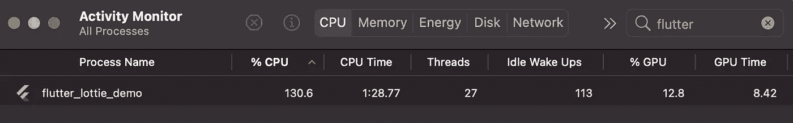

*“洛蒂”颤振 app。CPU: ~130.6%，GPU: ~12.8%*

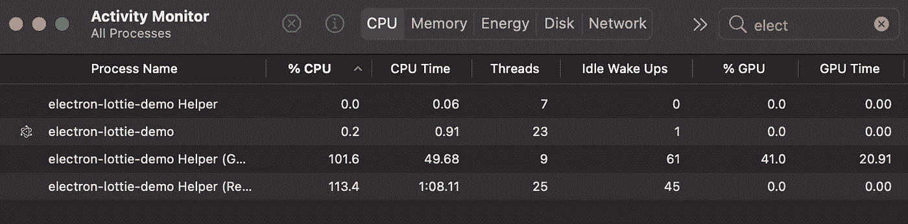

*“洛蒂”电子 app。CPU: ~215% (0.2 + 101.6 + 113.4)，GPU: ~41%*

**内存**

与大约 2.2gb 的 Electron 相比，Flutter 大约 170mb 的内存使用量要低得多。

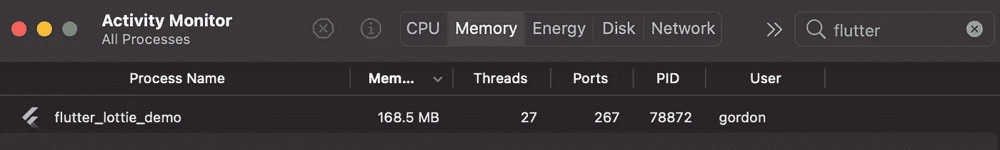

*“洛蒂”颤振 app。内存:~168.5 MB*

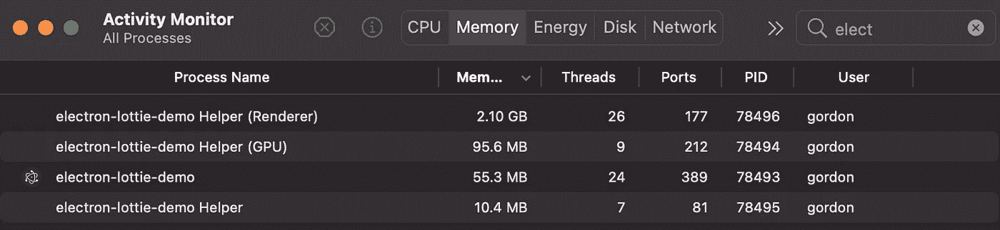

*“洛蒂”电子 app。内存:~ 2261.3 MB(2100+95.6+55.3+10.4)*

**能量冲击**

与大约 220 的电子冲击相比，颤动使用更少的能量，大约 130 的冲击。

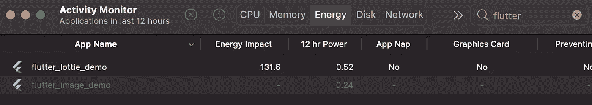

*“洛蒂”颤振 app。能量:~131.6*

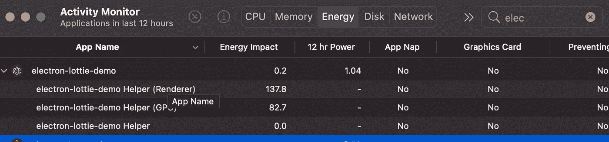

*“洛蒂”电子 app。能量:~220.7 (0.2 + 137.8 + 82.7)*

## 每秒剖析/帧数

在这个例子中，颤振和电子之间有明显的运行时差异。在启动时，Flutter 立即运行，并保持稳定的 40–45 fps，而 Electron 在最初几秒钟显示显著的帧丢失，然后保持 20–25 fps。

**颤振**
每帧 10–30 ms 不等，平均约 40–45 fps。

*“洛蒂动画”app。颤振桌面剖析。*

**电子**
每帧 25–60 ms 不等，平均约 20fps-25fps。

*“洛蒂动画”app。电子侧写。*

# 高分辨率图像应用程序

此示例通过网络加载 100 幅高分辨率图像，缓存它们，将其缩小到较小的尺寸，并连续旋转这些图像。

> 请注意，在 Flutter 上， [cached_network_image](https://pub.dev/packages/cached_network_image) 包用于缓存运行之间的图像。

## 应用启动时间

Flutter 和 Electron 都在一秒钟内打开，Flutter 应用程序打开和加载图像的速度略快。在最初几秒钟，电子应用程序中有明显的丢帧现象。

*“旋转影像”app，颤振桌面 vs 电子启动时间。*

## 可执行大小

电子应用程序的大小与“Hello，world”示例完全相同。在包括图像缓存包之后，Flutter 应用程序大了 5mb。

**颤动**

*   11.0 及以上版本的部署目标:27.7mb

**电子**

*   183.9 兆字节

## 活动监视器

在这个例子中，结果非常接近，除了内存使用，其中 Flutter 使用了大约 100mb。

**CPU/GPU**

颤振和电子之间没有太大的区别。使用稍微少一点的资源抖动。

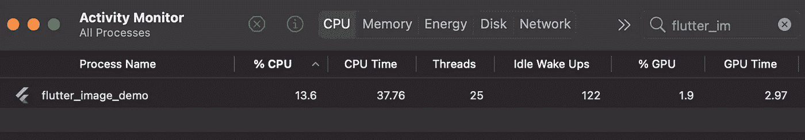

*“图片”app 飘起。CPU: ~13.6%，GPU: ~2.97%*

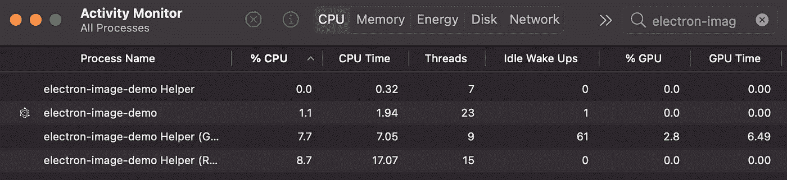

*“影像”app 电子版。CPU: ~17.5 % (1.1 + 7.7 + 8.7)，GPU ~2.8%*

**记忆**

颤动使用大约 100mb 小于电子。

*“图片”app 飘起。内存:~ 73.5 MB*

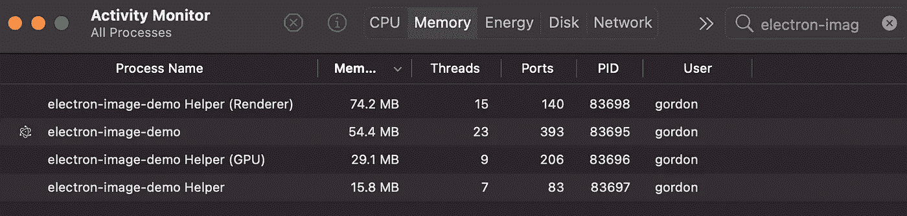

*【图片】app 电子。内存:~ 173.5 MB(74.2+54.4+29.1+15.8)*

**能量冲击**

颤振和电子之间没有太大的区别，在 12-17%的能量影响之间。

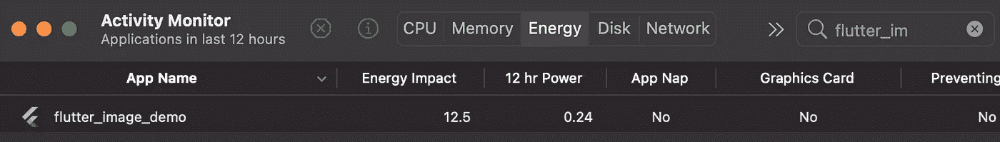

*“图片”app 飘起。能量影响:~12.5*

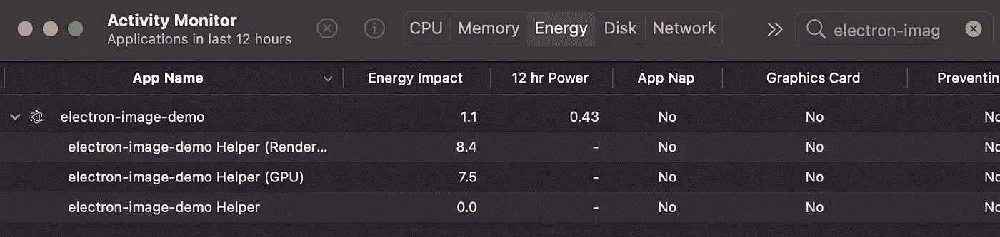

*【图片】app 电子。能量影响:~17 (1.1 + 8.4 + 7.5)*

## 每秒剖析/帧数

App start 电子版有明显丢帧现象。但在最初的几秒钟后，两者都以 60fps 的速度运行，没有问题。

**颤动**

除了偶尔丢帧之外，每帧渲染时间接近 1 毫秒。轻松的 60fps。

*“图片”app 飘起。每帧 1 毫秒，60fps。*

**电子**电子
强制每帧 16ms，60fps。

*【图片】app 电子。帧数设置为 16ms，60fps。然而，应用程序启动时会出现明显的帧丢失。*

# 结论

你必须从提供的数据中得出自己的结论🙂。如果您想将您的应用程序带到桌面上，这两者都是很好的跨平台选择。

调查结果概述如下:

**电子**

*   随着一个电子应用程序的成长，它可能会在启动时间和第一次内容丰富的绘制时间上挣扎。然而，像 VSCode 和 Figma 这样的应用程序证明这是可以避免的。
*   电子被证明是一种工作溶液；如果你能编写一个快速高效的 web 应用程序，那么你也可以在电子设备上完成。
*   具有较大的安装大小和内存使用量。
*   您需要更加注意您包含的模块，它们何时被加载，以及您的应用程序是如何打包的。
*   Wasm 集成可以极大地改善某些任务。

**颤振**

*   Flutter Desktop 仍处于测试阶段，尚未在更大范围内得到验证。
*   Flutter 将具有更小的内存占用和安装尺寸。这些数字也有可能提高，尤其是随着 Dart 的不断优化。
*   以多个平台为目标很容易，只需要最少的开发人员配置。
*   Flutter 的平台集成和 FFI 是非常棒的解决方案。
*   Dart 的零安全性及其与 Wasm 的潜在集成都是锦上添花。

对于性能实验，如果能并排演示两个大型且相似的颤振和电子应用，并能够比较更多真实场景，那就太棒了。

一旦生产颤振桌面应用开始浮出水面，这将是一个有趣的对话。

*最初发布于*[*https://getstream . io*](https://getstream.io/blog/flutter-desktop-vs-electron/)*。*