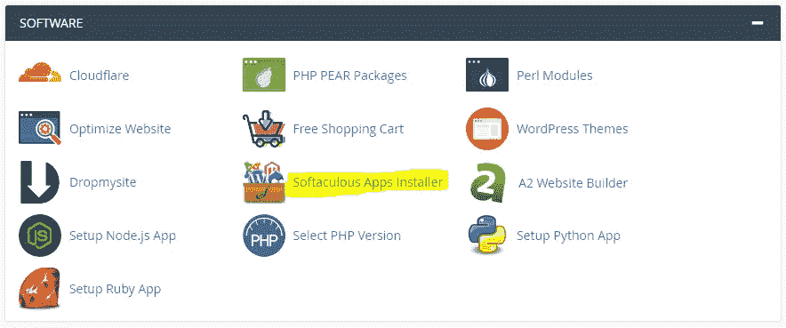
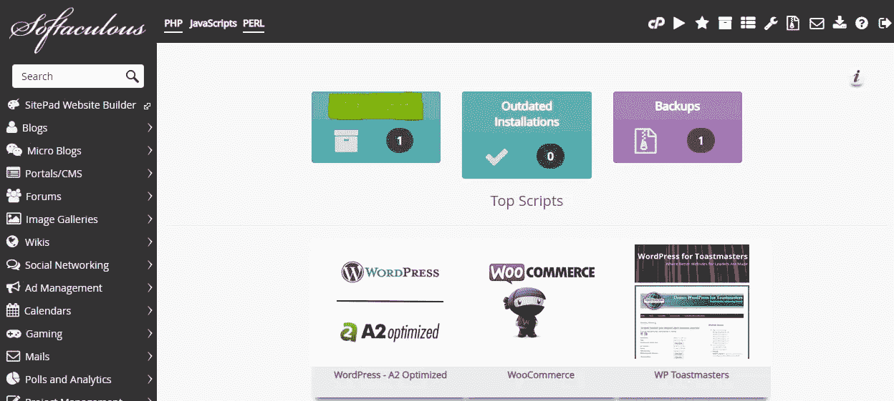
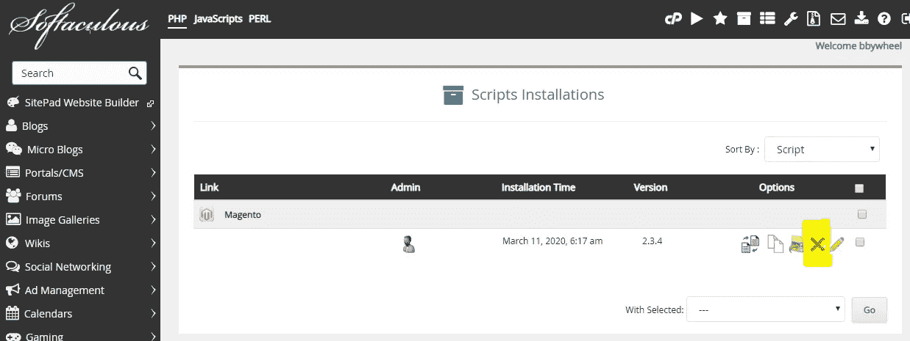
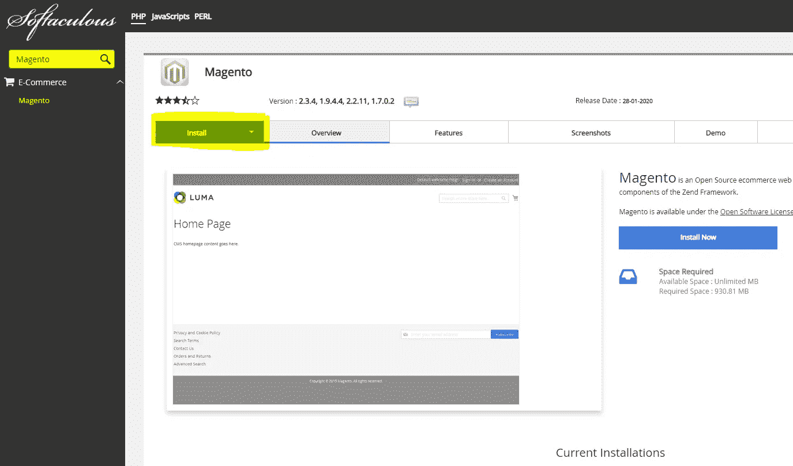
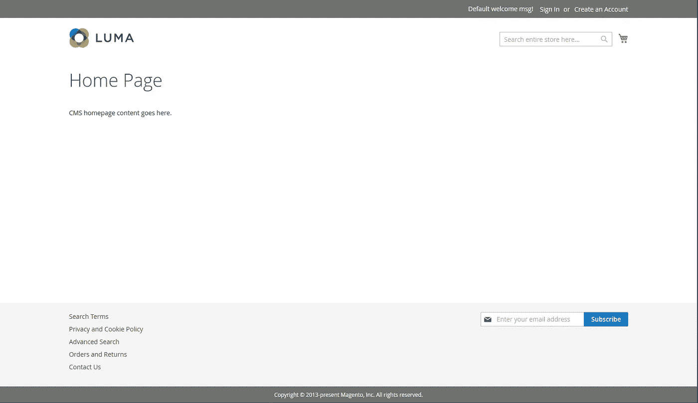
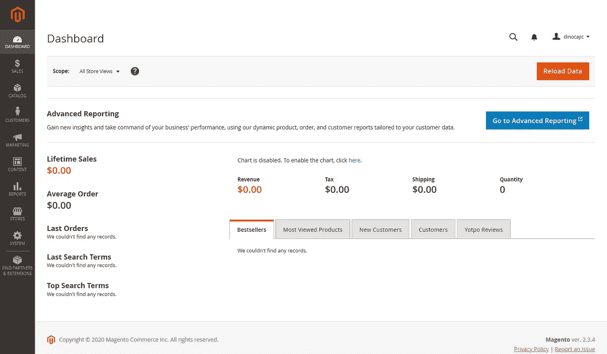

# Magento 2.3 商店(2020 P1):简介

> 原文：<https://levelup.gitconnected.com/magento-2-3-store-2020-p1-intro-69b2ab73fde8>

建立一个电子商务网站有许多不同的方法。我想向你们展示另一种方法。

我看过许多不同的教程，它们似乎无处不在。它们对你来说可能非常有意义，但是我的程序员身份在 30 分钟后开始感到焦虑。不要担心…这不是一个编程教程(我可能会在另一个时间点做一个)。

> *“你到底为什么要这样做？”*

这是我在观看这些教程时无数次问自己的问题。我总是决定从头到尾看完/读完它们，看看最后是否一切都有意义，我可以自动采取不同的方法，但不幸的是大多数时候都不会这样。

经过几个月的漫不经心地接近 Magento，我终于为自己找到了一个可能对你们中的一些人也有好处的惯例。

这里有一些困扰我的事情，以及我们将如何处理它们。

1.  让我们从创建一个产品开始。当我们创建产品时，让我们为这个产品创建属性。既然我们已经将所有这些属性添加到了产品中(在 Catalog -> Product 部分中)，让我们继续添加更多的产品。原来我们需要一个新的属性，让我们回去添加它，并再次修改所有这些产品，以包括新的属性。

甚至写作也让我的肌肉紧张。我更喜欢先计划属性，然后再解决产品。这并不意味着我们在 Magento 网站上开始做任何事情之前都要计划好每一件事情。但是我们将一次处理一种产品类型，提出该产品类型的属性(特征)，然后将产品添加到我们的网站。

2.从修改徽标、页眉和页脚开始。

大多数人想在网上销售产品。在一定程度上，你越快让他们到达那里，他们就会感觉越好。当这些教程开始修改页眉和页脚时，你的注意力就会转移到 UX 身上。本应是更有意义的事情的焦点现在转移到了修改网站的外观上。

你想跳到更有意义的部分，但是你觉得你需要看/读整个过程，否则你会错过前一部分的一些东西。

我们将首先关注有意义的东西。我们在努力学习 Magento。否则我们为什么要看/读这些教程？我们这样做不是为了向客户展示网站；我们在探索。我们需要知道它是如何工作的。如果我们向客户展示这个，那么很可能我们已经有了使用 Magento 的经验，如果我们查找教程，它们是非常具体的。

3.在产品、客户、UX 等之间来回跳跃。

当有人不知道如何组织他们的想法，所以他们只是来回跳。这个问题让我很焦虑:“到底发生了什么？我们在哪里？”

我们将一次专注于一件事。

我们要做一个书店。我说出来了。为什么是书店？因为目前只有一种产品，我们都熟悉书籍。我考虑了许多不同的产品，每一个似乎都很复杂。这并不意味着我们会在书店的设计中忽略复杂性。这只是意味着我们不必陷入比这复杂 100 倍的事情。

这样一来，我想我们需要从某个地方开始:让我们从安装开始。

你可以安装 Magento(对于更高级的用户)或者进入一个已经预先配置好的环境。预先配置好的环境可以通过托管公司获得，比如 [A2 托管](https://www.a2hosting.com/magento-hosting/2)(不是推广，只是我发现的便宜有效的东西)。当你购买它的时候，它应该会自动选择所有 Magento 的东西。如果不行，就换 Magento。我发现这个过程毫不费力。设置一切确实需要一些时间，所以请耐心等待。完成后，他们会给你发电子邮件(可能需要一天左右)。

如果你搞砸了，你可以通过进入**cPanel->Softaculous App Installer->Installations**删除安装来重新安装商店。

然后回到 Softaculous 应用安装程序并重新安装它。

> 如果你是 Windows 用户，[下面是我关于如何在 Windows 10 上安装它的教程](https://medium.com/@dinocajic/magento-2-3-windows-install-2020-d0073931a4ab)。

如果你是一个 Linux 用户，你可能有一些编程经验，可以搞清楚(我只是刻板印象)。它可以在 Ubuntu 18.04 上完美运行。Mac 用户，我安装过一次，由于速度非常慢，不得不从 Macbook Pro 上卸载。

这是你完成后主页的样子。

你的管理面板应该是这样的。

1.  我们卖什么？*书籍。*
2.  我们有图片、产品描述、价格等吗？*是的。*
3.  我们还会卖其他东西吗？很可能，但目前只是书籍。
4.  我们是面向零售(B2C)、批发(B2B)还是两者都有？在本教程中，我们将解决这两个问题。
5.  我们还会有其他类别的买家吗？*是的。将有 4 层批发客户。每一层将获得不同的折扣。*
6.  我们会在全球销售还是只在一个国家销售？*在单个国家。*

这是一个好的开始。你会想问自己一些其他的问题，但是我们不希望这个问题变得太难回答。

**目前就这样。接下来我们将看看属性及其含义。**

我们将从后面开始工作，稍后再考虑美学问题。我们甚至在相当长的一段时间内都不会换 logo。

## 航行

[P0: Magento 2.3 Windows 安装(2020)](https://medium.com/@dinocajic/magento-2-3-windows-install-2020-d0073931a4ab)
[**P1:Magento 2.3 商店(2020 P1):简介**](https://medium.com/@dinocajic/magento-2-3-store-2020-p1-intro-69b2ab73fde8)
[P2: Magento 2.3 商店(2020 P2):属性—了解你的产品](https://medium.com/@dinocajic/magento-2-3-store-2020-p2-attributes-get-to-know-your-product-a24f909dac18)[P3:Magento 2.3 商店(2020 P3):属性集](https://medium.com/@dinocajic/magento-2-3-store-2020-p3-attribute-sets-1550d083906a)

迪诺·卡希奇目前是 [LSBio(寿命生物科学公司)](https://www.lsbio.com/)、[绝对抗体](https://absoluteantibody.com/)、 [Kerafast](https://www.kerafast.com/) 、[珠穆朗玛生物科技](https://everestbiotech.com/)、[北欧 MUbio](https://www.nordicmubio.com/) 和 [Exalpha](https://www.exalpha.com/) 的 IT 负责人。他还担任我的自动系统的首席执行官。他有十多年的软件工程经验。他拥有计算机科学学士学位，辅修生物学。他的背景包括创建企业级电子商务应用程序、执行基于研究的软件开发，以及通过写作促进知识的传播。

你可以在 [LinkedIn](https://www.linkedin.com/in/dinocajic/) 上联系他，在 [Instagram](https://instagram.com/think.dino) 上关注他，或者[订阅他的媒体出版物](https://dinocajic.medium.com/subscribe)。

阅读 Dino Cajic(以及 Medium 上成千上万的其他作家)的每一个故事。你的会员费直接支持迪诺·卡吉克和你阅读的其他作家。你也可以在媒体上看到所有的故事。