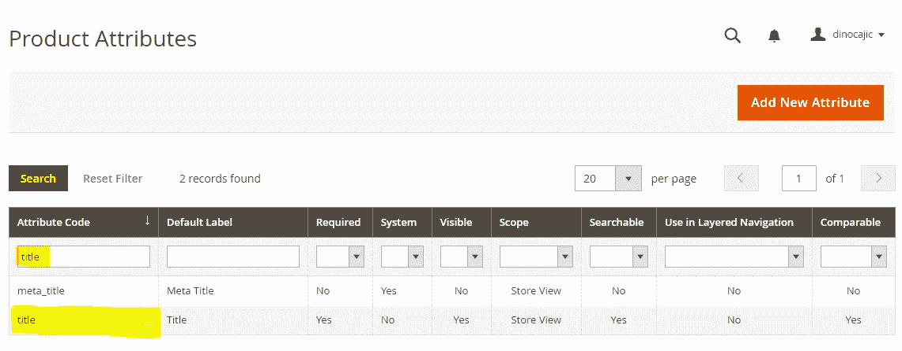
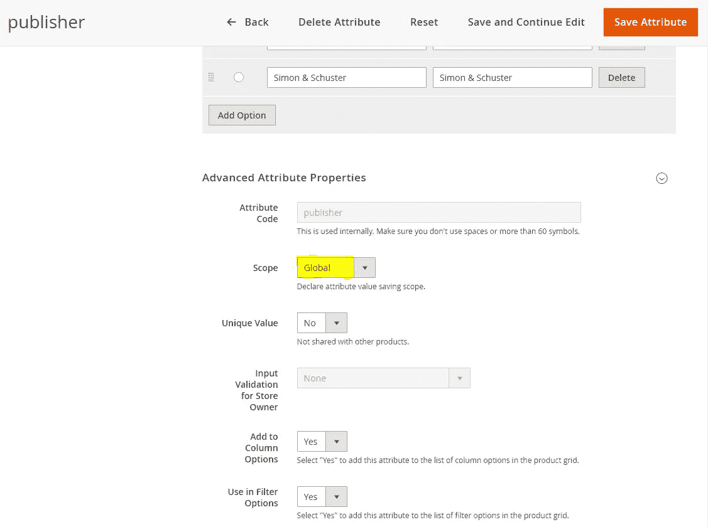

# Magento 2.3 商店(2020 P2):属性—了解你的产品

> 原文：<https://levelup.gitconnected.com/magento-2-3-store-2020-p2-attributes-get-to-know-your-product-a24f909dac18>

我们中有相当多的人会让某些单词变得比实际需要的更难。如果我们不精通技术，而我们开始关注技术，我们往往会把最简单的事情复杂化。很多人问过我 Magento 中的属性是什么。

一个*属性*是一个特征。从字面上看，那是它的同义词。你可能会被问到，或者至少听到被问到的问题，“那个人有什么特点？”+

这里有一篇文章谈论[真正有趣的人的 10 个特征](https://www.inc.com/allison-fass/jessica-hagy-interesting-people-characteristics.html)。

> 特征:典型地属于一个人、一个地方或一件事物的特征或品质，用来识别它。

顾名思义，事物都有特性。一本书是一个东西，因此有特点。在正式审视一本书的特点之前，让我们记下一些更明显的特点。每本书都有一个(n):

1.  国际标准图书编号
2.  标题
3.  作者
4.  出版者
5.  编辑
6.  类型
7.  页数

这是这本书的一些属性(另一个同义词)。

如果你曾经做过网络开发，并且想涉足结构化数据(强烈建议)，那么你可能已经去过 Schema.org 的。在本教程中，我们不需要了解任何关于 Schema.org 的知识，只需要知道在定义产品属性时，它是一个非常好的资源。你不必考虑这本书的每一个属性，因为其他人可能已经考虑过了，并把它们添加到了 Schema.org 的作品中。

让我们看看 Schema.org 为一本书列出的所有不同属性。

查看页面，你可以很快看到一本**书**继承了一部**创造性作品**的特点，也继承了一件**事物**的特点。

是的，它们非常详细。我们不需要实现本页列出的每个属性，但是让我们看看是否可以从上面扩展我们的列表:ISBN、标题、作者、出版商、编辑、流派、页数。

非常欢迎您尝试实现您认为必要的所有不同属性，但是我只打算再实现几个:

1.  插图画家
2.  图书格式
3.  观众
4.  版权持有者
5.  版权年
6.  出版日期
7.  语言

我认为这给了我们一份很好的名单。你可能很想在你的特性列表中添加一些类似于**描述**和**图像**的东西，但是我们处理的是 Magento，Magento 有一些现成的标准特性。

在我们研究其中一些特征之前，只需要知道 Magento 和其他电子商务平台希望尽可能抽象。他们想给你能力去卖任何你想要的东西。所以所有的产品都会有一定的特性，不管是什么。每个产品将有一个图像，描述，重量(如果不是数字)，价格，成本等。让我们来看看 Magento 中一个*产品的*特征。我们不会在这里添加任何东西，但是很高兴看到一个通用产品有什么特征。

登录到 Magento 站点的管理部分。

在左侧点击**目录- >产品**。

你不应该有任何产品(除非你用可选数据安装了 Magento)。点击**添加产品**按钮。

在这里你会看到任何产品都会有的特性。它会有**产品名称**、 **SKU** 、**价格**、**税级**、**数量**、**重量**等。这些属性不需要添加到我们的自定义属性列表中，因为它们已经在这里了。我们甚至可能会选择从现有列表中删除一些属性，因为它们可能会与其中一些重叠，或者我们可能会将它们留在一些显式的搜索引擎优化中。我正在考虑的是下面列出的**产品名称**与我们之前创建的**标题**。**产品名**可以是任何东西，比如**最佳编程书籍**，所以显式地拥有一个表明书名的属性可能更有益。

还有，注意那个页面上的**属性集**；设置为**默认**。这只是说下面的细节描述了一个**默认的**产品。一旦我们为我们的产品(书籍)创建了所有的属性，我们将把它们分配到一个类别(属性集)，我们将能够从下拉列表中选择它。我们将在下一节介绍并创建**属性集**。

再向下滚动一点，你会看到一个**内容**类别。展开它会产生两个 WYSIWYG *(所见即所得)*编辑器。一个用于**描述**，另一个用于**简短描述**。这似乎是一个放置我们书籍描述的好地方。

再往下，你会看到**图片/视频**部分。这似乎是放置**图像**属性的好地方。

现在我们知道 Magento 在它的产品页面中列出了哪些属性，我们可以回过头来真正专注于我们的属性。我喜欢假装我正在建立一个数据库来存储所有这些信息。如果你是一名程序员，只要知道我们这里有各种各样的读者；我们并不试图使数据库正常化，只是列出细节。对于非程序员来说，忽略前面那句话。假设您正在创建一个 Excel 表，并且希望在每一行中存储一本书。您的属性将是您的列名。

一个更正式的模型可能是这样的。

当我们对这本书的属性完全满意后，就该把它们添加到 Magento 中了。从左侧菜单中，选择**商店- >属性- >产品。**

你会看到 Magento 预装了相当多的属性。点击**添加新属性**按钮。

我们将添加几个不同类型的属性，我将剩下的部分留给您自己添加。

让我们从创建**标题**属性开始。为**默认标签**输入**标题**，为店主的**目录输入类型输入**文本字段**，为所需**的**值输入**是**。点击**保存并继续编辑**。**

**默认标签**是您在输入产品详情时看到的。它会说**标题**。**目录输入类型**是您将看到的表单输入字段。请看下图，了解文本字段和下拉菜单之间的区别。

我们什么时候使用文本字段而不是下拉菜单？当您有大量唯一输入时，可以使用文本字段。书名就是一个很好的例子。外面有数百万本书。你不想把每一个都输入到一个下拉菜单中，然后从中选择。有相当少的出版商，所以你可能想把它们添加到下拉菜单中。这将确保你不会无意中犯拼写错误。此外，如果出版商改变了它的名字，你就不必回去为成千上万使用过该出版商的书改名；您可以返回到这个页面，编辑属性，它将被应用到列出该出版商的每本书。

您还需要选择**所需值**旁边的**是**，因为每本书都有一个标题，所以您需要输入它。

保存后，展开**高级属性属性**部分。您会注意到**属性代码**有一个不可编辑的文本字段，列出了**的标题**。这是唯一的标识符，不能更改。让我们将**范围**从**商店视图**更改为**全局视图**，并点击**保存并继续编辑**。

在页面顶部，您会注意到出现了一条消息。我们很快就会谈到这一点。

点击**管理标签**编辑将出现在客户将看到的产品页面上的标签。在文本框中输入**标题**并点击**保存并继续编辑**。

点击**店面属性**。在搜索下拉菜单中选择**是**。这将使顾客能够按书名搜索图书。为在高级搜索中可见的**选择**是**，允许您的客户在网站的高级搜索部分按书名搜索图书。店面**上**可比选择**是**。这使得顾客在比较产品时可以看到标题。如果这本书的标题是你的产品名称，那么你可以把它设置为**否**，这样就不会重复。**

向下滚动并选择**是**作为店面目录页面上可见的**。**这将使属性在产品页面的“附加信息”标签中可见。产品列表中使用的**选择**是**。**这包括出现在目录列表中的产品摘要的属性(针对某些主题)。在产品列表中**选择**是**。当显示多个产品时，会出现一个排序依据下拉菜单。如果启用，它将允许访问者按标题对产品进行排序。如果您的产品名称与您的标题相同，您可能需要禁用此功能。点击**保存属性**进行保存。**

让我们简单回顾一下出现在顶部消息。如果你有主机，很可能你只会看到一条消息。如果您自己管理这个，您可能会看到两条消息:一条是索引器无效，另一条是缓存无效。在这一点上，他们的意思并不重要。要知道，如果你想让你的改变在管理面板和店面中得到反映，你就要让这些信息消失。

对于那些看到这两条消息的人，让我们从索引器开始。在 Windows 上，打开**命令提示符**并将 CD 放入安装 Magento 的文件夹。如果你使用的是 XAMPP 的默认位置，那么最有可能是在 **C:\xampp\htdocs\magento2** 。在 Ubuntu 中，你最有可能在 **/var/www/html/magento2 中。**

现在，运行以下命令:

**php bin/magento 索引器:reindex**

如果不能，那么很可能你的路径中没有添加 PHP(Windows 10)。你可以[在这里](https://medium.com/@dinocajic/add-xampp-php-to-environment-variables-in-windows-10-af20a765b0ce)了解如何添加。

如果一切正常，您将看到如下内容。

返回到您的属性页面并刷新页面。你会发现你现在只有一条信息。点击**缓存管理**链接。

请注意，**页面缓存**状态为**无效**。勾选复选框，点击**提交**刷新缓存。

这条信息现在消失了。

让我们回到**商店- >属性- >产品**。在**属性代码**文本框中输入**标题**，点击**搜索**。您将看到您的新属性。恭喜你，你刚刚创建完你的第一个属性。

对 ISBN、作者、编辑、页数、插图和出版日期重复完全相同的过程。您可以根据自己的喜好调整一些值。例如，你可能不希望书籍按照 ISBN、编辑器和插图进行分类。因此，在产品列表下拉列表中选择**为**否**。您可能还希望管理员可以选择输入一些字段。例如，编辑、插图和出版日期应该是可选的。从**所需值**下拉列表中选择**否**。最后，对于页数、插图、编辑和出版日期，您可能应该将搜索中使用的**设置为**而不是**。****

每本书的 ISBN 都是唯一的，所以您需要通过将**高级属性属性**部分中的**唯一值**设置为**是**来为管理员添加额外的验证级别。

现在我们已经完成了这些，我们需要创建其余的属性:出版商、图书格式、读者、版权所有者、版权年份和语言。与众不同的是，它们将采用下拉格式。

为什么要下拉？对我来说，有三个主要原因:

1.  **一致性**。每个类别都有数量有限的选项。世界上可能没有数百万的出版商。您将把出版商添加到下拉列表中，并根据需要扩大列表。如果只是一个文本字段，每个管理员输入的出版商名称可能会略有不同。使用下拉菜单，可以确保一致性。
2.  **维修**。假设出版社改名了。然后呢？嗯，如果我们使用文本字段，我们将不得不打开使用该出版商的每本书，并单独更改其名称。根据书籍的数量，这可能需要很长时间。如果你懂 SQL，你可能在几分钟内就能完成，但是如果你不懂，你就被困住了。通过下拉菜单，你可以修改属性的选项，这在任何地方都可以反映出来。
3.  **过滤性**。如果你访问大多数电子商务网站，在页面的左侧你会看到一个过滤选项。它允许您缩小初始搜索范围。假设你搜索 t 恤。它可以让你根据尺寸、颜色、面料等缩小搜索范围。在 Magento 中，要使过滤器选项工作，你必须使用四种输入类型之一:是/否、下拉、多选和价格。

让我们一起创建第一个:Publisher。导航至**商店- >属性- >产品**，点击**添加新属性**按钮。

输入**出版商**作为**默认标签**，选择**下拉框**作为**店主的目录输入类型，**选择**是**作为**所需值**(您可以根据需要灵活选择，因此您可能希望为该属性选择**否**)。点击**保存并继续编辑**。

向下滚动页面，查看刚刚显示的管理选项部分。

点击**添加选项**按钮，添加下列选项。持续点击**添加选项**添加更多选项。您也可以单击并按住单选按钮旁边的点，然后上下拖动选项来排列它们。您可以添加任意多的选项。完成后，点击**保存并继续编辑**。

进一步向下滚动并展开**高级属性属性**部分。将**范围**改为**全局**。点击**保存并继续编辑**。

点击**管理标签**并在文本字段中输入**出版商**。点击**保存并继续编辑**按钮。

展开**店面属性**部分。和之前一样，选择**是**用于**在搜索**，选择**在高级搜索**可见，选择**在店面**可比。接下来，我们将选择**Filterable(with results)**用于分层导航中的**。我们稍后将创建类别，并将产品添加到类别中。筛选选项将适用于这些类别。我们还想选择**是**用于**在搜索结果分层导航**中使用。这允许过滤器选项在访问者可能执行的搜索中可用。我们将把**位置**设置为 **0** 。这表示我们希望这个属性首先出现在过滤器选项中。其余的属性将是 1、2、3 等等。Price 已经被启用并设置为 0，所以我们可能需要在以后修改它，让它出现在我们想要的地方。**

向下滚动选择**是**店面目录页可见的**，商品清单**中使用的**，商品清单**中用于排序的**。点击**保存属性**按钮进行保存。**

对图书格式、读者、版权所有者、版权年份和语言重复该过程。此外，这次对其他一些选项也要运用你的判断力。例如，您真的需要图书格式是可搜索的吗？访问者真的需要能够被版权所有者过滤吗？

以下是我对每一个问题的建议:

1.  书籍格式:精装、平装。
2.  受众:成人、儿童、专业人士。
3.  版权所有者:出版商，作者
4.  版权年:添加你选择的几年。我是从 2000 年加到 2020 年。
5.  语言:选择一些你最喜欢的语言，如英语、德语、西班牙语、汉语、日语。

我们还有一个属性要添加:流派。你可能会认为这个流派是下拉菜单的绝佳选择。然而，一本书可以分为多种类型。因此，我们将创建一个**多选**列表。如果您以前从未使用过它，在多选列表中选择多个项目的方法是按住 CTRL 键并单击每个选项(Windows 用户)。

添加一个新属性，并为属性部分输入以下信息。

打开**管理标签**部分，在文本字段中输入**流派**。

展开**店面属性**部分并输入以下内容。

添加第一个产品后，我们将再次访问**位置**，我们可以看到这些过滤器选项出现在哪里。现在，我只是放置了 **5** 。您还会注意到，产品列表中用于排序的**是灰色的。由于你可以选择多个类别，这真的很难按流派排序，所以它是禁用的。**

保存属性。像以前一样通过运行以下命令来重新索引:

> php bin/magento indexer:reindex

点击警告消息中的**缓存管理**链接，像之前一样**刷新**页面缓存**。**

就是这样。我们已经添加了所有需要添加的属性。我们将很快看到如何使用这些属性。请记住，这样做的目的是在我们开始添加产品之前设置产品的特征。放松，让它消化。下一部分再见。

## 航行

[P0: Magento 2.3 Windows 安装(2020)](https://medium.com/@dinocajic/magento-2-3-windows-install-2020-d0073931a4ab)
[P1:Magento 2.3 商店(2020 P1):简介](https://medium.com/@dinocajic/magento-2-3-store-2020-p1-intro-69b2ab73fde8)
[**P2:Magento 2.3 商店(2020 P2):属性—了解你的产品**](https://medium.com/@dinocajic/magento-2-3-store-2020-p2-attributes-get-to-know-your-product-a24f909dac18)[P3:Magento 2.3 商店(2020 P3):属性集](https://medium.com/@dinocajic/magento-2-3-store-2020-p3-attribute-sets-1550d083906a)

迪诺·卡伊奇目前是 [LSBio(生命周期生物科学公司)](https://www.lsbio.com/)、[绝对抗体](https://absoluteantibody.com/)、 [Kerafast](https://www.kerafast.com/) 、[珠穆朗玛生物](https://everestbiotech.com/)、[北欧 MUbio](https://www.nordicmubio.com/) 和 [Exalpha](https://www.exalpha.com/) 的 IT 主管。他还担任我的自动系统的首席执行官。他有十多年的软件工程经验。他拥有计算机科学学士学位，辅修生物学。他的背景包括创建企业级电子商务应用程序、执行基于研究的软件开发，以及通过写作促进知识的传播。

你可以在 [LinkedIn](https://www.linkedin.com/in/dinocajic/) 上联系他，在 [Instagram](https://instagram.com/think.dino) 上关注他，或者[订阅他的媒体出版物](https://dinocajic.medium.com/subscribe)。

[*阅读迪诺·卡吉克(以及媒体上成千上万其他作家)的每一个故事。你的会员费直接支持迪诺·卡吉克和你阅读的其他作家。你也可以在媒体上看到所有的故事。*](https://dinocajic.medium.com/membership)