# Magento 2.3 商店(2020 P3):属性集

> 原文：<https://levelup.gitconnected.com/magento-2-3-store-2020-p3-attribute-sets-1550d083906a>

我们在[之前的文章](https://medium.com/@dinocajic/magento-2-3-store-2020-p2-attributes-get-to-know-your-product-a24f909dac18)中创建了属性，但是它们目前不代表任何东西。它们是可以用来表示任何东西的抽象概念。我们需要将这些属性组合成一个集合，一个属性集，这样我们就知道这些属性属于同一个集合，它们代表了特定的对象。

> 属性集只是属性的集合。

向 Magento 商店添加产品时，我们希望确保指定产品的类型。我们在卖书，所以我们要增加一本书。我们将从下拉列表中选择属性集 **Book** ，这将使我们能够指定代表该对象的所有特征，如 ISBN、页数等。如果我们销售钢笔，选择 Book 作为我们的属性集是没有意义的，因为钢笔没有 ISBN、页码等。

我们开始吧。登录你的管理面板，点击**商店- >属性- >属性集**。

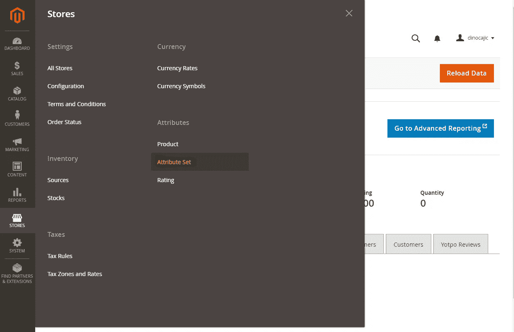

我们将创建一个名为 **Book** 的新属性集，因为这是我们将要销售的产品类型；另外，我们之前创建的所有属性都与书籍相关。点击**添加属性设置**按钮。

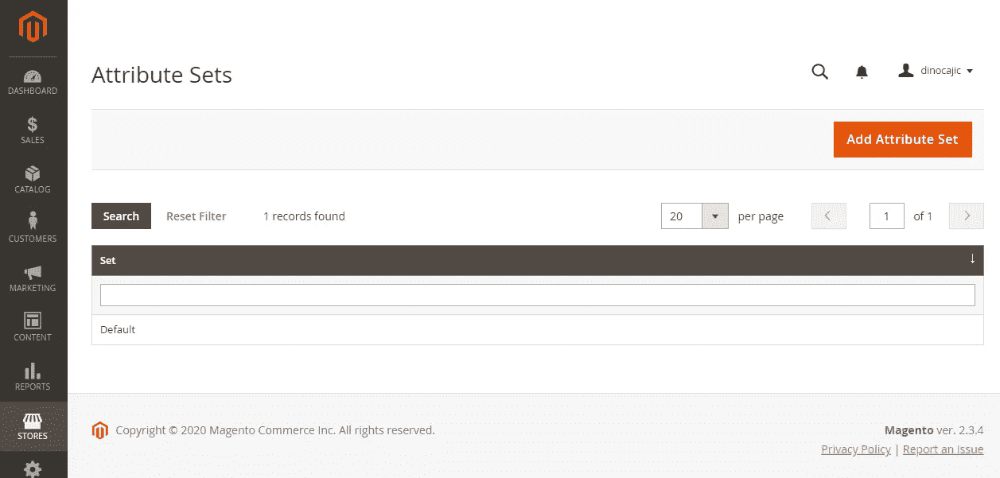

将属性集命名为 **Book** 并将 **Default** 保留为基于选择(您没有其他选择)。为什么基于？嗯，每个属性集都必须基于某些东西(面向对象编程 101)。如果我们有一个**汽车**属性，并且想要创建一个**外国汽车**属性，我们将指定**外国汽车**属性基于**汽车**属性。点击**保存**创建新的属性集。

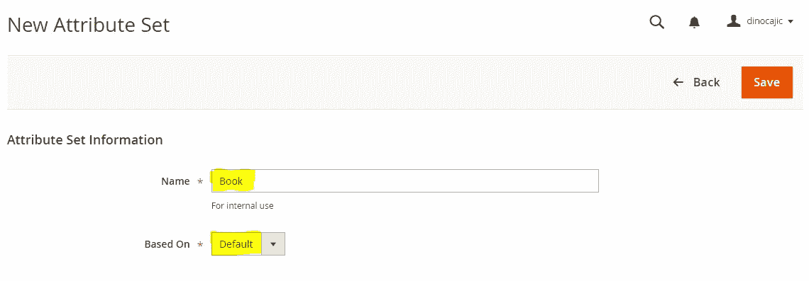

您将被定向到一个新页面，在此您可以将属性添加到属性集。

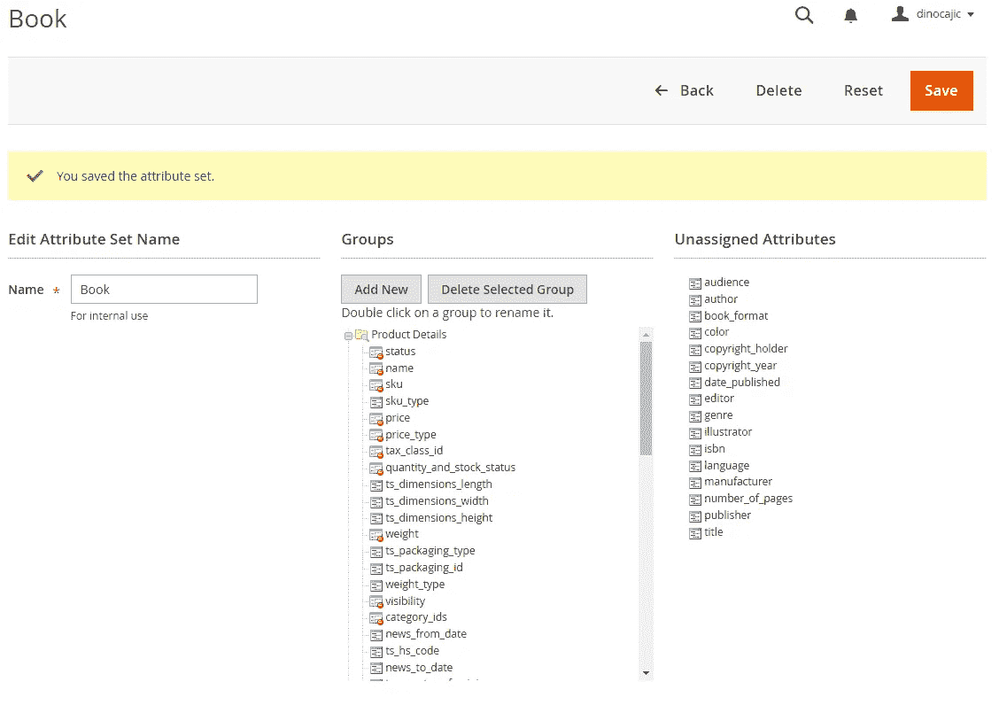

在**组**下，点击**添加新的**按钮，添加新的组。将其命名为 **Book** ，点击确定保存。

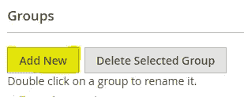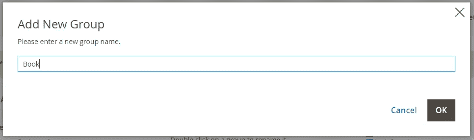

向下滚动到组的底部，你会看到你的新组**书**。

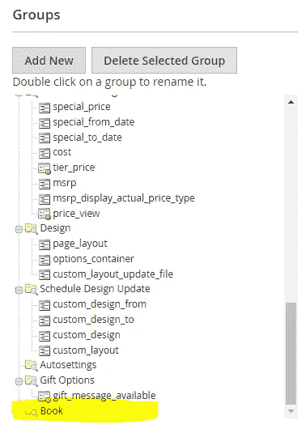

将我们在上一篇文章中创建的每个属性从**未分配的属性**拖到**图书**组中。

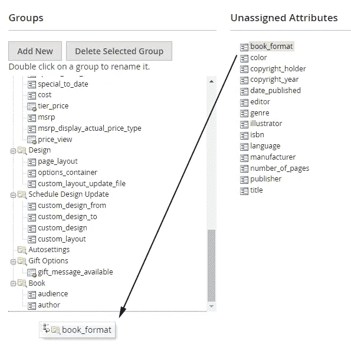

完成后，您应该会看到类似这样的内容。拖放它们有点棘手；在你放下它们之前，你必须让虚线出现。如果你不仅仅是正确的，它不会工作。

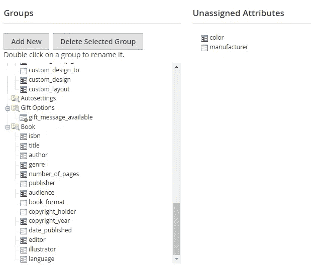

完成后，点击**保存**。

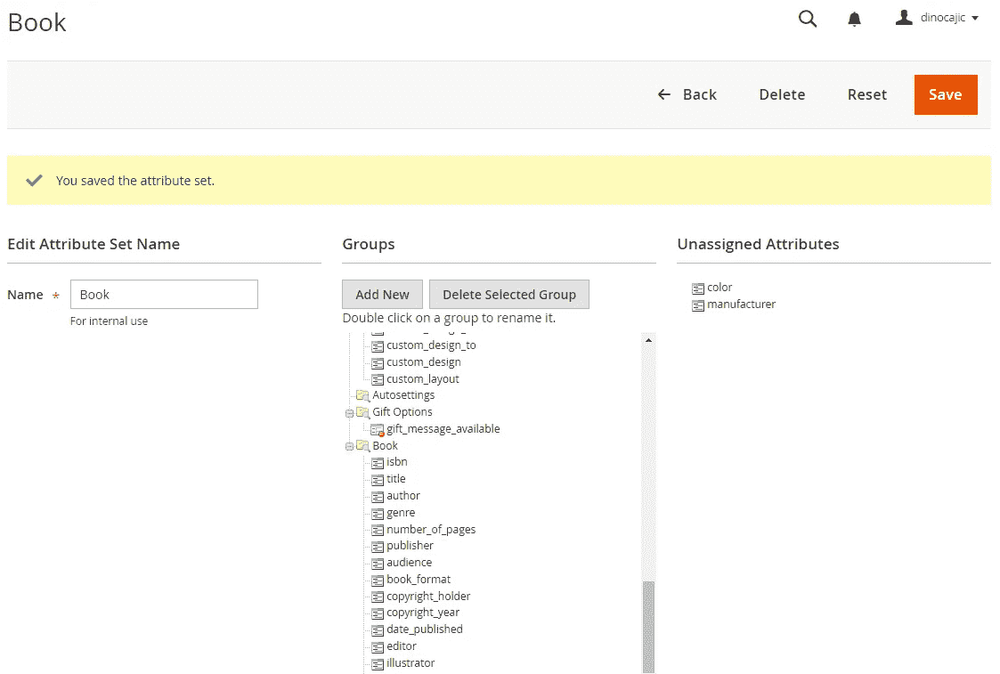

清除所有出现在顶部的消息。它会提示您需要重新建立索引，但是您稍后也必须清除页面缓存。就像之前一样，导航到 magento 安装文件夹并运行:

**php bin/magento 索引器:reindex**

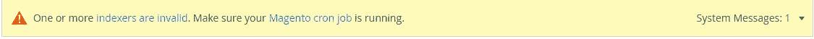

然后刷新页面缓存，返回**商店- >属性- >属性集。**你会看到你的**书**属性集列在集合表中。

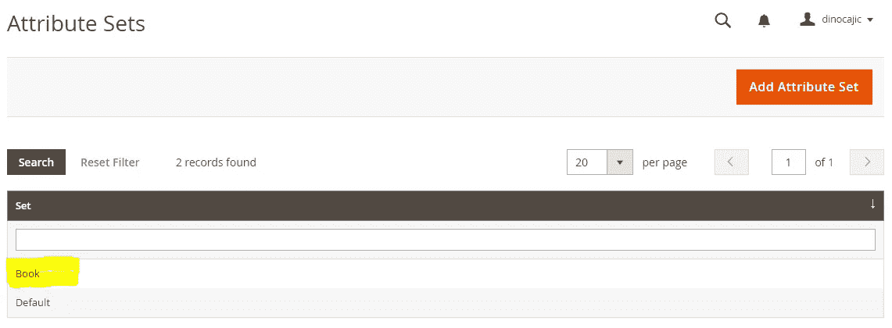

如果您需要向属性集添加其他属性，首先要创建属性，返回到此页面，单击 Book，然后将属性添加到您的图书组。

很好，我们几乎拥有了开始添加产品所需的一切。还有一件事:分类。下次见。

## 航行

[P0: Magento 2.3 Windows 安装(2020)](https://medium.com/@dinocajic/magento-2-3-windows-install-2020-d0073931a4ab)
[P1: Magento 2.3 商店(2020 P1):简介](https://medium.com/@dinocajic/magento-2-3-store-2020-p1-intro-69b2ab73fde8)
[P2: Magento 2.3 商店(2020 P2):属性—了解你的产品](https://medium.com/@dinocajic/magento-2-3-store-2020-p2-attributes-get-to-know-your-product-a24f909dac18)[**P3:Magento 2.3 商店(2020 P3):属性集**](https://medium.com/@dinocajic/magento-2-3-store-2020-p3-attribute-sets-1550d083906a)

迪诺·卡伊奇目前是 [LSBio(生命周期生物科学公司)](https://www.lsbio.com/)、[绝对抗体](https://absoluteantibody.com/)、 [Kerafast](https://www.kerafast.com/) 、[珠穆朗玛生物](https://everestbiotech.com/)、[北欧 MUbio](https://www.nordicmubio.com/) 和 [Exalpha](https://www.exalpha.com/) 的 IT 主管。他还担任我的自动系统的首席执行官。他有十多年的软件工程经验。他拥有计算机科学学士学位，辅修生物学。他的背景包括创建企业级电子商务应用程序、执行基于研究的软件开发，以及通过写作促进知识的传播。

你可以在 [LinkedIn](https://www.linkedin.com/in/dinocajic/) 上联系他，在 [Instagram](https://instagram.com/think.dino) 上关注他，或者[订阅他的媒体出版物](https://dinocajic.medium.com/subscribe)。

[*阅读迪诺·卡吉克(以及媒体上成千上万其他作家)的每一个故事。你的会员费直接支持迪诺·卡吉克和你阅读的其他作家。你也可以在媒体上看到所有的故事。*](https://dinocajic.medium.com/membership)