# Magento 2.3 商店(2020 P4):类别

> 原文：<https://levelup.gitconnected.com/magento-2-3-store-2020-p4-categories-c5e0059f3097>

到目前为止，设置还不错，从现在开始只会越来越容易。在接下来的几篇文章中，我们可能会担心一些棘手的问题，但是这一篇应该是非常简单的。

我们还在准备阶段。这一次我们将添加类别。什么是类别？这是一种将产品分组的方式。在我们的场景中，这是一种将书籍分组在一起的方式。我们可以创建我们想要的任何类别。类别名称可能与我们的一些属性重叠。类别将在我们商店的每个页面上显示为下拉菜单。下面你会看到一个页面上类别的例子。

我们将创建几个不同的类别。我将解释它们与我们已经创建的一些属性有何相似之处，以及有何不同。

1.  **流派**。和我们的流派属性差不多。尽管流派属性可以是特定的，但是我们可以创建我们想要突出显示的宽泛的流派类别。这些可能包括:小说，非小说，神秘，科学，计算机。
2.  **教科书**。我们可以使用类别来突出特定的产品，如果我们正在销售大量的教科书，那么我们可能希望有一个教科书类别，依次列出不同的子类别:商业、计算机、医学、大学等。
3.  **小孩**。你甚至可以针对特定的年龄组。我知道作为父母，我会在给儿子买书时寻找书店的儿童区。子类别可能包括:0-2 岁，2-4 岁，5-8 岁，9-12 岁。

想出一些其他类别，并作为练习添加它们。

让我们打开我们的管理页面，导航到**目录- >类别**。

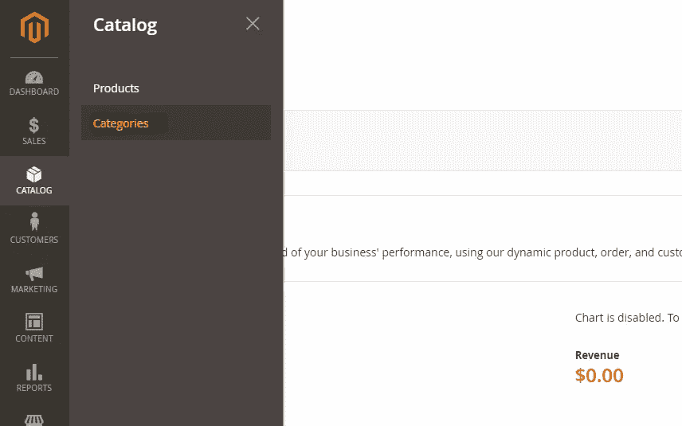

您将看到一个如下图所示的页面。有一个**默认类别**列出。我不喜欢术语**默认类别**，所以我要把它改成**根**。为什么是 Root？因为这个*根*类别将包含我们所有的其他类别(并且因为我是一名程序员)。你想怎么叫都行: **Main** 是另一个我经常用的。

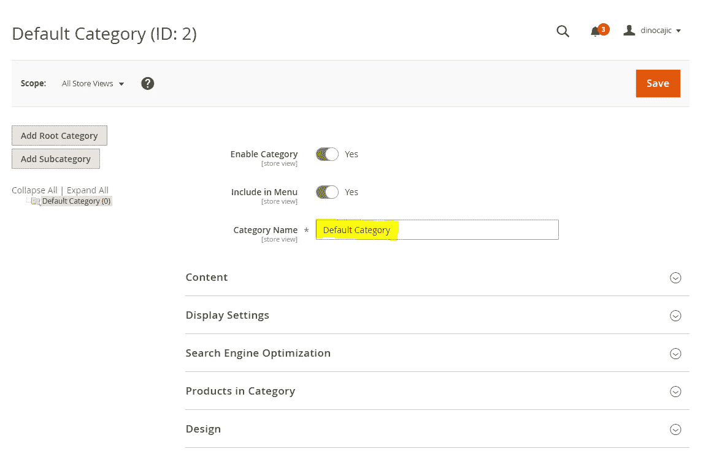

更改名称后，保存它。我们要添加我们定义的类别(流派，教科书，孩子)。由于这些类别中的每一个从技术上来说都是根类别的子类别，我们将点击**添加子类别**按钮。

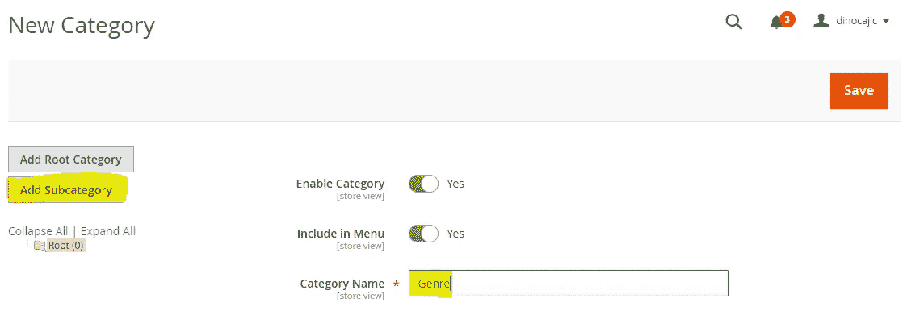

新页面打开后，输入**流派**作为**类别名称**，点击**保存**。你会看到**流派**子类出现在**根**类别下。

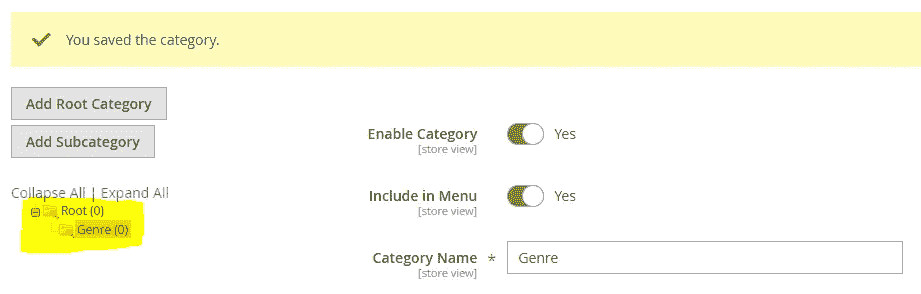

点击**根**将其选中，然后点击**添加子类别**。*如果* ***流派*** *仍然高亮显示，您将为其添加一个子类别(我们将在稍后进行)。*进入**教材**并保存。

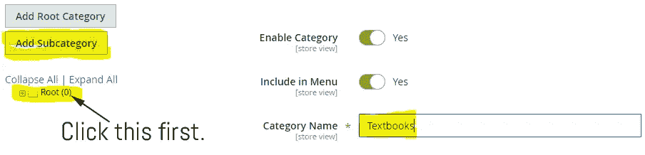

请注意，**教科书**子类别被添加到了与**流派**相同的级别上。

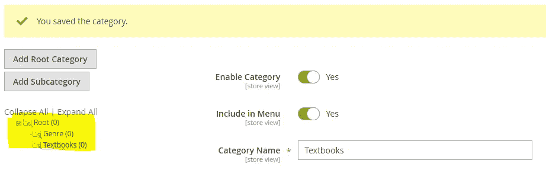

为**的孩子**再重复一次该过程。记得先点击**根**。保存它，你会看到 **Kids** 子类别出现在 **Root** 类别下。

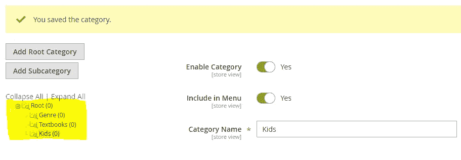

现在是时候为每个子类别添加一个子类别了。突出显示**流派**并点击**添加子类别**。为**类别名称**输入**虚构**，点击保存。你会看到**小说**现在出现在**类型**子类别下。

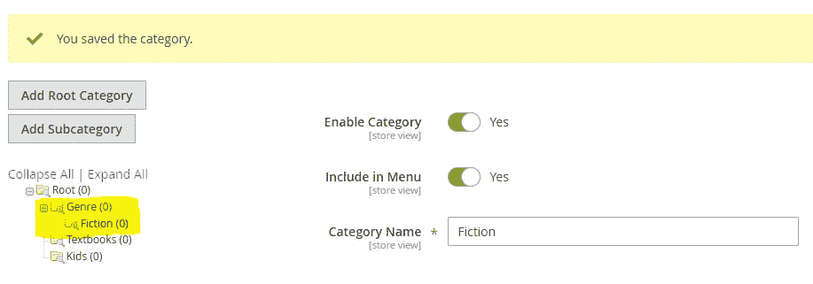

对非虚构、神秘、科学和计算机重复这个过程。记得每次点击**流派**，然后点击**添加子类**。如果你不这样做，你将添加一个子类别到高亮显示的部分。如果你做的一切都正确，你所有的子类别都应该出现在**类别**下。

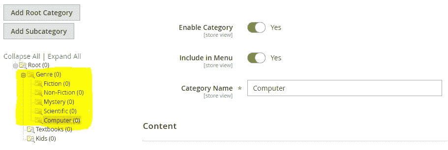

对**课本**(商业、计算机、医学、大学)和**孩子**(0-2 岁、2-4 岁、5-8 岁、9-12 岁)重复同样的过程。一旦你完成了，你会有一个类似这样的页面。

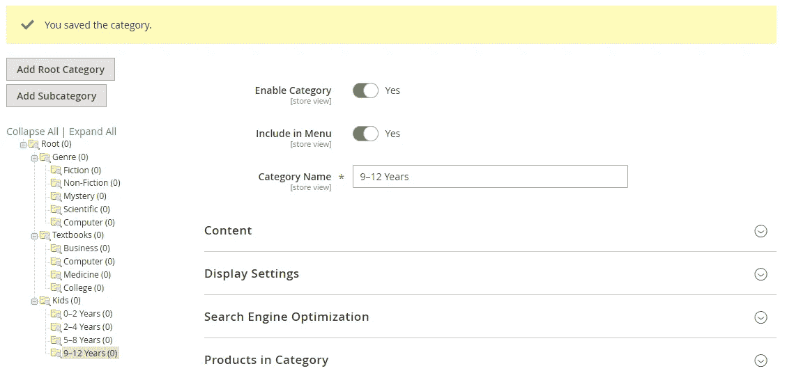

如果你犯了一个错误，或者想重新排列你的子类别，你可以把它们拖放到位。

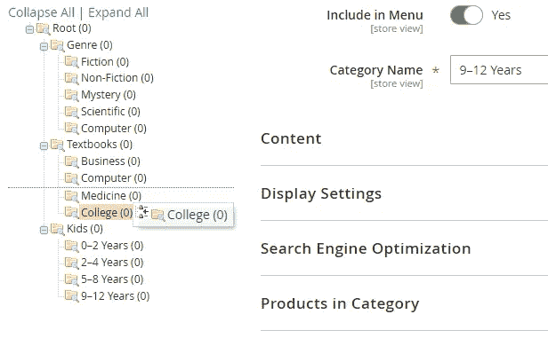

将出现一条消息，提示操作将需要很长时间。点击**确定**继续。

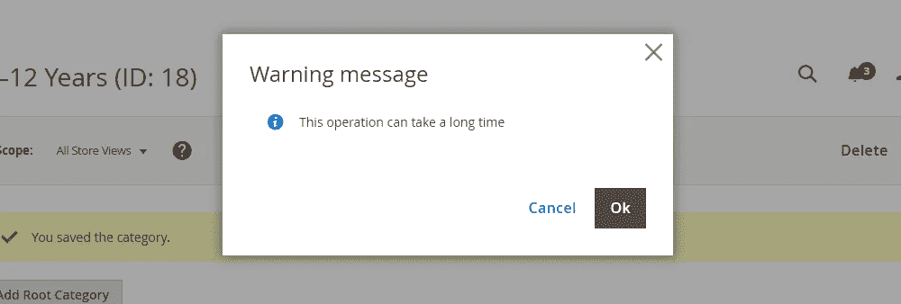

因为您还没有任何与此类别相关的产品，所以真的不会花那么长时间。您可以在屏幕左侧看到您的更改。

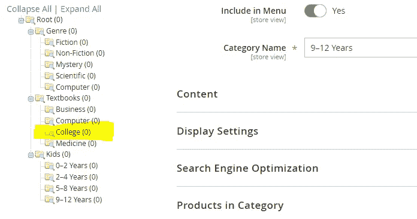

如果你一直密切关注，你可能会注意到每个子类别都有一个**启用类别**拨动开关。

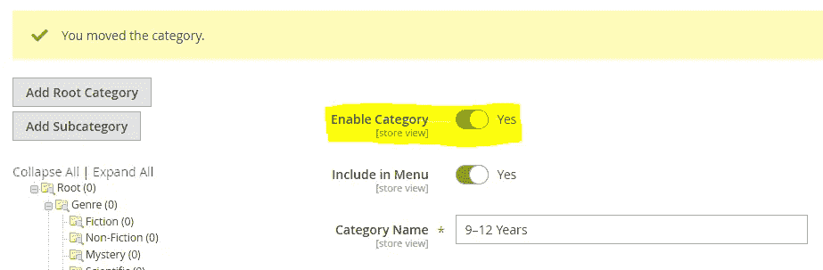

可能会有一天你的商店停止销售某个商品:你可以禁用该类别的商品，并在将来再次开始销售该类别的商品时重新启用它。

我经常使用它，因为我喜欢提前计划。我会列出我计划销售的所有不同类别，即使我还没有它们；我喜欢在添加产品之前添加类别。一旦我开始添加产品，我将启用类别。

您也可以启用该类别，使其在您的产品部分可见，但从菜单中隐藏，方法是切换菜单中的**包含**按钮**。**

现在我们已经添加了类别，我们可以继续添加产品了。

## 航行

[P0: Magento 2.3 Windows 安装(2020)](https://medium.com/@dinocajic/magento-2-3-windows-install-2020-d0073931a4ab)
[P1: Magento 2.3 商店(2020 P1):简介](https://medium.com/@dinocajic/magento-2-3-store-2020-p1-intro-69b2ab73fde8)
[P2: Magento 2.3 商店(2020 P2):属性—了解你的产品](https://medium.com/@dinocajic/magento-2-3-store-2020-p2-attributes-get-to-know-your-product-a24f909dac18)[P3:Magento 2.3 商店(2020 P3):属性集](https://medium.com/@dinocajic/magento-2-3-store-2020-p3-attribute-sets-1550d083906a)[**P4**](https://medium.com/@dinocajic/magento-2-3-store-2020-p4-categories-c5e0059f3097)

迪诺·卡希奇目前是 [LSBio(寿命生物科学公司)](https://www.lsbio.com/)、[绝对抗体](https://absoluteantibody.com/)、 [Kerafast](https://www.kerafast.com/) 、[珠穆朗玛生物科技](https://everestbiotech.com/)、[北欧 MUbio](https://www.nordicmubio.com/) 和 [Exalpha](https://www.exalpha.com/) 的 IT 负责人。他还担任我的自动系统的首席执行官。他有十多年的软件工程经验。他拥有计算机科学学士学位，辅修生物学。他的背景包括创建企业级电子商务应用程序、执行基于研究的软件开发，以及通过写作促进知识的传播。

你可以在 [LinkedIn](https://www.linkedin.com/in/dinocajic/) 上联系他，在 [Instagram](https://instagram.com/think.dino) 上关注他，或者[订阅他的媒体出版物](https://dinocajic.medium.com/subscribe)。

阅读迪诺·卡吉克(以及媒体上成千上万的其他作家)的每一个故事。你的会员费直接支持迪诺·卡吉克和你阅读的其他作家。你也可以在媒体上看到所有的故事。