# Magento 2.3 商店(2020 P5):产品

> 原文：<https://levelup.gitconnected.com/magento-2-3-store-2020-p5-products-37545496095f>

经过一点点准备工作，我们已经将产品添加到我们的商店。我们已经创建了属性、属性集和类别，所以让我们直接开始创建我们的第一个产品。我将使用[我的书](https://www.amazon.com/Illustrative-Introduction-Algorithms-Dino-Cajic/dp/1686863268/ref=tmm_pap_swatch_0?_encoding=UTF8&qid=1586973014&sr=8-1)作为例子，但是你可以添加任何你想添加的书。

登录管理面板，点击**目录- >产品**。

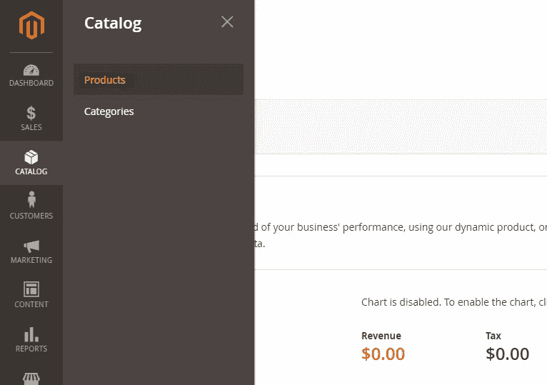

在产品页面上，您会注意到一些有趣的东西。您创建的所有属性都在表格中可见。我们将在下一个教程中学习如何清理这张桌子。现在，只需点击**添加产品**按钮。

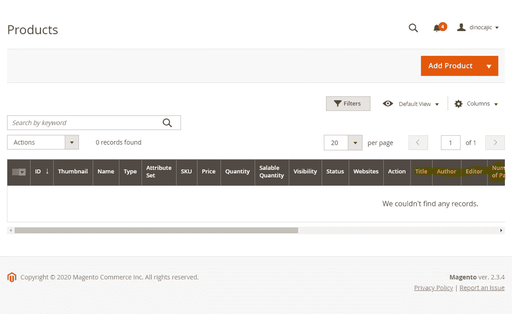

滚动到页面底部，快速记下不同的部分。现在回到页面顶部，从**属性集**下拉列表中选择 **Book** 。

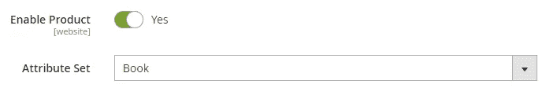

向下滚动，你会注意到一个新的部分出现在你的页面上:**图书**部分。

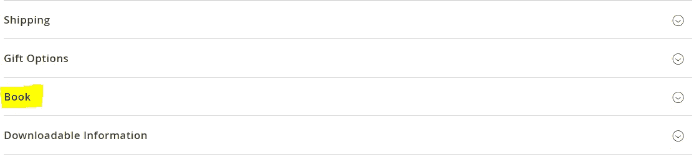

很好，让我们回到顶部，开始填写我们产品的细节。确保在**属性设置**下**图书**仍然被选中。在**产品名称**下，添加书名。对于 **SKU** ，添加图书的 ISBN 号或贵公司内部为产品生成的 SKU。加上这本书的**价格**。保持**税类**为**应税货物**。对于**数量**，添加库存物品数量并选择当前**库存状态**。输入书的重量。到目前为止，这是我的产品详细信息的样子。

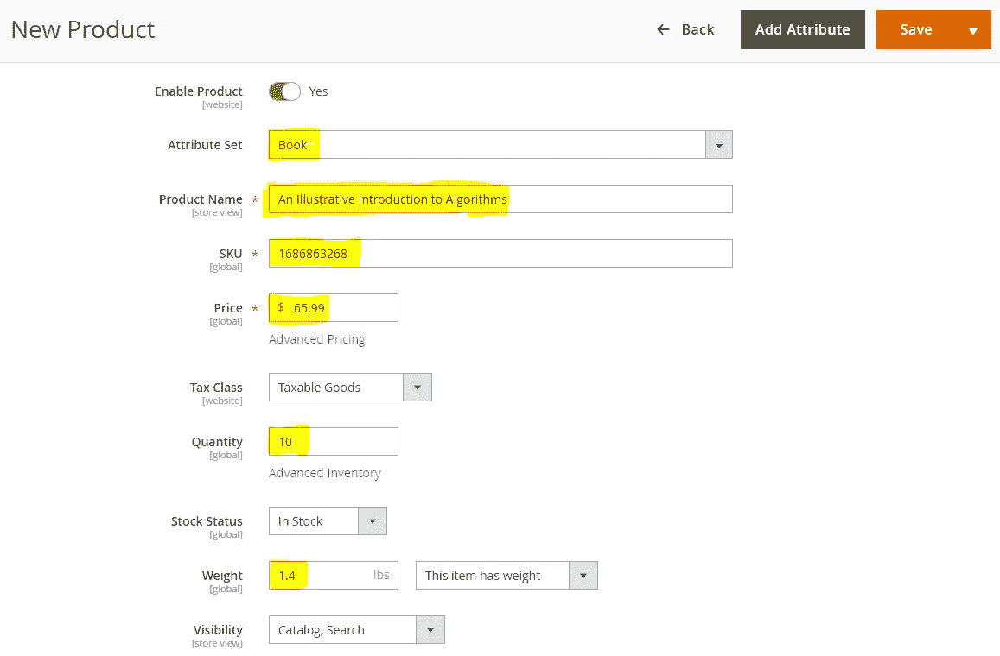

添加图书所属的**类别**。在前一篇文章中，我们讨论了产品类别。这是他们出现的地方。

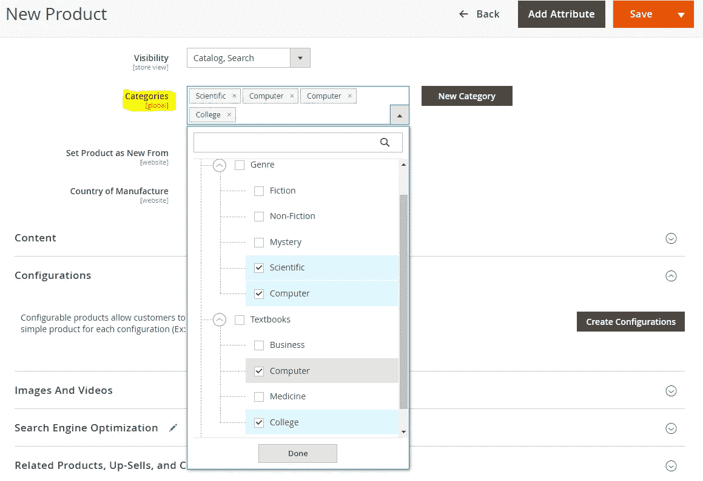

如果您选择这样做，请从类别中选择**将产品设置为新产品的日期范围。这将显示您的产品在特定日期范围内是您网站上的新产品。其他部分，如**生产国**，如果你愿意可以跳过。**

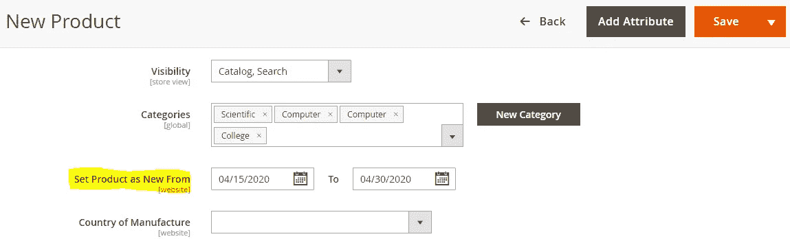

展开本书的**内容**部分，增加本书的**描述**。您也可以向该部分添加图像，但我们在这里不会这样做。

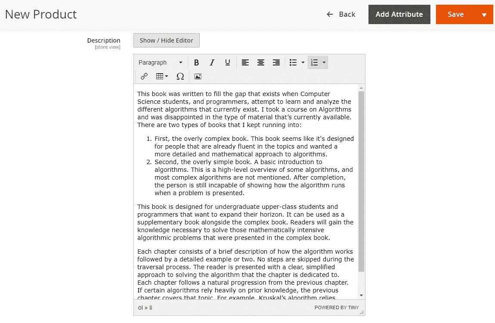

向下滚动并添加简短描述。这也会出现在你的网站上，但是在不同的地方。我通常只是复制第一句话。

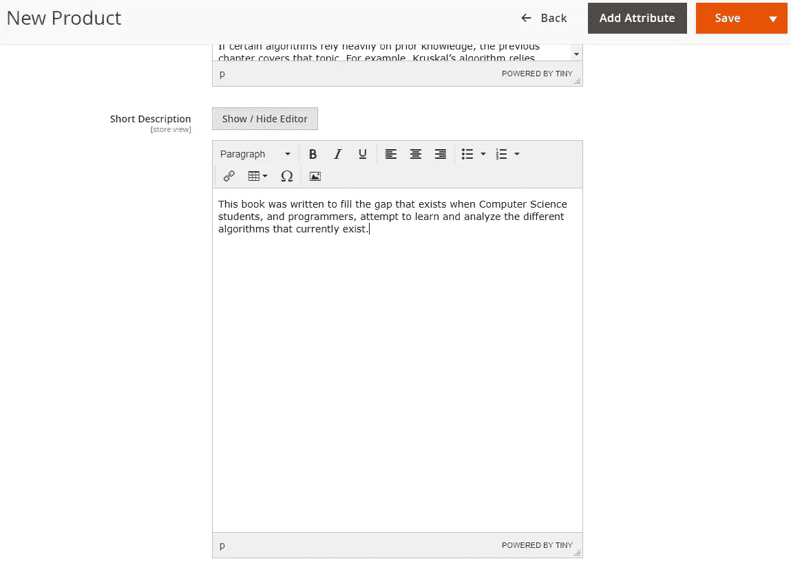

接下来，跳到**图像和视频**。展开该部分并点击**浏览以找到或拖动图像到此处**框。

如果您愿意，可以添加更多图像。您也可以点击**添加视频**按钮来添加视频。在继续之前，您需要指定 YouTube API 密钥，因此我们现在将跳过添加视频。

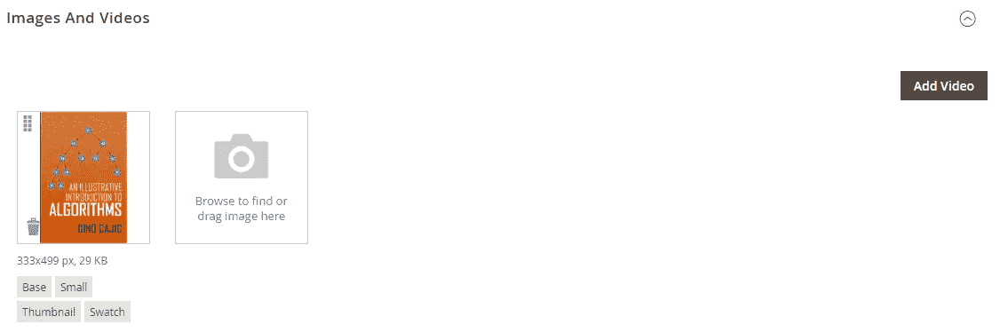

展开**搜索引擎优化**部分，查看已经为您填充的内容。你可以在关键字部分添加更多的条目，但一般来说我建议你不要去管它。你不希望你的商店因试图填充关键词而受到处罚。保存产品后，将自动为您生成 URL 密钥。

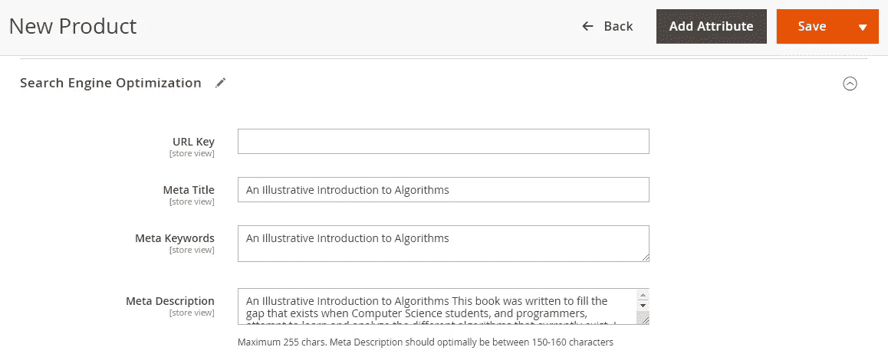

创建更多产品后，您可以通过在**相关产品、追加销售和交叉销售**部分指定来添加相关产品或追加销售。因为这是我们的第一个产品，我们将跳过这一节。

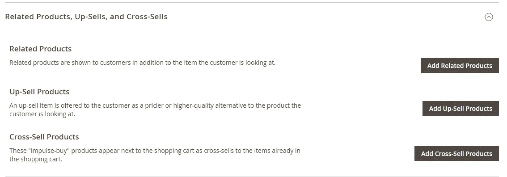

我们也将跳过所有其他部分，直接进入我们的**书**部分。例如，如果这是一件衬衫，并且您希望客户能够选择不同的颜色，那么您可以在**可定制选项**部分中添加选项。我们将在以后的某个时间点回到这个问题上(不是在本文中)。

展开**书本**部分。您会注意到我们创建的所有属性现在都是可见的。继续填写它们。它们应该不言自明。你可以在下面看到我添加的细节。完成后，点击**保存**按钮。

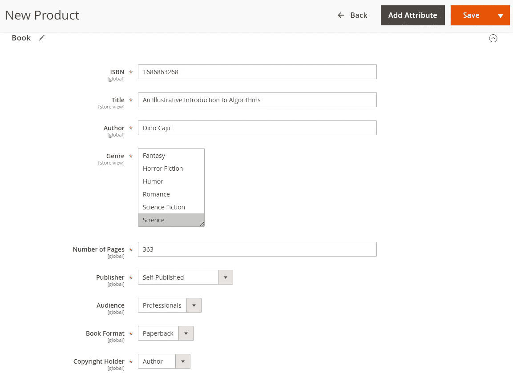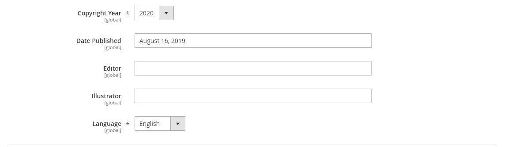

恭喜你！您刚刚添加了您的第一个产品。返回**目录- >产品**，您会看到您的产品列在表格中。

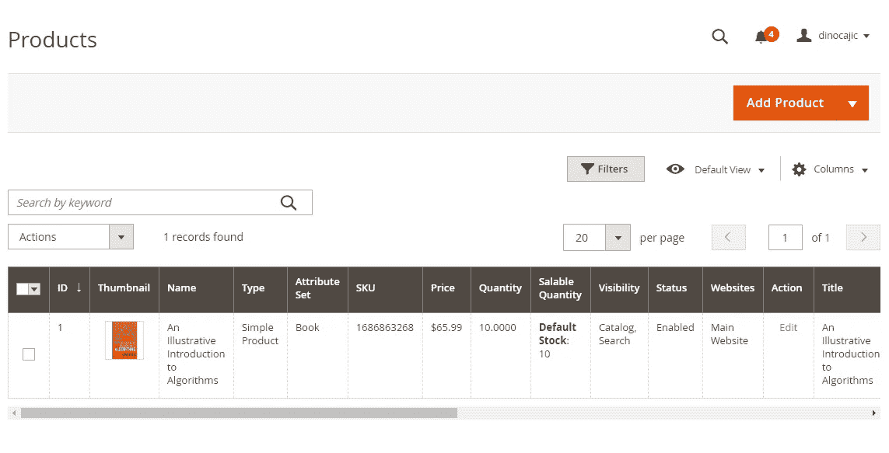

现在，导航到您的主页并刷新该页面。如果你跟随我的第一个教程，你的主页地址将会是 http://local.magento2.com。您也可以将其设置为 http://127.0.0.1/magento2。如果你买了托管，那么就只是你的域名，即 [http://dinocajic.xyz](http://dinocajic.xyz) 。

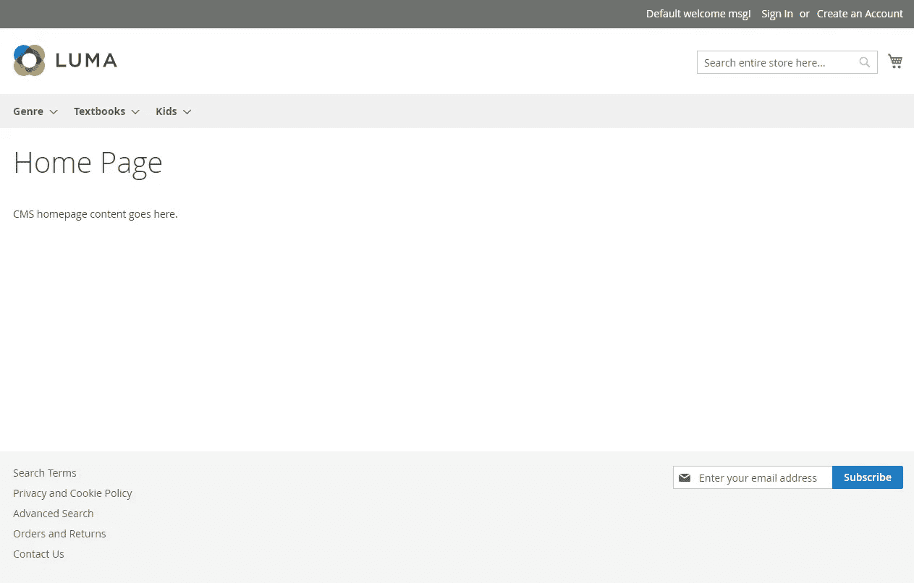

看一下亮度标志的正下方。这是您创建的所有类别。点击你的产品所属的类别。对于我来说，我将产品添加到流派->科学，流派->计算机，教科书->计算机，教科书->大学。我可以点击其中任何一个，我的产品就会出现。

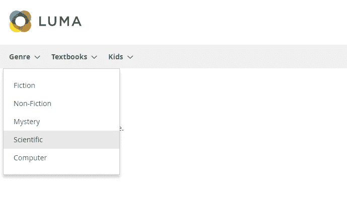

您的产品现在应该会显示出来。看看这一页。将显示图像、书名和价格。页面左侧是**出版商、图书格式、受众、版权年份、语言、**和**流派**购物选项。这些是我们创建的属性，允许用户缩小搜索范围。这些是我们精心设计的下拉菜单。如果您在此页面上列出了多本书，那么将它们缩小到您想要的规格将会非常方便。

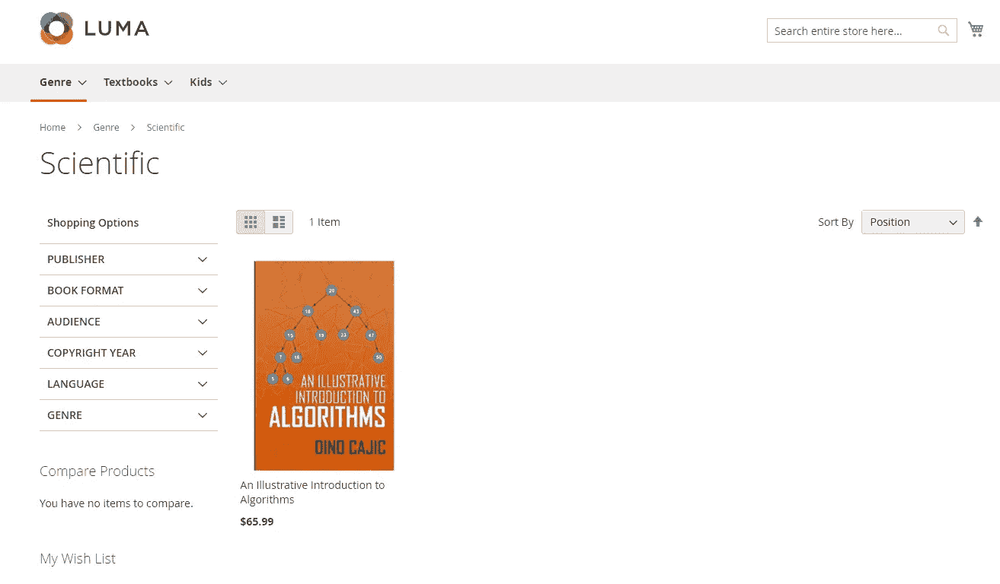

点击图书查看产品页面。在左边，你会看到这本书的大图。在右边，你会看到标题，价格，股票状态和 SKU。在**添加到愿望列表**按钮下面是我们添加的**简短描述**。

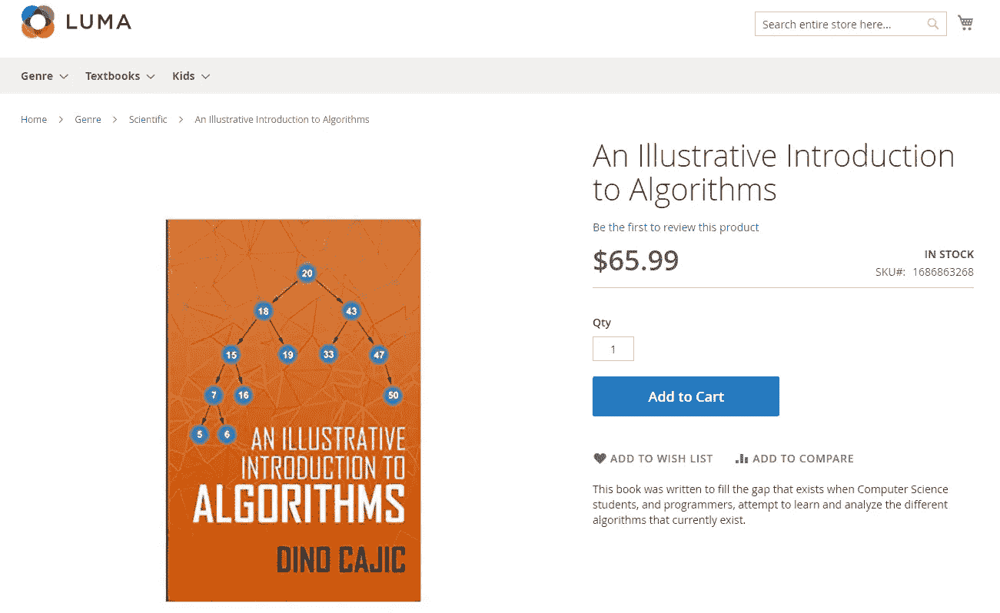

向下滚动页面，您将在详细信息选项卡下看到完整的**描述**。

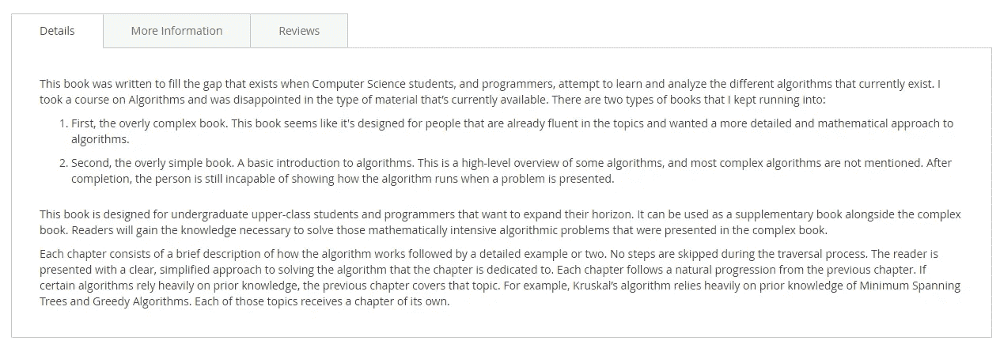

点击**更多信息**查看您创建和分配的所有属性的完整列表。

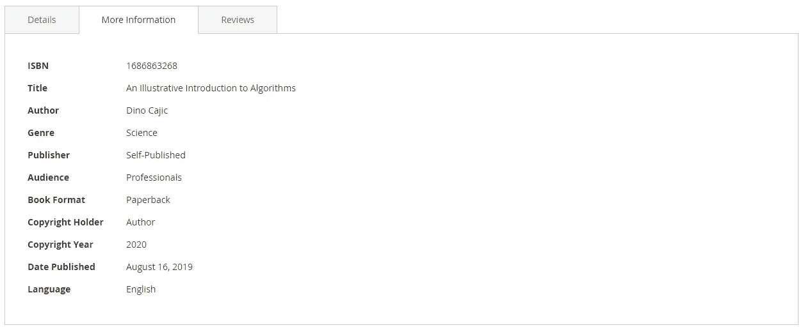

这就是事情的全部。还有其他类型的产品，我们可以添加，我们可能会在未来访问，但书籍是简单的。我建议你在进入下一部分之前再增加几本书。

## 航行

[P0: Magento 2.3 Windows 安装(2020)](https://medium.com/@dinocajic/magento-2-3-windows-install-2020-d0073931a4ab)
[P1:Magento 2.3 商店(2020 P1):简介](https://medium.com/@dinocajic/magento-2-3-store-2020-p1-intro-69b2ab73fde8)
[P2: Magento 2.3 商店(2020 P2):属性—了解你的产品](https://medium.com/@dinocajic/magento-2-3-store-2020-p2-attributes-get-to-know-your-product-a24f909dac18)[P3:Magento 2.3 商店(2020 P3):属性集](https://medium.com/@dinocajic/magento-2-3-store-2020-p3-attribute-sets-1550d083906a)[P4](https://medium.com/@dinocajic/magento-2-3-store-2020-p4-categories-c5e0059f3097)

迪诺·卡伊奇目前是 [LSBio(寿命生物科学公司)](https://www.lsbio.com/)、[绝对抗体](https://absoluteantibody.com/)、 [Kerafast](https://www.kerafast.com/) 、[珠穆朗玛生物](https://everestbiotech.com/)、[北欧 MUbio](https://www.nordicmubio.com/) 和 [Exalpha](https://www.exalpha.com/) 的 IT 负责人。他还担任我的自动系统的首席执行官。他有十多年的软件工程经验。他拥有计算机科学学士学位，辅修生物学。他的背景包括创建企业级电子商务应用程序、执行基于研究的软件开发，以及通过写作促进知识的传播。

你可以在 [LinkedIn](https://www.linkedin.com/in/dinocajic/) 上联系他，在 [Instagram](https://instagram.com/think.dino) 上关注他，或者[订阅他的媒体出版物](https://dinocajic.medium.com/subscribe)。

[*阅读迪诺·卡吉克(以及媒体上成千上万其他作家)的每一个故事。你的会员费直接支持迪诺·卡吉克和你阅读的其他作家。你也可以在媒体上看到所有的故事。*](https://dinocajic.medium.com/membership)