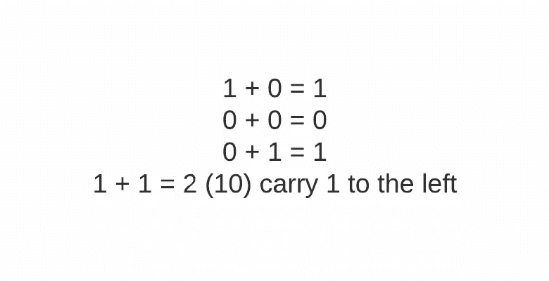
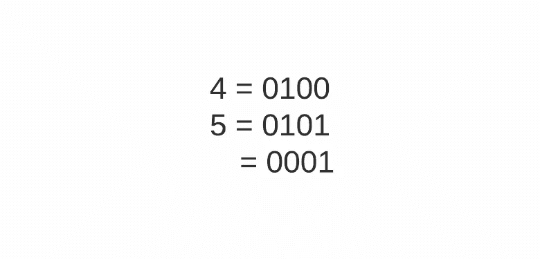

# 神奇的 XOR:如何在你的下一个编码项目中使用这个技巧？

> 原文：<https://levelup.gitconnected.com/magical-xor-how-you-can-use-this-trick-on-your-next-coding-project-5ad676c72957>

由作者提供

XOR 与 AND 和 OR 非常不同。AND 和 OR 很容易理解。我想原因之一大概是英语单词中经常使用 AND 和 OR。例如，当我们说 AND 时，通常意味着我们想要两个选择。当我们说或时，我们通常指的是一个*或*另一个*或*两者。然而，异或混合 AND 和 OR 一起产生所谓的“异或”

> 什么是排他 or？

当你想要其中一个，而不是两个。例如，如果你打算选择买糖果或巧克力，但你不想两个都买。

> 那么 XOR 为什么这么神奇呢？

在我谈论 XOR 带来的魔力之前，我想让你知道我们的任何运算都不需要 XOR。我们可以用技术上的方法来表示 XOR 和 and 和 OR。我让您思考这个问题，或者您也可以在堆栈溢出时搜索它。因此，不用写一长串的 AND 和 OR 来表示 XOR，你可以只写 XOR。

这是否意味着 XOR 是为那些想把代码压缩得更简洁的程序员准备的？换句话说，那些写一行程序却不评论他们代码的程序员？

如果它能把一个长运算浓缩成一个异或，那就太棒了。我看到了基于 if 语句的代码，它们将使用 XOR 来检查两个实体。当你学到一个词汇 superb，意思是超级快乐，你在你的文章中使用它。它简洁明了，而且更具宣示性。然而，如果一个非英语母语的人读了你的句子，他们可能不理解，需要检查那些单词。

但是，这并不是 XOR 神奇的原因。

要知道 XOR 为什么神奇，我们必须看看它是如何处理 0 和 1 的。

以下是我在查看 XOR 真值表时发现的一些事情:

如果我们做 1 XOR 0，它将等于 1。如果我们做 0 XOR 0，就等于 0。如果我们做 1 异或 1，就等于 0。如果我们做 0 异或 1，就等于 1。

你注意到这里有什么模式吗？

如果没有，用 x 代替 1。

如果我们做 x 异或 0，就等于 x，如果我们做 0 异或 0，就等于 0。如果我们做 x 异或 x，就等于 0。如果我们做 0 XOR x，就等于 x。

我们看到与 0 异或等于同一个数 x。然而，如果我们对同一个数做异或，它将等于 0。这意味着 XOR 0 就像 XOR 的一个恒等特性，对任何带有 x 的东西进行 XOR 运算都会把左边的操作数翻转到相反的方向。

换句话说，XOR 还可以帮助您检查两个值之间的差异。如果你对它们进行异或运算，你就知道这两个值是否相同。结果是 0。另一方面，你知道它们是否不同，因为它不会是 0。

就 0 和 1 而言，XOR、0 或 1 将导致该数的恒等运算。异或 0 或 1 与 1 将翻转该数字。

你看，XOR 比简单的比特有更多的用例。首先，它帮助我们检查两个操作数是否不同。第二，它有助于我们识别两种价值观的不同之处。

这两个可以帮助我们解决很多用例。我将在这里指定三个。

# 查找数组中的唯一值

这是一个著名的例子。

假设数组中有所有元素成对出现的数组。您想要检查集合是否有唯一的元素。

记住，如果你对元素本身进行 XOR 运算，结果是 0。如果你把一个元素和另一个元素用 0 进行异或运算，你会得到另一个元素。因此，我们可以对数组中的所有元素进行异或运算。对相同的数进行异或运算得到 0，异或 0 将得到那个元素。

# 无进位求和

这是让我震惊的一部。

我不知道 XOR 两位等于两个数相加没有进位。

以下是两位之间简单加法的规则:

由作者提供

你注意到了吗，如果我们用异或来代替加法，它和上面的真值表是一样的。

让它深入人心。

如果我们用 4 和 5，0100 和 0101 进行异或运算，我们会得到 0001，1。九用二进制表示是 1001。最左位的 1 是进位。

由作者提供

你的搜索关于你如何能在这里得到进位位。

# 就地交换

如何在不使用临时变量的情况下交换两个变量？

让我解释一下。

当我们对两个元素进行 XOR 运算时，0 不会改变左操作数的值，但 1 会翻转左操作数的位。因此，上述操作可以简化为:

上面的问题和现在的独特元素是一个概念。

就是这样！让我们以我们所谈论的来结束。

# 结论

XOR 是用于异或的运算符。这意味着给定两个布尔值，我们想要其中一个，而不是两个都要。XOR 可以用 AND 和 OR 来表示。但是，如果您现在已经知道了 XOR，为什么不在您的代码库中使用它呢？；)

对 0 的 XOR 运算充当了一个恒等运算符。如果你将 a 与 0 进行异或运算，它将返回 a。如果你对相同的数进行异或运算，它将得到 0。因此，我们可以使用该属性来查找数组中的任何唯一元素、不带进位的整数之和以及就地交换两个值。

如果你有任何其他的异或技巧，不要犹豫，在下面的评论区发表评论，这样每个人都可以向你学习。

如果你喜欢这篇文章，请订阅我的[故事](https://edwardgunawan880.medium.com/about)当我发布一些东西时得到通知！

*最初发表于*[T5【https://edward-huang.com】](https://edward-huang.com/algorithm/optimization/2021/01/27/magical-xor-how-can-you-use-this-trick-on-your-next-coding-project/)*。*