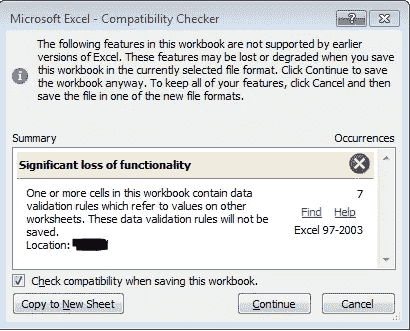

# MainWindowHandle 是个谎言

> 原文：<https://levelup.gitconnected.com/mainwindowhandle-is-a-lie-6e82e0e0fc8d>

## 如何将窗口前置

由 [Nicolas Solerieu](https://unsplash.com/@slrncl) 在 [Unsplash](https://unsplash.com/) 上拍摄

# 场景

在工作中，我必须编写一个脚本，将不同版本的 Excel 文件复制到我的计算机上，并编辑副本。

实现这一点的代码非常简单，然而令人烦恼的是，在你保存文件后， *Microsoft Excel —兼容性检查器*会弹出并阻塞主线程，直到你点击*继续*。

弹出窗口总是隐藏在我打开的其他窗口后面，我必须最小化所有东西才能看到弹出的 Excel 窗口。

因此，我需要一种方法来自动将 Excel 弹出窗口放到最前面。

兼容性检查器弹出窗口

# 解决问题的首次尝试

我在网上找了一下，找到了一些可以获得 Excel 进程的`MainWindowHandle`属性的代码，然后使用它作为 Win32 函数的输入，将该进程的窗口放到最前面:

# MainWindowHandle 是个谎言

这段代码在其他窗口中运行良好，但是由于某种原因，Excel 弹出窗口的`[System.Diagnostics.Process.MainWindowHandle](https://msdn.microsoft.com/en-us/library/system.diagnostics.process.mainwindowhandle(v=vs.110).aspx)`属性的值为 0，这意味着`SetForegroundWindow()`功能不起作用。

我注意到对于任何在 Windows 开始栏中有图标的窗口,`MainWindowHandle`属性都是`> 0`,所以可能`MainWindowHandle`是 0，因为尽管 Excel 弹出窗口有 GUI，但开始栏中没有图标。

## Windows API 可以做到，我也可以

在任务管理器中，我可以右键单击 Excel 进程，然后单击*前置*，这将成功地将弹出窗口前置，因此我知道一定有一些 Win32 代码可以工作。

经过一些研究，我发现每个窗口都有一个句柄，不管它在开始栏中是否有图标，我只是需要另一种方法来找到正确的句柄。

原来 Windows API 并没有模拟主窗口的概念。这纯粹是在。NET framework，它应用试探法来确定用户认为什么是主窗口。

# 可行的解决方案

多亏了 StackOverflow.com 的指点，他指引我找到了`[EnumWindows](https://msdn.microsoft.com/en-us/library/windows/desktop/ms633497.aspx)` Win32 函数，我才能够写一些获得正确句柄的代码:)

现在`MainWindowHandle`属性为> 0，我们可以调用`SetForegroundWindow()`函数:

使用这段代码，我现在可以复制一个 Excel 文件，修改它，并把 Excel 弹出到前面自动:D

看看我的 [GitHub](https://github.com/DavidKlempfner/CreatingAnExcelFile/blob/master/CreatingAnExcelFile.ps1) 页面，看看复制并编辑 Excel 文件的全部代码。

整个代码还向您展示了如何在自己的线程中运行`EnumWindows`代码，因为 Excel 弹出窗口阻塞了主线程，所以您必须这样做。