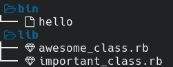

# 制作红宝石

> 原文：<https://levelup.gitconnected.com/make-a-ruby-gem-2139f8cdf910>

你有没有一个可爱的 ruby 脚本，你想很容易地与你的朋友分享，或者一个你认为对其他人有用的不错的类？别担心，在本文中，我将向您展示如何使用现有的 ruby 代码制作一个 ruby 宝石。


Muhannad Ajjan 在 [Unsplash](https://unsplash.com?utm_source=medium&utm_medium=referral) 上拍摄的照片

我将使用具有以下项目结构的模拟项目:



基本项目结构

在 ruby 项目的根目录下创建一个`.gemspec`文件。我创建了一个`hello.gemspec`文件，内容如下。确保用与您的项目相关的信息替换虚拟字段。

```
Gem::Specification.new do |s|
  s.name = 'hello'
  s.version = '0.0.0'
  s.executables << 'hello'
  s.summary = 'hello!!'
  s.description = 'Hello, World!'
  s.authors = ['Anon Anon']
  s.email = '[a](mailto:okbaymeron@gmail.com)non@anon.anon'
  s.files = ['lib/important_class.rb', 'lib/awesome_class.rb']
  s.license = 'MIT'
end
```

通过在文件顶部添加一个 shebang 并使用`chmod`使`bin/hello`可执行。在这种情况下，只需将`#!/usr/bin/env ruby`添加到`bin/hello`的顶部并执行`chmod +x bin/hello`。

通过执行`gem build hello.gemspec`创建 gem，这会在当前文件夹中创建它。执行`gem install ./hello-0.0.0.gem`安装宝石并进行测试。

如果您没有任何帐户，请创建一个 [rubygems](https://rubygems.org/sign_up) 帐户。接下来，运行以下命令，用您的 rubygems 帐户设置您的计算机。用您的用户名替换 anon。

```
curl -u anon [https://rubygems.org/api/v1/api_key.yaml](https://rubygems.org/api/v1/api_key.yaml) > ~/.gem/credentials; chmod 0600 ~/.gem/credentials
```

现在，您可以发布了！执行`gem push hello-0.0.0.gem`，你就可以开始了。

**注意:**模拟项目中的所有名字都是假名，所以在选择你的 gem、类和脚本的名字之前，你必须确保阅读[文档](https://guides.rubygems.org/patterns/#consistent-naming)并浏览 [rubygems 网站](http://rubygems.org/)。