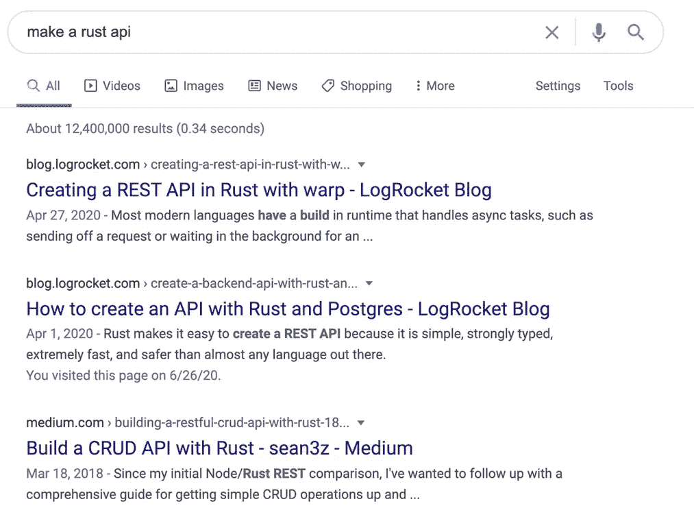
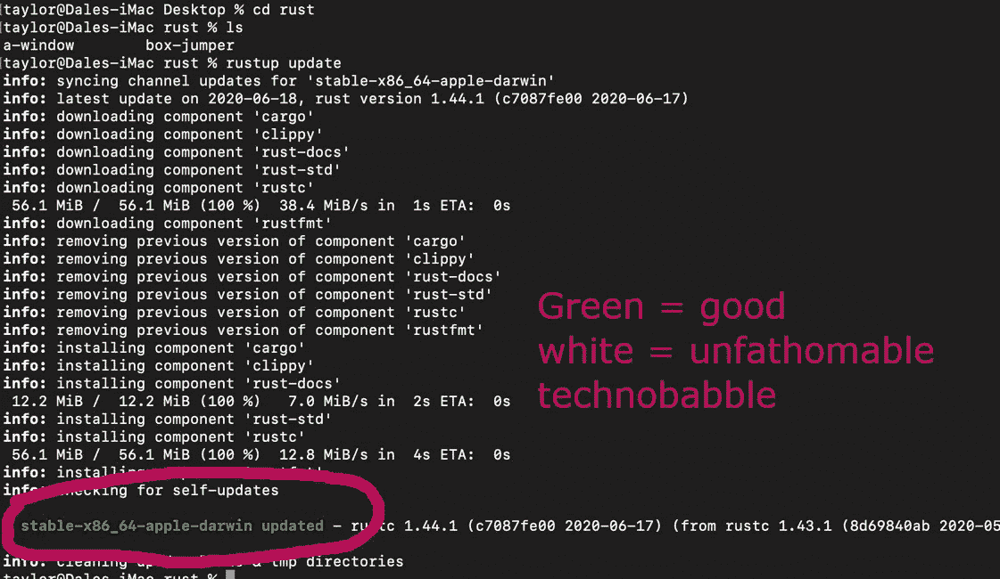
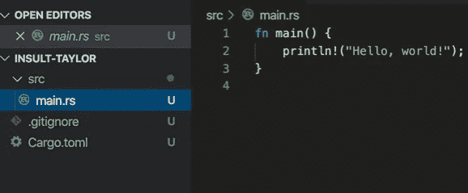
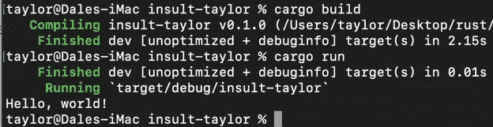
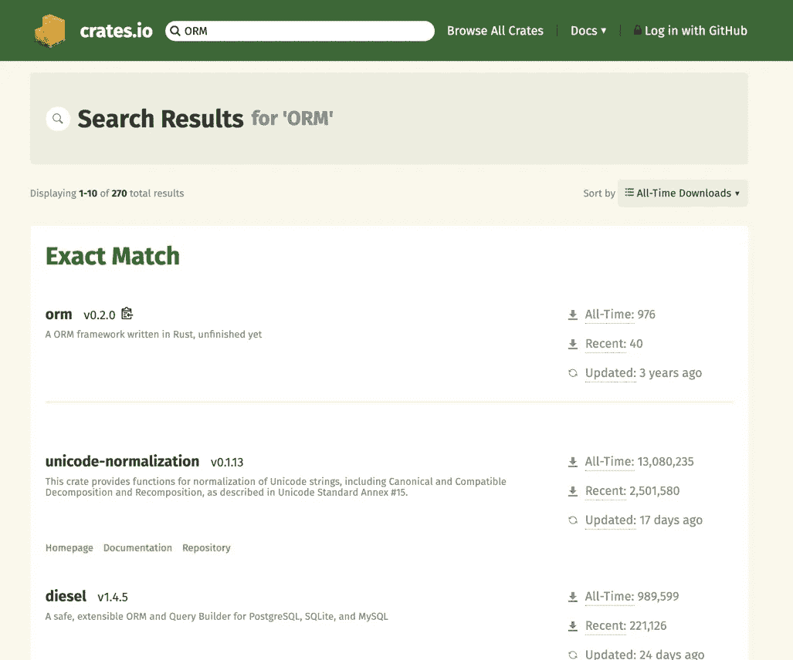

# 做一个侮辱我的 Rust API

> 原文：<https://levelup.gitconnected.com/make-a-rust-api-that-insults-me-3cac9db8c2bd>

开发日志


这只猫看起来像我

这是一个伟大节日的前夕。整个美洲的所有人和儿童刚刚醒来，看到了灰色的天空和过敏。

我醒来发现我女朋友的小狗(维奥莱塔)舔着我的鼻子在我床上打滚。这只狗喜欢在床上，因为她不应该在那里，她舔我的鼻子，因为她想在早上吃东西。还有，她讨厌我。

我们是死敌。


如果你仔细看，你可以看到她眼中的地狱之火

我给自己倒了杯咖啡，心想…

> 哎呀，我没有未来，我是一个没有计划的失败者。我的银行账户也是负数(非常重要的细节。)我还不如做一个没有任何用处的 Rust API，因为对这个世界来说最好的事情就是再多一个不知道自己在做什么的程序员。

为什么要用铁锈？因为，我为什么要使用一个以易用和可靠著称的工具(比如 ruby on rails 或。当我可以用一些愚蠢的困难和高尚的东西来满足我的自我时，比如我在《铁锈》中找到的任何未完成的箱子？我想我们有答案了。让我们用我们能想到的最难的工具来增加印象分。

然后，在 6 个月后的某个午餐时间，我可以夸耀这个烦人的项目，而我的同事们则翻着白眼，忍受着我难以忍受的废话。一年后我会喝着啤酒问自己为什么没有朋友。

# 第一步——试着找出这不可能的原因

还不如在我们开始前碰壁。逃避工作最简单的方法就是…逃避工作。有一次一个聪明人告诉我，图灵完备性意味着这个工具可以做任何事情。(这是经过数学证明的。)但是，我经常忽略聪明人，并试图欺骗自己，认为自己可能知道得更多。

Rust 是一门非常年轻的语言，它肯定缺少一些关键的特性，对吗？

好吧，那我们就用谷歌吧。



嗯嗯嗯。

看起来……有可能，但我并不完全相信。让我们点击其中一个链接，然后滚动到文章的底部，看看我们是否能找到更多确凿的证据。

第二个链接有一个工作演示。废话。看起来我不能告诉我的老板这是不可能的。


# 第二步——用铁锈做 hello world

我很肯定 Rust 已经安装在我的电脑上了，因为我在 6 个月前用它做了一些事情，但我不记得任何命令或我妈妈的电话号码，所以我要去谷歌“rust lang”

[](https://www.rust-lang.org/) [## 锈

### Rust 速度惊人，内存效率高:没有运行时或垃圾收集器，它可以支持关键性能…

www.rust-lang.org](https://www.rust-lang.org/) 

我将单击黄色的“开始”按钮。我很高兴它又大又黄，否则我就找不到它了。

> 我的简历生锈了

然后，导航到我桌面上的某个名为 rust 的目录。我在操作系统的其他地方有 rust 项目，但是我不记得它们在哪里了。

根据 rust-lang 网站，如果我已经安装了 rust，我可以运行…

```
**rustup update**
```

在我的命令行上。我这样做了，绿色文本出现在我的屏幕上，这很好，因为绿色意味着好。



此外，绿色文本还写着“等等，等等，等等，稳定，等等，等等。”所以，我猜我的锈版可以养马。我感觉好极了。我们在这里做得很棒。

根据我 10 秒前浏览的网站上的 rust 文档,“cargo”是大多数 rust 项目的构建工具。为了使用它，您运行这三个命令。

```
**cargo new [project-name]** => generate new project**cargo build** => compile the project**cargo run** => run the project
```

所以我做了一个…

```
**cargo new insult-taylor**
```

更多绿色文本


然后…

```
**cd insult-taylor** => navigate into insult-taylor repo**code .** =>vscode initializer
```

生成的回购看起来是这样的…



它已经有“hello world”了，所以我要构建并运行它。

```
**cargo build****cargo run**
```



甜蜜的现在我们都是乡巴佬。当我开始用 rust 编程时，我所有的问题都神奇地消失了。从现在开始，我将试图违背我的经理和上帝的良好愿望，将 rust 潜入我公司的代码库。

如果我被抓住了，我会在说出一些著名程序员的名字之前说一些类似“类型理论就是生命”的话，以试图迷惑我的仲裁者。

> 亲爱的谷歌，请雇用我

# 第三步——找别人帮我做大部分工作

因为我不是一个父亲，我不能让我的孩子编码这个。所以，我将退而求其次，搜索 crates.io。如果你不知道，许多编程语言使用某种模块管理系统，允许用户上传和下载社区制作的东西。

这真是太棒了，因为聪明人可以帮助很多人，像我这样的笨蛋可以利用聪明人的成果。

此外，由于 rust 最初是在 10 年前发布的，我们正处于一个甜蜜点，聪明人有时间来制作大多数重要的东西。这样我们就可以完全减少我们必须做的实际工作。

我要做的是去 crates.io，在搜索栏里输入“ORM”。

然后，我将使用过滤器来过滤“有史以来最多的下载”

对于那些不知道的人。大多数应用程序都有一些前端客户端来与人类进行交互。然后，他们有一些后端 API，有一个 ORM 和一个数据库。

随着应用程序变得更好，编码人员可以构建额外的前端或 API 来嵌入他们想要的任何功能。这就是他们所说的微服务。侮辱-泰勒 API 将会很小，所以这些都不重要。

ORM 代表对象关系映射器，但是我们可以忽略行话，只称它为“让编程语言容易和安全地与数据库通信的东西”此外，许多 ORM 都带有开箱即用的 SQL 注入保护，这有点不错。

这是我试图避免的聪明人的东西。



看起来 diesel 是 rust 最流行的查询生成器和 ORM。最上面的 orm 的东西写着未完成，所以我要避开它，就像我父亲和我父亲的父亲避开他们的孩子一样。

当我点击 Diesel 链接时，它说他们的网站上有大量的“入门”教程。这太棒了。网站增加可信度。

# 第四步——实际建造这个该死的东西

diesel 的默认文档使用 PostgreSQL。我喜欢 Postgres，因为我聪明的朋友告诉我它比 MYSQL 好。多年来，我一直在夸夸其谈 SQL 数据库。

我将直接从官方文档中复制并粘贴一些内容，除了它将与官方文档有所不同，因为文档告诉我们如何管理博客。我的 API 要管理人身侮辱。

进入你的。toml 文件，并使您的依赖项如下所示。

```
**[dependencies] 
diesel = { version = "1.4.4", features = ["postgres"] } 
dotenv = "0.15.0"**
```

安装 diesel CLI 工具。

```
**cargo install diesel_cli**
```

在过去的 4 个月里，我一直在我的公司使用 MongoDB。在这个过程中的某个地方，我搞砸了我的 postgres 环境，所以它不能工作，cargo 在错误语音中说“帮助我，我不能连接到 Postgres 数据库”。

实际错误是这样的:

```
**FATAL:  role "taylor" does not exist**
```

所有这些糟糕的话让我感到难过，所以我把这条错误信息复制到谷歌，发现了一个堆栈溢出的帖子，说我要么没有安装 Postgres，要么我的环境在某种程度上被搞糟了，最好的解决方案是重新安装应用程序。

结果是我在这个问题上更愚蠢，因为我没有安装 Postgres。不知何故，我完全忽略了那个细节。如果你遇到同样的问题，这里有一个链接。

[](https://postgresapp.com/) [## postgres . app——在 Mac 上开始使用 PostgreSQL 的最简单方法

### Postgres.app 是打包为标准 Mac 应用程序的全功能 PostgreSQL 安装。

postgresapp.com](https://postgresapp.com/) 

> 我甚至没有安装 postgres

一旦我安装了 Postgres，喝了一杯伏特加来缓解情绪上的痛苦，我就运行 diesel setup 命令。

```
**diesel setup**
```

然后，我迁移的发电机

```
**diesel migration generate create-insults**
```

对于那些不熟悉数据库/API 的人。整个迁移约定之所以存在，是因为人们希望能够跟踪数据库随时间的变化。通过这种方式，您可以添加新的表，或者更改现有的表，或者以递增的方式进行更改。

如果发生了可怕的事情，您可以恢复到以前的迁移。我将我生成的迁移称为 create-limits，因为这是迁移的名称，而不是表，这意味着它应该描述我们要对数据库做什么。

看起来 diesel 的惯例是我们将使用普通 SQL 进行迁移。每次迁移都有一个上行文件和一个下行文件。up 文件将包含进行我们的更改的 SQL。down 文件将包含根据迁移恢复我们的变更**的 SQL。**

这对我来说是令人愉快的。首先，编写普通的 SQL 让我觉得一年前阅读 SQL 教科书时没有浪费时间，而且这种迁移比我想象的要容易得多。

这就是我如何更改我的迁移文件。

```
// up.sql**CREATE TABLE insults (****id SERIAL PRIMARY KEY,****body TEXT NOT NULL****)** // down.sql**DROP TABLE insults**
```

如果你根本不懂 SQL。这很好。这是你在大学里将要上的课中的一个内容，你可能再也用不到了(比如艺术史。)即使你确实需要使用，语言也并不复杂。大概一周就能学会。

迁移完成后，我运行了迁移

```
**diesel migration run**
```

我要给你讲很多东西，但是我会解释它在高层次上做什么。你不需要知道每一个细节，因为这不是我们从零开始做的，所以我们不需要知道。

我做了另外 4 个。rs 文件，然后在里面放一些代码。官方文件让我们制作一个博客文章数据库，但是由于这个项目是一个侮辱数据库，我只是删除了所有我能找到的臃肿的软件，并且把所有的变量名改为“侮辱”而不是“文章”我保留了我所看到的多元化惯例，因为 ORM 非常重视他们的多元化(相信我。)

大约有 100 行代码，所以这里有一个要点。

简而言之，我制作了一个模型文件，它模拟了数据库中的侮辱表。

我在查询构建器中添加了一个名为 write _ limits 的方法，用于向 Postgres 数据库提交新信息。

现在有一个控制 write _ limits 过程的 write _ limits 文件。

有一个 show _ limits 文件控制侮辱的显示。

这一切都是从 diesel 网站上的官方文档中获得的。

 [## 内燃机

### 在本指南中，我们将通过一些简单的例子来了解 CRUD 的每一部分，它代表…

柴油. rs](https://diesel.rs/guides/getting-started/) 

这种建模数据库和编写模块化控制器的惯例在 API 的世界中很常见，在任何其他语言中都可以看到。(迁移也是如此。)

一路上，我遇到了许多问题。我懒得实际阅读代码，所以在几分钟内，我漫无目的地更改内容，并反复保存和运行它，试图绕过错误。在这段时间里，我向上帝祈祷，并在我的公寓里点燃了一些熏香，试图驱散那些不好的情绪。

当我拿出薰衣草在屏幕前挥舞时，我真的期待一些结果。但是唉，什么都没有。

最后，我放弃了这种方法，实际上是阅读代码。在那一点上，我意识到我不小心在文档中留下了一段代码，其中有一点点关于博文是否已经发表的验证。由于我所有的文件都被转换成处理未经证实的侮辱，这违反了我的代码。我删了它，嘣！

## 神化

> 谷歌不可能再忽视我的简历了
> 
> 我是活着的最好的程序员

现在我们可以通过跑步来写侮辱

```
**cargo run --bin write_insult**
```

我们可以通过跑步来阅读侮辱

```
**cargo run --bin show_insults**
```

这是它工作的视频。

# 第五步——让 scope creep 粉碎我的梦想，重新开始

有一个问题。我这个项目的目标是制作一个可以用于网页的 API，这样我就可以链接到网页，我的读者可以去链接，并在博客的结尾提交他们自己的侮辱。

然而，diesel 并没有自带 HTTP 功能。它只是一个查询生成器和 ORM。

rust 中有大量的 HTTP 库，但是我必须以某种方式将它们集成到 diesel 中，对于像我这样懒惰的人来说，这是一件非常繁重的工作。

当我在谷歌上搜索如何制作自己的 HTTP 请求和响应以便从我的数据库中提交 JSON 时，我发现有一个名为 rocket.rs 的新兴 rust 框架。它附带了一个 ORM，query builder 和 HTTP 功能，这些功能都捆绑在一起，这正是我想要的这个项目。

 [## Rocket -简单、快速、类型安全的 Rust Web 框架

### Rocket 对 JSON 有一流的支持，开箱即用。简单地派生反序列化或序列化来接收或…

火箭. rs](https://rocket.rs/) 

当我可以粉碎我的梦想，用新的东西重新开始时，我为什么要自己建造项目的最后一部分呢？自己做任何东西都是不可能的，因为我没有能力。

> 完全忽略这样一个事实，即编写一些 http 请求和响应函数可能更容易，因为我们的数据库已经设置好并正在工作

如果我在开始的时候多花 5 分钟来计划，我就可以从火箭开始了。

# 第六步——把我所有的错误(和放屁)都归咎于狗

维奥莱塔，你这个魔鬼！！！！！你怎么能让我不计划我的项目？！


# 结论

柴油发动机。我真的很喜欢这个项目。Diesel 实现了简单性和功能性的完美平衡。它是典型的准系统 ORM 和查询生成器，非常适合个人项目。组装它非常容易。我的错误很容易导航，这是类型安全的副产品。整个过程让我惊喜不已。

在下一篇博客中，我将把整个应用程序重构为 rocket.rs。一旦 API 最终设置了 HTTP 请求和响应功能，我将制作一个小的 react 前端，并发布一个到完成项目的链接。

届时，我将带您了解 react 前端。

下次见。